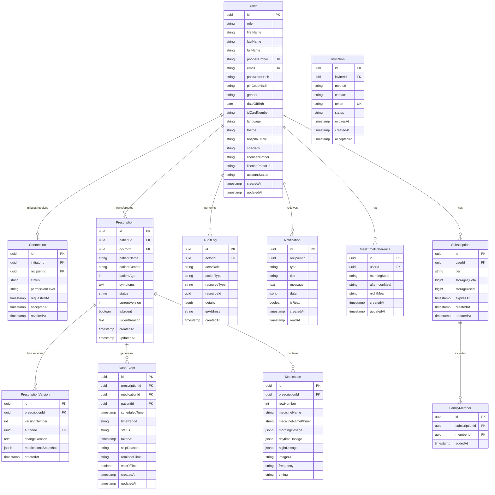

# Design Document: Das Tern Backend API

## Overview

The Das Tern Backend API is a RESTful API built with Next.js that provides comprehensive medication management services for patients, doctors, and family caregivers. The system implements an offline-first architecture where critical data is synchronized between client devices and the server, ensuring medication adherence tracking works seamlessly regardless of connectivity.

The API enforces patient-owned data principles, where patients maintain complete control over who can access their medical information through a granular permission system. All data access and modifications are logged in an immutable audit trail for transparency and trust.

### Key Design Principles

1. **Patient Data Ownership**: Patients are the sole owners of their medical data with explicit control over access permissions
2. **Offline-First**: Critical features (reminders, dose tracking) work without internet connectivity and sync when online
3. **Audit Transparency**: All actions are logged immutably for patient review and trust
4. **Version Control**: Prescription changes create new versions rather than destructive edits
5. **Cambodia-Centric**: Default timezone (Asia/Phnom_Penh UTC+7) and multi-language support (Khmer/English)
6. **Subscription-Based**: Three tiers (FREEMIUM, PREMIUM, FAMILY_PREMIUM) with storage quotas and feature access

### Technology Stack

- **Runtime**: Next.js 18+ (App Router)
- **Database**: PostgreSQL 16+ with PostGIS extension
- **Authentication**: JWT tokens with refresh token rotation
- **Real-time**: Server-Sent Events (SSE) for notifications
- **File Storage**: AWS S3 or compatible object storage for license photos and medication images
- **Caching**: Redis for session management and rate limiting
- **SMS**: Twilio or AWS SNS for OTP delivery


## Architecture

### System Architecture Diagram


### Architectural Layers

1. **API Layer**: Next.js API routes handle HTTP requests, authentication, and response formatting
2. **Business Logic Layer**: Service classes implement domain logic, validation, and orchestration
3. **Data Layer**: PostgreSQL for persistent storage, Redis for caching and sessions, S3 for file storage
4. **External Services**: Third-party integrations for SMS delivery

### Request Flow

```
Client Request → API Route → Auth Middleware → Service Layer → Data Layer → Response
                                    ↓
                              Audit Logging (async)
```


## Components and Interfaces

### API Endpoints

#### Authentication Endpoints

```typescript
POST /api/auth/register/patient
Body: {
  lastName: string
  firstName: string
  gender: "MALE" | "FEMALE" | "OTHER"
  dateOfBirth: string (ISO 8601)
  idCardNumber: string
  phoneNumber: string (+855 format)
  password: string (min 6 chars)
  pinCode: string (4 digits)
}
Response: { message: string, requiresOTP: boolean }

POST /api/auth/register/doctor
Body: {
  fullName: string
  phoneNumber: string (+855 format)
  hospitalClinic: string
  specialty: "GENERAL_PRACTICE" | "INTERNAL_MEDICINE" | "CARDIOLOGY" | "ENDOCRINOLOGY" | "OTHER"
  licenseNumber: string
  licensePhoto: File (multipart/form-data)
  password: string
}
Response: { message: string, status: "PENDING_VERIFICATION" }

POST /api/auth/otp/send
Body: { phoneNumber: string }
Response: { message: string, expiresIn: number }

POST /api/auth/otp/verify
Body: { phoneNumber: string, otp: string }
Response: { accessToken: string, refreshToken: string, user: UserProfile }

POST /api/auth/login
Body: { identifier: string (phone or email), password: string }
Response: { accessToken: string, refreshToken: string, user: UserProfile }

POST /api/auth/refresh
Body: { refreshToken: string }
Response: { accessToken: string, refreshToken: string }

POST /api/auth/logout
Headers: { Authorization: "Bearer <token>" }
Response: { message: string }
```

#### User Profile Endpoints

```typescript
GET /api/users/profile
Headers: { Authorization: "Bearer <token>" }
Response: {
  id: string
  role: "PATIENT" | "DOCTOR" | "FAMILY_MEMBER"
  firstName?: string
  lastName?: string
  fullName?: string
  phoneNumber: string
  email?: string
  language: "KHMER" | "ENGLISH"
  theme: "LIGHT" | "DARK"
  subscriptionTier: "FREEMIUM" | "PREMIUM" | "FAMILY_PREMIUM"
  storageUsed: number (bytes)
  storageQuota: number (bytes)
  storagePercentage: number
  dailyProgress?: number (for patients)
  hospitalClinic?: string (for doctors)
  specialty?: string (for doctors)
}

PATCH /api/users/profile
Headers: { Authorization: "Bearer <token>" }
Body: { language?: string, theme?: string, [other updatable fields] }
Response: { user: UserProfile }

GET /api/users/storage
Headers: { Authorization: "Bearer <token>" }
Response: {
  used: number
  quota: number
  percentage: number
  breakdown: { prescriptions: number, doseEvents: number, auditLogs: number, files: number }
}
```


#### Connection Endpoints

```typescript
POST /api/connections/request
Headers: { Authorization: "Bearer <token>" }
Body: { targetUserId: string, targetRole: "DOCTOR" | "PATIENT" | "FAMILY_MEMBER" }
Response: { connection: Connection }

GET /api/connections
Headers: { Authorization: "Bearer <token>" }
Query: { status?: "PENDING" | "ACCEPTED" | "REVOKED", role?: string }
Response: { connections: Connection[] }

POST /api/connections/:connectionId/accept
Headers: { Authorization: "Bearer <token>" }
Body: { permissionLevel?: "NOT_ALLOWED" | "REQUEST" | "SELECTED" | "ALLOWED" }
Response: { connection: Connection }

POST /api/connections/:connectionId/revoke
Headers: { Authorization: "Bearer <token>" }
Response: { message: string }

PATCH /api/connections/:connectionId/permission
Headers: { Authorization: "Bearer <token>" }
Body: { permissionLevel: "NOT_ALLOWED" | "REQUEST" | "SELECTED" | "ALLOWED" }
Response: { connection: Connection }
```

#### Prescription Endpoints

```typescript
POST /api/prescriptions
Headers: { Authorization: "Bearer <token>" }
Body: {
  patientId: string
  patientName: string
  patientGender: string
  patientAge: number
  symptoms: string (Khmer)
  medications: [{
    rowNumber: number
    medicineName: string
    morningDosage?: { amount: string, beforeMeal: boolean }
    daytimeDosage?: { amount: string, beforeMeal: boolean }
    nightDosage?: { amount: string, beforeMeal: boolean }
    imageUrl?: string
  }]
  status: "DRAFT" | "ACTIVE"
  isUrgent?: boolean
  urgentReason?: string
}
Response: { prescription: Prescription }

GET /api/prescriptions
Headers: { Authorization: "Bearer <token>" }
Query: { patientId?: string, status?: string, page?: number, limit?: number }
Response: { prescriptions: Prescription[], total: number, page: number }

GET /api/prescriptions/:prescriptionId
Headers: { Authorization: "Bearer <token>" }
Response: { prescription: Prescription, versions: PrescriptionVersion[] }

PATCH /api/prescriptions/:prescriptionId
Headers: { Authorization: "Bearer <token>" }
Body: { status?: string, medications?: [...], isUrgent?: boolean, urgentReason?: string }
Response: { prescription: Prescription, newVersion: number }

POST /api/prescriptions/:prescriptionId/confirm
Headers: { Authorization: "Bearer <token>" }
Response: { prescription: Prescription, schedule: DoseEvent[] }

POST /api/prescriptions/:prescriptionId/retake
Headers: { Authorization: "Bearer <token>" }
Body: { reason: string }
Response: { message: string }
```


#### Dose Tracking Endpoints

```typescript
GET /api/doses/schedule
Headers: { Authorization: "Bearer <token>" }
Query: { date?: string (ISO 8601), groupBy?: "TIME_PERIOD" }
Response: {
  date: string
  dailyProgress: number
  groups: [{
    period: "DAYTIME" | "NIGHT"
    color: string
    doses: [{
      id: string
      medicationName: string
      medicationNameKhmer: string
      dosage: string
      quantity: string
      imageUrl: string
      scheduledTime: string
      status: "DUE" | "TAKEN_ON_TIME" | "TAKEN_LATE" | "MISSED" | "SKIPPED"
      frequency: string
      timing: string (before/after meals)
      reminderTime: string
    }]
  }]
}

POST /api/doses/:doseId/mark-taken
Headers: { Authorization: "Bearer <token>" }
Body: { takenAt?: string (ISO 8601), offline?: boolean }
Response: { dose: DoseEvent, dailyProgress: number }

POST /api/doses/:doseId/skip
Headers: { Authorization: "Bearer <token>" }
Body: { reason: string }
Response: { dose: DoseEvent }

PATCH /api/doses/:doseId/reminder-time
Headers: { Authorization: "Bearer <token>" }
Body: { reminderTime: string (HH:mm format) }
Response: { dose: DoseEvent }

GET /api/doses/history
Headers: { Authorization: "Bearer <token>" }
Query: { startDate?: string, endDate?: string, status?: string, page?: number }
Response: { doses: DoseEvent[], adherencePercentage: number, total: number }
```

#### Onboarding Endpoints

```typescript
POST /api/onboarding/meal-times
Headers: { Authorization: "Bearer <token>" }
Body: {
  morningMeal: "6-7AM" | "7-8AM" | "8-9AM" | "9-10AM"
  afternoonMeal: "12-1PM" | "1-2PM" | "2-3PM" | "4-5PM"
  nightMeal: "6-7PM" | "7-8PM" | "8-9PM" | "9-10PM"
}
Response: { mealTimePreferences: MealTimePreference }

GET /api/onboarding/meal-times
Headers: { Authorization: "Bearer <token>" }
Response: { mealTimePreferences: MealTimePreference }
```

#### Family Invitation Endpoints

```typescript
POST /api/connections/invite
Headers: { Authorization: "Bearer <token>" }
Body: { 
  method: "PHONE" | "EMAIL" | "QR_CODE"
  contact?: string (required for PHONE and EMAIL)
}
Response: { 
  invitationToken: string
  qrCodeUrl?: string (for QR_CODE method)
  expiresAt: string
}

POST /api/connections/accept-invitation
Headers: { Authorization: "Bearer <token>" }
Body: { invitationToken: string }
Response: { connection: Connection }

GET /api/connections/invitations
Headers: { Authorization: "Bearer <token>" }
Query: { status?: "PENDING" | "ACCEPTED" | "EXPIRED" }
Response: { invitations: Invitation[] }
```


#### Offline Sync Endpoints

```typescript
POST /api/sync/batch
Headers: { Authorization: "Bearer <token>" }
Body: {
  actions: [{
    type: "DOSE_TAKEN" | "DOSE_SKIPPED" | "PRESCRIPTION_UPDATED"
    entityId: string
    timestamp: string (ISO 8601)
    data: object
  }]
}
Response: {
  applied: number
  conflicts: [{
    actionIndex: number
    reason: string
    serverState: object
  }]
  summary: { dosesTaken: number, dosesSkipped: number, missedDosesDetected: number }
}

GET /api/sync/status
Headers: { Authorization: "Bearer <token>" }
Query: { lastSyncTimestamp?: string }
Response: {
  hasUpdates: boolean
  updatedPrescriptions: string[]
  newNotifications: number
  serverTimestamp: string
}
```

#### Doctor Monitoring Endpoints

```typescript
GET /api/doctor/patients
Headers: { Authorization: "Bearer <token>" }
Query: { page?: number, limit?: number, sortBy?: "adherence" | "name" }
Response: {
  patients: [{
    id: string
    name: string
    gender: string
    age: number
    phoneNumber: string
    symptoms: string
    adherencePercentage: number
    adherenceLevel: "GREEN" | "YELLOW" | "RED"
    lastDoseTime: string
  }]
  total: number
}

GET /api/doctor/patients/:patientId/details
Headers: { Authorization: "Bearer <token>" }
Response: {
  patient: PatientProfile
  currentPrescriptions: Prescription[]
  schedule: MedicationSchedule
  adherenceHistory: { date: string, percentage: number }[]
}

GET /api/doctor/prescriptions/history
Headers: { Authorization: "Bearer <token>" }
Query: { patientId?: string, page?: number }
Response: { prescriptions: Prescription[], total: number }
```


#### Notification Endpoints

```typescript
GET /api/notifications/stream
Headers: { Authorization: "Bearer <token>" }
Response: Server-Sent Events stream
Event types:
  - connection_request
  - prescription_update
  - missed_dose_alert
  - urgent_prescription_change

GET /api/notifications
Headers: { Authorization: "Bearer <token>" }
Query: { unreadOnly?: boolean, page?: number }
Response: { notifications: Notification[], unreadCount: number }

POST /api/notifications/:notificationId/read
Headers: { Authorization: "Bearer <token>" }
Response: { notification: Notification }
```

#### Audit Log Endpoints

```typescript
GET /api/audit-logs
Headers: { Authorization: "Bearer <token>" }
Query: { 
  startDate?: string
  endDate?: string
  actionType?: string
  actorId?: string
  page?: number
}
Response: {
  logs: [{
    id: string
    timestamp: string
    actorId: string
    actorName: string
    actorRole: string
    actionType: string
    resourceType: string
    resourceId: string
    details: object
    ipAddress: string
  }]
  total: number
}
```

#### Subscription Endpoints

```typescript
POST /api/subscriptions/upgrade
Headers: { Authorization: "Bearer <token>" }
Body: { tier: "PREMIUM" | "FAMILY_PREMIUM", paymentMethod: object }
Response: { subscription: Subscription, paymentStatus: string }

POST /api/subscriptions/family/add-member
Headers: { Authorization: "Bearer <token>" }
Body: { memberId: string }
Response: { familyMembers: User[], remainingSlots: number }

POST /api/subscriptions/family/remove-member
Headers: { Authorization: "Bearer <token>" }
Body: { memberId: string }
Response: { familyMembers: User[] }

GET /api/subscriptions/current
Headers: { Authorization: "Bearer <token>" }
Response: {
  tier: string
  storageQuota: number
  features: string[]
  familyMembers?: User[]
  expiresAt?: string
}
```


## Data Models

### Database Schema




### TypeScript Type Definitions

```typescript
// User Types
type UserRole = "PATIENT" | "DOCTOR" | "FAMILY_MEMBER"
type AccountStatus = "ACTIVE" | "PENDING_VERIFICATION" | "VERIFIED" | "REJECTED" | "LOCKED"
type Language = "KHMER" | "ENGLISH"
type Theme = "LIGHT" | "DARK"
type Gender = "MALE" | "FEMALE" | "OTHER"

interface User {
  id: string
  role: UserRole
  firstName?: string
  lastName?: string
  fullName?: string
  phoneNumber: string
  email?: string
  passwordHash: string
  pinCodeHash?: string
  gender?: Gender
  dateOfBirth?: Date
  idCardNumber?: string
  language: Language
  theme: Theme
  hospitalClinic?: string
  specialty?: string
  licenseNumber?: string
  licensePhotoUrl?: string
  accountStatus: AccountStatus
  createdAt: Date
  updatedAt: Date
}

// Connection Types
type ConnectionStatus = "PENDING" | "ACCEPTED" | "REVOKED"
type PermissionLevel = "NOT_ALLOWED" | "REQUEST" | "SELECTED" | "ALLOWED"

interface Connection {
  id: string
  initiatorId: string
  recipientId: string
  status: ConnectionStatus
  permissionLevel: PermissionLevel
  requestedAt: Date
  acceptedAt?: Date
  revokedAt?: Date
}

// Prescription Types
type PrescriptionStatus = "DRAFT" | "ACTIVE" | "PAUSED" | "INACTIVE"

interface Dosage {
  amount: string
  beforeMeal: boolean
}

interface Medication {
  id: string
  prescriptionId: string
  rowNumber: number
  medicineName: string
  medicineNameKhmer: string
  morningDosage?: Dosage
  daytimeDosage?: Dosage
  nightDosage?: Dosage
  imageUrl?: string
  frequency: string
  timing: string
}

interface Prescription {
  id: string
  patientId: string
  doctorId: string
  patientName: string
  patientGender: string
  patientAge: number
  symptoms: string
  status: PrescriptionStatus
  currentVersion: number
  isUrgent: boolean
  urgentReason?: string
  medications: Medication[]
  createdAt: Date
  updatedAt: Date
}

interface PrescriptionVersion {
  id: string
  prescriptionId: string
  versionNumber: number
  authorId: string
  changeReason: string
  medicationsSnapshot: Medication[]
  createdAt: Date
}

// Dose Event Types
type DoseStatus = "DUE" | "TAKEN_ON_TIME" | "TAKEN_LATE" | "MISSED" | "SKIPPED"
type TimePeriod = "DAYTIME" | "NIGHT"

interface DoseEvent {
  id: string
  prescriptionId: string
  medicationId: string
  patientId: string
  scheduledTime: Date
  timePeriod: TimePeriod
  status: DoseStatus
  takenAt?: Date
  skipReason?: string
  reminderTime: string
  wasOffline: boolean
  createdAt: Date
  updatedAt: Date
}

// Meal Time Preference Types
type MealTimeRange = "6-7AM" | "7-8AM" | "8-9AM" | "9-10AM" | "12-1PM" | "1-2PM" | "2-3PM" | "4-5PM" | "6-7PM" | "7-8PM" | "8-9PM" | "9-10PM"

interface MealTimePreference {
  id: string
  userId: string
  morningMeal: MealTimeRange
  afternoonMeal: MealTimeRange
  nightMeal: MealTimeRange
  createdAt: Date
  updatedAt: Date
}

// Subscription Types
type SubscriptionTier = "FREEMIUM" | "PREMIUM" | "FAMILY_PREMIUM"

interface Subscription {
  id: string
  userId: string
  tier: SubscriptionTier
  storageQuota: number
  storageUsed: number
  expiresAt?: Date
  createdAt: Date
  updatedAt: Date
}

// Audit Log Types
type ActionType = "CONNECTION_REQUEST" | "CONNECTION_ACCEPT" | "CONNECTION_REVOKE" | "PERMISSION_CHANGE" | 
                  "PRESCRIPTION_CREATE" | "PRESCRIPTION_UPDATE" | "PRESCRIPTION_CONFIRM" | "PRESCRIPTION_RETAKE" |
                  "DOSE_TAKEN" | "DOSE_SKIPPED" | "DOSE_MISSED" | "DATA_ACCESS" | "NOTIFICATION_SENT"

interface AuditLog {
  id: string
  actorId: string
  actorRole: UserRole
  actionType: ActionType
  resourceType: string
  resourceId: string
  details: Record<string, any>
  ipAddress: string
  createdAt: Date
}

// Notification Types
type NotificationType = "CONNECTION_REQUEST" | "PRESCRIPTION_UPDATE" | "MISSED_DOSE_ALERT" | "URGENT_PRESCRIPTION_CHANGE"

interface Notification {
  id: string
  recipientId: string
  type: NotificationType
  title: string
  message: string
  data: Record<string, any>
  isRead: boolean
  createdAt: Date
  readAt?: Date
}

// Invitation Types
type InvitationMethod = "PHONE" | "EMAIL" | "QR_CODE"
type InvitationStatus = "PENDING" | "ACCEPTED" | "EXPIRED" | "REVOKED"

interface Invitation {
  id: string
  inviterId: string
  method: InvitationMethod
  contact?: string
  token: string
  status: InvitationStatus
  expiresAt: Date
  createdAt: Date
  acceptedAt?: Date
}
```


### Service Layer Design

#### UserService

```typescript
class UserService {
  async registerPatient(data: PatientRegistrationData): Promise<{ user: User, requiresOTP: boolean }>
  async registerDoctor(data: DoctorRegistrationData): Promise<{ user: User, status: AccountStatus }>
  async sendOTP(phoneNumber: string): Promise<{ expiresIn: number }>
  async verifyOTP(phoneNumber: string, otp: string): Promise<{ user: User, tokens: AuthTokens }>
  async login(identifier: string, password: string): Promise<{ user: User, tokens: AuthTokens }>
  async refreshToken(refreshToken: string): Promise<{ tokens: AuthTokens }>
  async logout(userId: string, refreshToken: string): Promise<void>
  async getProfile(userId: string): Promise<UserProfile>
  async updateProfile(userId: string, updates: Partial<User>): Promise<User>
  async calculateStorageUsage(userId: string): Promise<StorageInfo>
  async checkPhoneAvailability(phoneNumber: string): Promise<boolean>
  async lockAccount(userId: string, duration: number): Promise<void>
}
```

#### ConnectionService

```typescript
class ConnectionService {
  async requestConnection(initiatorId: string, targetUserId: string, targetRole: UserRole): Promise<Connection>
  async getConnections(userId: string, filters: ConnectionFilters): Promise<Connection[]>
  async acceptConnection(connectionId: string, userId: string, permissionLevel?: PermissionLevel): Promise<Connection>
  async revokeConnection(connectionId: string, userId: string): Promise<void>
  async updatePermission(connectionId: string, patientId: string, permissionLevel: PermissionLevel): Promise<Connection>
  async checkPermission(doctorId: string, patientId: string): Promise<PermissionLevel>
  async validateAccess(actorId: string, patientId: string, requiredPermission: PermissionLevel): Promise<boolean>
}
```

#### PrescriptionService

```typescript
class PrescriptionService {
  async createPrescription(doctorId: string, data: PrescriptionCreateData): Promise<Prescription>
  async getPrescriptions(userId: string, filters: PrescriptionFilters): Promise<{ prescriptions: Prescription[], total: number }>
  async getPrescriptionById(prescriptionId: string, userId: string): Promise<{ prescription: Prescription, versions: PrescriptionVersion[] }>
  async updatePrescription(prescriptionId: string, doctorId: string, updates: PrescriptionUpdateData): Promise<{ prescription: Prescription, newVersion: number }>
  async confirmPrescription(prescriptionId: string, patientId: string): Promise<{ prescription: Prescription, schedule: DoseEvent[] }>
  async requestRetake(prescriptionId: string, patientId: string, reason: string): Promise<void>
  async generateDoseEvents(prescription: Prescription): Promise<DoseEvent[]>
  async calculateReminderTimes(medication: Medication, mealPreferences: MealTimePreference): Promise<string[]>
}
```

#### DoseTrackingService

```typescript
class DoseTrackingService {
  async getSchedule(patientId: string, date: Date, groupBy?: "TIME_PERIOD"): Promise<MedicationSchedule>
  async markDoseTaken(doseId: string, patientId: string, takenAt?: Date, offline?: boolean): Promise<{ dose: DoseEvent, dailyProgress: number }>
  async skipDose(doseId: string, patientId: string, reason: string): Promise<DoseEvent>
  async updateReminderTime(doseId: string, patientId: string, reminderTime: string): Promise<DoseEvent>
  async getDoseHistory(patientId: string, filters: DoseHistoryFilters): Promise<{ doses: DoseEvent[], adherencePercentage: number, total: number }>
  async calculateDailyProgress(patientId: string, date: Date): Promise<number>
  async calculateAdherencePercentage(patientId: string, startDate: Date, endDate: Date): Promise<number>
  async detectMissedDoses(patientId: string): Promise<DoseEvent[]>
  async applyTimeWindowLogic(dose: DoseEvent, takenAt: Date): Promise<DoseStatus>
}
```

#### OfflineSyncService

```typescript
class OfflineSyncService {
  async processBatchActions(userId: string, actions: SyncAction[]): Promise<SyncResult>
  async resolveConflicts(action: SyncAction, serverState: any): Promise<{ resolved: boolean, finalState: any }>
  async getSyncStatus(userId: string, lastSyncTimestamp?: Date): Promise<SyncStatus>
  async queueNotifications(userId: string, missedDoses: DoseEvent[]): Promise<void>
}
```

#### NotificationService

```typescript
class NotificationService {
  async sendNotification(recipientId: string, type: NotificationType, data: NotificationData): Promise<Notification>
  async sendMissedDoseAlert(patientId: string, dose: DoseEvent, isDelayed: boolean): Promise<void>
  async sendToFamilyMembers(patientId: string, notification: Notification): Promise<void>
  async getNotifications(userId: string, filters: NotificationFilters): Promise<{ notifications: Notification[], unreadCount: number }>
  async markAsRead(notificationId: string, userId: string): Promise<Notification>
  async streamNotifications(userId: string): AsyncGenerator<Notification>
}
```

#### AuditService

```typescript
class AuditService {
  async log(entry: AuditLogEntry): Promise<AuditLog>
  async getLogs(userId: string, filters: AuditLogFilters): Promise<{ logs: AuditLog[], total: number }>
  async logConnectionAction(actorId: string, action: string, connectionId: string, details: any): Promise<void>
  async logPrescriptionAction(actorId: string, action: string, prescriptionId: string, details: any): Promise<void>
  async logDoseAction(actorId: string, action: string, doseId: string, details: any): Promise<void>
  async logDataAccess(actorId: string, resourceType: string, resourceId: string, details: any): Promise<void>
}
```

#### SubscriptionService

```typescript
class SubscriptionService {
  async getSubscription(userId: string): Promise<Subscription>
  async upgradeTier(userId: string, newTier: SubscriptionTier, paymentMethod: any): Promise<Subscription>
  async addFamilyMember(subscriptionId: string, memberId: string): Promise<{ familyMembers: User[], remainingSlots: number }>
  async removeFamilyMember(subscriptionId: string, memberId: string): Promise<{ familyMembers: User[] }>
  async checkStorageQuota(userId: string, additionalBytes: number): Promise<boolean>
  async updateStorageUsage(userId: string, deltaBytes: number): Promise<void>
  async enforceQuota(userId: string): Promise<void>
}
```

#### InvitationService

```typescript
class InvitationService {
  async createInvitation(inviterId: string, method: InvitationMethod, contact?: string): Promise<{ invitation: Invitation, qrCodeUrl?: string }>
  async acceptInvitation(token: string, acceptorId: string): Promise<Connection>
  async getInvitations(userId: string, filters: InvitationFilters): Promise<Invitation[]>
  async revokeInvitation(invitationId: string, inviterId: string): Promise<void>
  async expireOldInvitations(): Promise<number>
  async generateQRCode(token: string): Promise<string>
  async validateInvitationToken(token: string): Promise<Invitation>
}
```

