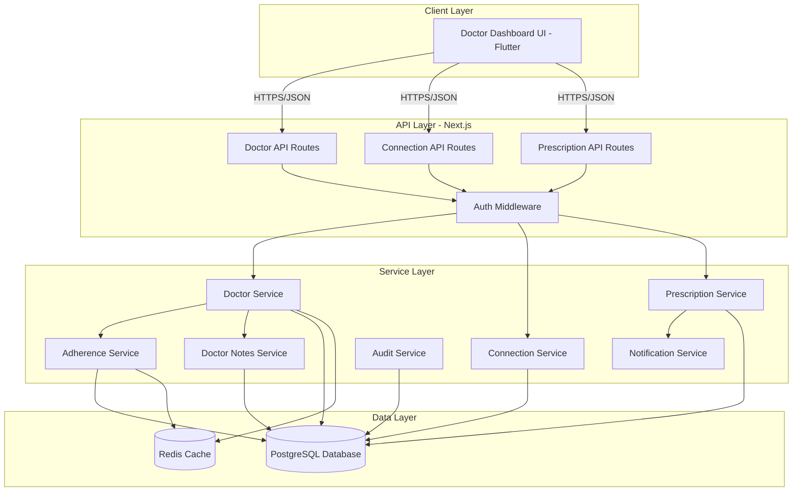

# Design Document: Doctor Dashboard

## Overview

The Doctor Dashboard is a comprehensive web and mobile interface that enables doctors to monitor patient medication adherence, create and send prescriptions, manage secure doctor-patient connections, and intervene early when adherence drops. The system is built on the existing DasTern backend infrastructure using Next.js 14+ with App Router, PostgreSQL 16, Prisma ORM, and Redis for caching.

The dashboard implements a supervision model where doctors guide and recommend while patients own execution and confirmation of their medication regimens. All medical actions are logged immutably for legal traceability and compliance.

### Key Design Principles

1. **Supervision Model**: Doctors supervise and recommend; patients own execution
2. **Manual-First Approach**: No OCR or AI in MVP - manual data entry only
3. **Secure Medical Data**: Role-based access control with connection-based permissions
4. **Immutable Audit Trail**: All actions logged for legal traceability
5. **Real-Time Updates**: Adherence data updates within 5 seconds of patient actions
6. **Performance**: Dashboard loads in under 2 seconds
7. **Multi-Language Support**: Khmer and English throughout the interface

### Technology Stack

- **Frontend**: Flutter mobile app (existing)
- **Backend**: Next.js 14+ App Router with TypeScript
- **Database**: PostgreSQL 16 with Prisma ORM
- **Cache**: Redis 7+ for session management and real-time data
- **Authentication**: NextAuth.js v5 with JWT tokens
- **Real-Time**: Server-Sent Events (SSE) for notifications
- **File Storage**: AWS S3 for prescription images

## Architecture

### System Architecture Diagram



### Request Flow

```
Doctor Client Request
    ↓
Next.js API Route Handler
    ↓
Auth Middleware (Verify JWT + Doctor Role)
    ↓
RBAC Check (Verify Connection + Permission)
    ↓
Service Layer (Business Logic)
    ↓
Data Access Layer (Prisma + Redis)
    ↓
Response (JSON)
    ↓
Audit Logging (Async)
```

### Key Architectural Decisions

1. **Reuse Existing Backend**: Leverage existing Next.js API infrastructure and database schema
2. **Connection-Based Access**: All patient data access requires an active ACCEPTED connection
3. **Permission Levels**: Use existing PermissionLevel enum (NOT_ALLOWED, REQUEST, SELECTED, ALLOWED)
4. **Caching Strategy**: Cache adherence calculations and patient lists in Redis with 5-minute TTL
5. **Real-Time Updates**: Use SSE for adherence alerts and prescription confirmations
6. **Audit Everything**: Log all connection actions, prescription operations, and data access

## Components and Interfaces

### API Endpoints

#### Doctor Dashboard Endpoints

```typescript
GET /api/doctor/dashboard
Headers: { Authorization: "Bearer <token>" }
Response: {
  totalPatients: number
  patientsNeedingAttention: number
  todayAlerts: number
  recentActivity: [{
    id: string
    type: "CONNECTION_REQUEST" | "PRESCRIPTION_CONFIRMED" | "ADHERENCE_ALERT"
    patientName: string
    timestamp: string
    details: string
  }]
}

GET /api/doctor/patients
Headers: { Authorization: "Bearer <token>" }
Query: {
  adherenceFilter?: "GREEN" | "YELLOW" | "RED"
  activePrescription?: boolean
  lastActive?: "TODAY" | "WEEK" | "MONTH"
  sortBy?: "adherence" | "name" | "lastActive"
  page?: number
  limit?: number
}
Response: {
  patients: [{
    id: string
    name: string
    age: number
    gender: string
    phoneNumber: string
    activePrescriptions: number
    adherencePercentage: number
    adherenceLevel: "GREEN" | "YELLOW" | "RED"
    lastActivity: string
    symptoms: string
  }]
  total: number
  page: number
}


GET /api/doctor/patients/:patientId/details
Headers: { Authorization: "Bearer <token>" }
Response: {
  patient: {
    id: string
    firstName: string
    lastName: string
    age: number
    gender: string
    phoneNumber: string
    email?: string
    symptoms: string
  }
  activePrescriptions: [{
    id: string
    status: string
    createdAt: string
    medicationCount: number
  }]
  medicines: [{
    id: string
    name: string
    dosage: string
    frequency: string
    schedule: string[]
    imageUrl?: string
  }]
  adherenceTimeline: [{
    date: string
    percentage: number
    takenDoses: number
    totalDoses: number
  }]
  doctorNotes: [{
    id: string
    content: string
    createdAt: string
    updatedAt: string
  }]
}

GET /api/doctor/patients/:patientId/adherence
Headers: { Authorization: "Bearer <token>" }
Query: { startDate?: string, endDate?: string }
Response: {
  overallPercentage: number
  dailyAdherence: [{
    date: string
    percentage: number
    missedDoses: number
    lateDoses: number
    onTimeDoses: number
  }]
  weeklyTrends: [{
    week: string
    percentage: number
  }]
  alerts: [{
    type: "WARNING" | "CRITICAL"
    message: string
    timestamp: string
    consecutiveMissed: number
  }]
}
```

#### Connection Management Endpoints

```typescript
GET /api/doctor/connections/pending
Headers: { Authorization: "Bearer <token>" }
Response: {
  requests: [{
    id: string
    patientId: string
    patientName: string
    patientAge: number
    patientGender: string
    requestedAt: string
  }]
  total: number
}

POST /api/doctor/connections/:connectionId/accept
Headers: { Authorization: "Bearer <token>" }
Body: { permissionLevel?: "ALLOWED" | "SELECTED" }
Response: {
  connection: {
    id: string
    patientId: string
    status: "ACCEPTED"
    permissionLevel: string
    acceptedAt: string
  }
}

POST /api/doctor/connections/:connectionId/reject
Headers: { Authorization: "Bearer <token>" }
Body: { reason?: string }
Response: { message: string }

POST /api/doctor/connections/:connectionId/disconnect
Headers: { Authorization: "Bearer <token>" }
Body: { reason: string }
Response: { message: string }
```

#### Prescription Management Endpoints

```typescript
POST /api/doctor/prescriptions
Headers: { Authorization: "Bearer <token>" }
Body: {
  patientId: string
  prescriptionTitle: string
  diagnosis: string
  startDate: string (ISO 8601)
  endDate?: string (ISO 8601)
  doctorNotes?: string
  medications: [{
    medicineName: string
    dosage: string
    form: "TABLET" | "CAPSULE" | "LIQUID" | "INJECTION" | "OTHER"
    frequency: "ONCE_DAILY" | "TWICE_DAILY" | "THREE_TIMES_DAILY" | "AS_NEEDED"
    scheduleTimes: string[] (HH:mm format)
    duration: number (days)
    instructions: string
    imageUrl?: string
  }]
}
Response: {
  prescription: {
    id: string
    status: "PENDING"
    createdAt: string
  }
}

GET /api/doctor/prescriptions
Headers: { Authorization: "Bearer <token>" }
Query: { patientId?: string, status?: string, page?: number }
Response: {
  prescriptions: [{
    id: string
    patientId: string
    patientName: string
    prescriptionTitle: string
    diagnosis: string
    status: "PENDING" | "ACTIVE" | "COMPLETED"
    medicationCount: number
    createdAt: string
    confirmedAt?: string
  }]
  total: number
}

GET /api/doctor/prescriptions/:prescriptionId
Headers: { Authorization: "Bearer <token>" }
Response: {
  prescription: {
    id: string
    patientId: string
    patientName: string
    prescriptionTitle: string
    diagnosis: string
    startDate: string
    endDate?: string
    status: string
    doctorNotes: string
    medications: [...]
    createdAt: string
    confirmedAt?: string
  }
}

PATCH /api/doctor/prescriptions/:prescriptionId
Headers: { Authorization: "Bearer <token>" }
Body: {
  medications?: [...]
  doctorNotes?: string
  urgentReason: string (required if status is ACTIVE)
}
Response: {
  prescription: {...}
  newVersion: number
}
```

#### Doctor Notes Endpoints

```typescript
POST /api/doctor/notes
Headers: { Authorization: "Bearer <token>" }
Body: {
  patientId: string
  content: string
}
Response: {
  note: {
    id: string
    patientId: string
    content: string
    createdAt: string
  }
}

GET /api/doctor/notes
Headers: { Authorization: "Bearer <token>" }
Query: { patientId: string }
Response: {
  notes: [{
    id: string
    content: string
    createdAt: string
    updatedAt: string
  }]
}

PATCH /api/doctor/notes/:noteId
Headers: { Authorization: "Bearer <token>" }
Body: { content: string }
Response: {
  note: {
    id: string
    content: string
    updatedAt: string
  }
}
```

## Data Models

### Database Schema Extensions

The Doctor Dashboard reuses the existing database schema with the following key models:

```typescript
// Existing models used by Doctor Dashboard

model User {
  id: string
  role: "PATIENT" | "DOCTOR" | "FAMILY_MEMBER"
  fullName: string
  phoneNumber: string
  hospitalClinic?: string
  specialty?: string
  // ... other fields
}

model Connection {
  id: string
  initiatorId: string
  recipientId: string
  status: "PENDING" | "ACCEPTED" | "REVOKED"
  permissionLevel: "NOT_ALLOWED" | "REQUEST" | "SELECTED" | "ALLOWED"
  requestedAt: DateTime
  acceptedAt?: DateTime
  revokedAt?: DateTime
}

model Prescription {
  id: string
  patientId: string
  doctorId: string
  patientName: string
  symptoms: string
  status: "DRAFT" | "ACTIVE" | "PAUSED" | "INACTIVE"
  isUrgent: boolean
  urgentReason?: string
  currentVersion: number
  medications: Medication[]
}

model Medication {
  id: string
  prescriptionId: string
  medicineName: string
  morningDosage?: Json
  daytimeDosage?: Json
  nightDosage?: Json
  frequency: string
  timing: string
}

model DoseEvent {
  id: string
  prescriptionId: string
  medicationId: string
  patientId: string
  scheduledTime: DateTime
  status: "DUE" | "TAKEN_ON_TIME" | "TAKEN_LATE" | "MISSED" | "SKIPPED"
  takenAt?: DateTime
}

model AuditLog {
  id: string
  actorId: string
  actorRole: "DOCTOR" | "PATIENT" | "FAMILY_MEMBER"
  actionType: ActionType
  resourceType: string
  resourceId: string
  details: Json
  createdAt: DateTime
}
```

### New Model: DoctorNote

```prisma
model DoctorNote {
  id        String   @id @default(uuid())
  doctorId  String
  patientId String
  content   String   @db.Text
  createdAt DateTime @default(now()) @db.Timestamptz
  updatedAt DateTime @updatedAt @db.Timestamptz
  
  doctor  User @relation("DoctorNotes", fields: [doctorId], references: [id], onDelete: Cascade)
  patient User @relation("PatientNotes", fields: [patientId], references: [id], onDelete: Cascade)
  
  @@index([doctorId, patientId])
  @@index([createdAt])
}
```

### TypeScript Type Definitions

```typescript
// Doctor Dashboard Types

interface DoctorDashboardOverview {
  totalPatients: number
  patientsNeedingAttention: number
  todayAlerts: number
  recentActivity: RecentActivity[]
}

interface RecentActivity {
  id: string
  type: "CONNECTION_REQUEST" | "PRESCRIPTION_CONFIRMED" | "ADHERENCE_ALERT"
  patientName: string
  timestamp: string
  details: string
}

interface PatientListItem {
  id: string
  name: string
  age: number
  gender: string
  phoneNumber: string
  activePrescriptions: number
  adherencePercentage: number
  adherenceLevel: "GREEN" | "YELLOW" | "RED"
  lastActivity: string
  symptoms: string
}

interface PatientDetails {
  patient: PatientInfo
  activePrescriptions: PrescriptionSummary[]
  medicines: MedicineInfo[]
  adherenceTimeline: AdherenceDataPoint[]
  doctorNotes: DoctorNote[]
}

interface AdherenceDataPoint {
  date: string
  percentage: number
  takenDoses: number
  totalDoses: number
}

interface AdherenceAlert {
  type: "WARNING" | "CRITICAL"
  message: string
  timestamp: string
  consecutiveMissed: number
}

interface DoctorNote {
  id: string
  content: string
  createdAt: string
  updatedAt: string
}

interface PrescriptionCreateRequest {
  patientId: string
  prescriptionTitle: string
  diagnosis: string
  startDate: string
  endDate?: string
  doctorNotes?: string
  medications: MedicationInput[]
}

interface MedicationInput {
  medicineName: string
  dosage: string
  form: MedicineForm
  frequency: Frequency
  scheduleTimes: string[]
  duration: number
  instructions: string
  imageUrl?: string
}

type MedicineForm = "TABLET" | "CAPSULE" | "LIQUID" | "INJECTION" | "OTHER"
type Frequency = "ONCE_DAILY" | "TWICE_DAILY" | "THREE_TIMES_DAILY" | "AS_NEEDED"
type AdherenceLevel = "GREEN" | "YELLOW" | "RED"
```

## Service
    await this.auditService.log({
      actorId: doctorId,
      actorRole: "DOCTOR",
      actionType: "DOCTOR_NOTE_UPDATE",
      resourceType: "DoctorNote",
      resourceId: noteId,
      details: { oldContentLength: existing.content.length, newContentLength: content.length }
    })
    
    return note
  }
}
```

" }
    })
  }
  
  async updateNote(
    doctorId: string,
    noteId: string,
    content: string
  ): Promise<DoctorNote> {
    // Verify ownership
    const existing = await this.prisma.doctorNote.findUnique({
      where: { id: noteId }
    })
    
    if (!existing || existing.doctorId !== doctorId) {
      throw new Error("Note not found or access denied")
    }
    
    const note = await this.prisma.doctorNote.update({
      where: { id: noteId },
      data: { content }
    })
    
    // Audit log    })
    
    // Audit log
    await this.auditService.log({
      actorId: doctorId,
      actorRole: "DOCTOR",
      actionType: "DOCTOR_NOTE_CREATE",
      resourceType: "DoctorNote",
      resourceId: note.id,
      details: { patientId, contentLength: content.length }
    })
    
    return note
  }
  
  async getNotes(
    doctorId: string,
    patientId: string
  ): Promise<DoctorNote[]> {
    return this.prisma.doctorNote.findMany({
      where: { doctorId, patientId },
      orderBy: { createdAt: "descing,
    patientId: string,
    content: string
  ): Promise<DoctorNote> {
    // Verify connection
    const connection = await this.prisma.connection.findFirst({
      where: {
        initiatorId: patientId,
        recipientId: doctorId,
        status: "ACCEPTED"
      }
    })
    
    if (!connection) {
      throw new Error("No active connection with patient")
    }
    
    const note = await this.prisma.doctorNote.create({
      data: {
        doctorId,
        patientId,
        content
      }
  }
    }
    
    return alerts
  }
  
  async getBatchAdherence(patientIds: string[]): Promise<AdherenceResult[]> {
    const endDate = new Date()
    const startDate = new Date(endDate.getTime() - 30 * 24 * 60 * 60 * 1000)
    
    return Promise.all(
      patientIds.map(id => this.calculateAdherence(id, startDate, endDate))
    )
  }
}
```

### DoctorNotesService

```typescript
class DoctorNotesService {
  private prisma: PrismaClient
  private auditService: AuditService
  
  async createNote(
    doctorId: str "WARNING",
          message: `Patient has missed ${consecutiveCount} consecutive doses`,
          timestamp: dose.scheduledTime.toISOString(),
          consecutiveMissed: consecutiveCount
        })
      } else if (consecutiveCount >= 3) {
        alerts.push({
          type: "CRITICAL",
          message: `Patient has missed ${consecutiveCount} consecutive doses - immediate intervention needed`,
          timestamp: dose.scheduledTime.toISOString(),
          consecutiveMissed: consecutiveCount
        })
    et lastDate: Date | null = null
    
    for (const dose of missedDoses) {
      if (lastDate) {
        const hoursDiff = (dose.scheduledTime.getTime() - lastDate.getTime()) / (1000 * 60 * 60)
        if (hoursDiff <= 24) {
          consecutiveCount++
        } else {
          consecutiveCount = 1
        }
      } else {
        consecutiveCount = 1
      }
      
      lastDate = dose.scheduledTime
      
      // Generate alerts
      if (consecutiveCount === 2) {
        alerts.push({
          type:e<AdherenceAlert[]> {
    const now = new Date()
    const threeDaysAgo = new Date(now.getTime() - 3 * 24 * 60 * 60 * 1000)
    
    const missedDoses = await this.prisma.doseEvent.findMany({
      where: {
        patientId,
        status: "MISSED",
        scheduledTime: {
          gte: threeDaysAgo,
          lte: now
        }
      },
      orderBy: { scheduledTime: "asc" }
    })
    
    const alerts: AdherenceAlert[] = []
    
    // Check for consecutive missed doses
    let consecutiveCount = 0
    l0, 0, 0)
      
      const nextDate = new Date(date)
      nextDate.setDate(nextDate.getDate() + 1)
      
      const adherence = await this.calculateAdherence(patientId, date, nextDate)
      
      timeline.unshift({
        date: date.toISOString().split('T')[0],
        percentage: adherence.percentage,
        takenDoses: adherence.takenOnTime + adherence.takenLate,
        totalDoses: adherence.totalDoses
      })
    }
    
    return timeline
  }
  
  async detectMissedDoses(patientId: string): PromisoseEvents[doseEvents.length - 1]?.takenAt?.toISOString()
    }
    
    // Cache for 5 minutes
    await this.redis.setex(cacheKey, 300, JSON.stringify(result))
    
    return result
  }
  
  async getAdherenceTimeline(
    patientId: string,
    days: number
  ): Promise<AdherenceDataPoint[]> {
    const timeline: AdherenceDataPoint[] = []
    const endDate = new Date()
    
    for (let i = 0; i < days; i++) {
      const date = new Date(endDate)
      date.setDate(date.getDate() - i)
      date.setHours(0, seEvents.length
    const takenOnTime = doseEvents.filter(d => d.status === "TAKEN_ON_TIME").length
    const takenLate = doseEvents.filter(d => d.status === "TAKEN_LATE").length
    const missed = doseEvents.filter(d => d.status === "MISSED").length
    
    const percentage = totalDoses > 0 
      ? ((takenOnTime + takenLate) / totalDoses) * 100 
      : 0
    
    const result = {
      percentage: Math.round(percentage),
      totalDoses,
      takenOnTime,
      takenLate,
      missed,
      lastDoseTime: dDate
  ): Promise<AdherenceResult> {
    // Check cache
    const cacheKey = `adherence:${patientId}:${startDate.toISOString()}:${endDate.toISOString()}`
    const cached = await this.redis.get(cacheKey)
    if (cached) return JSON.parse(cached)
    
    // Get all dose events in date range
    const doseEvents = await this.prisma.doseEvent.findMany({
      where: {
        patientId,
        scheduledTime: {
          gte: startDate,
          lte: endDate
        }
      }
    })
    
    const totalDoses = do Date): number {
    const today = new Date()
    let age = today.getFullYear() - dateOfBirth.getFullYear()
    const monthDiff = today.getMonth() - dateOfBirth.getMonth()
    if (monthDiff < 0 || (monthDiff === 0 && today.getDate() < dateOfBirth.getDate())) {
      age--
    }
    return age
  }
}
```

### AdherenceService

```typescript
class AdherenceService {
  private prisma: PrismaClient
  private redis: RedisClient
  
  async calculateAdherence(
    patientId: string,
    startDate: Date,
    endDate: : { createdAt: "desc" }
    })
    
    return {
      patient: this.mapPatientInfo(patient),
      activePrescriptions: patient.ownedPrescriptions.map(this.mapPrescriptionSummary),
      medicines: this.extractMedicines(patient.ownedPrescriptions),
      adherenceTimeline,
      doctorNotes
    }
  }
  
  private getAdherenceLevel(percentage: number): AdherenceLevel {
    if (percentage >= 90) return "GREEN"
    if (percentage >= 70) return "YELLOW"
    return "RED"
  }
  
  private calculateAge(dateOfBirth:include: {
        ownedPrescriptions: {
          where: { status: { in: ["ACTIVE", "PENDING"] } },
          include: { medications: true }
        }
      }
    })
    
    if (!patient) throw new Error("Patient not found")
    
    // Get adherence timeline
    const adherenceTimeline = await this.adherenceService.getAdherenceTimeline(
      patientId,
      30
    )
    
    // Get doctor notes
    const doctorNotes = await this.prisma.doctorNote.findMany({
      where: { doctorId, patientId },
      orderBy: paginated, total: filtered.length }
    
    // Cache for 5 minutes
    await this.redis.setex(cacheKey, 300, JSON.stringify(result))
    
    return result
  }
  
  async getPatientDetails(
    doctorId: string,
    patientId: string
  ): Promise<PatientDetails> {
    // Verify connection and permission
    await this.connectionService.validateAccess(doctorId, patientId, "ALLOWED")
    
    // Fetch patient data
    const patient = await this.prisma.user.findUnique({
      where: { id: patientId },
      scriptions === 0
      )
    }
    
    // Apply sorting
    if (filters.sortBy === "adherence") {
      filtered.sort((a, b) => a.adherencePercentage - b.adherencePercentage)
    } else if (filters.sortBy === "name") {
      filtered.sort((a, b) => a.name.localeCompare(b.name))
    }
    
    // Pagination
    const page = filters.page || 1
    const limit = filters.limit || 20
    const start = (page - 1) * limit
    const paginated = filtered.slice(start, start + limit)
    
    const result = { patientsel(adherence.percentage),
          lastActivity: adherence.lastDoseTime,
          symptoms: patient.ownedPrescriptions[0]?.symptoms || ""
        }
      })
    )
    
    // Apply filters
    let filtered = patientList
    if (filters.adherenceFilter) {
      filtered = filtered.filter(p => p.adherenceLevel === filters.adherenceFilter)
    }
    if (filters.activePrescription !== undefined) {
      filtered = filtered.filter(p => 
        filters.activePrescription ? p.activePrescriptions > 0 : p.activePre  patient.id,
          new Date(Date.now() - 30 * 24 * 60 * 60 * 1000),
          new Date()
        )
        
        return {
          id: patient.id,
          name: `${patient.firstName} ${patient.lastName}`,
          age: this.calculateAge(patient.dateOfBirth),
          gender: patient.gender,
          phoneNumber: patient.phoneNumber,
          activePrescriptions: patient.ownedPrescriptions.length,
          adherencePercentage: adherence.percentage,
          adherenceLevel: this.getAdherenceLevIds = connections.map(c => c.recipientId)
    
    // Fetch patient data with prescriptions
    const patients = await this.prisma.user.findMany({
      where: { id: { in: patientIds } },
      include: {
        ownedPrescriptions: {
          where: { status: "ACTIVE" }
        }
      }
    })
    
    // Calculate adherence for each patient
    const patientList = await Promise.all(
      patients.map(async (patient) => {
        const adherence = await this.adherenceService.calculateAdherence(
        rts.length,
      recentActivity
    }
  }
  
  async getPatientList(
    doctorId: string,
    filters: PatientListFilters
  ): Promise<{ patients: PatientListItem[], total: number }> {
    // Check cache first
    const cacheKey = `doctor:${doctorId}:patients:${JSON.stringify(filters)}`
    const cached = await this.redis.get(cacheKey)
    if (cached) return JSON.parse(cached)
    
    // Get connected patients
    const connections = await this.connectionService.getAcceptedConnections(doctorId)
    let patientcs
    const totalPatients = patientIds.length
    const adherenceData = await this.adherenceService.getBatchAdherence(patientIds)
    const patientsNeedingAttention = adherenceData.filter(a => a.percentage < 70).length
    
    // Get today's alerts
    const todayAlerts = await this.getAlertsForToday(patientIds)
    
    // Get recent activity
    const recentActivity = await this.getRecentActivity(doctorId, 10)
    
    return {
      totalPatients,
      patientsNeedingAttention,
      todayAlerts: todayAle Layer Design

### DoctorService

```typescript
class DoctorService {
  private prisma: PrismaClient
  private redis: RedisClient
  private connectionService: ConnectionService
  private adherenceService: AdherenceService
  
  async getDashboardOverview(doctorId: string): Promise<DoctorDashboardOverview> {
    // Get all connected patients
    const connections = await this.connectionService.getAcceptedConnections(doctorId)
    const patientIds = connections.map(c => c.recipientId)
    
    // Calculate metri


GET /api/doctor/patients/:patientId/details
Headers: { Authorization: "Bearer <token>" }
Response: {
  patient: {
    id: string
    firstName: string
    lastName: string
    age: number
    gender: string
    phoneNumber: string
    email?: string
    symptoms: string
  }
  activePrescriptions: [{
    id: string
    status: string
    createdAt: string
    medicationCount: number
  }]
  medicines: [{
    id: string
    name: string
    dosage: string
    frequency: string
    schedule: string[]
    imageUrl?: string
  }]
  adherenceTimeline: [{
    date: string
    percentage: number
    takenDoses: number
    totalDoses: number
  }]
  doctorNotes: [{
    id: string
    content: string
    createdAt: string
    updatedAt: string
  }]
}
```


## Error Handling

### Error Response Format

All API endpoints return errors in a consistent format:

```typescript
{
  error: {
    code: string
    message: string
    details?: object
  }
  status: number
}
```

### Error Categories

1. **Authentication Errors (401)**
   - Invalid or expired JWT token
   - Missing authorization header
   - Token signature verification failed

2. **Authorization Errors (403)**
   - User role is not DOCTOR
   - No active connection with patient
   - Insufficient permission level
   - Attempting to access another doctor's notes

3. **Validation Errors (400)**
   - Missing required fields
   - Invalid data format
   - Invalid enum values
   - Date range errors

4. **Not Found Errors (404)**
   - Patient not found
   - Prescription not found
   - Connection not found
   - Doctor note not found

5. **Conflict Errors (409)**
   - Attempting to edit confirmed prescription without urgent reason
   - Connection already exists
   - Duplicate note creation

6. **Server Errors (500)**
   - Database connection failures
   - Redis cache failures
   - Unexpected exceptions

### Error Handling Strategy

```typescript
// Middleware error handler
async function errorHandler(error: Error, req: Request, res: Response) {
  // Log error
  logger.error({
    error: error.message,
    stack: error.stack,
    path: req.path,
    method: req.method,
    userId: req.user?.id
  })
  
  // Map error to response
  if (error instanceof ValidationError) {
    return res.status(400).json({
      error: {
        code: "VALIDATION_ERROR",
        message: error.message,
        details: error.details
      }
    })
  }
  
  if (error instanceof AuthorizationError) {
    return res.status(403).json({
      error: {
        code: "AUTHORIZATION_ERROR",
        message: error.message
      }
    })
  }
  
  // Default to 500
  return res.status(500).json({
    error: {
      code: "INTERNAL_SERVER_ERROR",
      message: "An unexpected error occurred"
    }
  })
}
```

## Correctness Properties

*A property is a characteristic or behavior that should hold true across all valid executions of a system—essentially, a formal statement about what the system should do. Properties serve as the bridge between human-readable specifications and machine-verifiable correctness guarantees.*

### Property 1: Connection State Transitions

*For any* connection between a doctor and patient, when a state transition occurs (PENDING → ACCEPTED, PENDING → REVOKED, ACCEPTED → REVOKED), the new state should be correctly recorded and an audit log entry should be created with the transition details.

**Validates: Requirements 1.1, 1.3, 1.4, 1.5, 1.6**

### Property 2: Connection-Based Access Control

*For any* doctor attempting to access patient data, the system should grant access if and only if an ACCEPTED connection exists between the doctor and patient.

**Validates: Requirements 10.1**

### Property 3: Pending Connection Filtering

*For any* doctor, querying pending connection requests should return only connections where the doctor is the recipient and the status is PENDING.

**Validates: Requirements 1.2**

### Property 4: Dashboard Metrics Accuracy

*For any* doctor with N accepted connections, the dashboard should display totalPatients equal to N, and patientsNeedingAttention should equal the count of patients with adherence < 70%.

**Validates: Requirements 2.1, 2.2**

### Property 5: Patient List Filtering

*For any* adherence filter (GREEN/YELLOW/RED), all returned patients should have adherence percentages matching the filter range (GREEN: ≥90%, YELLOW: 70-89%, RED: <70%).

**Validates: Requirements 3.2**

### Property 6: Patient List Data Completeness

*For any* patient in the patient list, the returned data should include all required fields: name, age, gender, phoneNumber, activePrescriptions, adherencePercentage, adherenceLevel, lastActivity, and symptoms.

**Validates: Requirements 3.1**

### Property 7: Patient List Sorting

*For any* sort column and direction, the patient list should be ordered correctly by that column in the specified direction (ascending or descending).

**Validates: Requirements 3.5**

### Property 8: Adherence Calculation Correctness

*For any* patient and date range, the adherence percentage should equal (takenOnTime + takenLate) / totalDoses * 100, rounded to the nearest integer.

**Validates: Requirements 7.1**

### Property 9: Adherence Indicator Mapping

*For any* adherence percentage, the adherence indicator should be GREEN if percentage ≥ 90%, YELLOW if 70% ≤ percentage < 90%, and RED if percentage < 70%.

**Validates: Requirements 7.7, 7.8, 7.9**

### Property 10: Missed Dose Alert Generation

*For any* patient with 3 or more consecutive missed doses, the system should generate a WARNING alert for 2 consecutive misses and a CRITICAL alert for 3+ consecutive misses.

**Validates: Requirements 7.5, 7.6**

### Property 11: Adherence Timeline Completeness

*For any* patient and N-day timeline request, the returned timeline should contain exactly N data points, one for each day, with correct adherence calculations for each day.

**Validates: Requirements 4.4**

### Property 12: Prescription Creation Validation

*For any* prescription creation request, the system should reject requests missing required fields (prescriptionTitle, diagnosis, startDate, or at least one medication) and accept requests with all required fields.

**Validates: Requirements 5.1, 5.2**

### Property 13: Prescription Initial State

*For any* newly created prescription, the initial status should be PENDING and an audit log entry should be created.

**Validates: Requirements 5.3, 5.4, 6.1**

### Property 14: Prescription Confirmation State Transition

*For any* prescription with PENDING status, when a patient confirms it, the status should change to ACTIVE and an audit log entry should be created.

**Validates: Requirements 6.2, 6.5**

### Property 15: Active Prescription Immutability

*For any* prescription with ACTIVE status, attempting to edit the prescription without providing an urgentReason should be rejected with an error.

**Validates: Requirements 6.3, 10.2**

### Property 16: Doctor Notes Access Control

*For any* doctor querying notes for a patient, only notes created by that specific doctor for that specific patient should be returned.

**Validates: Requirements 8.4**

### Property 17: Doctor Notes Timestamping

*For any* doctor note creation, the note should have a createdAt timestamp, and when edited, the updatedAt timestamp should be updated to a time after createdAt.

**Validates: Requirements 8.2, 8.3**

### Property 18: Patient Note Access Restriction

*For any* patient attempting to access doctor notes, the system should reject the request with an authorization error.

**Validates: Requirements 8.5**

### Property 19: Notification Generation on Prescription Send

*For any* prescription sent by a doctor, a system notification should be generated for the patient with the prescription details.

**Validates: Requirements 9.1**

### Property 20: Notification Generation on Disconnection

*For any* doctor-initiated disconnection, a system notification should be generated for the patient with the disconnection notice.

**Validates: Requirements 9.3**

### Property 21: Role-Based Action Restrictions

*For any* doctor attempting to mark a dose as taken, the system should reject the action with an authorization error.

**Validates: Requirements 10.3**

### Property 22: Audit Trail Immutability

*For any* audit log entry, attempting to modify or delete the entry after creation should be rejected.

**Validates: Requirements 11.5**

### Property 23: Comprehensive Audit Logging

*For any* connection action (accept, reject, disconnect), prescription action (create, update, confirm), or note action (create, update), an audit log entry should be created with actorId, actionType, resourceType, resourceId, and timestamp.

**Validates: Requirements 1.6, 5.4, 6.5, 11.1, 11.2, 11.3, 11.4**

### Property 24: Pagination Correctness

*For any* patient list with more than 100 patients, requesting page N with limit 20 should return patients from index (N-1)*20 to N*20-1.

**Validates: Requirements 12.4**

### Property 25: Access Control Violation Logging

*For any* access control violation (unauthorized data access, invalid permission level, missing connection), an audit log entry should be created recording the attempted action.

**Validates: Requirements 10.5**

## Testing Strategy

### Dual Testing Approach

The Doctor Dashboard will use both unit testing and property-based testing to ensure comprehensive coverage:

- **Unit Tests**: Verify specific examples, edge cases, and error conditions
- **Property Tests**: Verify universal properties across all inputs

Both approaches are complementary and necessary for comprehensive coverage. Unit tests catch concrete bugs in specific scenarios, while property tests verify general correctness across a wide range of inputs.

### Property-Based Testing Configuration

**Library Selection**: 
- **TypeScript/JavaScript**: fast-check
- **Reason**: Mature library with excellent TypeScript support, built-in generators, and shrinking capabilities

**Test Configuration**:
- Minimum 100 iterations per property test (due to randomization)
- Each property test must reference its design document property
- Tag format: `// Feature: doctor-dashboard, Property {number}: {property_text}`

**Example Property Test**:

```typescript
import fc from 'fast-check'

// Feature: doctor-dashboard, Property 9: Adherence Indicator Mapping
describe('Adherence Indicator Mapping', () => {
  it('should map adherence percentages to correct indicator levels', () => {
    fc.assert(
      fc.property(
        fc.integer({ min: 0, max: 100 }),
        (adherencePercentage) => {
          const indicator = getAdherenceLevel(adherencePercentage)
          
          if (adherencePercentage >= 90) {
            expect(indicator).toBe('GREEN')
          } else if (adherencePercentage >= 70) {
            expect(indicator).toBe('YELLOW')
          } else {
            expect(indicator).toBe('RED')
          }
        }
      ),
      { numRuns: 100 }
    )
  })
})

// Feature: doctor-dashboard, Property 8: Adherence Calculation Correctness
describe('Adherence Calculation', () => {
  it('should calculate adherence percentage correctly', () => {
    fc.assert(
      fc.property(
        fc.array(fc.record({
          status: fc.constantFrom('TAKEN_ON_TIME', 'TAKEN_LATE', 'MISSED', 'SKIPPED')
        }), { minLength: 1, maxLength: 100 }),
        (doseEvents) => {
          const takenOnTime = doseEvents.filter(d => d.status === 'TAKEN_ON_TIME').length
          const takenLate = doseEvents.filter(d => d.status === 'TAKEN_LATE').length
          const total = doseEvents.length
          
          const result = calculateAdherence(doseEvents)
          const expected = Math.round(((takenOnTime + takenLate) / total) * 100)
          
          expect(result.percentage).toBe(expected)
          expect(result.totalDoses).toBe(total)
          expect(result.takenOnTime).toBe(takenOnTime)
          expect(result.takenLate).toBe(takenLate)
        }
      ),
      { numRuns: 100 }
    )
  })
})
```

### Unit Testing Strategy

Unit tests should focus on:

1. **Specific Examples**: Test concrete scenarios with known inputs and outputs
2. **Edge Cases**: Empty lists, boundary values, null/undefined handling
3. **Error Conditions**: Invalid inputs, missing permissions, database failures
4. **Integration Points**: API endpoint responses, service layer interactions

**Example Unit Tests**:

```typescript
describe('DoctorService.getDashboardOverview', () => {
  it('should return correct metrics for doctor with 5 patients', async () => {
    // Setup: Create doctor with 5 connected patients
    const doctorId = 'doctor-123'
    const patients = await createTestPatients(5, doctorId)
    
    // Execute
    const overview = await doctorService.getDashboardOverview(doctorId)
    
    // Assert
    expect(overview.totalPatients).toBe(5)
    expect(overview.patientsNeedingAttention).toBeGreaterThanOrEqual(0)
    expect(overview.todayAlerts).toBeGreaterThanOrEqual(0)
    expect(overview.recentActivity).toBeInstanceOf(Array)
  })
  
  it('should return zero metrics for doctor with no patients', async () => {
    const doctorId = 'doctor-456'
    
    const overview = await doctorService.getDashboardOverview(doctorId)
    
    expect(overview.totalPatients).toBe(0)
    expect(overview.patientsNeedingAttention).toBe(0)
    expect(overview.todayAlerts).toBe(0)
    expect(overview.recentActivity).toEqual([])
  })
  
  it('should throw error for non-existent doctor', async () => {
    await expect(
      doctorService.getDashboardOverview('non-existent')
    ).rejects.toThrow('Doctor not found')
  })
})
```

### Integration Testing

Integration tests verify end-to-end flows:

1. **Connection Flow**: Request → Accept → Access patient data
2. **Prescription Flow**: Create → Send → Patient confirms → Generate doses
3. **Adherence Monitoring**: Patient marks doses → Adherence updates → Alerts generated
4. **Notes Flow**: Create note → Edit note → Query notes

### Test Coverage Goals

- **Unit Test Coverage**: Minimum 80% code coverage
- **Property Test Coverage**: All 25 correctness properties implemented
- **Integration Test Coverage**: All critical user flows tested
- **API Endpoint Coverage**: 100% of endpoints tested

### Continuous Integration

- Run all tests on every pull request
- Block merges if tests fail
- Generate coverage reports
- Run property tests with 100 iterations in CI, 1000 iterations nightly
