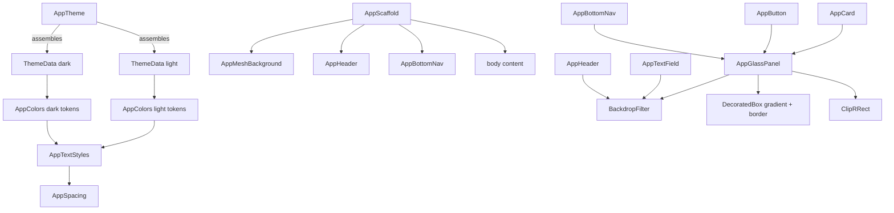

# Design Document — Global Widget System

## Overview

The RxCam global widget system is the complete set of reusable Flutter widgets that every screen
in the app must use. It implements the **iOS 26 Liquid Glass** aesthetic: frosted-glass surfaces
rendered with `BackdropFilter`, animated mesh backgrounds, spring-physics interactions, and a
dual-mode (light/dark) design token system.

All colour, spacing, and typography values are defined as named tokens in `lib/core/theme/`. No
widget may reference a raw `Color(0x...)` or `Colors.*` value directly. Every widget adapts to
the active `ThemeData.brightness` automatically through the token system.

**Primary brand colour:** `#009DFF`  
**Target platform:** Flutter (iOS-first, Android-compatible)  
**Dart SDK:** ≥ 3.0  
**Flutter SDK:** ≥ 3.22

---

## Architecture



### File Structure

```
lib/
  core/
    theme/
      app_colors.dart          # All colour tokens (light + dark)
      app_spacing.dart         # Spacing scale + border-radius tokens
      app_text_styles.dart     # Typography scale
      app_theme.dart           # ThemeData assembly
    widgets/
      app_glass_panel.dart
      app_mesh_background.dart
      app_scaffold.dart
      app_header.dart
      app_bottom_nav.dart
      app_button.dart
      app_text_field.dart
      app_card.dart
      app_badge.dart
      app_avatar.dart
      app_loading_view.dart
      app_error_view.dart
      app_empty_view.dart
```

---

## Components and Interfaces

### Token System

#### AppColors

**Design Decision:** Use a static class with named constants for shared tokens and a static
`of(BuildContext)` factory method that returns a resolved `_AppColorScheme` object for
mode-sensitive tokens. This is preferred over `ThemeExtension` because:

- Zero boilerplate — no `copyWith` / `lerp` required
- Compile-time safety for shared tokens (accessed as `AppColors.primary`)
- Runtime resolution for mode-sensitive tokens via `AppColors.of(context).textPrimary`
- Easier to read in widget code than `Theme.of(context).extension<AppColors>()!`

```dart
// lib/core/theme/app_colors.dart

class AppColors {
  AppColors._();

  // ── Shared tokens (identical in both modes) ──────────────────────────────
  static const Color primary      = Color(0xFF009DFF);
  static const Color primaryDark  = Color(0xFF0070CC);
  static const Color primaryLight = Color(0xFF66C8FF);

  static const Color success  = Color(0xFF34C759);
  static const Color danger   = Color(0xFFFF3B30);
  static const Color warning  = Color(0xFFFF9500);
  static const Color info     = Color(0xFF5AC8FA);

  static const Color glassPrimary = Color(0x1A009DFF); // primary @ 10%
  static const Color glassDanger  = Color(0x1AFF3B30); // danger  @ 10%

  // ── Dark-mode tokens ─────────────────────────────────────────────────────
  static const Color meshDeep  = Color(0xFF050A14);
  static const Color meshMid   = Color(0xFF0A1628);

  static const Color glassWhiteDark  = Color(0x1AFFFFFF); // white @ 10%
  static const Color glassBorderDark = Color(0x33FFFFFF); // white @ 20%
  static const Color glassShadow     = Color(0x40000000); // black @ 25%

  static const Color textPrimaryDark   = Color(0xFFFFFFFF);
  static const Color textSecondaryDark = Color(0xB3FFFFFF); // white @ 70%
  static const Color textTertiaryDark  = Color(0x66FFFFFF); // white @ 40%

  // ── Light-mode tokens ────────────────────────────────────────────────────
  static const Color lightBackground = Color(0xFFF2F2F7);
  static const Color lightSurface    = Color(0xFFFFFFFF);

  static const Color glassWhiteLight  = Color(0x99FFFFFF); // white @ 60%
  static const Color glassBorderLight = Color(0x1F000000); // black @ 12%
  static const Color glassShadowLight = Color(0x1A000000); // black @ 10%

  static const Color textPrimaryLight   = Color(0xFF0D0D0D);
  static const Color textSecondaryLight = Color(0x993C3C43); // #3C3C43 @ 60%
  static const Color textTertiaryLight  = Color(0x4D3C3C43); // #3C3C43 @ 30%

  // ── Context-resolved accessor ─────────────────────────────────────────────
  static _AppColorScheme of(BuildContext context) {
    final isDark = Theme.of(context).brightness == Brightness.dark;
    return isDark ? const _AppColorScheme.dark() : const _AppColorScheme.light();
  }
}

class _AppColorScheme {
  final Color background;
  final Color surface;
  final Color glassWhite;
  final Color glassBorder;
  final Color glassShadowColor;
  final Color textPrimary;
  final Color textSecondary;
  final Color textTertiary;

  const _AppColorScheme.dark()
      : background     = AppColors.meshDeep,
        surface        = AppColors.meshMid,
        glassWhite     = AppColors.glassWhiteDark,
        glassBorder    = AppColors.glassBorderDark,
        glassShadowColor = AppColors.glassShadow,
        textPrimary    = AppColors.textPrimaryDark,
        textSecondary  = AppColors.textSecondaryDark,
        textTertiary   = AppColors.textTertiaryDark;

  const _AppColorScheme.light()
      : background     = AppColors.lightBackground,
        surface        = AppColors.lightSurface,
        glassWhite     = AppColors.glassWhiteLight,
        glassBorder    = AppColors.glassBorderLight,
        glassShadowColor = AppColors.glassShadowLight,
        textPrimary    = AppColors.textPrimaryLight,
        textSecondary  = AppColors.textSecondaryLight,
        textTertiary   = AppColors.textTertiaryLight;
}
```


#### AppSpacing

```dart
// lib/core/theme/app_spacing.dart

class AppSpacing {
  AppSpacing._();

  // Spacing scale (dp)
  static const double xs  = 4;
  static const double sm  = 8;
  static const double md  = 16;
  static const double lg  = 24;
  static const double xl  = 32;
  static const double xxl = 48;

  // Superellipse border-radius tokens (dp)
  static const double radiusSm   = 12;
  static const double radiusMd   = 20;
  static const double radiusLg   = 28;
  static const double radiusXl   = 36;
  static const double radiusFull = 100;
}
```

#### AppTextStyles

`AppTextStyles` defines the full typography scale. All text colours are resolved at call-site
via `AppColors.of(context)` — the style constants themselves use `Colors.transparent` as a
placeholder that is always overridden by `copyWith` at the widget level.

```dart
// lib/core/theme/app_text_styles.dart

class AppTextStyles {
  AppTextStyles._();

  // Base styles — colour is always overridden via resolve()
  static const TextStyle displayLarge  = TextStyle(fontSize: 34, fontWeight: FontWeight.w700, letterSpacing: -0.5);
  static const TextStyle displayMedium = TextStyle(fontSize: 28, fontWeight: FontWeight.w600, letterSpacing: -0.3);
  static const TextStyle headlineLarge = TextStyle(fontSize: 22, fontWeight: FontWeight.w600, letterSpacing: -0.2);
  static const TextStyle headlineMedium= TextStyle(fontSize: 18, fontWeight: FontWeight.w600);
  static const TextStyle bodyLarge     = TextStyle(fontSize: 17, fontWeight: FontWeight.w400);
  static const TextStyle bodyMedium    = TextStyle(fontSize: 15, fontWeight: FontWeight.w400);
  static const TextStyle bodySmall     = TextStyle(fontSize: 13, fontWeight: FontWeight.w400);
  static const TextStyle labelLarge    = TextStyle(fontSize: 15, fontWeight: FontWeight.w600);
  static const TextStyle labelSmall    = TextStyle(fontSize: 11, fontWeight: FontWeight.w600, letterSpacing: 0.5);

  /// Returns the style with the correct text colour for the active brightness.
  static TextStyle resolve(TextStyle base, BuildContext context) {
    final colors = AppColors.of(context);
    return base.copyWith(color: colors.textPrimary);
  }

  /// Convenience resolvers for common use cases.
  static TextStyle headlineMediumResolved(BuildContext context) =>
      headlineMedium.copyWith(color: AppColors.of(context).textPrimary);

  static TextStyle bodyMediumResolved(BuildContext context) =>
      bodyMedium.copyWith(color: AppColors.of(context).textSecondary);

  static TextStyle labelSmallResolved(BuildContext context, {Color? color}) =>
      labelSmall.copyWith(color: color ?? AppColors.of(context).textTertiary);
}
```

#### AppTheme

```dart
// lib/core/theme/app_theme.dart

class AppTheme {
  AppTheme._();

  static ThemeData get dark => ThemeData(
    brightness: Brightness.dark,
    scaffoldBackgroundColor: AppColors.meshDeep,
    colorScheme: const ColorScheme.dark(primary: AppColors.primary),
    appBarTheme: const AppBarTheme(backgroundColor: Colors.transparent, elevation: 0),
    textTheme: _buildTextTheme(isDark: true),
    useMaterial3: true,
  );

  static ThemeData get light => ThemeData(
    brightness: Brightness.light,
    scaffoldBackgroundColor: AppColors.lightBackground,
    colorScheme: const ColorScheme.light(primary: AppColors.primary),
    appBarTheme: const AppBarTheme(backgroundColor: Colors.transparent, elevation: 0),
    textTheme: _buildTextTheme(isDark: false),
    useMaterial3: true,
  );

  static TextTheme _buildTextTheme({required bool isDark}) {
    final primary   = isDark ? AppColors.textPrimaryDark   : AppColors.textPrimaryLight;
    final secondary = isDark ? AppColors.textSecondaryDark : AppColors.textSecondaryLight;
    return TextTheme(
      displayLarge:  AppTextStyles.displayLarge.copyWith(color: primary),
      displayMedium: AppTextStyles.displayMedium.copyWith(color: primary),
      headlineLarge: AppTextStyles.headlineLarge.copyWith(color: primary),
      headlineMedium:AppTextStyles.headlineMedium.copyWith(color: primary),
      bodyLarge:     AppTextStyles.bodyLarge.copyWith(color: primary),
      bodyMedium:    AppTextStyles.bodyMedium.copyWith(color: secondary),
      bodySmall:     AppTextStyles.bodySmall.copyWith(color: secondary),
      labelLarge:    AppTextStyles.labelLarge.copyWith(color: primary),
      labelSmall:    AppTextStyles.labelSmall.copyWith(color: secondary),
    );
  }
}
```

---

### AppGlassPanel

**Class signature:**

```dart
class AppGlassPanel extends StatelessWidget {
  const AppGlassPanel({
    super.key,
    required this.child,
    this.borderRadius = AppSpacing.radiusLg,   // 28 dp default
    this.tint,           // null → mode-aware default (glassWhite token)
    this.blurRadius = 20.0,
    this.opacity = 1.0,
    this.padding,
  });

  final Widget child;
  final double borderRadius;
  final Color? tint;
  final double blurRadius;
  final double opacity;
  final EdgeInsetsGeometry? padding;
}
```

**Widget tree (ASCII):**

```
Opacity(opacity)
└── DecoratedBox
│     decoration: BoxDecoration(
│       boxShadow: [BoxShadow(
│         color: colors.glassShadowColor,
│         blurRadius: 32,
│         offset: Offset(0, 8),
│       )]
│     )
└── ClipRRect(borderRadius: BorderRadius.circular(borderRadius))
    └── BackdropFilter(filter: ImageFilter.blur(sigmaX: blurRadius, sigmaY: blurRadius))
        └── DecoratedBox
        │     decoration: BoxDecoration(
        │       gradient: LinearGradient(
        │         begin: Alignment.topLeft,
        │         end: Alignment.bottomRight,
        │         colors: [
        │           resolvedTint.withOpacity(darkMode ? 0.18 : 0.60),
        │           resolvedTint.withOpacity(darkMode ? 0.06 : 0.40),
        │         ],
        │       ),
        │       border: Border(
        │         top: BorderSide(
        │           color: colors.glassBorder,
        │           width: 0.8,
        │         ),
        │       ),
        │     )
        └── Padding(padding ?? EdgeInsets.zero)
            └── child
```

**Dark mode visual spec:**
- `resolvedTint` defaults to `Colors.white`; overridden by `tint` parameter
- Gradient stops: `white.withOpacity(0.18)` → `white.withOpacity(0.06)`
- Top border: `AppColors.glassBorderDark` (`#33FFFFFF`) at 0.8 px
- Shadow: `AppColors.glassShadow` (`#40000000`), blurRadius 32, offset (0, 8)

**Light mode visual spec:**
- `resolvedTint` defaults to `Colors.white`
- Gradient stops: `white.withOpacity(0.60)` → `white.withOpacity(0.40)` (more opaque)
- Top border: `AppColors.glassBorderLight` (`#1F000000`) at 0.8 px
- Shadow: `AppColors.glassShadowLight` (`#1A000000`), blurRadius 32, offset (0, 8)

**Implementation note:** The `DecoratedBox` for the shadow must sit *outside* `ClipRRect` so the
shadow is not clipped. The `BackdropFilter` must be the direct child of `ClipRRect` — this is the
only `BackdropFilter` in the tree (invariant: no double-blur stacking).

**Accessibility:** When used as an interactive surface, the caller must ensure the widget is at
least 44×44 dp. `AppGlassPanel` itself does not enforce a minimum size.


---

### AppMeshBackground

**Class signature:**

```dart
class AppMeshBackground extends StatefulWidget {
  const AppMeshBackground({
    super.key,
    required this.child,
  });

  final Widget child;
}
```

**Widget tree (ASCII):**

```
Stack
├── Container(color: colors.background)          // base fill
├── AnimatedBuilder(animation: _controller1)
│   └── CustomPaint(painter: _OrbPainter(
│         color: AppColors.primary,
│         opacity: darkMode ? 0.30 : 0.12,
│         progress: _anim1,
│         center: Offset(0.2w, 0.3h),
│       ))
├── AnimatedBuilder(animation: _controller2)
│   └── CustomPaint(painter: _OrbPainter(
│         color: AppColors.primaryDark,
│         opacity: darkMode ? 0.22 : 0.08,
│         progress: _anim2,
│         center: Offset(0.8w, 0.6h),
│       ))
├── AnimatedBuilder(animation: _controller1)     // reuses controller1
│   └── CustomPaint(painter: _OrbPainter(
│         color: AppColors.primaryLight,
│         opacity: darkMode ? 0.16 : 0.06,
│         progress: Tween(0.3, 0.7).animate(_controller1),
│         center: Offset(0.5w, 0.8h),
│       ))
└── child
```

**Animation spec:**
- `_controller1`: duration 9 s, `repeat(reverse: true)`
- `_controller2`: duration 13 s, `repeat(reverse: true)`
- Each orb is a `RadialGradient` painted via `CustomPainter`; the orb centre drifts ±10% of
  screen width/height over the animation cycle using a `Tween<Offset>`

**Dark mode orb opacities:** 0.30, 0.22, 0.16  
**Light mode orb opacities:** 0.12, 0.08, 0.06

**Disposal:** Both `AnimationController` instances must be disposed in `dispose()`.

**Dark mode base:** `AppColors.meshDeep` (`#050A14`)  
**Light mode base:** `AppColors.lightBackground` (`#F2F2F7`)

---

### AppScaffold

**Class signature:**

```dart
class AppScaffold extends StatelessWidget {
  const AppScaffold({
    super.key,
    required this.title,
    required this.body,
    this.currentNavIndex,
    this.onNavTap,
    this.showBackButton = false,
    this.subtitle,
    this.headerActions,
    this.floatingActionButton,
  });

  final String title;
  final Widget body;
  final int? currentNavIndex;
  final ValueChanged<int>? onNavTap;
  final bool showBackButton;
  final String? subtitle;
  final List<Widget>? headerActions;
  final Widget? floatingActionButton;
}
```

**Widget tree (ASCII):**

```
Scaffold(
  extendBody: true,
  extendBodyBehindAppBar: true,
  backgroundColor: colors.background,
  appBar: AppHeader(
    title: title,
    showBackButton: showBackButton,
    subtitle: subtitle,
    actions: headerActions,
  ),
  body: AppMeshBackground(
    child: body,
  ),
  bottomNavigationBar: currentNavIndex != null
    ? AppBottomNav(
        currentIndex: currentNavIndex!,
        onTap: onNavTap ?? (_) {},
      )
    : null,
  floatingActionButton: floatingActionButton,
)
```

**Key constraints:**
- `extendBody: true` — body content bleeds under the floating bottom nav
- `extendBodyBehindAppBar: true` — body content bleeds under the glass header
- `AppMeshBackground` is always the direct wrapper of `body` — no exceptions
- `AppBottomNav` is rendered if and only if `currentNavIndex != null`

---

### AppHeader

**Class signature:**

```dart
class AppHeader extends StatelessWidget implements PreferredSizeWidget {
  const AppHeader({
    super.key,
    required this.title,
    this.showBackButton = false,
    this.subtitle,
    this.actions,
  });

  final String title;
  final bool showBackButton;
  final String? subtitle;
  final List<Widget>? actions;

  @override
  Size get preferredSize => const Size.fromHeight(kToolbarHeight + 16); // ~72 dp
}
```

**Widget tree (ASCII):**

```
PreferredSize(height: kToolbarHeight + 16)
└── ClipRect
    └── BackdropFilter(filter: ImageFilter.blur(sigmaX: 20, sigmaY: 20))
        └── DecoratedBox
        │     decoration: BoxDecoration(
        │       color: colors.glassWhite,
        │       border: Border(
        │         bottom: BorderSide(color: colors.glassBorder, width: 0.5),
        │       ),
        │     )
        └── SafeArea(bottom: false)
            └── Padding(horizontal: AppSpacing.md, vertical: AppSpacing.sm)
                └── Row
                    ├── [if showBackButton]
                    │   SizedBox(44×44)
                    │   └── GestureDetector(onTap: Navigator.pop)
                    │       └── Icon(CupertinoIcons.chevron_left,
                    │             color: AppColors.primary, size: 20)
                    ├── Expanded
                    │   └── Column(crossAxisAlignment: start)
                    │       ├── Text(title,
                    │       │     style: AppTextStyles.headlineMediumResolved(context))
                    │       └── [if subtitle != null]
                    │           Text(subtitle!,
                    │             style: AppTextStyles.bodyMediumResolved(context),
                    │             overflow: TextOverflow.ellipsis)
                    └── [if actions != null]
                        Row(children: actions!.map(
                          (a) => SizedBox(44×44, child: Center(child: a))
                        ))
```

**Dark mode visual spec:**
- Background fill: `AppColors.glassWhiteDark` (`#1AFFFFFF`)
- Bottom border: `AppColors.glassBorderDark` (`#33FFFFFF`) at 0.5 px
- Title colour: `AppColors.textPrimaryDark` (`#FFFFFF`)

**Light mode visual spec:**
- Background fill: `AppColors.glassWhiteLight` (`#99FFFFFF`)
- Bottom border: `AppColors.glassBorderLight` (`#1F000000`) at 0.5 px
- Title colour: `AppColors.textPrimaryLight` (`#0D0D0D`)

**Accessibility:**
- Back button wrapped in `SizedBox(44, 44)` — meets 44×44 dp touch target
- Each action wrapped in `SizedBox(44, 44)` — meets 44×44 dp touch target
- `SafeArea(bottom: false)` ensures status bar is respected on all devices


---

### AppBottomNav

**Class signature:**

```dart
enum NavTab { home, medication, scan, connection, settings }

class AppBottomNav extends StatelessWidget {
  const AppBottomNav({
    super.key,
    required this.currentIndex,
    required this.onTap,
  });

  final int currentIndex;   // 0–4
  final ValueChanged<int> onTap;
}
```

**Tab definitions:**

| Index | Tab         | Outline icon                      | Filled icon                        | Label        |
|-------|-------------|-----------------------------------|------------------------------------|--------------|
| 0     | Home        | `CupertinoIcons.house`            | `CupertinoIcons.house_fill`        | "Home"       |
| 1     | Medication  | `CupertinoIcons.pills`            | `CupertinoIcons.pills_fill`        | "Medication" |
| 2     | Scan        | `CupertinoIcons.camera`           | `CupertinoIcons.camera_fill`       | "Scan"       |
| 3     | Connection  | `CupertinoIcons.person_2`         | `CupertinoIcons.person_2_fill`     | "Connection" |
| 4     | Settings    | `CupertinoIcons.settings`         | `CupertinoIcons.settings_solid`    | "Settings"   |

**Widget tree (ASCII):**

```
Padding(bottom: MediaQuery.padding.bottom + 12)
└── Center
    └── AppGlassPanel(
          borderRadius: AppSpacing.radiusFull,
          padding: EdgeInsets.symmetric(horizontal: 8, vertical: 8),
        )
        └── Row(mainAxisSize: min)
            ├── _NavItem(index: 0, ...)   // Home
            ├── _NavItem(index: 1, ...)   // Medication
            ├── _ScanTab()                // Scan — special treatment
            ├── _NavItem(index: 3, ...)   // Connection
            └── _NavItem(index: 4, ...)   // Settings
```

**`_NavItem` widget tree (for indices 0, 1, 3, 4):**

```
GestureDetector(onTap: () => onTap(index))
└── AnimatedContainer(
      duration: 260ms, curve: Curves.easeOutCubic,
      width: isSelected ? labelWidth + 48 : 44,
      height: 44,
      decoration: BoxDecoration(
        color: isSelected ? AppColors.primary.withOpacity(0.15) : Colors.transparent,
        borderRadius: BorderRadius.circular(AppSpacing.radiusFull),
      ),
    )
    └── Row(mainAxisSize: min, mainAxisAlignment: center)
        ├── Icon(
        │     isSelected ? filledIcon : outlineIcon,
        │     color: isSelected ? AppColors.primary : colors.textTertiary,
        │     size: 22,
        │   )
        └── [if isSelected]
            AnimatedOpacity(opacity: 1.0, duration: 160ms)
            └── Padding(left: 6)
                └── Text(label,
                      style: AppTextStyles.labelSmall.copyWith(
                        color: AppColors.primary,
                      ))
```

**`_ScanTab` widget tree (index 2 — always prominent):**

```
GestureDetector(onTap: () => onTap(2))
└── Transform.translate(offset: Offset(0, -4))   // elevated 4 dp above baseline
    └── Container(
          width: 48, height: 48,
          decoration: BoxDecoration(
            color: AppColors.primary,
            shape: BoxShape.circle,
            boxShadow: [BoxShadow(
              color: AppColors.primary.withOpacity(0.40),
              blurRadius: 12,
              offset: Offset(0, 4),
            )],
          ),
        )
        └── Icon(CupertinoIcons.camera_fill, color: Colors.white, size: 22)
```

**Dark mode visual spec:**
- Pill background: `AppColors.glassWhiteDark` (`#1AFFFFFF`)
- Pill border: `AppColors.glassBorderDark` (`#33FFFFFF`)
- Selected icon/label: `AppColors.primary` (`#009DFF`)
- Unselected icon: `AppColors.textTertiaryDark` (`#66FFFFFF`)

**Light mode visual spec:**
- Pill background: `AppColors.glassWhiteLight` (`#99FFFFFF`)
- Pill border: `AppColors.glassBorderLight` (`#1F000000`)
- Selected icon/label: `AppColors.primary` (`#009DFF`)
- Unselected icon: `AppColors.textTertiaryLight` (`#4D3C3C43`)

**Animation spec:**
- `AnimatedContainer` duration: 260 ms, curve: `Curves.easeOutCubic`
- Label fade-in: `AnimatedOpacity` 160 ms
- Scan tab: static (no selection animation — always prominent)

**Invariant:** Exactly one of indices 0–4 equals `currentIndex` at any time. The Scan tab (index 2)
always renders with `AppColors.primary` background and white icon regardless of selection state.

**Accessibility:**
- Each `_NavItem` has a minimum size of 44×44 dp (enforced by `AnimatedContainer` height: 44)
- `_ScanTab` is 48×48 dp (exceeds minimum)

---

### AppButton

**Class signature:**

```dart
enum AppButtonVariant { primary, secondary, destructive, ghost }

class AppButton extends StatefulWidget {
  const AppButton({
    super.key,
    required this.label,
    required this.onPressed,
    this.variant = AppButtonVariant.primary,
    this.isLoading = false,
    this.isFullWidth = false,
    this.icon,
  });

  final String label;
  final VoidCallback? onPressed;
  final AppButtonVariant variant;
  final bool isLoading;
  final bool isFullWidth;
  final IconData? icon;
}
```

**Variant colour matrix:**

| Variant     | Tint (glass fill)            | Label colour                  | Both modes? |
|-------------|------------------------------|-------------------------------|-------------|
| primary     | `AppColors.glassPrimary`     | `AppColors.primary`           | Yes         |
| secondary   | `colors.glassWhite`          | `colors.textPrimary`          | Mode-aware  |
| destructive | `AppColors.glassDanger`      | `AppColors.danger`            | Yes         |
| ghost       | `Colors.transparent`         | `colors.textSecondary`        | Mode-aware  |

**Widget tree (ASCII):**

```
Opacity(opacity: onPressed == null ? 0.5 : 1.0)
└── GestureDetector(
      onTapDown: _startPress,
      onTapUp: _endPress,
      onTapCancel: _endPress,
      onTap: isLoading ? null : onPressed,
    )
    └── AnimatedBuilder(animation: _scaleAnimation)
        └── Transform.scale(scale: _scaleAnimation.value)
            └── AppGlassPanel(
                  tint: resolvedTint,
                  borderRadius: AppSpacing.radiusFull,
                  padding: EdgeInsets.symmetric(
                    horizontal: AppSpacing.lg,   // 24 dp
                    vertical: AppSpacing.sm + 4, // 12 dp → total height ≥ 44 dp
                  ),
                )
                └── SizedBox(
                      width: isFullWidth ? double.infinity : null,
                      child: Row(mainAxisSize: min, mainAxisAlignment: center)
                    )
                    ├── [if isLoading]
                    │   SizedBox(18×18)
                    │   └── CircularProgressIndicator(
                    │         strokeWidth: 2,
                    │         color: AppColors.primary,
                    │       )
                    ├── [if !isLoading && icon != null]
                    │   Padding(right: AppSpacing.sm)
                    │   └── Icon(icon!, color: resolvedLabelColor, size: 18)
                    └── [if !isLoading]
                        Text(label,
                          style: AppTextStyles.labelLarge.copyWith(
                            color: resolvedLabelColor,
                          ))
```

**Spring animation spec:**
- `AnimationController`: duration 160 ms, `vsync: this`
- `CurvedAnimation`: curve `Curves.easeOutBack`
- `Tween<double>(begin: 1.0, end: 0.94)`
- `_startPress()`: `_controller.forward()`
- `_endPress()`: `_controller.reverse()`

**Disabled state:** When `onPressed == null`, the entire widget is wrapped in `Opacity(0.5)`.
The `GestureDetector.onTap` is set to `null` — Flutter automatically ignores taps.

**Loading state:** When `isLoading == true`, the label and icon are replaced by a 18×18
`CircularProgressIndicator`. The `onTap` callback is set to `null`.

**Accessibility:** Minimum height 44 dp enforced by vertical padding (12 dp × 2 + ~20 dp text = 44 dp).


---

### AppTextField

**Class signature:**

```dart
class AppTextField extends StatefulWidget {
  const AppTextField({
    super.key,
    required this.label,
    this.hint,
    this.controller,
    this.validator,
    this.keyboardType,
    this.obscureText = false,
    this.maxLines = 1,
    this.prefix,
    this.suffix,
    this.onChanged,
  });

  final String label;
  final String? hint;
  final TextEditingController? controller;
  final FormFieldValidator<String>? validator;
  final TextInputType? keyboardType;
  final bool obscureText;
  final int maxLines;
  final Widget? prefix;
  final Widget? suffix;
  final ValueChanged<String>? onChanged;
}
```

**Widget tree (ASCII):**

```
Column(crossAxisAlignment: start)
├── Padding(bottom: AppSpacing.xs)
│   └── Text(label.toUpperCase(),
│         style: AppTextStyles.labelSmallResolved(context))
└── ClipRRect(borderRadius: AppSpacing.radiusMd)
    └── BackdropFilter(filter: ImageFilter.blur(sigmaX: 16, sigmaY: 16))
        └── TextFormField(
              style: AppTextStyles.bodyLarge.copyWith(color: colors.textPrimary),
              decoration: InputDecoration(
                filled: true,
                fillColor: colors.glassWhite,
                hintText: hint,
                hintStyle: AppTextStyles.bodyLarge.copyWith(color: colors.textTertiary),
                prefixIcon: prefix,
                suffixIcon: suffix,
                contentPadding: EdgeInsets.symmetric(
                  horizontal: AppSpacing.md,
                  vertical: AppSpacing.sm + 4,  // ≥ 44 dp total height
                ),
                enabledBorder: OutlineInputBorder(
                  borderRadius: BorderRadius.circular(AppSpacing.radiusMd),
                  borderSide: BorderSide(color: colors.glassBorder, width: 0.8),
                ),
                focusedBorder: OutlineInputBorder(
                  borderRadius: BorderRadius.circular(AppSpacing.radiusMd),
                  borderSide: BorderSide(color: AppColors.primary, width: 1.5),
                ),
                errorBorder: OutlineInputBorder(
                  borderRadius: BorderRadius.circular(AppSpacing.radiusMd),
                  borderSide: BorderSide(color: AppColors.danger, width: 1.0),
                ),
                focusedErrorBorder: OutlineInputBorder(
                  borderRadius: BorderRadius.circular(AppSpacing.radiusMd),
                  borderSide: BorderSide(color: AppColors.danger, width: 1.5),
                ),
              ),
            )
```

**Dark mode visual spec:**
- Fill: `AppColors.glassWhiteDark` (`#1AFFFFFF`)
- Enabled border: `AppColors.glassBorderDark` (`#33FFFFFF`) at 0.8 px
- Focused border: `AppColors.primary` (`#009DFF`) at 1.5 px
- Error border: `AppColors.danger` (`#FF3B30`) at 1.0 px
- Input text: `AppColors.textPrimaryDark` (`#FFFFFF`)
- Hint text: `AppColors.textTertiaryDark` (`#66FFFFFF`)
- Label: `AppColors.textTertiaryDark`

**Light mode visual spec:**
- Fill: `AppColors.glassWhiteLight` (`#99FFFFFF`)
- Enabled border: `AppColors.glassBorderLight` (`#1F000000`) at 0.8 px
- Focused border: `AppColors.primary` (`#009DFF`) at 1.5 px
- Error border: `AppColors.danger` (`#FF3B30`) at 1.0 px
- Input text: `AppColors.textPrimaryLight` (`#0D0D0D`)
- Hint text: `AppColors.textTertiaryLight` (`#4D3C3C43`)
- Label: `AppColors.textTertiaryLight`

**Label:** Always rendered as `label.toUpperCase()` using `AppTextStyles.labelSmall`.

**Accessibility:** Label is always visible above the field — the field purpose is never ambiguous.
Minimum input area height 44 dp enforced by `contentPadding`.

---

### AppCard

**Class signature:**

```dart
class AppCard extends StatefulWidget {
  const AppCard({
    super.key,
    required this.child,
    this.onTap,
    this.padding,
    this.borderRadius = AppSpacing.radiusLg,
    this.tint,
  });

  final Widget child;
  final VoidCallback? onTap;
  final EdgeInsetsGeometry? padding;
  final double borderRadius;
  final Color? tint;
}
```

**Widget tree (ASCII):**

```
GestureDetector(onTap: onTap)   // only if onTap != null
└── AnimatedBuilder(animation: _scaleAnim)   // only if onTap != null
    └── Transform.scale(scale: _scaleAnim.value)
        └── AppGlassPanel(
              borderRadius: borderRadius,
              tint: tint ?? colors.glassWhite,
              padding: padding ?? EdgeInsets.all(AppSpacing.md),
            )
            └── child
```

**Spring animation spec (when `onTap` provided):**
- `AnimationController`: duration 120 ms
- `CurvedAnimation`: curve `Curves.easeOutBack`
- `Tween<double>(begin: 1.0, end: 0.97)`
- `onTapDown`: `_controller.forward()`
- `onTapUp` / `onTapCancel`: `_controller.reverse()`

**Dark mode visual spec:**
- Glass fill: `AppColors.glassWhiteDark` (via `AppGlassPanel` default)
- Shadow: `AppColors.glassShadow` (`#40000000`), blurRadius 32, offset (0, 8)
- Top border: `AppColors.glassBorderDark` (`#33FFFFFF`) at 0.8 px

**Light mode visual spec:**
- Glass fill: `AppColors.glassWhiteLight` (via `AppGlassPanel` default)
- Shadow: `AppColors.glassShadowLight` (`#1A000000`), blurRadius 32, offset (0, 8)
- Top border: `AppColors.glassBorderLight` (`#1F000000`) at 0.8 px

---

### AppBadge

**Class signature:**

```dart
enum AppBadgeVariant { active, pending, completed, flagged, info }

class AppBadge extends StatelessWidget {
  const AppBadge({
    super.key,
    required this.label,
    required this.variant,
  });

  final String label;
  final AppBadgeVariant variant;
}
```

**Variant colour mapping:**

| Variant   | Badge colour              | Hex       |
|-----------|---------------------------|-----------|
| active    | `AppColors.success`       | `#34C759` |
| pending   | `AppColors.warning`       | `#FF9500` |
| completed | `AppColors.primary`       | `#009DFF` |
| flagged   | `AppColors.danger`        | `#FF3B30` |
| info      | `AppColors.info`          | `#5AC8FA` |

**Widget tree (ASCII):**

```
Container(
  height: ≥ 22,
  padding: EdgeInsets.symmetric(horizontal: AppSpacing.sm, vertical: 3),
  decoration: BoxDecoration(
    color: badgeColor.withOpacity(0.15),
    borderRadius: BorderRadius.circular(AppSpacing.radiusFull),
  ),
)
└── Text(
      label.toUpperCase(),
      style: AppTextStyles.labelSmall.copyWith(color: badgeColor),
    )
```

**Visual spec (both modes):**
- Background: `badgeColor.withOpacity(0.15)` — always 15% opacity of the badge colour
- Label: `label.toUpperCase()` in `AppTextStyles.labelSmall` coloured with `badgeColor`
- Border radius: `AppSpacing.radiusFull` (100 dp) — pill shape
- Minimum height: 22 dp; horizontal padding: `AppSpacing.sm` (8 dp)

**Accessibility:** Label text is always present alongside the colour indicator — colour is never
the sole means of conveying status.

---

### AppAvatar

**Class signature:**

```dart
class AppAvatar extends StatelessWidget {
  const AppAvatar({
    super.key,
    this.imageUrl,
    this.initials,
    this.radius = 24,
    this.onTap,
  });

  final String? imageUrl;
  final String? initials;
  final double radius;
  final VoidCallback? onTap;
}
```

**Widget tree (ASCII):**

```
GestureDetector(onTap: onTap)
└── SizedBox(
      width: max(radius * 2, 44),   // enforce 44 dp touch target when interactive
      height: max(radius * 2, 44),
    )
    └── Center
        └── Container(
              width: radius * 2,
              height: radius * 2,
              decoration: BoxDecoration(
                shape: BoxShape.circle,
                gradient: LinearGradient(
                  begin: Alignment.topLeft,
                  end: Alignment.bottomRight,
                  colors: [colors.glassWhite, Colors.transparent],
                ),
                border: Border.all(color: colors.glassBorder, width: 1.5),
              ),
            )
            └── ClipOval
                └── [if imageUrl != null]
                    Image.network(imageUrl!, fit: BoxFit.cover)
                    [else]
                    Container(
                      color: AppColors.primary.withOpacity(0.20),
                      child: Center(
                        child: Text(
                          initials ?? '?',
                          style: AppTextStyles.labelLarge.copyWith(
                            color: AppColors.primary,
                          ),
                        ),
                      ),
                    )
```

**Dark mode visual spec:**
- Ring gradient: `AppColors.glassWhiteDark` → `Colors.transparent`
- Ring border: `AppColors.glassBorderDark` at 1.5 px

**Light mode visual spec:**
- Ring gradient: `AppColors.glassWhiteLight` → `Colors.transparent`
- Ring border: `AppColors.glassBorderLight` at 1.5 px

**Accessibility:** When `onTap` is provided, the `SizedBox` enforces a minimum 44×44 dp touch target.


---

### AppLoadingView

```dart
class AppLoadingView extends StatelessWidget {
  const AppLoadingView({super.key, this.message});
  final String? message;
}
```

**Widget tree:**

```
Center
└── Column(mainAxisSize: min)
    ├── CircularProgressIndicator(color: AppColors.primary, strokeWidth: 3)
    └── [if message != null]
        Padding(top: AppSpacing.md)
        └── Text(message!,
              style: AppTextStyles.bodyMedium.copyWith(color: colors.textSecondary),
              textAlign: TextAlign.center)
```

---

### AppErrorView

```dart
class AppErrorView extends StatelessWidget {
  const AppErrorView({
    super.key,
    required this.message,
    this.onRetry,
  });
  final String message;
  final VoidCallback? onRetry;
}
```

**Widget tree:**

```
Center
└── Padding(all: AppSpacing.xl)
    └── Column(mainAxisSize: min)
        ├── Icon(Icons.error_outline, color: AppColors.danger, size: 48)
        ├── Padding(top: AppSpacing.md)
        │   └── Text(message,
        │         style: AppTextStyles.bodyMedium.copyWith(color: colors.textSecondary),
        │         textAlign: TextAlign.center)
        └── [if onRetry != null]
            Padding(top: AppSpacing.lg)
            └── AppButton(
                  label: 'Try Again',
                  variant: AppButtonVariant.primary,
                  onPressed: onRetry,
                )
```

---

### AppEmptyView

```dart
class AppEmptyView extends StatelessWidget {
  const AppEmptyView({
    super.key,
    required this.message,
    this.icon = Icons.inbox_outlined,
  });
  final String message;
  final IconData icon;
}
```

**Widget tree:**

```
Center
└── Padding(all: AppSpacing.xl)
    └── Column(mainAxisSize: min)
        ├── Icon(icon, color: colors.textTertiary, size: 48)
        └── Padding(top: AppSpacing.md)
            └── Text(message,
                  style: AppTextStyles.bodyMedium.copyWith(color: colors.textSecondary),
                  textAlign: TextAlign.center)
```

**Dark mode:** Message text uses `AppColors.textSecondaryDark`  
**Light mode:** Message text uses `AppColors.textSecondaryLight`


---

## Data Models

The widget system is purely presentational — it has no persistent data models. The following
value types are used as widget parameters.

```dart
// Enumerations used across widgets

enum AppButtonVariant { primary, secondary, destructive, ghost }

enum AppBadgeVariant { active, pending, completed, flagged, info }

enum NavTab {
  home(0),
  medication(1),
  scan(2),
  connection(3),
  settings(4);

  const NavTab(this.index);
  final int index;
}
```

**Token resolution summary:**

| Context          | Dark mode value                  | Light mode value                  |
|------------------|----------------------------------|-----------------------------------|
| `glassWhite`     | `#1AFFFFFF` (white 10%)          | `#99FFFFFF` (white 60%)           |
| `glassBorder`    | `#33FFFFFF` (white 20%)          | `#1F000000` (black 12%)           |
| `glassShadow`    | `#40000000` (black 25%)          | `#1A000000` (black 10%)           |
| `textPrimary`    | `#FFFFFF`                        | `#0D0D0D`                         |
| `textSecondary`  | `#B3FFFFFF` (white 70%)          | `#993C3C43` (#3C3C43 60%)         |
| `textTertiary`   | `#66FFFFFF` (white 40%)          | `#4D3C3C43` (#3C3C43 30%)         |
| `background`     | `#050A14` (meshDeep)             | `#F2F2F7` (lightBackground)       |
| `surface`        | `#0A1628` (meshMid)              | `#FFFFFF` (lightSurface)          |


---

## Correctness Properties

*A property is a characteristic or behavior that should hold true across all valid executions of a
system — essentially, a formal statement about what the system should do. Properties serve as the
bridge between human-readable specifications and machine-verifiable correctness guarantees.*

### Property 1: AppGlassPanel single BackdropFilter invariant

*For any* combination of `AppGlassPanel` parameters (any `borderRadius`, `blurRadius`, `opacity`,
`padding`, `tint`, and any child widget), the resulting widget tree SHALL contain exactly one
`BackdropFilter` node. Nesting one `AppGlassPanel` inside another SHALL NOT produce two
`BackdropFilter` nodes within the same `AppGlassPanel` subtree.

**Validates: Requirements 4.9**

---

### Property 2: AppGlassPanel gradient opacity stops are mode-correct

*For any* `AppGlassPanel` instance rendered without a custom `tint`, the linear gradient's two
opacity stops SHALL be `(0.18, 0.06)` in dark mode and `(0.60, 0.40)` in light mode. When a
custom `tint` is provided, the same stop values apply to that tint colour.

**Validates: Requirements 4.4, 4.5, 4.6**

---

### Property 3: AppBottomNav exactly one tab selected invariant

*For any* integer `currentIndex` in the range `[0, 4]`, exactly one of the five tab items in
`AppBottomNav` SHALL be in the selected visual state (filled icon + label + primary colour
highlight). The remaining four tabs SHALL be in the unselected state (outline icon + tertiary
colour, no label).

**Validates: Requirements 8.13, 8.4, 8.5**

---

### Property 4: AppBottomNav Scan tab always has primary background

*For any* `AppBottomNav` instance and *any* value of `currentIndex` (0–4, including 2), the Scan
tab (index 2) SHALL always render with a circular `AppColors.primary` background at 48×48 dp and
a white camera icon. The Scan tab's visual appearance SHALL NOT change based on whether it is the
currently selected index.

**Validates: Requirements 8.3**

---

### Property 5: AppButton scale reaches 0.94 on tap for all variants

*For any* `AppButton` instance with any `AppButtonVariant` and a non-null `onPressed` callback,
when a tap-down gesture is received, the `Transform.scale` value SHALL animate to `0.94`. When
the tap is released or cancelled, the scale SHALL animate back to `1.0`. This property holds for
all four variants: `primary`, `secondary`, `destructive`, and `ghost`.

**Validates: Requirements 9.8**

---

### Property 6: AppBadge background always at 15% opacity of badge colour

*For any* `AppBadge` instance with any `AppBadgeVariant`, the background container colour SHALL
equal `badgeColor.withOpacity(0.15)` where `badgeColor` is the colour associated with the variant.
This property holds in both light mode and dark mode.

**Validates: Requirements 12.8**

---

### Property 7: AppBadge label always uppercase

*For any* `AppBadge` instance with any non-empty `label` string, the rendered text SHALL be the
uppercase transformation of that string (`label.toUpperCase()`). This property holds regardless
of the input casing (all-lowercase, all-uppercase, mixed-case, or containing non-ASCII characters).

**Validates: Requirements 12.7**

---

### Property 8: AppTextField label always uppercase

*For any* `AppTextField` instance with any non-empty `label` string, the label text rendered
above the input field SHALL be the uppercase transformation of that string
(`label.toUpperCase()`). This property holds regardless of the input casing.

**Validates: Requirements 10.4**

---

### Property 9: AppScaffold body always wrapped in AppMeshBackground

*For any* `AppScaffold` instance with any `body` widget, the `body` SHALL always be the direct
child of an `AppMeshBackground` widget. There SHALL be no `AppScaffold` configuration that renders
the body without the mesh background wrapper.

**Validates: Requirements 6.1**

---

### Property 10: AppScaffold bottom nav present iff currentNavIndex non-null

*For any* `AppScaffold` instance, the `bottomNavigationBar` slot SHALL contain an `AppBottomNav`
widget if and only if `currentNavIndex` is non-null. When `currentNavIndex` is `null`, the
`bottomNavigationBar` slot SHALL be `null`. This is a biconditional invariant.

**Validates: Requirements 6.3, 6.4**

---

### Property 11: AppTheme light mode uses lightBackground scaffold colour

*For any* call to `AppTheme.light`, the returned `ThemeData.scaffoldBackgroundColor` SHALL equal
`AppColors.lightBackground` (`Color(0xFFF2F2F7)`). The `brightness` SHALL equal
`Brightness.light` and `colorScheme.primary` SHALL equal `AppColors.primary`.

**Validates: Requirements 3.2, 3.5**

---

### Property 12: AppTheme dark mode uses meshDeep scaffold colour

*For any* call to `AppTheme.dark`, the returned `ThemeData.scaffoldBackgroundColor` SHALL equal
`AppColors.meshDeep` (`Color(0xFF050A14)`). The `brightness` SHALL equal `Brightness.dark` and
`colorScheme.primary` SHALL equal `AppColors.primary`.

**Validates: Requirements 3.1, 3.5**

---

### Property 13: Token colour values are exact

*For any* access to a named `AppColors` constant, the returned `Color` value SHALL exactly match
the hex specification in the requirements. This property covers all 20+ named tokens and ensures
no rounding or approximation occurs during constant definition.

**Validates: Requirements 1.1–1.10**

---

### Property 14: AppColors.of resolves correct scheme for brightness

*For any* `BuildContext` with `ThemeData.brightness == Brightness.dark`, `AppColors.of(context)`
SHALL return an `_AppColorScheme` where `glassWhite == AppColors.glassWhiteDark` and
`textPrimary == AppColors.textPrimaryDark`. *For any* context with `Brightness.light`, it SHALL
return the light variants. The resolver SHALL never return a mixed scheme.

**Validates: Requirements 1.4, 1.5, 1.6, 1.7, 2.5**

---

### Property 15: Text contrast ratios meet accessibility minimums

*For any* pairing of `AppColors.textPrimaryDark` on `AppColors.meshDeep` (dark mode body text),
the WCAG relative luminance contrast ratio SHALL be ≥ 4.5:1. *For any* pairing of
`AppColors.textPrimaryLight` on `AppColors.lightBackground` (light mode body text), the contrast
ratio SHALL also be ≥ 4.5:1. Secondary text pairings SHALL meet ≥ 3.0:1.

**Validates: Requirements 15.2, 15.3, 15.4, 15.5**

---

### Property 16: AppMeshBackground disposes all AnimationControllers

*For any* `AppMeshBackground` instance that has been mounted and then unmounted (disposed), both
`AnimationController` instances (`_controller1` and `_controller2`) SHALL have their `dispose()`
method called exactly once. No controller SHALL remain active after the widget is removed from
the tree.

**Validates: Requirements 5.5**

---

### Property 17: AppLoadingView and AppErrorView are mutually exclusive with data content

*For any* view that uses `AppLoadingView` or `AppErrorView`, when `isLoading` is `true` the view
SHALL NOT simultaneously render data content widgets. When `hasError` is `true` and `isLoading`
is `false`, the view SHALL render `AppErrorView` and SHALL NOT render data content. These two
conditions are mutually exclusive with the data-display state.

**Validates: Requirements 14.7, 14.8**


---

## Error Handling

### Token Resolution Failures

`AppColors.of(context)` reads `Theme.of(context).brightness`. This call will throw if called
outside a `MaterialApp` widget tree. All widgets in this system are designed to be used inside
`MaterialApp` — no additional null-safety guard is needed, but developers must not use these
widgets in isolation outside a theme context.

### Image Loading in AppAvatar

When `imageUrl` is provided but the network request fails, `Image.network` will show a broken
image. Wrap with `errorBuilder` to fall back to the initials view:

```dart
Image.network(
  imageUrl!,
  fit: BoxFit.cover,
  errorBuilder: (_, __, ___) => _InitialsView(initials: initials),
)
```

### Animation Controller Lifecycle

All `StatefulWidget` widgets that own `AnimationController` instances (`AppButton`, `AppCard`,
`AppMeshBackground`) must dispose their controllers in `dispose()`. Failure to do so causes
memory leaks and Flutter framework warnings. The pattern is:

```dart
@override
void dispose() {
  _controller.dispose();
  super.dispose();
}
```

### BackdropFilter Performance

`BackdropFilter` is expensive on low-end devices. The following rules apply:
- Never nest `AppGlassPanel` inside another `AppGlassPanel` without a `RepaintBoundary` between them
- `AppMeshBackground` uses `CustomPainter` (not `BackdropFilter`) for orbs — this is intentional
- If performance issues arise, `blurRadius` can be reduced to 10.0 without significant visual degradation

### Null Safety for Optional Parameters

All optional widget parameters use Dart null safety. Widgets check for null before rendering
optional children:

```dart
if (subtitle != null) Text(subtitle!, ...)
if (actions != null) Row(children: actions!)
```

No `!` force-unwrap is used without a preceding null check.

---

## Testing Strategy

### Overview

The testing strategy uses a **dual approach**: unit/widget tests for specific examples and edge
cases, and property-based tests for universal invariants. Both are required for comprehensive
coverage.

**Property-based testing library:** [`fast_check`](https://pub.dev/packages/fast_check) (Dart)  
Minimum iterations per property test: **100**

### Test File Structure

```
test/
  core/
    theme/
      app_colors_test.dart          # Token value examples + contrast ratio properties
      app_text_styles_test.dart     # Typography scale examples
      app_spacing_test.dart         # Spacing scale examples
      app_theme_test.dart           # ThemeData assembly examples + Properties 11, 12
    widgets/
      app_glass_panel_test.dart     # Properties 1, 2
      app_mesh_background_test.dart # Property 16
      app_scaffold_test.dart        # Properties 9, 10
      app_header_test.dart          # Widget tree examples
      app_bottom_nav_test.dart      # Properties 3, 4
      app_button_test.dart          # Property 5
      app_text_field_test.dart      # Property 8
      app_card_test.dart            # Widget tree + animation examples
      app_badge_test.dart           # Properties 6, 7
      app_avatar_test.dart          # Widget tree examples
      app_loading_view_test.dart    # Property 17 (loading side)
      app_error_view_test.dart      # Property 17 (error side)
      app_empty_view_test.dart      # Widget tree examples
```

### Property-Based Test Specifications

Each property test below references its design document property number.

**Property 1 — AppGlassPanel single BackdropFilter:**
```dart
// Feature: global-widget-system-design, Property 1: single BackdropFilter invariant
test('AppGlassPanel always contains exactly one BackdropFilter', () {
  fc.assert(
    fc.property(
      fc.record({
        'borderRadius': fc.double(min: 0, max: 100),
        'blurRadius': fc.double(min: 0, max: 40),
        'opacity': fc.double(min: 0, max: 1),
      }),
      (params) {
        final widget = AppGlassPanel(
          borderRadius: params['borderRadius'] as double,
          blurRadius: params['blurRadius'] as double,
          opacity: params['opacity'] as double,
          child: const SizedBox(),
        );
        final finder = find.byType(BackdropFilter);
        // pump and verify exactly one BackdropFilter
        expect(finder, findsOneWidget);
      },
    ),
    numRuns: 100,
  );
});
```

**Property 3 — AppBottomNav exactly one selected:**
```dart
// Feature: global-widget-system-design, Property 3: exactly one tab selected
test('AppBottomNav has exactly one selected tab for any currentIndex', () {
  fc.assert(
    fc.property(
      fc.integer(min: 0, max: 4),
      (index) {
        // pump AppBottomNav with currentIndex = index
        // count widgets with primary color fill
        // assert count == 1
      },
    ),
    numRuns: 100,
  );
});
```

**Property 5 — AppButton scale 0.94:**
```dart
// Feature: global-widget-system-design, Property 5: scale reaches 0.94 on tap
test('AppButton scale reaches 0.94 on tap for all variants', () {
  fc.assert(
    fc.property(
      fc.constantFrom(AppButtonVariant.values),
      (variant) async {
        // pump AppButton with variant
        // simulate tapDown
        // pump animation
        // find Transform.scale and assert scale == 0.94
      },
    ),
    numRuns: 100,
  );
});
```

**Property 6 — AppBadge background 15% opacity:**
```dart
// Feature: global-widget-system-design, Property 6: badge background 15% opacity
test('AppBadge background is always 15% opacity of badge colour', () {
  fc.assert(
    fc.property(
      fc.constantFrom(AppBadgeVariant.values),
      (variant) {
        final badge = AppBadge(label: 'TEST', variant: variant);
        // pump and find Container
        // assert container color.opacity == 0.15
        // assert container color.withOpacity(1) == expectedBadgeColor
      },
    ),
    numRuns: 100,
  );
});
```

**Property 7 — AppBadge label uppercase:**
```dart
// Feature: global-widget-system-design, Property 7: badge label always uppercase
test('AppBadge label is always uppercase regardless of input casing', () {
  fc.assert(
    fc.property(
      fc.string(minLength: 1, maxLength: 20),
      fc.constantFrom(AppBadgeVariant.values),
      (label, variant) {
        // pump AppBadge(label: label, variant: variant)
        // find Text widget
        // assert text.data == label.toUpperCase()
      },
    ),
    numRuns: 100,
  );
});
```

**Property 8 — AppTextField label uppercase:**
```dart
// Feature: global-widget-system-design, Property 8: textfield label always uppercase
test('AppTextField label is always uppercase regardless of input casing', () {
  fc.assert(
    fc.property(
      fc.string(minLength: 1, maxLength: 30),
      (label) {
        // pump AppTextField(label: label)
        // find the label Text widget (above the input)
        // assert text.data == label.toUpperCase()
      },
    ),
    numRuns: 100,
  );
});
```

**Property 14 — AppColors.of resolves correct scheme:**
```dart
// Feature: global-widget-system-design, Property 14: AppColors.of resolves correct scheme
test('AppColors.of returns correct scheme for any brightness', () {
  fc.assert(
    fc.property(
      fc.constantFrom([Brightness.dark, Brightness.light]),
      (brightness) {
        // build widget with ThemeData(brightness: brightness)
        // call AppColors.of(context)
        // assert glassWhite matches expected token for brightness
        // assert textPrimary matches expected token for brightness
      },
    ),
    numRuns: 100,
  );
});
```

**Property 15 — Contrast ratios:**
```dart
// Feature: global-widget-system-design, Property 15: contrast ratios meet minimums
test('Token colour pairs meet WCAG contrast minimums', () {
  // Dark mode body text: textPrimaryDark on meshDeep
  final darkBodyContrast = _contrastRatio(
    AppColors.textPrimaryDark,
    AppColors.meshDeep,
  );
  expect(darkBodyContrast, greaterThanOrEqualTo(4.5));

  // Light mode body text: textPrimaryLight on lightBackground
  final lightBodyContrast = _contrastRatio(
    AppColors.textPrimaryLight,
    AppColors.lightBackground,
  );
  expect(lightBodyContrast, greaterThanOrEqualTo(4.5));

  // Dark secondary: textSecondaryDark on glassWhiteDark surface
  final darkSecondaryContrast = _contrastRatio(
    AppColors.textSecondaryDark,
    AppColors.meshDeep,
  );
  expect(darkSecondaryContrast, greaterThanOrEqualTo(3.0));
});
```

### Unit Test Key Scenarios

**app_colors_test.dart:**
- Assert every named constant equals its exact hex value
- Assert `AppColors.of(darkContext).glassWhite == AppColors.glassWhiteDark`
- Assert `AppColors.of(lightContext).glassWhite == AppColors.glassWhiteLight`

**app_theme_test.dart:**
- Assert `AppTheme.dark.brightness == Brightness.dark`
- Assert `AppTheme.dark.scaffoldBackgroundColor == AppColors.meshDeep`
- Assert `AppTheme.light.brightness == Brightness.light`
- Assert `AppTheme.light.scaffoldBackgroundColor == AppColors.lightBackground`
- Assert both themes have `colorScheme.primary == AppColors.primary`

**app_scaffold_test.dart:**
- Pump `AppScaffold` with `currentNavIndex: 0` → assert `AppBottomNav` present
- Pump `AppScaffold` with `currentNavIndex: null` → assert `AppBottomNav` absent
- Assert `AppMeshBackground` is always in the widget tree

**app_bottom_nav_test.dart:**
- Pump with each index 0–4 → assert exactly one selected item
- Assert Scan tab (index 2) always has `AppColors.primary` background
- Assert Scan tab icon is always white regardless of `currentIndex`

**app_button_test.dart:**
- Pump with `onPressed: null` → assert `Opacity(0.5)` wrapper
- Pump with `isLoading: true` → assert `CircularProgressIndicator` present, label absent
- Pump with `isFullWidth: true` → assert `SizedBox(width: double.infinity)`
- Pump with `icon: Icons.star` → assert `Icon` at 18 dp left of label

**app_badge_test.dart:**
- Pump each variant → assert correct badge colour
- Assert label is uppercase for mixed-case input
- Assert background opacity is 0.15

**app_mesh_background_test.dart:**
- Pump and dispose → assert no `AnimationController` leaks (use `FlutterTest.pumpAndSettle`)
- Assert dark mode base colour is `AppColors.meshDeep`
- Assert light mode base colour is `AppColors.lightBackground`

