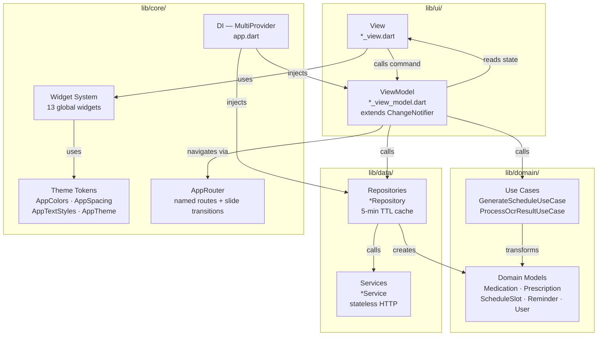
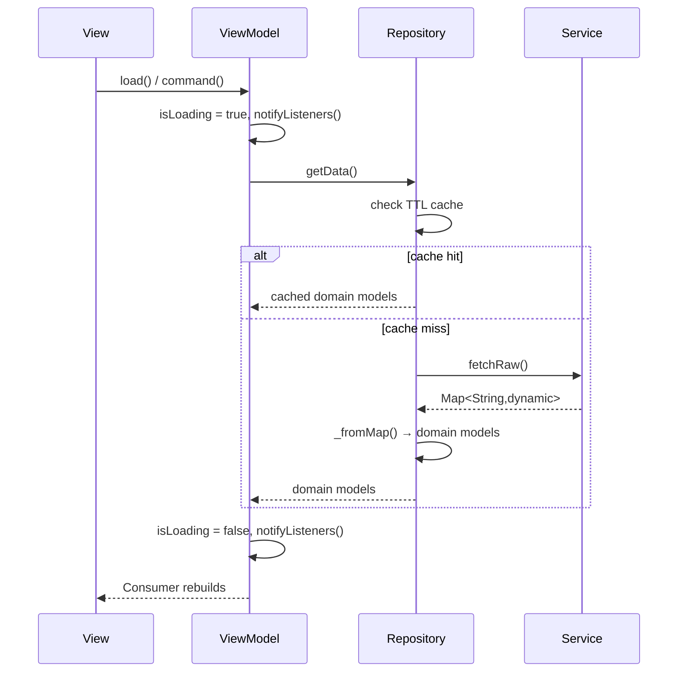
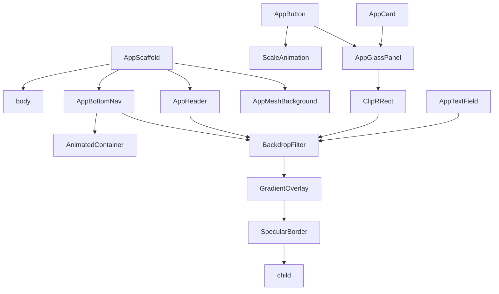
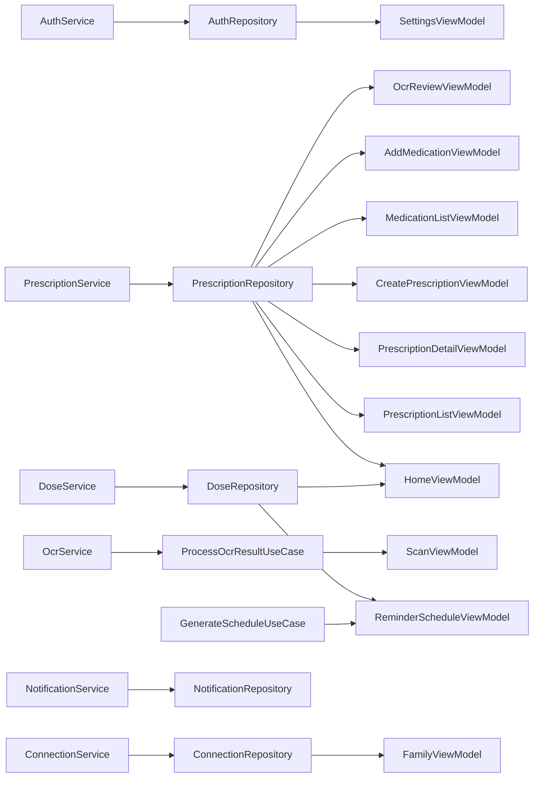
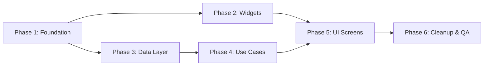

# Design Document — iOS 26 Liquid Glass Refactor (RxCam)

> ⚠️ **v2 status note (2026-05-26).** This file documents the v1 RxCam refactor design. The v2 design concept now lives at **[`/.kiro/specs-v2-flutter-supabase/10-frontend-liquid-glass/design.md`](../../specs-v2-flutter-supabase/10-frontend-liquid-glass/design.md)** and inherits the visual primitives below while replacing the v1-specific architecture. The standalone [`frontend-concept-v2.md`](./frontend-concept-v2.md) in this folder is the original draft snapshot kept for reference.
>
> Sections of this document remain canonical for v2:
>
> - § "Design Token System" (the AppColors, AppSpacing, AppTextStyles structure — values are remapped per v2).
> - All `AppGlassPanel`, `AppMeshBackground`, `AppButton` spring-scale, `AppBottomNav` expand-on-select definitions describe the **visual contract** that v2 still uses.
>
> Sections of this document are **superseded** by v2:
>
> - The MVVM + Provider four-layer architecture diagram (replaced by Riverpod + Drift + repository pattern in `00-overview/design.md`).
> - The data model definitions (replaced by `01-supabase-data-layer/design.md`).
> - The 5-tab bottom-nav layout (replaced by role-aware nav in `10-frontend-liquid-glass/design.md` § 5).
> - The brand colour `#009DFF` (replaced by `#1A8E5F`).
> - All references to RxCam, NestJS endpoints, and the v1 services list.
>
> Read the v2 spec folder first; come back here only for the deeper visual contract details that did not need to change.

---

## Overview

RxCam is a Flutter prescription and medication management app for Cambodian healthcare users.
This refactor migrates the codebase to the iOS 26 Liquid Glass aesthetic and adopts strict
MVVM Clean Architecture with a fully reusable global widget system.

Primary brand colour: `#009DFF`. All visual values are defined as design tokens in `core/theme/`.
No raw Material widgets, hardcoded colours, or inline styles are permitted in the `ui/` layer.

The refactor is delivered in six phases:
- Phase 1 — Foundation (theme tokens, router, DI wiring)
- Phase 2 — Global Widget System (13 widgets)
- Phase 3 — Data Layer (models, services, repositories)
- Phase 4 — Domain Use Cases (GenerateSchedule, ProcessOcr, serialisation)
- Phase 5 — UI Screens (11 screen pairs with ViewModels)
- Phase 6 — Cleanup & QA (anti-pattern elimination, full test suite)


## Architecture

### System Architecture Diagram



### Four-Layer MVVM Data Flow



### Folder Structure

```
lib/
├── core/
│   ├── theme/
│   │   ├── app_colors.dart
│   │   ├── app_spacing.dart
│   │   ├── app_text_styles.dart
│   │   └── app_theme.dart
│   ├── widgets/
│   │   ├── app_glass_panel.dart
│   │   ├── app_mesh_background.dart
│   │   ├── app_scaffold.dart
│   │   ├── app_header.dart
│   │   ├── app_bottom_nav.dart
│   │   ├── app_button.dart
│   │   ├── app_text_field.dart
│   │   ├── app_card.dart
│   │   ├── app_badge.dart
│   │   ├── app_avatar.dart
│   │   ├── app_loading_view.dart
│   │   ├── app_error_view.dart
│   │   └── app_empty_view.dart
│   └── router/
│       └── app_router.dart
├── data/
│   ├── models/
│   │   ├── medication.dart
│   │   ├── prescription.dart
│   │   ├── dose_event.dart
│   │   ├── schedule_slot.dart
│   │   └── user.dart
│   ├── services/
│   │   ├── auth_service.dart
│   │   ├── prescription_service.dart
│   │   ├── dose_service.dart
│   │   ├── ocr_service.dart
│   │   ├── notification_service.dart
│   │   └── connection_service.dart
│   └── repositories/
│       ├── auth_repository.dart
│       ├── prescription_repository.dart
│       ├── dose_repository.dart
│       ├── notification_repository.dart
│       └── connection_repository.dart
├── domain/
│   ├── models/
│   │   └── ocr_result.dart
│   └── use_cases/
│       ├── generate_schedule_use_case.dart
│       └── process_ocr_result_use_case.dart
├── ui/
│   ├── home/
│   │   ├── home_view.dart
│   │   └── home_view_model.dart
│   ├── prescriptions/
│   │   ├── prescription_list_view.dart
│   │   ├── prescription_list_view_model.dart
│   │   ├── prescription_detail_view.dart
│   │   ├── prescription_detail_view_model.dart
│   │   ├── create_prescription_view.dart
│   │   └── create_prescription_view_model.dart
│   ├── medications/
│   │   ├── medication_list_view.dart
│   │   ├── medication_list_view_model.dart
│   │   ├── add_medication_view.dart
│   │   └── add_medication_view_model.dart
│   ├── scan/
│   │   ├── scan_view.dart
│   │   ├── scan_view_model.dart
│   │   ├── ocr_review_view.dart
│   │   └── ocr_review_view_model.dart
│   ├── reminders/
│   │   ├── reminder_schedule_view.dart
│   │   └── reminder_schedule_view_model.dart
│   ├── family/
│   │   ├── family_view.dart
│   │   └── family_view_model.dart
│   └── settings/
│       ├── settings_view.dart
│       └── settings_view_model.dart
└── app.dart
```


## Design Token System

### AppColors (`lib/core/theme/app_colors.dart`)

```dart
abstract final class AppColors {
  // Brand
  static const Color primary      = Color(0xFF009DFF);
  static const Color primaryDark  = Color(0xFF0070CC);
  static const Color primaryLight = Color(0xFF66C8FF);

  // Mesh background
  static const Color meshDeep     = Color(0xFF050A14);
  static const Color meshMid      = Color(0xFF0A1628);

  // Glass surfaces
  static const Color glassWhite   = Color(0x1AFFFFFF); // white 10%
  static const Color glassBorder  = Color(0x33FFFFFF); // white 20%
  static const Color glassShadow  = Color(0x40000000); // black 25%
  static const Color glassPrimary = Color(0x1A009DFF); // primary 10%
  static const Color glassDanger  = Color(0x1AFF3B30); // danger 10%

  // Semantic
  static const Color success      = Color(0xFF34C759);
  static const Color danger       = Color(0xFFFF3B30);
  static const Color warning      = Color(0xFFFF9500);
  static const Color info         = Color(0xFF5AC8FA);

  // Text
  static const Color textPrimary   = Color(0xFFFFFFFF);
  static const Color textSecondary = Color(0xB3FFFFFF); // white 70%
  static const Color textTertiary  = Color(0x66FFFFFF); // white 40%
}
```

| Token | Hex | Usage |
|---|---|---|
| `primary` | `#009DFF` | Brand, focus borders, active tabs |
| `primaryDark` | `#0070CC` | Pressed states, deep accents |
| `primaryLight` | `#66C8FF` | Orb 3, light highlights |
| `meshDeep` | `#050A14` | Scaffold background |
| `glassWhite` | `#1AFFFFFF` | Glass panel fill |
| `glassBorder` | `#33FFFFFF` | Specular top-edge border |
| `glassShadow` | `#40000000` | Floating shadow |
| `success` | `#34C759` | Active badge |
| `danger` | `#FF3B30` | Destructive, error, flagged badge |

### AppSpacing (`lib/core/theme/app_spacing.dart`)

```dart
abstract final class AppSpacing {
  // Spacing scale (dp)
  static const double xs  = 4;
  static const double sm  = 8;
  static const double md  = 16;
  static const double lg  = 24;
  static const double xl  = 32;
  static const double xxl = 48;

  // iOS 26 superellipse border-radius (dp)
  static const double radiusSm  = 12;
  static const double radiusMd  = 20;
  static const double radiusLg  = 28;
  static const double radiusXl  = 36;
  static const double radiusFull = 100;
}
```

### AppTextStyles (`lib/core/theme/app_text_styles.dart`)

```dart
abstract final class AppTextStyles {
  static const TextStyle displayLarge  = TextStyle(fontSize: 34, fontWeight: FontWeight.w700, color: AppColors.textPrimary);
  static const TextStyle displayMedium = TextStyle(fontSize: 28, fontWeight: FontWeight.w600, color: AppColors.textPrimary);
  static const TextStyle headlineLarge = TextStyle(fontSize: 22, fontWeight: FontWeight.w600, color: AppColors.textPrimary);
  static const TextStyle headlineMedium= TextStyle(fontSize: 18, fontWeight: FontWeight.w600, color: AppColors.textPrimary);
  static const TextStyle bodyLarge     = TextStyle(fontSize: 17, fontWeight: FontWeight.w400, color: AppColors.textPrimary);
  static const TextStyle bodyMedium    = TextStyle(fontSize: 15, fontWeight: FontWeight.w400, color: AppColors.textSecondary);
  static const TextStyle bodySmall     = TextStyle(fontSize: 13, fontWeight: FontWeight.w400, color: AppColors.textTertiary);
  static const TextStyle labelLarge    = TextStyle(fontSize: 15, fontWeight: FontWeight.w600, color: AppColors.textPrimary, letterSpacing: 0.5);
  static const TextStyle labelSmall    = TextStyle(fontSize: 11, fontWeight: FontWeight.w600, color: AppColors.textTertiary, letterSpacing: 1.2);
}
```

### AppTheme (`lib/core/theme/app_theme.dart`)

```dart
abstract final class AppTheme {
  static ThemeData get dark => ThemeData(
    brightness: Brightness.dark,
    scaffoldBackgroundColor: AppColors.meshDeep,
    colorScheme: ColorScheme.dark(primary: AppColors.primary),
    appBarTheme: const AppBarTheme(backgroundColor: Colors.transparent, elevation: 0),
    textTheme: const TextTheme(/* mapped from AppTextStyles */),
  );
}
```


## iOS 26 Liquid Glass Principles

### Principle-to-Flutter Mapping

| # | Principle | Flutter Implementation |
|---|---|---|
| 1 | Frosted glass blur | `BackdropFilter(filter: ImageFilter.blur(sigmaX:20, sigmaY:20))` inside `AppGlassPanel` |
| 2 | Shrinking tab bar | `AnimatedContainer` with 260 ms `easeOutCubic` in `AppBottomNav` |
| 3 | Floating layers | Specular border (`glassBorder`, 0.8 px) + `BoxShadow(blurRadius:32, offset:Offset(0,8))` |
| 4 | Spring physics | `AnimationController(duration:160ms)` + `CurvedAnimation(Curves.easeOutBack)` in `AppButton` |
| 5 | Parallax depth | `Transform.translate` on glass layers driven by `ScrollController.offset` in `AppScaffold` |
| 6 | Adaptive tint | Optional `tint` parameter on `AppGlassPanel` applied at 18%/6% gradient stops |
| 7 | Superellipse shapes | `BorderRadius.circular(AppSpacing.radiusLg)` (28 dp default, up to 36 dp) |
| 8 | Mesh background | `AppMeshBackground` — three `RadialGradient` orbs animated at 9 s and 13 s |

### Widget Composition Hierarchy



`AppGlassPanel` is the single source of truth for all glass surfaces. Every widget that needs
frosted glass composes `AppGlassPanel` rather than constructing `BackdropFilter` directly.


## Global Widget System — Detailed Design

### AppGlassPanel

**Satisfies:** Requirements 2.1–2.5, 4.1–4.6

```dart
class AppGlassPanel extends StatelessWidget {
  const AppGlassPanel({
    super.key,
    required this.child,
    this.borderRadius = AppSpacing.radiusLg,   // 28 dp default
    this.tint,                                  // null → white tint
    this.blurRadius = 20.0,
    this.opacity = 1.0,
    this.padding,
  });

  final Widget child;
  final double borderRadius;
  final Color? tint;
  final double blurRadius;
  final double opacity;
  final EdgeInsetsGeometry? padding;
}
```

**Widget tree:**
```
Opacity(opacity)
└── DecoratedBox(shadow: BoxShadow(blurRadius:32, offset:Offset(0,8), color:glassShadow))
    └── ClipRRect(borderRadius)
        └── BackdropFilter(ImageFilter.blur(sigmaX:blurRadius, sigmaY:blurRadius))
            └── DecoratedBox(
                  gradient: LinearGradient(
                    begin: topLeft, end: bottomRight,
                    colors: [tint.withOpacity(0.18), tint.withOpacity(0.06)]
                  ),
                  border: Border(top: BorderSide(color:glassBorder, width:0.8))
                )
                └── Padding(padding) → child
```

**Key notes:**
- Exactly one `BackdropFilter` per panel — enforced by widget tree structure (Req 4.6)
- `tint` defaults to `Colors.white` when null (Req 4.4)
- `borderRadius` is configurable 24–36 dp (Req 2.5)

---

### AppMeshBackground

**Satisfies:** Requirements 2.6–2.7, 5.1–5.6

```dart
class AppMeshBackground extends StatefulWidget {
  const AppMeshBackground({super.key, required this.child});
  final Widget child;
}
```

**Widget tree:**
```
Stack
├── Container(color: AppColors.meshDeep)          // base
├── AnimatedBuilder(controller1 @ 9s)
│   └── CustomPaint(orb1: primary, opacity:0.30)
├── AnimatedBuilder(controller2 @ 13s)
│   └── CustomPaint(orb2: primaryDark, opacity:0.22)
├── AnimatedBuilder(controller1)                   // reuse controller1 offset
│   └── CustomPaint(orb3: primaryLight, opacity:0.16)
└── child
```

**Key notes:**
- Two `AnimationController` instances: `_ctrl1` (9 s), `_ctrl2` (13 s), both `repeat(reverse:true)`
- Both disposed in `dispose()` (Req 5.3)
- Orb positions are driven by `Tween<Offset>` on each controller

---

### AppScaffold

**Satisfies:** Requirements 6.1–6.7

```dart
class AppScaffold extends StatelessWidget {
  const AppScaffold({
    super.key,
    required this.title,
    required this.body,
    this.currentNavIndex,
    this.showBackButton = false,
    this.subtitle,
    this.headerActions,
    this.floatingActionButton,
    this.scrollController,
  });

  final String title;
  final Widget body;
  final int? currentNavIndex;
  final bool showBackButton;
  final String? subtitle;
  final List<Widget>? headerActions;
  final Widget? floatingActionButton;
  final ScrollController? scrollController;
}
```

**Widget tree:**
```
Scaffold(
  extendBody: true,
  extendBodyBehindAppBar: true,
  appBar: AppHeader(...),
  bottomNavigationBar: currentNavIndex != null ? AppBottomNav(...) : null,
  floatingActionButton: floatingActionButton,
  body: AppMeshBackground(
    child: scrollController != null
      ? _ParallaxBody(controller: scrollController, child: body)
      : body
  )
)
```

---

### AppHeader

**Satisfies:** Requirements 7.1–7.6

```dart
class AppHeader extends StatelessWidget implements PreferredSizeWidget {
  const AppHeader({
    super.key,
    required this.title,
    this.showBackButton = false,
    this.subtitle,
    this.actions,
  });

  final String title;
  final bool showBackButton;
  final String? subtitle;
  final List<Widget>? actions;

  @override
  Size get preferredSize => const Size.fromHeight(kToolbarHeight + 16);
}
```

**Widget tree:**
```
ClipRect
└── BackdropFilter(blur 20/20)
    └── DecoratedBox(border-bottom: glassBorder 0.5px, color: glassWhite)
        └── SafeArea(bottom:false)
            └── Row
                ├── [if showBackButton] GestureDetector → AppRouter.pop()
                │   └── Icon(CupertinoIcons.chevron_left, color:primary)
                ├── Expanded
                │   └── Column
                │       ├── Text(title, style:headlineMedium)
                │       └── [if subtitle] Text(subtitle, style:bodyMedium, overflow:ellipsis)
                └── [if actions] Row(actions)
```

---

### AppBottomNav

**Satisfies:** Requirements 8.1–8.8

```dart
class AppBottomNav extends StatelessWidget {
  const AppBottomNav({
    super.key,
    required this.currentIndex,
    required this.onTap,
  });

  final int currentIndex;
  final ValueChanged<int> onTap;
}
```

**Tab definitions:**
```dart
const _tabs = [
  (icon: CupertinoIcons.house,        filledIcon: CupertinoIcons.house_fill,        label: 'Home',       route: '/'),
  (icon: CupertinoIcons.pills,        filledIcon: CupertinoIcons.pills_fill,         label: 'Medication', route: '/medications'),
  (icon: CupertinoIcons.camera,       filledIcon: CupertinoIcons.camera_fill,        label: 'Scan',       route: '/scan'),
  (icon: CupertinoIcons.person_2,     filledIcon: CupertinoIcons.person_2_fill,      label: 'Family',     route: '/family'),
  (icon: CupertinoIcons.settings,     filledIcon: CupertinoIcons.settings_solid,     label: 'Settings',   route: '/settings'),
];
```

**Widget tree:**
```
Padding(bottom: MediaQuery.padding.bottom + 12)
└── ClipRRect(radius: radiusFull)
    └── BackdropFilter(blur 20/20)
        └── DecoratedBox(gradient: glassWhite→glassBorder, border: glassBorder)
            └── Row(
                  children: tabs.map((tab, i) =>
                    GestureDetector(onTap: () => onTap(i))
                    └── AnimatedContainer(
                          duration: 260ms, curve: easeOutCubic,
                          width: i==currentIndex ? expandedWidth : iconWidth
                        )
                        └── Row
                            ├── Icon(filled/outline, color: i==currentIndex ? primary : textTertiary)
                            └── [if selected] AnimatedOpacity → Text(label)
                  )
                )
```

**Key notes:**
- Exactly one tab highlighted at a time — enforced by `currentIndex` integer (Req 8.8)
- `AppRouter.push(route)` called on tap (Req 8.6)


---

### AppButton

**Satisfies:** Requirements 2.8, 9.1–9.9

```dart
enum AppButtonVariant { primary, secondary, destructive, ghost }

class AppButton extends StatefulWidget {
  const AppButton({
    super.key,
    required this.label,
    required this.onPressed,
    this.variant = AppButtonVariant.primary,
    this.isLoading = false,
    this.isFullWidth = false,
    this.icon,
  });

  final String label;
  final VoidCallback? onPressed;
  final AppButtonVariant variant;
  final bool isLoading;
  final bool isFullWidth;
  final IconData? icon;
}
```

**Variant → tint/label colour mapping:**
| Variant | Tint | Label colour |
|---|---|---|
| `primary` | `glassPrimary` | `primary` |
| `secondary` | `glassWhite` | `textPrimary` |
| `destructive` | `glassDanger` | `danger` |
| `ghost` | `Colors.transparent` | `textSecondary` |

**Widget tree:**
```
Opacity(opacity: onPressed==null ? 0.5 : 1.0)
└── GestureDetector(onTapDown, onTapUp, onTapCancel)
    └── AnimatedBuilder(scaleController)
        └── Transform.scale(scale: 1.0→0.94)
            └── AppGlassPanel(tint: variantTint, borderRadius: radiusFull)
                └── SizedBox(width: isFullWidth ? double.infinity : null)
                    └── Row
                        ├── [if icon] Icon(icon, size:18)
                        └── [if isLoading] CircularProgressIndicator(color:primary)
                           else Text(label)
```

**Spring animation:** `AnimationController(duration:160ms)` + `CurvedAnimation(Curves.easeOutBack)` for scale 1.0→0.94 on `onTapDown`, reversed on `onTapUp`/`onTapCancel`.

---

### AppTextField

**Satisfies:** Requirements 10.1–10.6

```dart
class AppTextField extends StatelessWidget {
  const AppTextField({
    super.key,
    required this.label,
    this.controller,
    this.prefix,
    this.suffix,
    this.validator,
    this.keyboardType,
    this.obscureText = false,
    this.maxLines = 1,
    this.onChanged,
  });

  final String label;
  final TextEditingController? controller;
  final Widget? prefix;
  final Widget? suffix;
  final FormFieldValidator<String>? validator;
  final TextInputType? keyboardType;
  final bool obscureText;
  final int maxLines;
  final ValueChanged<String>? onChanged;
}
```

**Widget tree:**
```
Column(crossAxisAlignment: start)
├── Text(label.toUpperCase(), style: labelSmall)
└── ClipRRect(radius: radiusMd)
    └── BackdropFilter(blur 16/16)
        └── DecoratedBox(color: glassWhite)
            └── TextFormField(
                  decoration: InputDecoration(
                    enabledBorder:  OutlineInputBorder(borderSide: glassBorder 0.8px),
                    focusedBorder:  OutlineInputBorder(borderSide: primary 1.5px),
                    errorBorder:    OutlineInputBorder(borderSide: danger 1.0px),
                    prefixIcon: prefix, suffixIcon: suffix,
                  )
                )
```

---

### AppCard

**Satisfies:** Requirement 11.1–11.2

```dart
class AppCard extends StatelessWidget {
  const AppCard({
    super.key,
    required this.child,
    this.onTap,
    this.padding,
  });

  final Widget child;
  final VoidCallback? onTap;
  final EdgeInsetsGeometry? padding;
}
```

**Widget tree:**
```
[if onTap] GestureDetector(onTap)
└── AppGlassPanel(padding: padding ?? AppSpacing.md)
    └── child
```

---

### AppBadge

**Satisfies:** Requirement 11.3–11.6

```dart
enum AppBadgeVariant { active, pending, completed, flagged, info }

class AppBadge extends StatelessWidget {
  const AppBadge({super.key, required this.label, required this.variant});
  final String label;
  final AppBadgeVariant variant;
}
```

**Variant → colour mapping:**
| Variant | Colour |
|---|---|
| `active` | `AppColors.success` |
| `pending` | `AppColors.warning` |
| `completed` | `AppColors.primary` |
| `flagged` | `AppColors.danger` |
| `info` | `AppColors.info` |

**Widget tree:**
```
DecoratedBox(
  color: variantColor.withOpacity(0.15),
  borderRadius: radiusFull
)
└── Padding(horizontal:8, vertical:4)
    └── Text(label.toUpperCase(), style: labelSmall.copyWith(color: variantColor))
```

---

### AppAvatar

**Satisfies:** Requirement 11.7

```dart
class AppAvatar extends StatelessWidget {
  const AppAvatar({
    super.key,
    this.imageUrl,
    this.initials,
    this.radius = 24,
  });

  final String? imageUrl;
  final String? initials;
  final double radius;
}
```

**Widget tree:**
```
Container(
  decoration: BoxDecoration(
    shape: circle,
    border: Border.all(color: glassBorder, width: 1.5),
    gradient: LinearGradient(glassWhite → transparent)
  )
)
└── CircleAvatar(radius, backgroundImage: imageUrl, child: initials text)
```

---

### AppLoadingView, AppErrorView, AppEmptyView

**Satisfies:** Requirements 12.1–12.6

```dart
class AppLoadingView extends StatelessWidget {
  const AppLoadingView({super.key, this.message});
  final String? message;
  // Center → Column → CircularProgressIndicator(color:primary) + optional Text
}

class AppErrorView extends StatelessWidget {
  const AppErrorView({super.key, required this.message, this.onRetry});
  final String message;
  final VoidCallback? onRetry;
  // Center → Column → Icon(error_outline, 48dp, danger) + Text + optional AppButton('Retry')
}

class AppEmptyView extends StatelessWidget {
  const AppEmptyView({
    super.key,
    required this.message,
    this.icon = Icons.inbox_outlined,
  });
  final String message;
  final IconData icon;
  // Center → Column → Icon(icon, 48dp, textTertiary) + Text
}
```


## Router Design

**Satisfies:** Requirement 13.1–13.5

### Route Constants

```dart
abstract final class AppRoutes {
  static const String home                = '/';
  static const String scan                = '/scan';
  static const String scanReview          = '/scan/review';
  static const String prescriptions       = '/prescriptions';
  static const String prescriptionDetail  = '/prescriptions/detail';
  static const String prescriptionCreate  = '/prescriptions/create';
  static const String medications         = '/medications';
  static const String medicationAdd       = '/medications/add';
  static const String reminders           = '/reminders';
  static const String family              = '/family';
  static const String settings            = '/settings';
}
```

### AppRouter Class

```dart
abstract final class AppRouter {
  static final GlobalKey<NavigatorState> navigatorKey = GlobalKey<NavigatorState>();

  static Route<dynamic> onGenerateRoute(RouteSettings settings) {
    final builder = switch (settings.name) {
      AppRoutes.home               => (_) => const HomeView(),
      AppRoutes.scan               => (_) => const ScanView(),
      AppRoutes.scanReview         => (_) => const OcrReviewView(),
      AppRoutes.prescriptions      => (_) => const PrescriptionListView(),
      AppRoutes.prescriptionDetail => (_) => PrescriptionDetailView(id: settings.arguments as String),
      AppRoutes.prescriptionCreate => (_) => const CreatePrescriptionView(),
      AppRoutes.medications        => (_) => const MedicationListView(),
      AppRoutes.medicationAdd      => (_) => const AddMedicationView(),
      AppRoutes.reminders          => (_) => const ReminderScheduleView(),
      AppRoutes.family             => (_) => const FamilyView(),
      AppRoutes.settings           => (_) => const SettingsView(),
      _                            => (_) => const HomeView(),   // fallback (Req 13.5)
    };
    return _slideRoute(builder, settings);
  }

  static PageRouteBuilder<dynamic> _slideRoute(
    WidgetBuilder builder, RouteSettings settings) =>
    PageRouteBuilder(
      settings: settings,
      transitionDuration: const Duration(milliseconds: 340),
      pageBuilder: (ctx, _, __) => builder(ctx),
      transitionsBuilder: (_, animation, __, child) => SlideTransition(
        position: Tween(begin: const Offset(1.0, 0.0), end: Offset.zero)
            .animate(CurvedAnimation(parent: animation, curve: Curves.easeOutCubic)),
        child: child,
      ),
    );

  static void push(String route, {Object? arguments}) =>
      navigatorKey.currentState?.pushNamed(route, arguments: arguments);

  static void pop<T>([T? result]) =>
      navigatorKey.currentState?.pop(result);

  static void pushReplacement(String route, {Object? arguments}) =>
      navigatorKey.currentState?.pushReplacementNamed(route, arguments: arguments);
}
```


## Data Layer Design

> **Backend alignment note:** All models, service signatures, and field names below are derived
> directly from the NestJS backend (`backend_nestjs/`). The Prisma schema is the single source of
> truth for field names and enum values.

### API Endpoint Map

| Flutter Service | HTTP Method | Endpoint | Backend Controller |
|---|---|---|---|
| `AuthService.login` | POST | `/auth/login` | `AuthController` |
| `AuthService.register` | POST | `/auth/register/patient` | `AuthController` |
| `AuthService.getCurrentUser` | GET | `/users/me` | `UsersController` |
| `AuthService.logout` | — | (clear local JWT) | — |
| `PrescriptionService.fetchPrescriptions` | GET | `/prescriptions?status=` | `PrescriptionsController` |
| `PrescriptionService.fetchById` | GET | `/prescriptions/:id` | `PrescriptionsController` |
| `PrescriptionService.createPatientPrescription` | POST | `/prescriptions/patient` | `PrescriptionsController` |
| `PrescriptionService.confirmPrescription` | POST | `/prescriptions/:id/confirm` | `PrescriptionsController` |
| `PrescriptionService.deletePrescription` | DELETE | `/prescriptions/:id` | `PrescriptionsController` |
| `DoseService.getSchedule` | GET | `/doses/schedule?date=` | `DosesController` |
| `DoseService.getTodaysDoses` | GET | `/doses/today` | `DosesController` |
| `DoseService.markTaken` | PATCH | `/doses/:id/taken` | `DosesController` |
| `DoseService.skip` | PATCH | `/doses/:id/skipped` | `DosesController` |
| `NotificationService.fetchAll` | GET | `/notifications` | `NotificationsController` |
| `NotificationService.markRead` | PATCH | `/notifications/:id/read` | `NotificationsController` |
| `ConnectionService.getFamilyMembers` | GET | `/connections/family` | `ConnectionsController` |
| `ConnectionService.getCaregivers` | GET | `/connections/caregivers` | `ConnectionsController` |
| `OcrService.extractOnly` | POST | `/ocr/extract` (multipart) | `OcrController` |
| `OcrService.scanAndSave` | POST | `/ocr/scan` (multipart) | `OcrController` |

### Model Class Signatures

**Satisfies:** Requirements 14.1–14.6, 19.1–19.5

All field names match the Prisma schema exactly (camelCase as returned by NestJS JSON serialisation).

```dart
// lib/data/models/medication.dart
// Maps to Prisma `Medication` model — nested inside Prescription responses.
// NOTE: The backend uses morningDosage/afternoonDosage/eveningDosage/nightDosage JSON objects,
// NOT a single frequency enum. Frequency is a free string (e.g. "2ដង/១ថ្ងៃ").

enum MedicineType { PO, ORAL, INJECTION, TOPICAL, OTHER }
enum MedicineUnit { TABLET, CAPSULE, ML, MG, DROP, OTHER }

class DosageSlot {
  // Represents morningDosage / afternoonDosage / eveningDosage / nightDosage JSON
  const DosageSlot({required this.amount, required this.beforeMeal, this.time});
  final String amount;      // e.g. "1tablet"
  final bool beforeMeal;
  final String? time;       // e.g. "07:00"

  factory DosageSlot.fromJson(Map<String, dynamic> json);
  Map<String, dynamic> toJson();
}

class Medication {
  const Medication({
    required this.id,
    required this.prescriptionId,
    required this.rowNumber,
    required this.medicineName,
    this.medicineNameKhmer,
    this.medicineType = MedicineType.ORAL,
    this.unit = MedicineUnit.TABLET,
    this.dosageAmount = 1.0,
    this.frequency,          // free string, e.g. "2ដង/១ថ្ងៃ"
    this.duration,           // days (backend field name: `duration`, not `durationDays`)
    this.morningDosage,
    this.afternoonDosage,
    this.eveningDosage,
    this.nightDosage,
    this.timing,             // Khmer string: "មុនអាហារ" | "បន្ទាប់ពីអាហារ"
    this.isPRN = false,
    this.beforeMeal = false,
    this.description,
    this.additionalNote,
    this.imageUrl,
  });

  final String id;
  final String prescriptionId;
  final int rowNumber;
  final String medicineName;
  final String? medicineNameKhmer;
  final MedicineType medicineType;
  final MedicineUnit unit;
  final double dosageAmount;
  final String? frequency;
  final int? duration;
  final DosageSlot? morningDosage;
  final DosageSlot? afternoonDosage;
  final DosageSlot? eveningDosage;
  final DosageSlot? nightDosage;
  final String? timing;
  final bool isPRN;
  final bool beforeMeal;
  final String? description;
  final String? additionalNote;
  final String? imageUrl;

  factory Medication.fromJson(Map<String, dynamic> json);
  Map<String, dynamic> toJson();
  Medication copyWith({...});
}

// lib/data/models/prescription.dart
// Maps to Prisma `Prescription` model.
// Status values: DRAFT | ACTIVE | PAUSED | INACTIVE  (NOT active/pending/completed/flagged)

enum PrescriptionStatus { DRAFT, ACTIVE, PAUSED, INACTIVE }

class Prescription {
  const Prescription({
    required this.id,
    required this.patientId,
    required this.patientName,
    required this.patientGender,
    required this.patientAge,
    required this.symptoms,
    required this.status,
    required this.createdAt,
    this.doctorId,
    this.diagnosis,
    this.clinicalNote,
    this.followUpDate,
    this.startDate,
    this.endDate,
    this.isUrgent = false,
    this.urgentReason,
    this.currentVersion = 1,
    this.medications = const [],
    this.ocrMetadata,
  });

  final String id;
  final String patientId;
  final String? doctorId;
  final String patientName;
  final String patientGender;   // 'MALE' | 'FEMALE' | 'OTHER'
  final int patientAge;
  final String symptoms;
  final String? diagnosis;
  final String? clinicalNote;
  final DateTime? followUpDate;
  final DateTime? startDate;
  final DateTime? endDate;
  final PrescriptionStatus status;
  final bool isUrgent;
  final String? urgentReason;
  final int currentVersion;
  final List<Medication> medications;
  final Map<String, dynamic>? ocrMetadata;
  final DateTime createdAt;

  factory Prescription.fromJson(Map<String, dynamic> json);
  Map<String, dynamic> toJson();
}

// lib/data/models/dose_event.dart
// Maps to Prisma `DoseEvent` model — replaces the old `Reminder` model.
// The backend generates DoseEvents server-side when a prescription is confirmed.

enum TimePeriod { MORNING, AFTERNOON, EVENING, NIGHT }
enum DoseEventStatus { DUE, TAKEN_ON_TIME, TAKEN_LATE, MISSED, SKIPPED }

class DoseEvent {
  const DoseEvent({
    required this.id,
    required this.prescriptionId,
    required this.medicationId,
    required this.patientId,
    required this.scheduledTime,
    required this.timePeriod,
    required this.status,
    this.reminderTime,
    this.takenAt,
    this.skipReason,
    this.wasOffline = false,
  });

  final String id;
  final String prescriptionId;
  final String medicationId;
  final String patientId;
  final DateTime scheduledTime;
  final TimePeriod timePeriod;
  final DoseEventStatus status;
  final String? reminderTime;   // "HH:mm" string
  final DateTime? takenAt;
  final String? skipReason;
  final bool wasOffline;

  factory DoseEvent.fromJson(Map<String, dynamic> json);
  Map<String, dynamic> toJson();
}

// lib/data/models/schedule_slot.dart
// Client-side grouping of DoseEvents by timePeriod — built by GenerateScheduleUseCase
// from the /doses/schedule API response.

class ScheduleSlot {
  const ScheduleSlot({
    required this.timePeriod,
    required this.displayTime,
    required this.doseEvents,
  });

  final TimePeriod timePeriod;
  final String displayTime;       // '08:00 AM' | '12:00 PM' | '06:00 PM' | '09:00 PM'
  final List<DoseEvent> doseEvents;

  factory ScheduleSlot.fromJson(Map<String, dynamic> json);
  Map<String, dynamic> toJson();
}

// lib/data/models/user.dart
// Maps to Prisma `User` model (passwordHash excluded by backend).

enum UserRole { PATIENT, DOCTOR, FAMILY_MEMBER }

class User {
  const User({
    required this.id,
    required this.role,
    this.firstName,
    this.lastName,
    this.fullName,
    this.email,
    this.phoneNumber,
    this.profilePictureUrl,
    this.specialty,
    this.subscriptionTier,
    this.dailyProgress,
  });

  final String id;
  final UserRole role;
  final String? firstName;
  final String? lastName;
  final String? fullName;
  final String? email;
  final String? phoneNumber;
  final String? profilePictureUrl;
  final String? specialty;
  final String? subscriptionTier;   // 'FREEMIUM' | 'PREMIUM' | 'FAMILY_PREMIUM'
  final int? dailyProgress;         // 0–100, patients only

  String get displayName => fullName ?? [firstName, lastName].whereType<String>().join(' ');

  factory User.fromJson(Map<String, dynamic> json);
  Map<String, dynamic> toJson();
}
```

### Service Interface Signatures

**Satisfies:** Requirements 15.1–15.5

All services are stateless. Field names in DTOs match the NestJS DTO classes exactly.

```dart
// lib/data/services/auth_service.dart
// Endpoints: POST /auth/login, POST /auth/register/patient, GET /users/me
class AuthService {
  // POST /auth/login — body: { identifier, password }
  // identifier can be email OR phone number
  Future<Map<String, dynamic>> login(String identifier, String password);

  // GET /users/me — requires Bearer token
  Future<Map<String, dynamic>> getCurrentUser();

  // GET /connections/family — returns connected family members
  Future<List<Map<String, dynamic>>> getFamilyMembers();
}

// lib/data/services/prescription_service.dart
// Endpoints: GET /prescriptions, GET /prescriptions/:id,
//            POST /prescriptions/patient, POST /prescriptions/:id/confirm,
//            DELETE /prescriptions/:id
class PrescriptionService {
  // GET /prescriptions?status=ACTIVE
  Future<List<Map<String, dynamic>>> fetchPrescriptions({String? status});

  // GET /prescriptions/:id
  Future<Map<String, dynamic>> fetchById(String id);

  // POST /prescriptions/patient
  // body matches CreatePatientPrescriptionDto:
  //   { title, doctorName?, startDate, endDate?, diagnosis?, notes?, medicines[], ocrMetadata? }
  // Each medicine: { medicineName, medicineNameKhmer?, medicineType?, unit?,
  //   dosageAmount, dosageUnit, form, frequency, scheduleTimes?, durationDays?,
  //   description?, beforeMeal?, isPRN?, imageUrl? }
  Future<Map<String, dynamic>> createPatientPrescription(Map<String, dynamic> dto);

  // POST /prescriptions/:id/confirm
  Future<Map<String, dynamic>> confirmPrescription(String id);

  // DELETE /prescriptions/:id
  Future<void> deletePrescription(String id);
}

// lib/data/services/dose_service.dart
// Endpoints: GET /doses/schedule, GET /doses/today, PATCH /doses/:id/taken,
//            PATCH /doses/:id/skipped
// NOTE: Replaces the old ReminderService — the backend generates DoseEvents server-side.
class DoseService {
  // GET /doses/schedule?date=YYYY-MM-DD&groupBy=timePeriod
  Future<Map<String, dynamic>> getSchedule({String? date, String? groupBy});

  // GET /doses/today
  Future<List<Map<String, dynamic>>> getTodaysDoses();

  // PATCH /doses/:id/taken — body: { takenAt?, offline? }
  Future<Map<String, dynamic>> markTaken(String id, {DateTime? takenAt, bool offline = false});

  // PATCH /doses/:id/skipped — body: { reason? }
  Future<Map<String, dynamic>> skip(String id, {String? reason});
}

// lib/data/services/notification_service.dart
// Endpoints: GET /notifications, PATCH /notifications/:id/read
class NotificationService {
  // GET /notifications?unreadOnly=true
  Future<Map<String, dynamic>> fetchAll({bool unreadOnly = false});

  // PATCH /notifications/:id/read
  Future<Map<String, dynamic>> markRead(String id);
}

// lib/data/services/ocr_service.dart
// Endpoints: POST /ocr/extract (preview), POST /ocr/scan (save)
// Both accept multipart/form-data with a `file` field (image or PDF, max 10 MB).
class OcrService {
  // POST /ocr/extract — returns raw OCR + AI enhancement preview without saving
  // Response includes: { success, data, extraction_summary, ai_status, ai_enhanced }
  Future<Map<String, dynamic>> extractOnly(List<int> fileBytes, String filename, String mimeType);

  // POST /ocr/scan — extracts OCR, creates prescription, returns { prescription, ocr_summary, ai_status }
  Future<Map<String, dynamic>> scanAndSave(List<int> fileBytes, String filename, String mimeType);
}
```

Non-200 responses throw `Exception('HTTP $statusCode: $message')`.

### Repository Design with Cache Structure

**Satisfies:** Requirements 16.1–16.7

```dart
// Shared cache entry type
class _CacheEntry<T> {
  _CacheEntry(this.data) : fetchedAt = DateTime.now();
  final T data;
  final DateTime fetchedAt;
  bool get isValid => DateTime.now().difference(fetchedAt) < const Duration(minutes: 5);
}

class PrescriptionRepository {
  PrescriptionRepository(this._service);
  final PrescriptionService _service;

  _CacheEntry<List<Prescription>>? _cache;
  final Map<String, Prescription> _byIdCache = {};

  Future<List<Prescription>> getPrescriptions({bool forceRefresh = false, String? status}) async {
    if (!forceRefresh && _cache != null && _cache!.isValid) return _cache!.data;
    try {
      final raw = await _service.fetchPrescriptions(status: status);
      final models = raw.map(_fromMap).toList();
      _cache = _CacheEntry(models);
      for (final p in models) { _byIdCache[p.id] = p; }
      return models;
    } catch (e) {
      if (_cache != null) return _cache!.data;  // stale fallback (Req 16.4)
      rethrow;                                   // no cache → rethrow (Req 16.5)
    }
  }

  Future<Prescription> getById(String id) async {
    if (_byIdCache.containsKey(id)) return _byIdCache[id]!;  // cache-hit (Req 16.7)
    final raw = await _service.fetchById(id);
    final model = _fromMap(raw);
    _byIdCache[id] = model;
    return model;
  }

  Future<Prescription> createPatientPrescription(Map<String, dynamic> dto) async {
    final raw = await _service.createPatientPrescription(dto);
    final model = _fromMap(raw);
    _byIdCache[model.id] = model;
    _cache = null; // invalidate list cache
    return model;
  }

  Prescription _fromMap(Map<String, dynamic> map) => Prescription(
    id:             map['id'] as String,
    patientId:      map['patientId'] as String,
    patientName:    map['patientName'] as String,
    patientGender:  map['patientGender'] as String,
    patientAge:     map['patientAge'] as int,
    symptoms:       map['symptoms'] as String,
    status:         PrescriptionStatus.values.byName(map['status'] as String),
    createdAt:      DateTime.parse(map['createdAt'] as String),
    doctorId:       map['doctorId'] as String?,
    diagnosis:      map['diagnosis'] as String?,
    clinicalNote:   map['clinicalNote'] as String?,
    startDate:      map['startDate'] != null ? DateTime.parse(map['startDate'] as String) : null,
    endDate:        map['endDate'] != null ? DateTime.parse(map['endDate'] as String) : null,
    isUrgent:       map['isUrgent'] as bool? ?? false,
    urgentReason:   map['urgentReason'] as String?,
    currentVersion: map['currentVersion'] as int? ?? 1,
    medications:    (map['medications'] as List? ?? [])
                      .map((m) => Medication.fromJson(m as Map<String, dynamic>))
                      .toList(),
    ocrMetadata:    map['ocrMetadata'] as Map<String, dynamic>?,
  );
}
```

`DoseRepository`, `AuthRepository`, and `NotificationRepository` follow the same cache pattern.

### `_fromMap` for Medication

```dart
// NOTE: `duration` is the backend field name (not `durationDays`).
// morningDosage / afternoonDosage / eveningDosage / nightDosage are JSON objects or null.
Medication _fromMap(Map<String, dynamic> map) => Medication(
  id:                map['id'] as String,
  prescriptionId:    map['prescriptionId'] as String,
  rowNumber:         map['rowNumber'] as int,
  medicineName:      map['medicineName'] as String,
  medicineNameKhmer: map['medicineNameKhmer'] as String?,
  medicineType:      MedicineType.values.byName(map['medicineType'] as String? ?? 'ORAL'),
  unit:              MedicineUnit.values.byName(map['unit'] as String? ?? 'TABLET'),
  dosageAmount:      (map['dosageAmount'] as num?)?.toDouble() ?? 1.0,
  frequency:         map['frequency'] as String?,
  duration:          map['duration'] as int?,
  morningDosage:     map['morningDosage'] != null
                       ? DosageSlot.fromJson(map['morningDosage'] as Map<String, dynamic>)
                       : null,
  afternoonDosage:   map['afternoonDosage'] != null
                       ? DosageSlot.fromJson(map['afternoonDosage'] as Map<String, dynamic>)
                       : null,
  eveningDosage:     map['eveningDosage'] != null
                       ? DosageSlot.fromJson(map['eveningDosage'] as Map<String, dynamic>)
                       : null,
  nightDosage:       map['nightDosage'] != null
                       ? DosageSlot.fromJson(map['nightDosage'] as Map<String, dynamic>)
                       : null,
  timing:            map['timing'] as String?,
  isPRN:             map['isPRN'] as bool? ?? false,
  beforeMeal:        map['beforeMeal'] as bool? ?? false,
  description:       map['description'] as String?,
  additionalNote:    map['additionalNote'] as String?,
  imageUrl:          map['imageUrl'] as String?,
);
```


## Domain Use Cases Design

### GenerateScheduleUseCase

**Satisfies:** Requirements 17.1–17.10

> **Backend alignment:** The backend generates `DoseEvent` records server-side when a prescription
> is confirmed (`POST /prescriptions/:id/confirm`). The Flutter use case does NOT re-compute
> schedules from medications. Instead it groups the `DoseEvent` objects returned by
> `GET /doses/schedule` into `ScheduleSlot` buckets by `timePeriod`.

```dart
class GenerateScheduleUseCase {
  static const _slotConfig = [
    (period: TimePeriod.MORNING,   display: '08:00 AM'),
    (period: TimePeriod.AFTERNOON, display: '12:00 PM'),
    (period: TimePeriod.EVENING,   display: '06:00 PM'),
    (period: TimePeriod.NIGHT,     display: '09:00 PM'),
  ];

  List<ScheduleSlot> execute(List<DoseEvent> doseEvents) {
    // 1. Build a bucket map: TimePeriod → List<DoseEvent>
    // 2. Iterate _slotConfig in order, emit ScheduleSlot only if bucket non-empty
    // 3. Return list (empty if input empty)
  }
}
```

**Slot bucketing algorithm:**
```
buckets = { MORNING:[], AFTERNOON:[], EVENING:[], NIGHT:[] }
for each doseEvent:
  buckets[doseEvent.timePeriod].add(doseEvent)

result = []
for each (period, display) in _slotConfig:
  if buckets[period].isNotEmpty:
    result.add(ScheduleSlot(timePeriod:period, displayTime:display, doseEvents:buckets[period]))
return result
```

**Invariants enforced by algorithm:**
- Total dose events in output == input length (no loss, no duplication)
- Each dose event appears in exactly one slot (buckets are disjoint)
- Idempotent: same input → same output (pure function, no side effects)

---

### ProcessOcrResultUseCase

**Satisfies:** Requirements 18.1–18.11

> **Backend alignment:** OCR processing is done entirely server-side by the Python OCR service
> and the AI enhancement service. The Flutter use case calls `OcrService.extractOnly()` (which
> hits `POST /ocr/extract`) and maps the server response into an `OcrResult` domain model.
> There is NO local regex extraction in the Flutter app.

```dart
class ProcessOcrResultUseCase {
  ProcessOcrResultUseCase(this._ocrService);
  final OcrService _ocrService;

  Future<OcrResult> execute(List<int> fileBytes, String filename, String mimeType) async {
    final raw = await _ocrService.extractOnly(fileBytes, filename, mimeType);
    return _mapToOcrResult(raw);
  }

  OcrResult _mapToOcrResult(Map<String, dynamic> raw) {
    final summary = raw['extraction_summary'] as Map<String, dynamic>;
    final data    = raw['data'] as Map<String, dynamic>;
    final presc   = data['prescription'] as Map<String, dynamic>;
    final aiEnhanced = raw['ai_enhanced'] as Map<String, dynamic>?;

    // Language detection: read from OCR response, not local regex
    // The OCR service detects Khmer (KH), French (FR), or English (EN)
    final detectedLanguage = _detectLanguage(presc, aiEnhanced);

    // Patient / doctor names — prefer AI-enhanced values
    final patientName = (aiEnhanced?['patient']?['name'] as String?)
        ?? _extractPatientName(presc);
    final doctorName = (aiEnhanced?['prescriber_name'] as String?)
        ?? _extractDoctorName(presc);

    // Medications — mapped from OCR items
    final items = (presc['medications']?['items'] as List? ?? []);
    final medications = items.map((item) => _mapMedication(item as Map<String, dynamic>)).toList();

    final confidence = (summary['confidence_score'] as num?)?.toDouble() ?? 0.0;

    return OcrResult(
      medications: medications,
      detectedLanguage: detectedLanguage,
      confidence: confidence,
      patientName: patientName,
      doctorName: doctorName,
      aiStatus: raw['ai_status'] as String? ?? 'not_responded',
      needsReview: summary['needs_review'] as bool? ?? true,
    );
  }

  String _detectLanguage(Map<String, dynamic> presc, Map<String, dynamic>? ai) {
    // Check for Khmer characters in any text field (U+1780–U+17FF)
    final allText = presc.toString();
    if (RegExp(r'[\u1780-\u17FF]').hasMatch(allText)) return 'KH';
    // French keywords
    final frenchKeywords = ['comprimé', 'ordonnance', 'posologie', 'médicament'];
    if (frenchKeywords.any((kw) => allText.toLowerCase().contains(kw))) return 'FR';
    return 'EN';
  }
}
```

---

### OcrResult Model

```dart
// lib/domain/models/ocr_result.dart
// Wraps the server OCR response — NOT a locally-computed result.
class OcrResult {
  const OcrResult({
    required this.medications,
    required this.detectedLanguage,
    required this.confidence,
    required this.aiStatus,
    required this.needsReview,
    this.patientName,
    this.doctorName,
  });

  final List<Medication> medications;
  final String detectedLanguage;   // 'KH' | 'EN' | 'FR'
  final double confidence;         // 0.0–1.0
  final String aiStatus;           // 'ok' | 'not_responded'
  final bool needsReview;          // from extraction_summary.needs_review
  final String? patientName;
  final String? doctorName;

  factory OcrResult.fromJson(Map<String, dynamic> json);
  Map<String, dynamic> toJson();
}


## UI Screen Design — MVVM Pairs

### Base ViewModel Pattern

All ViewModels follow this base pattern:

```dart
abstract class BaseViewModel extends ChangeNotifier {
  bool _isLoading = false;
  bool _hasError = false;
  String _errorMessage = '';

  bool get isLoading => _isLoading;
  bool get hasError => _hasError;
  String get errorMessage => _errorMessage;

  Future<void> _run(Future<void> Function() action) async {
    _isLoading = true;
    _hasError = false;
    notifyListeners();
    try {
      await action();
    } catch (e) {
      _hasError = true;
      _errorMessage = e.toString();
    } finally {
      _isLoading = false;
      notifyListeners();
    }
  }
}
```

---

### HomeView + HomeViewModel

**Satisfies:** Requirements 20.1–20.9

> **Backend alignment:** Home fetches ACTIVE prescriptions (`GET /prescriptions?status=ACTIVE`)
> and today's dose schedule (`GET /doses/today`) concurrently. There is no standalone
> `MedicationRepository` — medications are always nested inside prescriptions.

```dart
class HomeViewModel extends BaseViewModel {
  HomeViewModel(this._prescriptionRepo, this._doseRepo);

  final PrescriptionRepository _prescriptionRepo;
  final DoseRepository _doseRepo;

  List<Prescription> get prescriptions => _prescriptions;
  List<DoseEvent> get todaysDoses => _todaysDoses;
  bool get isEmpty => _prescriptions.isEmpty && _todaysDoses.isEmpty;

  Future<void> load() => _run(() async {
    final results = await Future.wait([
      _prescriptionRepo.getPrescriptions(status: 'ACTIVE'),
      _doseRepo.getTodaysDoses(),
    ]);
    _prescriptions = results[0] as List<Prescription>;
    _todaysDoses   = results[1] as List<DoseEvent>;
  });
}
```

**View widget tree:**
```
AppScaffold(title:'Home', currentNavIndex:0)
└── Consumer<HomeViewModel>
    ├── [if isLoading] AppLoadingView()
    ├── [if hasError]  AppErrorView(message, onRetry: vm.load)
    ├── [if isEmpty]   AppEmptyView(message:'No data yet')
    └── else ListView
        ├── Section('Active Prescriptions')
        │   └── prescriptions.map → AppCard(onTap:→detail)
        │       └── Row: Text(patientName) + AppBadge(status)
        └── Section('Today\'s Doses')
            └── todaysDoses.map → AppCard
                └── Row: Text(medicineName) + AppBadge(doseStatus)
```

---

### PrescriptionListView + PrescriptionListViewModel

**Satisfies:** Requirements 21.1–21.3

```dart
class PrescriptionListViewModel extends BaseViewModel {
  PrescriptionListViewModel(this._repo);
  final PrescriptionRepository _repo;

  List<Prescription> get prescriptions => _prescriptions;

  Future<void> load() => _run(() async {
    _prescriptions = await _repo.getPrescriptions();
  });

  void onTapPrescription(String id) =>
      AppRouter.push(AppRoutes.prescriptionDetail, arguments: id);
}
```

---

### PrescriptionDetailView + PrescriptionDetailViewModel

**Satisfies:** Requirements 21.4–21.5

```dart
class PrescriptionDetailViewModel extends BaseViewModel {
  PrescriptionDetailViewModel(this._repo, this._id);
  final PrescriptionRepository _repo;
  final String _id;

  Prescription? get prescription => _prescription;

  Future<void> load() => _run(() async {
    _prescription = await _repo.getById(_id);
  });
}
```

---

### CreatePrescriptionView + CreatePrescriptionViewModel

**Satisfies:** Requirements 21.6–21.9

> **Backend alignment:** Patients create prescriptions via `POST /prescriptions/patient`.
> The DTO shape matches `CreatePatientPrescriptionDto` exactly — `title`, `startDate`, and
> `medicines[]` are required; all other fields are optional.

```dart
class CreatePrescriptionViewModel extends BaseViewModel {
  CreatePrescriptionViewModel(this._repo);
  final PrescriptionRepository _repo;

  // Required fields
  final titleCtrl     = TextEditingController();
  final startDateCtrl = TextEditingController();   // ISO date string YYYY-MM-DD

  // Optional fields
  final doctorNameCtrl = TextEditingController();
  final diagnosisCtrl  = TextEditingController();
  final notesCtrl      = TextEditingController();

  // Medicines list — each entry is a PatientMedicationDto-shaped map
  final List<Map<String, dynamic>> medicines = [];

  Map<String, String> get validationErrors => _validationErrors;
  Map<String, String> _validationErrors = {};

  bool _validate() {
    _validationErrors = {};
    if (titleCtrl.text.trim().isEmpty)
      _validationErrors['title'] = 'Required';
    if (startDateCtrl.text.trim().isEmpty)
      _validationErrors['startDate'] = 'Required';
    if (medicines.isEmpty)
      _validationErrors['medicines'] = 'At least one medicine is required';
    return _validationErrors.isEmpty;
  }

  Future<void> onSave() async {
    if (!_validate()) {
      _hasError = true;
      _errorMessage = 'Please fix validation errors';
      notifyListeners();
      return;
    }
    await _run(() async {
      final dto = {
        'title':      titleCtrl.text.trim(),
        'startDate':  startDateCtrl.text.trim(),
        if (doctorNameCtrl.text.trim().isNotEmpty) 'doctorName': doctorNameCtrl.text.trim(),
        if (diagnosisCtrl.text.trim().isNotEmpty)  'diagnosis':  diagnosisCtrl.text.trim(),
        if (notesCtrl.text.trim().isNotEmpty)      'notes':      notesCtrl.text.trim(),
        'medicines': medicines,
      };
      await _repo.createPatientPrescription(dto);
      AppRouter.pushReplacement(AppRoutes.prescriptions);
    });
  }
}
```

---

### MedicationListView + MedicationListViewModel

**Satisfies:** Requirements 22.1–22.3

> **Backend alignment:** There is no standalone medication CRUD API. Medications are always
> nested inside prescriptions. `MedicationListViewModel` reads medications from the
> `PrescriptionRepository` — it fetches ACTIVE prescriptions and flattens their `medications`
> lists. The "Add Medication" flow creates a new prescription with a single medicine entry
> via `POST /prescriptions/patient`.

```dart
class MedicationListViewModel extends BaseViewModel {
  MedicationListViewModel(this._prescriptionRepo);
  final PrescriptionRepository _prescriptionRepo;

  List<Medication> get medications => _medications;
  List<Medication> _medications = [];

  Future<void> load() => _run(() async {
    final prescriptions = await _prescriptionRepo.getPrescriptions(status: 'ACTIVE');
    // Flatten medications from all active prescriptions
    _medications = prescriptions.expand((p) => p.medications).toList();
  });
}
```

---

### AddMedicationView + AddMedicationViewModel

**Satisfies:** Requirements 22.4–22.7

> **Backend alignment:** "Add Medication" creates a new patient prescription with a single
> medicine entry via `POST /prescriptions/patient`. The DTO must include `title`, `startDate`,
> and `medicines[]` (required fields of `CreatePatientPrescriptionDto`).

```dart
class AddMedicationViewModel extends BaseViewModel {
  AddMedicationViewModel(this._prescriptionRepo);
  final PrescriptionRepository _prescriptionRepo;

  // Prescription wrapper fields (required by backend)
  final titleCtrl     = TextEditingController();
  final startDateCtrl = TextEditingController();   // YYYY-MM-DD

  // Medicine fields
  final medicineNameCtrl = TextEditingController();
  final dosageAmountCtrl = TextEditingController();
  final dosageUnitCtrl   = TextEditingController();
  final formCtrl         = TextEditingController();
  final frequencyCtrl    = TextEditingController();
  int? durationDays;
  bool beforeMeal = false;

  Future<void> onSave() async {
    if (medicineNameCtrl.text.trim().isEmpty ||
        dosageAmountCtrl.text.trim().isEmpty ||
        titleCtrl.text.trim().isEmpty ||
        startDateCtrl.text.trim().isEmpty) {
      _hasError = true;
      _errorMessage = 'Medicine name, dosage, title, and start date are required';
      notifyListeners();
      return;
    }
    await _run(() async {
      final dto = {
        'title':     titleCtrl.text.trim(),
        'startDate': startDateCtrl.text.trim(),
        'medicines': [
          {
            'medicineName': medicineNameCtrl.text.trim(),
            'dosageAmount': double.tryParse(dosageAmountCtrl.text.trim()) ?? 1.0,
            'dosageUnit':   dosageUnitCtrl.text.trim().isNotEmpty ? dosageUnitCtrl.text.trim() : 'tablet',
            'form':         formCtrl.text.trim().isNotEmpty ? formCtrl.text.trim() : 'tablet',
            'frequency':    frequencyCtrl.text.trim().isNotEmpty ? frequencyCtrl.text.trim() : 'once daily',
            if (durationDays != null) 'durationDays': durationDays,
            'beforeMeal': beforeMeal,
          }
        ],
      };
      await _prescriptionRepo.createPatientPrescription(dto);
      AppRouter.pop();
    });
  }
}

---

### ScanView + ScanViewModel

**Satisfies:** Requirements 23.1–23.7

> **Backend alignment:** The scan flow calls `ProcessOcrResultUseCase.execute(fileBytes, filename, mimeType)`
> which hits `POST /ocr/extract` server-side. The ViewModel receives file bytes from the camera
> capture (or image picker), not raw text. Progress is updated as the async server call proceeds.

```dart
enum ScanState { idle, scanning, processing, success, error }

class ScanViewModel extends BaseViewModel {
  ScanViewModel(this._processOcrUseCase);
  final ProcessOcrResultUseCase _processOcrUseCase;

  ScanState get scanState => _scanState;
  double get progress => _progress;
  OcrResult? get lastResult => _lastResult;

  ScanState _scanState = ScanState.idle;
  double _progress = 0.0;
  OcrResult? _lastResult;

  Future<void> onImageCaptured(List<int> fileBytes, String filename, String mimeType) =>
      _run(() async {
        _scanState = ScanState.processing;
        _progress = 0.3;
        notifyListeners();

        // Server-side OCR via POST /ocr/extract
        _lastResult = await _processOcrUseCase.execute(fileBytes, filename, mimeType);

        _progress = 1.0;
        _scanState = ScanState.success;
        AppRouter.push(AppRoutes.scanReview);
      });

  void onRetry() {
    _scanState = ScanState.idle;
    _errorMessage = '';
    _progress = 0.0;
    notifyListeners();
  }
}
```

**View widget tree:**
```
AppScaffold(title:'Scan', showBackButton:true, currentNavIndex:2)
└── Stack
    ├── CameraPreview
    ├── CustomPaint(ScanBracketPainter, color:primary)   // corner brackets
    └── [if isScanning] AppGlassPanel
        └── Column
            ├── LinearProgressIndicator(value:progress)
            └── Text('Detecting Khmer + French + English…')
```

---

### OcrReviewView + OcrReviewViewModel

**Satisfies:** Requirements 23.8–23.11

> **Backend alignment:** On confirm, calls `_repo.createPatientPrescription(dto)` with the
> `CreatePatientPrescriptionDto` shape. The `ocrMetadata` field carries the raw OCR response
> for audit purposes.

```dart
class OcrReviewViewModel extends BaseViewModel {
  OcrReviewViewModel(this._repo, this._ocrResult);
  final PrescriptionRepository _repo;
  final OcrResult _ocrResult;

  List<Medication> get medications => _editableMedications;
  List<Medication> _editableMedications = [];
  String get detectedLanguage => _ocrResult.detectedLanguage;
  double get confidence => _ocrResult.confidence;

  @override
  void init() {
    _editableMedications = List.from(_ocrResult.medications);
  }

  void updateMedication(int index, Medication updated) {
    _editableMedications[index] = updated;
    notifyListeners();
  }

  Future<void> onConfirm() => _run(() async {
    final dto = {
      'title':     'Prescription from scan',
      'startDate': DateTime.now().toIso8601String().substring(0, 10),
      if (_ocrResult.doctorName != null) 'doctorName': _ocrResult.doctorName,
      'medicines': _editableMedications.map((m) => {
        'medicineName': m.medicineName,
        'dosageAmount': m.dosageAmount,
        'dosageUnit':   m.unit.name,
        'form':         m.unit.name.toLowerCase(),
        'frequency':    m.frequency ?? 'once daily',
        if (m.duration != null) 'durationDays': m.duration,
        'beforeMeal': m.beforeMeal,
      }).toList(),
      'ocrMetadata': {
        'confidence':       _ocrResult.confidence,
        'detectedLanguage': _ocrResult.detectedLanguage,
        'aiStatus':         _ocrResult.aiStatus,
        'needsReview':      _ocrResult.needsReview,
      },
    };
    await _repo.createPatientPrescription(dto);
    AppRouter.pushReplacement(AppRoutes.prescriptions);
  });
}

---

### ReminderScheduleView + ReminderScheduleViewModel

**Satisfies:** Requirements 24.1–24.6

> **Backend alignment:** The schedule is fetched from `GET /doses/schedule` via `DoseRepository`.
> `GenerateScheduleUseCase` groups the returned `DoseEvent` objects by `timePeriod` into
> `ScheduleSlot` buckets — it does NOT compute schedules from medications.

```dart
class ReminderScheduleViewModel extends BaseViewModel {
  ReminderScheduleViewModel(this._doseRepo, this._useCase);
  final DoseRepository _doseRepo;
  final GenerateScheduleUseCase _useCase;

  List<ScheduleSlot> get slots => _slots;
  List<ScheduleSlot> _slots = [];

  Future<void> load() => _run(() async {
    final doseEvents = await _doseRepo.getSchedule();
    _slots = _useCase.execute(doseEvents);
  });
}

---

### FamilyView + FamilyViewModel

**Satisfies:** Requirements 25.1–25.5

> **Backend alignment:** Family connections are fetched from `GET /connections/family` via
> `ConnectionService`. The `FamilyViewModel` uses a dedicated `ConnectionRepository` (not
> `AuthRepository`) to call this endpoint.

```dart
class FamilyViewModel extends BaseViewModel {
  FamilyViewModel(this._connectionRepo);
  final ConnectionRepository _connectionRepo;

  List<User> get familyMembers => _familyMembers;
  List<User> _familyMembers = [];

  Future<void> load() => _run(() async {
    _familyMembers = await _connectionRepo.getFamilyMembers();
  });
}

---

### SettingsView + SettingsViewModel

**Satisfies:** Requirements 26.1–26.5

```dart
class SettingsViewModel extends BaseViewModel {
  SettingsViewModel(this._authRepo);
  final AuthRepository _authRepo;

  User? get currentUser => _currentUser;

  Future<void> load() => _run(() async {
    _currentUser = await _authRepo.getCurrentUser();
  });

  Future<void> onLogout() => _run(() async {
    await _authRepo.logout();
    AppRouter.pushReplacement(AppRoutes.home);
  });
}
```


## Dependency Injection Design

**Satisfies:** Requirements 3.9, 34.1

### MultiProvider Tree in `app.dart`

```dart
void main() => runApp(const RxCamApp());

class RxCamApp extends StatelessWidget {
  const RxCamApp({super.key});

  @override
  Widget build(BuildContext context) {
    // Services (stateless — created once)
    final authService         = AuthService();
    final prescriptionService = PrescriptionService();
    final doseService         = DoseService();
    final ocrService          = OcrService();
    final notificationService = NotificationService();
    final connectionService   = ConnectionService();

    // Repositories (hold cache — created once)
    final authRepo         = AuthRepository(authService);
    final prescriptionRepo = PrescriptionRepository(prescriptionService);
    final doseRepo         = DoseRepository(doseService);
    final notificationRepo = NotificationRepository(notificationService);
    final connectionRepo   = ConnectionRepository(connectionService);

    // Use cases (pure — created once)
    final generateSchedule = GenerateScheduleUseCase();
    final processOcr       = ProcessOcrResultUseCase(ocrService);

    return MultiProvider(
      providers: [
        // Repositories
        Provider.value(value: authRepo),
        Provider.value(value: prescriptionRepo),
        Provider.value(value: doseRepo),
        Provider.value(value: notificationRepo),
        Provider.value(value: connectionRepo),

        // ViewModels (ChangeNotifierProvider recreates on dependency change)
        ChangeNotifierProvider(create: (_) => HomeViewModel(prescriptionRepo, doseRepo)),
        ChangeNotifierProvider(create: (_) => PrescriptionListViewModel(prescriptionRepo)),
        ChangeNotifierProvider(create: (_) => MedicationListViewModel(prescriptionRepo)),
        ChangeNotifierProvider(create: (_) => ScanViewModel(processOcr)),
        ChangeNotifierProvider(create: (_) => ReminderScheduleViewModel(doseRepo, generateSchedule)),
        ChangeNotifierProvider(create: (_) => FamilyViewModel(connectionRepo)),
        ChangeNotifierProvider(create: (_) => SettingsViewModel(authRepo)),
        // Detail/Create ViewModels are created per-route via ProxyProvider or constructor injection
      ],
      child: MaterialApp(
        theme: AppTheme.dark,
        navigatorKey: AppRouter.navigatorKey,
        onGenerateRoute: AppRouter.onGenerateRoute,
        initialRoute: AppRoutes.home,
      ),
    );
  }
}
```

### Wiring Diagram




## Correctness Properties

*A property is a characteristic or behavior that should hold true across all valid executions of a system — essentially, a formal statement about what the system should do. Properties serve as the bridge between human-readable specifications and machine-verifiable correctness guarantees.*

---

### Property 1: AppGlassPanel — Single BackdropFilter Invariant

*For any* valid combination of `AppGlassPanel` parameters (any `borderRadius`, any `tint`, any `blurRadius`, any `opacity`, any `padding`, any `child`), the resulting widget tree SHALL contain exactly one `BackdropFilter` node.

**Validates: Requirements 4.6, 33.6**

---

### Property 2: AppGlassPanel — Tint Applied at Correct Opacity Stops

*For any* `Color` value passed as `tint` to `AppGlassPanel`, the gradient overlay SHALL use that colour at 18% opacity on the top-left stop and 6% opacity on the bottom-right stop.

**Validates: Requirements 4.3, 2.4**

---

### Property 3: AppGlassPanel — Opacity Parameter Propagated

*For any* `opacity` value in the range `[0.0, 1.0]`, the `Opacity` widget wrapping `AppGlassPanel` SHALL use exactly that value.

**Validates: Requirements 4.5**

---

### Property 4: AppGlassPanel — BorderRadius Clipping

*For any* `borderRadius` value in the range `[24.0, 36.0]`, the `ClipRRect` inside `AppGlassPanel` SHALL use exactly that radius value.

**Validates: Requirements 4.2, 2.5**

---

### Property 5: AppMeshBackground — Child Rendered Above Orbs

*For any* child widget passed to `AppMeshBackground`, the child SHALL appear as the topmost element in the `Stack`, above all three orb layers.

**Validates: Requirements 5.6**

---

### Property 6: AppScaffold — Body Always Wrapped in AppMeshBackground

*For any* body widget passed to `AppScaffold`, the resulting widget tree SHALL contain `AppMeshBackground` as an ancestor of the body.

**Validates: Requirements 6.1**

---

### Property 7: AppScaffold — Bottom Nav Presence Matches currentNavIndex

*For any* `currentNavIndex` value in `[0, 4]`, `AppScaffold` SHALL render `AppBottomNav` in the widget tree. When `currentNavIndex` is `null`, `AppScaffold` SHALL render no `AppBottomNav`.

**Validates: Requirements 6.3, 6.4**

---

### Property 8: AppBottomNav — Exactly One Tab Highlighted (Mutual Exclusion Invariant)

*For any* `currentIndex` value in `[0, 4]`, the `AppBottomNav` widget SHALL highlight exactly one tab — the tab at `currentIndex` — and all other tabs SHALL be in the unselected state.

**Validates: Requirements 8.8, 33.3**

---

### Property 9: AppBottomNav — Selected Tab Shows Label, Unselected Shows Icon Only

*For any* tab index `N` in `[0, 4]`, when `currentIndex == N`, that tab SHALL display both the filled icon and the label text. All other tabs SHALL display only the outline icon without label text.

**Validates: Requirements 8.3, 8.4**

---

### Property 10: AppBottomNav — Tap Calls Correct Route

*For any* tab index `N` in `[0, 4]`, tapping that tab SHALL invoke `AppRouter.push()` with the route string corresponding to tab `N` from the tab configuration.

**Validates: Requirements 8.6**

---

### Property 11: AppButton — Spring Scale Animation on All Variants

*For any* `AppButtonVariant`, when the button receives a `onTapDown` event, the scale animation SHALL reach `0.94`. When the button receives `onTapUp` or `onTapCancel`, the scale SHALL return to `1.0`.

**Validates: Requirements 9.6, 2.8, 33.2**

---

### Property 12: AppButton — Icon Rendered at 18dp for Any IconData

*For any* `IconData` value passed as `icon` to `AppButton`, the icon SHALL be rendered at exactly 18 logical pixels to the left of the label text.

**Validates: Requirements 9.8**

---

### Property 13: AppTextField — Label Uppercased for Any String

*For any* non-empty `label` string passed to `AppTextField`, the rendered label text SHALL be the uppercase version of that string.

**Validates: Requirements 10.2**

---

### Property 14: AppBadge — Label Uppercased for Any String and Variant

*For any* `label` string and any `AppBadgeVariant`, the rendered badge text SHALL be the uppercase version of the label, and the background SHALL be the variant colour at 15% opacity.

**Validates: Requirements 11.6**

---

### Property 15: ViewModel State Mutual Exclusion Invariant

*For any* ViewModel instance and at any point during its lifecycle, `isLoading` and `hasError` SHALL NOT both be `true` simultaneously. Additionally, `isLoading` and `isEmpty` SHALL NOT both be `true` simultaneously.

**Validates: Requirements 32.1, 32.2, 12.5, 12.6**

---

### Property 16: ViewModel Error Handling — Exception Always Caught

*For any* ViewModel and any `Exception` thrown by its Repository dependency, after the `load()` method completes, `hasError` SHALL be `true`, `isLoading` SHALL be `false`, and `errorMessage` SHALL be non-empty.

**Validates: Requirements 3.8**

---

### Property 17: ViewModel Eventual Termination

*For any* sequence of `load()` and `refresh()` calls on any ViewModel, the ViewModel SHALL eventually reach a state where `isLoading` is `false` (the ViewModel never gets permanently stuck in a loading state).

**Validates: Requirements 32.6**

---

### Property 18: GenerateScheduleUseCase — No Medication Loss (Invariant)

*For any* list of `Medication` objects with valid `frequency` values, the total count of medications across all returned `ScheduleSlot` objects SHALL equal the count of input medications. No medication is lost or duplicated.

**Validates: Requirements 17.8, 28.1**

---

### Property 19: GenerateScheduleUseCase — No Duplication Across Slots (Invariant)

*For any* list of `Medication` objects, each medication SHALL appear in exactly one `ScheduleSlot` in the result. No medication appears in two or more slots.

**Validates: Requirements 17.9, 28.2**

---

### Property 20: GenerateScheduleUseCase — Idempotence

*For any* list of `Medication` objects, calling `execute` twice with the same input SHALL return equivalent `ScheduleSlot` lists (same slots, same medications in each slot, same `displayTime` values).

**Validates: Requirements 17.10, 28.3**

---

### Property 21: GenerateScheduleUseCase — Correct DisplayTime per Frequency

*For any* list of `Medication` objects where all medications share the same `frequency` value, the returned slot SHALL have the `displayTime` corresponding to that frequency: `morning→'08:00 AM'`, `afternoon→'12:00 PM'`, `evening→'06:00 PM'`, `night→'09:00 PM'`.

**Validates: Requirements 17.2, 17.3, 17.4, 17.5, 28.4**

---

### Property 22: GenerateScheduleUseCase — At Most Four Slots

*For any* list of `Medication` objects containing medications across all four frequency values, the result SHALL contain at most four `ScheduleSlot` objects.

**Validates: Requirements 28.5**

---

### Property 23: GenerateScheduleUseCase — Only Non-Empty Slots Returned

*For any* list of `Medication` objects, every `ScheduleSlot` in the result SHALL contain at least one medication. No empty slots are returned.

**Validates: Requirements 17.1**

---

### Property 24: ProcessOcrResultUseCase — Language Detection Correctness

*For any* input text:
- If the text contains at least one character in Unicode range U+1780–U+17FF, `detectedLanguage` SHALL be `'KH'`.
- If the text contains French medical keywords and no Khmer characters, `detectedLanguage` SHALL be `'FR'`.
- Otherwise, `detectedLanguage` SHALL be `'EN'`.

**Validates: Requirements 18.2, 18.3, 18.4, 29.1**

---

### Property 25: ProcessOcrResultUseCase — Language Detection Idempotence

*For any* input text, calling `execute` twice with the same text SHALL return the same `detectedLanguage` value.

**Validates: Requirements 18.10, 29.3**

---

### Property 26: ProcessOcrResultUseCase — Confidence in Valid Range

*For any* input text, the `confidence` field of the returned `OcrResult` SHALL be in the range `[0.0, 1.0]` inclusive.

**Validates: Requirements 29.2**

---

### Property 27: ProcessOcrResultUseCase — Extracted Medications Have Non-Empty Fields (Invariant)

*For any* input text, all `Medication` objects in the returned `OcrResult.medications` list SHALL have a non-empty `name` field and a non-empty `dosage` field.

**Validates: Requirements 18.11, 29.4**

---

### Property 28: ProcessOcrResultUseCase — Medication Extraction from Pattern

*For any* input text containing at least one pattern matching `[A-Z][a-zA-Z]+ \d+(?:mg|ml|g|mcg|IU)`, the returned `OcrResult.medications` list SHALL contain at least one `Medication` with a non-empty `name` and `dosage`, and `confidence` SHALL be greater than `0.0`.

**Validates: Requirements 18.5, 18.9**

---

### Property 29: Serialisation Round-Trip — All Domain Models

*For any* valid instance of `Medication`, `OcrResult`, `Prescription`, or `ScheduleSlot`, serialising with `toJson()` and then deserialising with `fromJson()` SHALL produce an object that is equivalent to the original (all fields equal).

**Validates: Requirements 19.3, 19.4, 30.1, 30.2, 30.3, 30.4**

---

### Property 30: Serialisation — toJson Produces JSON-Primitive Values Only

*For any* valid model instance, `toJson()` SHALL produce a `Map<String, dynamic>` where all leaf values are JSON-primitive types (`String`, `num`, `bool`, `null`, `List`, or `Map`) — no `DateTime` objects, no non-serialisable types.

**Validates: Requirements 30.5**

---

### Property 31: Repository Cache — Cache Length Never Exceeds Last Fetch Count

*For any* `Repository` instance, after a successful fetch, the number of items in the cache SHALL be less than or equal to the number of items returned by the most recent successful Service call.

**Validates: Requirements 31.5**


## Error Handling

### Layer-by-Layer Error Strategy

| Layer | Error Source | Handling |
|---|---|---|
| Service | Non-200 HTTP | Throw `Exception('HTTP $statusCode: $message')` |
| Repository | Service exception + no cache | Rethrow to ViewModel |
| Repository | Service exception + stale cache | Return stale cache, swallow exception |
| ViewModel | Repository exception | Catch in `_run()`, set `_hasError=true`, `_errorMessage`, call `notifyListeners()` |
| View | ViewModel `hasError==true` | Render `AppErrorView` with retry callback |

### ViewModel `_run()` Contract

```dart
// Invariant: after _run() completes, isLoading is always false
// Invariant: isLoading and hasError are never both true
Future<void> _run(Future<void> Function() action) async {
  if (_isLoading) return;          // guard against concurrent calls (Req 32.5)
  _isLoading = true;
  _hasError = false;
  notifyListeners();
  try {
    await action();
  } catch (e) {
    _hasError = true;
    _errorMessage = e.toString();
  } finally {
    _isLoading = false;
    notifyListeners();
  }
}
```

### Repository Stale-Cache Fallback

When a Service call fails and a stale cache exists, the Repository returns the stale data silently.
The ViewModel receives data (not an error), so the View shows content rather than an error screen.
This is the correct behaviour for intermittent connectivity — users see potentially stale data
rather than a blank error screen.

### OCR Error Handling

`ProcessOcrResultUseCase` never throws. If the input text yields no matches, it returns an
`OcrResult` with an empty `medications` list and `confidence == 0.0`. The `ScanViewModel`
transitions to `ScanState.error` only if the underlying camera/OCR platform call throws.


## Testing Strategy

### Dual Testing Approach

Both unit/widget tests and property-based tests are required. They are complementary:
- Unit/widget tests verify specific examples, edge cases, and integration points
- Property-based tests verify universal correctness across arbitrary inputs

### Property-Based Testing Library

**Recommended library:** [`dart_test`](https://pub.dev/packages/test) + [`fast_check`](https://pub.dev/packages/fast_check)

`fast_check` is a Dart port of the JavaScript `fast-check` library. It provides:
- Arbitrary generators for primitives, lists, records, and custom types
- Shrinking of failing examples to minimal counterexamples
- `fc.assert(fc.property(...))` API

```yaml
# pubspec.yaml dev_dependencies
dev_dependencies:
  test: ^1.24.0
  fast_check: ^0.2.0
```

Each property test MUST run a minimum of **100 iterations** (configured via `fc.Parameters(numRuns: 100)`).

### Property Test Tag Format

Each property-based test MUST include a comment referencing the design property:

```dart
// Feature: ios26-liquid-glass-refactor, Property 18: No Medication Loss Invariant
test('no medication loss', () {
  fc.assert(
    fc.property(
      fc.list(arbitraryMedication()),
      (medications) {
        final slots = useCase.execute(medications);
        final total = slots.fold(0, (sum, s) => sum + s.medications.length);
        expect(total, equals(medications.length));
      },
    ),
    parameters: fc.Parameters(numRuns: 100),
  );
});
```

### Custom Arbitraries

```dart
// Generates a random Medication with valid frequency
Arbitrary<Medication> arbitraryMedication() => fc.record({
  'id':          fc.uuid(),
  'name':        fc.string(minLength: 1, maxLength: 50),
  'dosage':      fc.string(minLength: 1, maxLength: 20),
  'frequency':   fc.constantFrom(MedicationFrequency.values),
  'durationDays':fc.integer(min: 1, max: 365),
}).map((m) => Medication(
  id: m['id'], name: m['name'], dosage: m['dosage'],
  frequency: m['frequency'], durationDays: m['durationDays'],
));

// Generates text with Khmer characters (U+1780–U+17FF)
Arbitrary<String> arbitraryKhmerText() =>
    fc.string(minLength: 1).map((s) => s + '\u1780');

// Generates text with French medical keywords
Arbitrary<String> arbitraryFrenchText() =>
    fc.constantFrom(['comprimé', 'ordonnance', 'posologie'])
      .map((kw) => 'Prescription $kw 500mg');
```

### Test File Organisation

```
test/
├── core/
│   ├── widgets/
│   │   ├── app_glass_panel_test.dart       // Properties 1–4
│   │   ├── app_mesh_background_test.dart   // Property 5
│   │   ├── app_scaffold_test.dart          // Properties 6–7
│   │   ├── app_bottom_nav_test.dart        // Properties 8–10
│   │   ├── app_button_test.dart            // Properties 11–12
│   │   ├── app_text_field_test.dart        // Property 13
│   │   ├── app_badge_test.dart             // Property 14
│   │   ├── app_card_test.dart
│   │   ├── app_avatar_test.dart
│   │   ├── app_loading_view_test.dart
│   │   ├── app_error_view_test.dart
│   │   └── app_empty_view_test.dart
├── domain/
│   ├── generate_schedule_use_case_test.dart  // Properties 18–23
│   └── process_ocr_result_use_case_test.dart // Properties 24–28
├── data/
│   ├── models/
│   │   ├── medication_test.dart              // Property 29 (Medication)
│   │   ├── ocr_result_test.dart              // Property 29 (OcrResult)
│   │   ├── prescription_test.dart            // Property 29 (Prescription)
│   │   └── schedule_slot_test.dart           // Property 29 (ScheduleSlot)
│   └── repositories/
│       └── prescription_repository_test.dart // Properties 30–31
└── ui/
    ├── home/
    │   └── home_view_model_test.dart          // Properties 15–17
    └── ... (one test file per ViewModel)
```

### Unit Test Coverage Targets

| Area | Test Type | Key Scenarios |
|---|---|---|
| AppGlassPanel | Widget | BackdropFilter count, tint default, opacity propagation |
| AppBottomNav | Widget | 5 tabs rendered, tab highlight, AnimatedContainer present |
| AppButton | Widget | Scale animation 0.94, isLoading state, disabled opacity |
| AppTextField | Widget | Label uppercase, border colours per state |
| AppBadge | Widget | All 5 variant colours |
| AppErrorView | Widget | Retry button present/absent |
| GenerateScheduleUseCase | Unit + PBT | All slot mappings, empty input, unrecognised frequency |
| ProcessOcrResultUseCase | Unit + PBT | Language detection, extraction patterns, edge cases |
| Serialisation | PBT | Round-trip for all 4 models |
| Repository | Unit | Cache hit, force refresh, stale fallback, no-cache rethrow |
| ViewModels | Unit + PBT | State machine transitions, mutual exclusion, error handling |

### Property Test Summary Table

| Property # | Subject | Pattern | Iterations |
|---|---|---|---|
| 1 | AppGlassPanel | Invariant (BackdropFilter count) | 100 |
| 2 | AppGlassPanel | Invariant (tint opacity stops) | 100 |
| 3 | AppGlassPanel | Invariant (opacity propagation) | 100 |
| 4 | AppGlassPanel | Invariant (borderRadius clipping) | 100 |
| 5 | AppMeshBackground | Invariant (child above orbs) | 100 |
| 6 | AppScaffold | Invariant (mesh background) | 100 |
| 7 | AppScaffold | Invariant (bottom nav presence) | 100 |
| 8 | AppBottomNav | Invariant (one tab highlighted) | 100 |
| 9 | AppBottomNav | Metamorphic (selected/unselected state) | 100 |
| 10 | AppBottomNav | Metamorphic (tap → correct route) | 100 |
| 11 | AppButton | Invariant (scale animation) | 100 |
| 12 | AppButton | Invariant (icon size) | 100 |
| 13 | AppTextField | Invariant (label uppercase) | 100 |
| 14 | AppBadge | Invariant (label uppercase + bg opacity) | 100 |
| 15 | ViewModels | Invariant (mutual exclusion) | 100 |
| 16 | ViewModels | Error condition | 100 |
| 17 | ViewModels | Eventual termination | 100 |
| 18 | GenerateScheduleUseCase | Invariant (no loss) | 200 |
| 19 | GenerateScheduleUseCase | Invariant (no duplication) | 200 |
| 20 | GenerateScheduleUseCase | Idempotence | 200 |
| 21 | GenerateScheduleUseCase | Metamorphic (displayTime) | 200 |
| 22 | GenerateScheduleUseCase | Metamorphic (≤4 slots) | 200 |
| 23 | GenerateScheduleUseCase | Invariant (non-empty slots) | 200 |
| 24 | ProcessOcrResultUseCase | Invariant (language detection) | 200 |
| 25 | ProcessOcrResultUseCase | Idempotence | 200 |
| 26 | ProcessOcrResultUseCase | Invariant (confidence range) | 200 |
| 27 | ProcessOcrResultUseCase | Invariant (non-empty fields) | 200 |
| 28 | ProcessOcrResultUseCase | Metamorphic (extraction) | 200 |
| 29 | Serialisation | Round-trip (all models) | 200 |
| 30 | Serialisation | Invariant (JSON primitives only) | 200 |
| 31 | Repository | Metamorphic (cache length) | 100 |


## Phased Delivery Plan

**Satisfies:** Requirements 34.1–34.8

### Phase 1 — Foundation

**PR scope:** `lib/core/theme/`, `lib/core/router/`, `lib/app.dart`

Files:
- `lib/core/theme/app_colors.dart`
- `lib/core/theme/app_spacing.dart`
- `lib/core/theme/app_text_styles.dart`
- `lib/core/theme/app_theme.dart`
- `lib/core/router/app_router.dart`
- `lib/app.dart` (MultiProvider skeleton, MaterialApp wiring)

Quality gates: `flutter analyze` zero issues, `flutter test` passes.

---

### Phase 2 — Global Widget System

**PR scope:** `lib/core/widgets/` (13 files)

Files: all 13 widget files listed in the folder structure above.

Quality gates: widget tests for all 13 widgets pass, `flutter analyze` zero issues.

---

### Phase 3 — Data Layer

**PR scope:** `lib/data/`

Files:
- `lib/data/models/` (5 model files with `toJson`/`fromJson`)
- `lib/data/services/` (5 service files)
- `lib/data/repositories/` (4 repository files)

Quality gates: serialisation round-trip PBTs pass, repository cache unit tests pass.

---

### Phase 4 — Domain Use Cases

**PR scope:** `lib/domain/`

Files:
- `lib/domain/models/ocr_result.dart`
- `lib/domain/use_cases/generate_schedule_use_case.dart`
- `lib/domain/use_cases/process_ocr_result_use_case.dart`

Quality gates: all GenerateSchedule and ProcessOcr PBTs pass (Properties 18–28).

---

### Phase 5 — UI Screens

**PR scope:** `lib/ui/`

Files: all 22 view + view_model files listed in the folder structure.

Quality gates: ViewModel state machine tests pass, `flutter analyze` zero issues.

---

### Phase 6 — Cleanup & QA

**PR scope:** removal of all legacy patterns, full test suite

Tasks:
- Remove all raw `Scaffold(`, `ElevatedButton(`, `TextField(`, `TextFormField(` from `lib/ui/`
- Remove all `Colors.` and `Color(0x...)` literals from `lib/ui/`
- Remove all `Navigator.push(MaterialPageRoute(...))` from `lib/ui/`
- Remove all `BackdropFilter` usages from `lib/ui/`
- Remove all `setState()` data-fetching calls from `*_view.dart` files
- Run full test suite

Quality gates: all anti-pattern checks pass (zero grep hits), `flutter analyze` zero issues, `flutter test` zero failures.

### PR Dependency Graph



Phases 2 and 3 can be developed in parallel after Phase 1 merges.


## Anti-Pattern Reference

**Satisfies:** Requirement 27.1–27.10

| Forbidden Pattern | Correct Replacement | Requirement |
|---|---|---|
| `Scaffold(...)` in `lib/ui/` | `AppScaffold(...)` | 6.7, 27.3 |
| `ElevatedButton(...)` in `lib/ui/` | `AppButton(...)` | 9.9, 27.4 |
| `TextField(...)` in `lib/ui/` | `AppTextField(...)` | 10.6, 27.5 |
| `TextFormField(...)` in `lib/ui/` | `AppTextField(...)` | 10.6, 27.5 |
| `Colors.blue` / `Colors.red` etc. in `lib/ui/` | `AppColors.primary` / `AppColors.danger` etc. | 1.5, 27.6 |
| `Color(0xFF...)` inline literal in `lib/ui/` | Named `AppColors.*` token | 1.6, 27.7 |
| `Navigator.push(MaterialPageRoute(...))` | `AppRouter.push(AppRoutes.*)` | 13.2, 27.8 |
| `BackdropFilter(...)` directly in `lib/ui/` | `AppGlassPanel(...)` | 27.9 |
| `setState(() { _data = await fetch(); })` in `*_view.dart` | ViewModel `load()` + `Consumer<ViewModel>` | 27.10 |
| Hardcoded spacing `SizedBox(height: 16)` | `SizedBox(height: AppSpacing.md)` | 1.2 |
| Hardcoded radius `BorderRadius.circular(12)` | `BorderRadius.circular(AppSpacing.radiusSm)` | 1.2 |
| Inline `TextStyle(fontSize: 17)` | `AppTextStyles.bodyLarge` | 1.3 |
| Direct `Service` import in ViewModel | Import `Repository` only | 3.4 |
| `BuildContext` in ViewModel for navigation | `AppRouter.push()` via `navigatorKey` | 3.7 |

