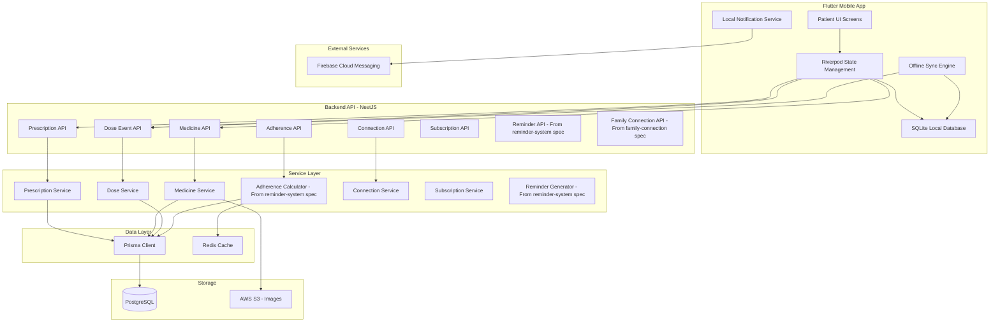

# Design Document: Patient Role Management

## Overview

The Patient Role Management feature is the central hub of the DasTern medication adherence platform, providing patients with comprehensive tools to manage prescriptions, track medications, receive reminders, monitor adherence, connect with healthcare providers and family members, and manage their subscriptions. This design builds upon the existing backend infrastructure (NestJS, PostgreSQL, Prisma, Redis) and integrates with the Flutter mobile app to deliver an offline-first, secure, and user-friendly medication management experience.

### Key Design Principles

1. **Patient-Centric**: Patient owns all data with explicit consent-based sharing
2. **Offline-First**: Full functionality without connectivity, sync when online
3. **Security-First**: Role-based access control, encryption, audit logging
4. **Performance-Optimized**: Redis caching, efficient queries, fast UI responses
5. **Reliability**: 99.9% reminder delivery, graceful degradation, retry logic
6. **Accessibility**: Multi-language support (Khmer/English), screen reader compatible
7. **Integration**: Seamless integration with reminder-system, family-connection, and doctor-dashboard specs

### Technology Stack

- **Backend**: NestJS with TypeScript, existing database schema from das-tern-backend-database
- **Mobile**: Flutter with offline-first architecture using SQLite
- **Database**: PostgreSQL 16 with Prisma ORM (existing schema)
- **Cache**: Redis 7 for adherence caching and session management
- **Push Notifications**: Firebase Cloud Messaging (FCM) via reminder-system
- **Authentication**: NextAuth.js with JWT tokens
- **Validation**: Zod for runtime validation
- **State Management**: Riverpod for Flutter state management


## Architecture

### System Architecture



### Data Flow: Manual Prescription Creation

```
Patient (Mobile App)
        ↓
Fill Prescription Form
  - Title, doctor name, dates
  - Add medicines with dosage, schedule
        ↓
Submit to Backend API
  POST /api/prescriptions
        ↓
Prescription Service
  - Validate data
  - Create Prescription (status: ACTIVE)
  - Create Medicine records
  - Set patient as owner
        ↓
Trigger Reminder Generation
  (Reminder System Integration)
        ↓
Generate Dose Events
  - Calculate schedule based on frequency
  - Create DoseEvent records (status: DUE)
        ↓
Generate Reminders
  - Use meal time preferences
  - Schedule notifications via FCM
        ↓
Return Success
        ↓
Mobile App Updates UI
  - Show prescription in active list
  - Display today's doses on dashboard
```

### Data Flow: Doctor Prescription Confirmation

```
Doctor Creates Prescription
  (From doctor-dashboard spec)
        ↓
Backend Creates Prescription
  - Status: PENDING
  - Send notification to patient
        ↓
Patient Receives Notification
  - Push notification via FCM
  - In-app notification badge
        ↓
Patient Views Prescription Details
  GET /api/prescriptions/:id
        ↓
Patient Reviews and Confirms
  POST /api/prescriptions/:id/confirm
        ↓
Backend Updates Prescription
  - Status: PENDING → ACTIVE
  - Trigger reminder generation
  - Generate dose events
  - Create audit log entry
        ↓
Notify Doctor
  - Confirmation notification
        ↓
Patient Dashboard Updates
  - Move from pending to active
  - Show today's doses
```

### Data Flow: Dose Marking (Online)

```
Patient Marks Dose as Taken
  - Tap "Mark as Taken" button
        ↓
Mobile App
  POST /api/doses/:doseId/mark-taken
  Body: { takenAt: timestamp }
        ↓
Backend Dose Service
  - Validate dose belongs to patient
  - Check time window (within 24 hours)
  - Determine status:
    * Within grace period → TAKEN_ON_TIME
    * After grace period → TAKEN_LATE
        ↓
Create DoseEvent Record
  - status: TAKEN_ON_TIME or TAKEN_LATE
  - takenAt: current timestamp
  - wasOffline: false
        ↓
Update Reminder Status
  - Dismiss active notification
  - Update reminder to COMPLETED
        ↓
Invalidate Adherence Cache
  - Delete Redis cache key
        ↓
Recalculate Adherence
  - Calculate daily percentage
  - Return updated adherence
        ↓
Mobile App Updates UI
  - Show dose as taken (green)
  - Update adherence percentage
  - Show success toast
```

### Data Flow: Offline Mode

```
App Goes Offline
        ↓
Local Notification Service
  - Continue delivering reminders
  - Use locally stored schedule
        ↓
Patient Marks Dose
  - Store in SQLite queue
  - Update local UI immediately
  - Set wasOffline flag
        ↓
App Comes Online
        ↓
Sync Engine Activates
  - Detect connectivity
  - Query SQLite for pending operations
        ↓
Batch Sync to Backend
  POST /api/doses/sync
  Body: { events: [OfflineDoseEvent[]] }
        ↓
Backend Validates Each Event
  - Check timestamp within 24 hours
  - Check for conflicts
  - Resolve conflicts (earliest wins)
        ↓
Create DoseEvent Records
  - Set wasOffline: true
  - Create audit log entries
        ↓
Return Sync Results
  { synced: 5, failed: 0, conflicts: [] }
        ↓
Mobile App
  - Clear SQLite queue
  - Update UI with server state
  - Show sync success toast
```


## Components and Interfaces

### Backend Components

#### 1. Prescription Service

**Purpose**: Manage prescription lifecycle including creation, viewing, editing, pausing, and deletion.

**Interface**:
```typescript
interface PrescriptionService {
  createPrescription(patientId: string, data: PrescriptionCreateData): Promise<Prescription>;
  getPrescriptions(patientId: string, filters: PrescriptionFilters): Promise<PaginatedPrescriptions>;
  getPrescriptionById(prescriptionId: string, userId: string): Promise<PrescriptionDetail>;
  updatePrescription(prescriptionId: string, patientId: string, updates: PrescriptionUpdateData): Promise<Prescription>;
  deletePrescription(prescriptionId: string, patientId: string): Promise<void>;
  confirmPrescription(prescriptionId: string, patientId: string): Promise<Prescription>;
  rejectPrescription(prescriptionId: string, patientId: string, reason?: string): Promise<Prescription>;
  pausePrescription(prescriptionId: string, patientId: string): Promise<Prescription>;
  resumePrescription(prescriptionId: string, patientId: string): Promise<Prescription>;
}

interface PrescriptionCreateData {
  title: string;
  doctorName?: string;
  startDate: Date;
  endDate?: Date;
  diagnosis?: string;
  notes?: string;
  medicines: MedicineCreateData[];
}

interface PrescriptionFilters {
  status?: PrescriptionStatus;
  startDate?: Date;
  endDate?: Date;
  page: number;
  limit: number;
}

interface PrescriptionDetail extends Prescription {
  medicines: Medicine[];
  adherencePercentage: number;
  totalDoses: number;
  takenDoses: number;
  missedDoses: number;
}
```

**Implementation Details**:
- Use existing Prescription model from das-tern-backend-database spec
- Validate patient ownership before allowing edits/deletes
- Only allow editing patient-created prescriptions (doctorId is null)
- When confirming doctor prescription: status PENDING → ACTIVE, trigger reminder generation
- When pausing: status ACTIVE → PAUSED, cancel pending reminders
- When resuming: status PAUSED → ACTIVE, regenerate reminders
- Create audit log entries for all state changes
- Use database transactions for multi-step operations

#### 2. Medicine Service

**Purpose**: Manage medicines within prescriptions including creation, editing (before first dose), and archiving.

**Interface**:
```typescript
interface MedicineService {
  addMedicine(prescriptionId: string, patientId: string, data: MedicineCreateData): Promise<Medicine>;
  getMedicines(prescriptionId: string, userId: string): Promise<Medicine[]>;
  getMedicineById(medicineId: string, userId: string): Promise<MedicineDetail>;
  updateMedicine(medicineId: string, patientId: string, updates: MedicineUpdateData): Promise<Medicine>;
  deleteMedicine(medicineId: string, patientId: string): Promise<void>;
  getArchivedMedicines(patientId: string, filters: ArchiveFilters): Promise<Medicine[]>;
  canEditMedicine(medicineId: string): Promise<boolean>;
}

interface MedicineCreateData {
  medicineName: string;
  medicineNameKhmer?: string;
  dosageAmount: number;
  dosageUnit: string;
  form: MedicineForm;
  frequency: MedicineFrequency;
  scheduleTimes: ScheduleTime[];
  duration: MedicineDuration;
  instructions?: string;
  beforeMeal?: boolean;
  isPRN?: boolean;
}

interface ScheduleTime {
  timePeriod: 'MORNING' | 'DAYTIME' | 'NIGHT';
  time: string; // HH:mm format
}

interface MedicineDuration {
  type: 'DAYS' | 'UNTIL_DATE' | 'ONGOING';
  value?: number | Date;
}

type MedicineForm = 'TABLET' | 'CAPSULE' | 'LIQUID' | 'INJECTION' | 'INHALER' | 'TOPICAL';
type MedicineFrequency = 'DAILY' | 'EVERY_N_DAYS' | 'SPECIFIC_DAYS' | 'PRN';
```

**Implementation Details**:
- Use existing Medication model from das-tern-backend-database spec
- Before allowing edit, check if any DoseEvent exists with status TAKEN_ON_TIME or TAKEN_LATE
- If doses taken, reject edit with error message
- When medicine is created, trigger dose event generation via DoseService
- When medicine is edited, regenerate all future dose events
- When medicine duration ends, automatically set status to ARCHIVED
- Store schedule times in JSONB field for flexibility
- Support PRN medications (no automatic reminders)

#### 3. Dose Service

**Purpose**: Manage dose events including marking as taken/skipped, generating dose events, and tracking adherence.

**Interface**:
```typescript
interface DoseService {
  generateDoseEvents(prescriptionId: string): Promise<DoseEvent[]>;
  regenerateDoseEvents(medicineId: string): Promise<DoseEvent[]>;
  getTodaysDoses(patientId: string): Promise<DoseEvent[]>;
  getUpcomingDose(patientId: string): Promise<DoseEvent | null>;
  getDoseHistory(patientId: string, filters: DoseHistoryFilters): Promise<PaginatedDoseEvents>;
  markDoseAsTaken(doseId: string, patientId: string, takenAt?: Date): Promise<DoseEventResult>;
  skipDose(doseId: string, patientId: string, reason?: string): Promise<DoseEventResult>;
  syncOfflineDoses(patientId: string, events: OfflineDoseEvent[]): Promise<SyncResult>;
}

interface DoseEventResult {
  doseEvent: DoseEvent;
  dailyProgress: number;
  adherencePercentage: number;
}

interface OfflineDoseEvent {
  localId: string;
  doseId: string;
  status: 'TAKEN' | 'SKIPPED';
  takenAt: Date;
  skipReason?: string;
  deviceTimestamp: Date;
}

interface SyncResult {
  synced: number;
  failed: number;
  conflicts: ConflictInfo[];
}
```

**Implementation Details**:
- Use existing DoseEvent model from das-tern-backend-database spec
- Generate dose events based on medicine frequency and duration
- Calculate scheduled times using meal time preferences from MealTimePreference table
- When marking as taken:
  * Check if within 24 hours of scheduledTime
  * Determine status: within grace period = TAKEN_ON_TIME, after = TAKEN_LATE
  * Update reminder status to COMPLETED
  * Invalidate adherence cache
  * Recalculate daily progress
- When skipping:
  * Record skip reason
  * Update reminder status to COMPLETED
  * Count as non-compliant for adherence
- For offline sync:
  * Validate timestamps
  * Check for conflicts (existing DoseEvent for same dose)
  * Resolve conflicts by using earliest takenAt
  * Set wasOffline flag to true
  * Create audit log entries

#### 4. Adherence Calculator Service (Integration)

**Purpose**: Calculate adherence percentages with caching. This service is defined in reminder-system-adherence-tracking spec.

**Integration Points**:
```typescript
// Use existing AdherenceCalculatorService from reminder-system spec
interface AdherenceCalculatorService {
  calculateAdherence(patientId: string, period: 'daily' | 'weekly' | 'monthly', date?: Date): Promise<AdherenceResult>;
  calculateDailyProgress(patientId: string, date: Date): Promise<number>;
  getAdherenceTrend(patientId: string, startDate: Date, endDate: Date): Promise<AdherenceTrendData[]>;
  invalidateCache(patientId: string): Promise<void>;
}
```

**Implementation Notes**:
- Reuse existing service from reminder-system-adherence-tracking spec
- Call invalidateCache() after every dose event creation
- Cache results in Redis with 5-minute TTL
- Exclude PRN medications from calculations
- Formula: (TAKEN_ON_TIME + TAKEN_LATE) / TOTAL_SCHEDULED × 100

#### 5. Connection Service (Extended)

**Purpose**: Manage doctor and family connections. Extends existing ConnectionService from das-tern-backend-database spec.

**Extended Interface**:
```typescript
interface ConnectionService {
  // Existing methods from das-tern-backend-database spec
  createConnection(initiatorId: string, recipientId: string, permissionLevel: PermissionLevel): Promise<Connection>;
  acceptConnection(connectionId: string, userId: string): Promise<Connection>;
  rejectConnection(connectionId: string, userId: string): Promise<Connection>;
  revokeConnection(connectionId: string, userId: string): Promise<Connection>;
  updatePermission(connectionId: string, userId: string, newLevel: PermissionLevel): Promise<Connection>;
  
  // New methods for patient role management
  searchDoctors(query: string, filters: DoctorSearchFilters): Promise<Doctor[]>;
  getDoctorConnections(patientId: string): Promise<Connection[]>;
  getFamilyConnections(patientId: string): Promise<Connection[]>;
  getConnectionHistory(userId: string, filters: HistoryFilters): Promise<AuditLog[]>;
  validateCaregiverLimit(patientId: string): Promise<boolean>;
}

interface DoctorSearchFilters {
  specialty?: string;
  hospital?: string;
  verifiedOnly?: boolean;
  page: number;
  limit: number;
}
```

**Implementation Details**:
- Use existing Connection model from das-tern-backend-database spec
- Search doctors by name, hospital, or license number
- Filter by accountStatus = VERIFIED for verified doctors
- Enforce subscription tier limits for family connections
- Separate doctor and family connections by role field
- Create audit log entries for all connection actions


#### 6. Subscription Service (Extended)

**Purpose**: Manage subscription tiers and enforce limits. Extends existing SubscriptionService from das-tern-backend-database spec.

**Extended Interface**:
```typescript
interface SubscriptionService {
  // Existing methods
  getSubscription(userId: string): Promise<Subscription>;
  upgradeSubscription(userId: string, newTier: SubscriptionTier): Promise<Subscription>;
  downgradeSubscription(userId: string, newTier: SubscriptionTier): Promise<Subscription>;
  
  // New methods for limit enforcement
  checkPrescriptionLimit(patientId: string): Promise<boolean>;
  checkMedicineLimit(patientId: string): Promise<boolean>;
  checkFamilyConnectionLimit(patientId: string): Promise<boolean>;
  checkStorageLimit(patientId: string, fileSize: number): Promise<boolean>;
  getCurrentLimits(patientId: string): Promise<SubscriptionLimits>;
}

interface SubscriptionLimits {
  tier: SubscriptionTier;
  prescriptionLimit: number;
  prescriptionCount: number;
  medicineLimit: number;
  medicineCount: number;
  familyConnectionLimit: number;
  familyConnectionCount: number;
  storageQuota: number;
  storageUsed: number;
}
```

**Implementation Details**:
- FREEMIUM: 1 prescription, 3 medicines, 1 family member, 5GB storage
- PREMIUM: unlimited prescriptions/medicines, 5 family members, 20GB storage
- FAMILY_PREMIUM: unlimited prescriptions/medicines, 10 family members, 20GB storage
- Check limits before allowing create operations
- Return clear error messages when limits reached
- Allow existing data to remain when downgrading

### Mobile App Components

#### 1. State Management (Riverpod)

**Purpose**: Manage application state with offline-first architecture.

**Providers**:
```dart
// Prescription State
final prescriptionProvider = StateNotifierProvider<PrescriptionNotifier, PrescriptionState>((ref) {
  return PrescriptionNotifier(ref.read(prescriptionRepositoryProvider));
});

class PrescriptionState {
  final List<Prescription> activePrescriptions;
  final List<Prescription> pendingPrescriptions;
  final List<Prescription> pausedPrescriptions;
  final List<Prescription> completedPrescriptions;
  final bool isLoading;
  final String? error;
}

// Dose State
final todaysDosesProvider = FutureProvider<List<DoseEvent>>((ref) async {
  final repository = ref.read(doseRepositoryProvider);
  return repository.getTodaysDoses();
});

final adherenceProvider = FutureProvider.family<AdherenceResult, String>((ref, period) async {
  final repository = ref.read(adherenceRepositoryProvider);
  return repository.getAdherence(period);
});

// Sync State
final syncStateProvider = StateNotifierProvider<SyncNotifier, SyncState>((ref) {
  return SyncNotifier(ref.read(syncEngineProvider));
});

class SyncState {
  final bool isSyncing;
  final int pendingCount;
  final DateTime? lastSyncTime;
  final String? error;
}
```

#### 2. Local Database (SQLite)

**Purpose**: Store data locally for offline access and sync queue.

**Schema**:
```sql
-- Prescriptions
CREATE TABLE prescriptions (
  id TEXT PRIMARY KEY,
  patient_id TEXT NOT NULL,
  doctor_id TEXT,
  title TEXT NOT NULL,
  status TEXT NOT NULL,
  start_date TEXT NOT NULL,
  end_date TEXT,
  diagnosis TEXT,
  notes TEXT,
  created_at TEXT NOT NULL,
  updated_at TEXT NOT NULL,
  synced INTEGER DEFAULT 0
);

-- Medicines
CREATE TABLE medicines (
  id TEXT PRIMARY KEY,
  prescription_id TEXT NOT NULL,
  medicine_name TEXT NOT NULL,
  dosage_amount REAL NOT NULL,
  dosage_unit TEXT NOT NULL,
  form TEXT NOT NULL,
  frequency TEXT NOT NULL,
  schedule_times TEXT NOT NULL, -- JSON
  duration TEXT NOT NULL, -- JSON
  instructions TEXT,
  created_at TEXT NOT NULL,
  updated_at TEXT NOT NULL,
  synced INTEGER DEFAULT 0,
  FOREIGN KEY (prescription_id) REFERENCES prescriptions(id) ON DELETE CASCADE
);

-- Dose Events
CREATE TABLE dose_events (
  id TEXT PRIMARY KEY,
  prescription_id TEXT NOT NULL,
  medicine_id TEXT NOT NULL,
  scheduled_time TEXT NOT NULL,
  status TEXT NOT NULL,
  taken_at TEXT,
  skip_reason TEXT,
  was_offline INTEGER DEFAULT 0,
  created_at TEXT NOT NULL,
  updated_at TEXT NOT NULL,
  synced INTEGER DEFAULT 0,
  FOREIGN KEY (prescription_id) REFERENCES prescriptions(id) ON DELETE CASCADE,
  FOREIGN KEY (medicine_id) REFERENCES medicines(id) ON DELETE CASCADE
);

-- Sync Queue
CREATE TABLE sync_queue (
  id INTEGER PRIMARY KEY AUTOINCREMENT,
  operation_type TEXT NOT NULL, -- 'CREATE', 'UPDATE', 'DELETE'
  resource_type TEXT NOT NULL, -- 'PRESCRIPTION', 'MEDICINE', 'DOSE_EVENT'
  resource_id TEXT NOT NULL,
  payload TEXT NOT NULL, -- JSON
  created_at TEXT NOT NULL,
  retry_count INTEGER DEFAULT 0
);

-- Reminders (for offline delivery)
CREATE TABLE local_reminders (
  id TEXT PRIMARY KEY,
  medicine_id TEXT NOT NULL,
  scheduled_time TEXT NOT NULL,
  status TEXT NOT NULL,
  delivered INTEGER DEFAULT 0,
  FOREIGN KEY (medicine_id) REFERENCES medicines(id) ON DELETE CASCADE
);
```

#### 3. Offline Sync Engine

**Purpose**: Synchronize offline changes when connectivity is restored.

**Interface**:
```dart
class OfflineSyncEngine {
  Future<void> startSync();
  Future<SyncResult> syncPendingOperations();
  Future<void> queueOperation(SyncOperation operation);
  Future<int> getPendingCount();
  Stream<SyncState> watchSyncState();
}

class SyncOperation {
  final String operationType; // 'CREATE', 'UPDATE', 'DELETE'
  final String resourceType; // 'PRESCRIPTION', 'MEDICINE', 'DOSE_EVENT'
  final String resourceId;
  final Map<String, dynamic> payload;
  final DateTime createdAt;
  final int retryCount;
}
```

**Implementation Details**:
- Monitor connectivity using `connectivity_plus` package
- Auto-sync when connectivity is restored
- Process sync queue in chronological order
- Retry failed operations with exponential backoff (1s, 2s, 4s)
- After 3 failures, mark as failed and notify user
- Batch operations for efficiency (max 50 per batch)
- Handle conflicts by prioritizing server state

#### 4. Local Notification Service

**Purpose**: Deliver reminders when offline using local notifications.

**Interface**:
```dart
class LocalNotificationService {
  Future<void> scheduleReminder(Reminder reminder);
  Future<void> cancelReminder(String reminderId);
  Future<void> cancelAllReminders();
  Future<void> handleNotificationTap(String payload);
  Future<void> syncRemindersWithServer();
}
```

**Implementation Details**:
- Use `flutter_local_notifications` package
- Schedule notifications using exact alarm (Android 12+)
- Store up to 100 pending reminders locally
- Sync with server every hour when online
- Handle notification actions: Mark Taken, Snooze, Dismiss
- Use notification channels for different types

#### 5. Repository Pattern

**Purpose**: Abstract data access layer for both online and offline modes.

**Interface**:
```dart
abstract class PrescriptionRepository {
  Future<List<Prescription>> getPrescriptions({PrescriptionFilters? filters});
  Future<Prescription> getPrescriptionById(String id);
  Future<Prescription> createPrescription(PrescriptionCreateData data);
  Future<Prescription> updatePrescription(String id, PrescriptionUpdateData data);
  Future<void> deletePrescription(String id);
  Future<Prescription> confirmPrescription(String id);
  Future<Prescription> pausePrescription(String id);
}

class PrescriptionRepositoryImpl implements PrescriptionRepository {
  final ApiClient apiClient;
  final LocalDatabase localDb;
  final ConnectivityService connectivity;
  
  @override
  Future<Prescription> createPrescription(PrescriptionCreateData data) async {
    if (await connectivity.isOnline()) {
      // Online: Call API
      final prescription = await apiClient.createPrescription(data);
      await localDb.savePrescription(prescription);
      return prescription;
    } else {
      // Offline: Save locally and queue for sync
      final prescription = Prescription.fromData(data);
      await localDb.savePrescription(prescription);
      await syncEngine.queueOperation(SyncOperation(
        operationType: 'CREATE',
        resourceType: 'PRESCRIPTION',
        resourceId: prescription.id,
        payload: prescription.toJson(),
      ));
      return prescription;
    }
  }
}
```

## Data Models

### API Request/Response Types

```typescript
// Prescription Types
interface PrescriptionCreateRequest {
  title: string;
  doctorName?: string;
  startDate: string; // ISO 8601
  endDate?: string;
  diagnosis?: string;
  notes?: string;
  medicines: MedicineCreateRequest[];
}

interface MedicineCreateRequest {
  medicineName: string;
  medicineNameKhmer?: string;
  dosageAmount: number;
  dosageUnit: string;
  form: MedicineForm;
  frequency: MedicineFrequency;
  scheduleTimes: ScheduleTimeRequest[];
  duration: MedicineDurationRequest;
  instructions?: string;
  beforeMeal?: boolean;
  isPRN?: boolean;
}

interface ScheduleTimeRequest {
  timePeriod: 'MORNING' | 'DAYTIME' | 'NIGHT';
  time: string; // HH:mm
}

interface MedicineDurationRequest {
  type: 'DAYS' | 'UNTIL_DATE' | 'ONGOING';
  value?: number | string; // number for DAYS, ISO date for UNTIL_DATE
}

// Dose Event Types
interface MarkDoseTakenRequest {
  takenAt?: string; // ISO 8601, defaults to now
  offline?: boolean;
}

interface SkipDoseRequest {
  reason?: string;
}

interface SyncDosesRequest {
  events: OfflineDoseEventRequest[];
}

interface OfflineDoseEventRequest {
  localId: string;
  doseId: string;
  status: 'TAKEN' | 'SKIPPED';
  takenAt: string; // ISO 8601
  skipReason?: string;
  deviceTimestamp: string; // ISO 8601
}

// Response Types
interface PrescriptionResponse {
  prescription: Prescription;
  medicines: Medicine[];
  adherencePercentage: number;
}

interface DoseEventResponse {
  doseEvent: DoseEvent;
  dailyProgress: number;
  adherencePercentage: number;
}

interface SyncResponse {
  synced: number;
  failed: number;
  conflicts: ConflictInfo[];
}

interface ConflictInfo {
  localId: string;
  doseId: string;
  reason: string;
  resolution: 'SERVER_WINS' | 'CLIENT_WINS' | 'MERGED';
}
```

### Flutter Data Models

```dart
// Prescription Model
class Prescription {
  final String id;
  final String patientId;
  final String? doctorId;
  final String title;
  final String? doctorName;
  final PrescriptionStatus status;
  final DateTime startDate;
  final DateTime? endDate;
  final String? diagnosis;
  final String? notes;
  final DateTime createdAt;
  final DateTime updatedAt;
  final bool synced;
  
  // Computed fields
  int get medicineCount;
  double get adherencePercentage;
}

// Medicine Model
class Medicine {
  final String id;
  final String prescriptionId;
  final String medicineName;
  final String? medicineNameKhmer;
  final double dosageAmount;
  final String dosageUnit;
  final MedicineForm form;
  final MedicineFrequency frequency;
  final List<ScheduleTime> scheduleTimes;
  final MedicineDuration duration;
  final String? instructions;
  final bool beforeMeal;
  final bool isPRN;
  final DateTime createdAt;
  final DateTime updatedAt;
  final bool synced;
}

// Dose Event Model
class DoseEvent {
  final String id;
  final String prescriptionId;
  final String medicineId;
  final DateTime scheduledTime;
  final DoseStatus status;
  final DateTime? takenAt;
  final String? skipReason;
  final bool wasOffline;
  final DateTime createdAt;
  final DateTime updatedAt;
  final bool synced;
  
  // Computed fields
  bool get isLate;
  bool get isMissed;
  bool get isDue;
}
```


## Correctness Properties

*A property is a characteristic or behavior that should hold true across all valid executions of a system—essentially, a formal statement about what the system should do. Properties serve as the bridge between human-readable specifications and machine-verifiable correctness guarantees.*

### Property 1: Prescription Creation Validation
*For any* prescription creation attempt, if the data is missing required fields (title, start date, or at least one medicine), the system should reject the creation with a validation error.
**Validates: Requirements 1.1**

### Property 2: Patient-Created Prescription Status
*For any* prescription created by a patient (where doctorId is null), the initial status should be ACTIVE.
**Validates: Requirements 1.3**

### Property 3: Prescription Ownership
*For any* prescription created by a patient, the patientId field should match the creator's user ID, granting full edit permissions.
**Validates: Requirements 1.4**

### Property 4: Prescription ID Uniqueness
*For any* two prescriptions created at any time, their IDs should be unique and each should have a valid timestamp.
**Validates: Requirements 1.5**

### Property 5: Prescription Audit Logging
*For any* prescription creation, an AuditLog entry with actionType PRESCRIPTION_CREATE should be created with the same prescriptionId.
**Validates: Requirements 1.6**

### Property 6: Start Date Validation
*For any* prescription with a start date more than 7 days in the past, the validation should reject the creation.
**Validates: Requirements 1.7**

### Property 7: Medicine Creation Validation
*For any* medicine creation attempt, if the data is missing required fields (medicine name, dosage amount, or form), the system should reject the creation with a validation error.
**Validates: Requirements 2.1**

### Property 8: Dose Event Generation Completeness
*For any* medicine with a defined schedule (non-PRN), creating the medicine should generate dose events for all scheduled times based on frequency and duration, with the count matching the expected number of doses.
**Validates: Requirements 2.7**

### Property 9: Reminder Generation Trigger
*For any* medicine creation, the Reminder_System should be triggered to generate reminders for all scheduled doses.
**Validates: Requirements 2.8, 46.1**

### Property 10: Doctor Prescription Pending Status
*For any* prescription created by a doctor (where doctorId is not null), the initial status should be PENDING.
**Validates: Requirements 3.1**

### Property 11: Prescription Confirmation State Transition
*For any* prescription with status PENDING, when confirmed by the patient, the status should change to ACTIVE and dose events should be generated.
**Validates: Requirements 3.5, 3.6**

### Property 12: Medicine Edit Precondition Check
*For any* medicine edit attempt, the system should check if any DoseEvent exists with status TAKEN_ON_TIME or TAKEN_LATE; if yes, the edit should be rejected.
**Validates: Requirements 5.1, 5.3**

### Property 13: Medicine Edit Permission
*For any* medicine with no taken doses, editing all fields should be allowed and should regenerate dose events.
**Validates: Requirements 5.2, 5.4**

### Property 14: Medicine Archiving on Duration End
*For any* medicine whose duration has ended, the status should automatically change to ARCHIVED while preserving all dose events and adherence data.
**Validates: Requirements 6.1, 6.2**

### Property 15: Adherence Calculation Formula
*For any* adherence calculation request, the percentage should equal (count of TAKEN_ON_TIME + TAKEN_LATE) / (count of all non-PRN scheduled doses) × 100, excluding PRN medications.
**Validates: Requirements 8.1, 8.2, 8.3, 8.4**

### Property 16: Dose Timing Classification
*For any* dose marked as taken, if marked within the grace period it should be recorded as TAKEN_ON_TIME, if after grace period but within 24 hours as TAKEN_LATE, and if beyond 24 hours the action should be rejected.
**Validates: Requirfields in red
- Provide specific guidance for correction
- Prevent form submission until valid

**Sync Errors**:
- Display banner: "Sync failed. Tap to retry."
- Show pending operation count
- Provide manual retry button
- Log errors for debugging

**Permission Errors**:
- Display dialog explaining the issue
- Provide "Contact Support" button if needed
- Suggest upgrading subscription if limit reached

ts with this user"
- Already confirmed: "Prescription has already been confirmed"

**Rate Limit Errors (HTTP 429)**:
- Too many requests: "Too many requests. Please try again in {seconds} seconds"

### Mobile App Error Handling

**Network Errors**:
- Display toast: "Connection failed. Check your internet and try again."
- Provide retry button
- Queue operation for offline sync if applicable
- Show offline indicator

**Validation Errors**:
- Display inline error messages below input fields
- Highlight invalid hed your {limitType} limit. Upgrade to continue."
- Cannot edit medicine: "Cannot edit medicine after first dose. Create a new medicine instead."
- Cannot edit doctor prescription: "Cannot edit prescriptions created by doctors"

**Not Found Errors (HTTP 404)**:
- Prescription not found: "Prescription not found"
- Medicine not found: "Medicine not found"
- Dose not found: "Dose event not found"
- User not found: "User not found"

**Conflict Errors (HTTP 409)**:
- Duplicate connection: "Connection already exis: "Required field '{fieldName}' is missing"
- Invalid date format: "Invalid date format. Use ISO 8601 (YYYY-MM-DD)"
- Start date too far in past: "Start date cannot be more than 7 days in the past"
- Invalid dosage: "Dosage amount must be greater than 0"
- Invalid frequency: "Invalid frequency. Must be one of: DAILY, EVERY_N_DAYS, SPECIFIC_DAYS, PRN"

**Authorization Errors (HTTP 403)**:
- Insufficient permissions: "You don't have permission to perform this action"
- Subscription limit reached: "You've reacons where alertsEnabled is true.
**Validates: Requirements 47.3**

### Property 43: Doctor Notification on Confirmation
*For any* doctor prescription confirmation by a patient, a notification should be sent to the doctor indicating successful confirmation.
**Validates: Requirements 48.3**

## Error Handling

### Backend Error Handling

**Validation Errors (HTTP 400)**:
- Missing required fieldsasing delays (1s, 2s, 4s) before displaying an error.
**Validates: Requirements 60.1, 60.2, 60.3**

### Property 41: Reminder System Integration Completeness
*For any* medicine schedule update or deletion, the corresponding reminder operations (regenerate or cancel) should be triggered in the Reminder_System.
**Validates: Requirements 46.2, 46.3**

### Property 42: Family Alert Trigger
*For any* dose marked as MISSED, MISSED_DOSE_ALERT notifications should be created for all family members with ACCEPTED connectiecord consent or access in the audit log with timestamp and accessor information.
**Validates: Requirements 27.2, 27.4, 27.5**

### Property 39: Schedule Conflict Detection
*For any* two medicines scheduled within 5 minutes of each other (and not from the same prescription), the system should detect and warn about the conflict.
**Validates: Requirements 31.6**

### Property 40: Retry Logic with Exponential Backoff
*For any* failed network request, the system should retry up to 3 times with exponentially increrty 36: Authentication Token Expiration
*For any* JWT access token, it should expire after 15 minutes, and refresh tokens should expire after 7 days (or 30 days with "remember me").
**Validates: Requirements 26.2, 26.3, 26.4**

### Property 37: Account Lockout on Failed Logins
*For any* user account, after 5 consecutive failed login attempts, the account should be locked for 30 minutes.
**Validates: Requirements 26.8**

### Property 38: Consent Logging
*For any* connection approval or data access, the system should rRequirements 23.7, 23.8**

### Property 34: Language Preference Application
*For any* language change, all future notifications and UI text should use the selected language immediately without restart.
**Validates: Requirements 24.2, 24.3**

### Property 35: Data Access Authorization
*For any* data access attempt, the system should verify that the user either owns the data or has an ACCEPTED connection with appropriate permission level before granting access.
**Validates: Requirements 25.2, 25.3, 25.4**

### Propehould reject that event.
**Validates: Requirements 22.2**

### Property 32: Sync Conflict Resolution
*For any* sync conflict where multiple DoseEvents exist for the same scheduled dose, the system should resolve by prioritizing the earliest takenAt timestamp.
**Validates: Requirements 22.3**

### Property 33: Meal Time Reminder Calculation
*For any* medicine with "before meal" timing, the reminder should be scheduled 30 minutes before the meal time; for "after meal", 30 minutes after the meal time.
**Validates: s.
**Validates: Requirements 21.1, 21.2**

### Property 31: Offline Sync Validation
*For any* offline dose event being synced, if the takenAt timestamp is more than 24 hours after scheduledTime, the sync s reached.
**Validates: Requirements 19.1, 19.2, 19.3, 19.7**

### Property 29: Offline Data Queueing
*For any* operation performed while offline (dose marking, prescription creation), the operation should be stored in the local SQLite queue with wasOffline flag set to true.
**Validates: Requirements 20.1, 20.2, 20.6**

### Property 30: Offline Reminder Delivery
*For any* scheduled reminder while the device is offline, the local notification service should deliver the reminder using local device notification

### Property 27: Family Connection Approval
*For any* family connection request, the patient should be able to approve (status → ACCEPTED) or deny (status → REVOKED), and the family member should receive a confirmation notification.
**Validates: Requirements 17.3, 17.4, 17.5**

### Property 28: Subscription Limit Enforcement
*For any* operation that would exceed subscription limits (prescriptions, medicines, family connections), the system should reject the operation with a clear error message indicating the limitacter alphanumeric code should be created with 24-hour expiration.
**Validates: Requirements 16.2, 16.3** an AuditLog entry with actionType CONNECTION_REQUEST should be logged.
**Validates: Requirements 14.4, 14.6**

### Property 25: Connection State Transitions
*For any* connection in PENDING status, accepting should change status to ACCEPTED with acceptedAt timestamp, and revoking should change status to REVOKED while preserving existing prescriptions.
**Validates: Requirements 15.5, 15.6, 15.7**

### Property 26: Family Connection Token Generation
*For any* family connection token generation, a unique 8-12 chart, a Connection record with status PENDING should be created anderiod, repeat frequency, custom times), all future reminders for affected medicines should be regenerated with the new settings.
**Validates: Requirements 13.1, 13.6**

### Property 23: Doctor Search Correctness
*For any* doctor search query, all returned results should match the search criteria (name, hospital, or license number) and have accountStatus = VERIFIED if verifiedOnly filter is true.
**Validates: Requirements 14.1, 14.2**

### Property 24: Connection Creation and Audit
*For any* connection request sen*

### Property 22: Reminder Settings Regeneration
*For any* reminder settings update (grace punt as non-compliant for adherence.
**Validates: Requirements 11.1, 11.2, 11.6**

### Property 20: Snooze Rescheduling
*For any* reminder snooze action with duration N minutes, the reminder should be rescheduled to (current time + N minutes), status updated to SNOOZED, and snooze count incremented.
**Validates: Requirements 12.2, 12.3**

### Property 21: Snooze Limit Enforcement
*For any* reminder that has been snoozed 3 times, additional snooze options should not be offered.
**Validates: Requirements 12.5*

### Property 19: Skip Reason Recording
*For any* dose skipped with a reason, the DoseEvent should record the skip reason and coements 10.1, 10.2, 10.7**

### Property 17: Dose Event Creation and Reminder Dismissal
*For any* dose marked as taken or skipped, a DoseEvent record should be created with the appropriate status and timestamp, and the active reminder notification should be dismissed.
**Validates: Requirements 10.3, 10.4**

### Property 18: Adherence Cache Invalidation
*For any* dose event creation, the adherence cache for that patient should be invalidated and adherence should be recalculated.
**Validates: Requirements 10.5, 10.6**

## Testing Strategy

### Dual Testing Approach

This feature requires both unit tests and property-based tests for comprehensive coverage:

**Unit Tests** focus on:
- Specific UI screen rendering and navigation
- Error message display and formatting
- Edge cases (expired tokens, rate limits, boundary conditions)
- Integration between components
- Specific examples of prescription creation, dose marking

**Property-Based Tests** focus on:
- Prescription and medicine validation across all inputs
- Dose timing classification for all time windows
- Adherence calculation correctness for all dose combinations
- State transitions for prescriptions and connections
- Subscription limit enforcement for all tiers
- Offline sync behavior for all operation types
- Authentication and authorization rules

### Property Test Configuration

- **Backend Library**: Use `fast-check` for TypeScript/NestJS
- **Mobile Library**: Use Dart `test` package with custom generators
- **Iterations**: Minimum 100 iterations per property test
- **Tagging**: Each property test must reference its design document property

Example tag format:
```typescript
// Feature: patient-role-management, Property 16: Dose Timing Classification
test('dose timing classification based on grace period', async () => {
  await fc.assert(
    fc.asyncProperty(
      fc.date(), // scheduledTime
      fc.integer({ min: 10, max: 60 }), // gracePeriodMinutes
      fc.date(), // takenAt
      async (scheduledTime, gracePeriodMinutes, takenAt) => {
        const timeDiff = takenAt.getTime() - scheduledTime.getTime();
        const graceMs = gracePeriodMinutes * 60 * 1000;
        const twentyFourHoursMs = 24 * 60 * 60 * 1000;
        
        if (timeDiff > twentyFourHoursMs) {
          // Should reject
          await expect(
            doseService.markDoseAsTaken(doseId, patientId, takenAt)
          ).rejects.toThrow('Cannot mark dose more than 24 hours late');
        } else if (timeDiff <= graceMs) {
          // Should be TAKEN_ON_TIME
          const result = await doseService.markDoseAsTaken(doseId, patientId, takenAt);
          expect(result.doseEvent.status).toBe('TAKEN_ON_TIME');
        } else {
          // Should be TAKEN_LATE
          const result = await doseService.markDoseAsTaken(doseId, patientId, takenAt);
          expect(result.doseEvent.status).toBe('TAKEN_LATE');
        }
      }
    ),
    { numRuns: 100 }
  );
});
```

### Unit Test Examples

**Prescription Service**:
```typescript
describe('PrescriptionService', () => {
  it('should create prescription with ACTIVE status for patient', async () => {
    const patientId = 'patient-123';
    const data = {
      title: 'Blood Pressure Medication',
      startDate: new Date(),
      medicines: [{ medicineName: 'Amlodipine', dosageAmount: 5, dosageUnit: 'mg', form: 'TABLET', frequency: 'DAILY', scheduleTimes: [{ timePeriod: 'MORNING', time: '08:00' }], duration: { type: 'DAYS', value: 30 } }]
    };
    
    const prescription = await prescriptionService.createPrescription(patientId, data);
    
    expect(prescription.status).toBe('ACTIVE');
    expect(prescription.patientId).toBe(patientId);
    expect(prescription.doctorId).toBeNull();
  });
  
  it('should reject editing medicine after first dose taken', async () => {
    const medicineId = 'medicine-123';
    await createTestDose({ medicineId, status: 'TAKEN_ON_TIME' });
    
    await expect(
      medicineService.updateMedicine(medicineId, patientId, { dosageAmount: 10 })
    ).rejects.toThrow('Cannot edit medicine after first dose');
  });
});
```

**Offline Sync**:
```typescript
describe('OfflineSyncService', () => {
  it('should sync offline dose events when connectivity restored', async () => {
    const offlineEvents = [
      { localId: '1', doseId: 'dose-1', status: 'TAKEN', takenAt: new Date(), deviceTimestamp: new Date() },
      { localId: '2', doseId: 'dose-2', status: 'SKIPPED', skipReason: 'Forgot', deviceTimestamp: new Date() }
    ];
    
    const result = await syncService.syncDoseEvents(patientId, offlineEvents);
    
    expect(result.synced).toBe(2);
    expect(result.failed).toBe(0);
    
    const dose1 = await prisma.doseEvent.findUnique({ where: { id: 'dose-1' } });
    expect(dose1.wasOffline).toBe(true);
  });
  
  it('should resolve conflicts by using earliest timestamp', async () => {
    const earlierTime = new Date('2025-01-20T08:00:00Z');
    const laterTime = new Date('2025-01-20T08:30:00Z');
    
    // Create existing dose event
    await prisma.doseEvent.create({
      data: { id: 'dose-1', status: 'TAKEN_ON_TIME', takenAt: laterTime, /* ... */ }
    });
    
    // Sync offline event with earlier time
    const offlineEvents = [
      { localId: '1', doseId: 'dose-1', status: 'TAKEN', takenAt: earlierTime, deviceTimestamp: earlierTime }
    ];
    
    await syncService.syncDoseEvents(patientId, offlineEvents);
    
    const dose = await prisma.doseEvent.findUnique({ where: { id: 'dose-1' } });
    expect(dose.takenAt).toEqual(earlierTime);
  });
});
```

## Implementation Notes

### API Endpoints Summary

**Prescription Endpoints**:
- `POST /api/prescriptions` - Create prescription
- `GET /api/prescriptions` - List prescriptions with filters
- `GET /api/prescriptions/:id` - Get prescription details
- `PATCH /api/prescriptions/:id` - Update prescription
- `DELETE /api/prescriptions/:id` - Delete prescription
- `POST /api/prescriptions/:id/confirm` - Confirm doctor prescription
- `POST /api/prescriptions/:id/reject` - Reject doctor prescription
- `POST /api/prescriptions/:id/pause` - Pause prescription
- `POST /api/prescriptions/:id/resume` - Resume prescription

**Medicine Endpoints**:
- `POST /api/prescriptions/:prescriptionId/medicines` - Add medicine
- `GET /api/prescriptions/:prescriptionId/medicines` - List medicines
- `GET /api/medicines/:id` - Get medicine details
- `PATCH /api/medicines/:id` - Update medicine (before first dose)
- `DELETE /api/medicines/:id` - Delete medicine
- `GET /api/medicines/archived` - List archived medicines

**Dose Event Endpoints**:
- `POST /api/doses/:id/taken` - Mark dose as taken
- `POST /api/doses/:id/skip` - Skip dose with reason
- `GET /api/doses/today` - Get today's doses
- `GET /api/doses/upcoming` - Get next upcoming dose
- `GET /api/doses/history` - Get dose history
- `POST /api/doses/sync` - Sync offline doses

**Adherence Endpoints** (from reminder-system spec):
- `GET /api/adherence/today` - Today's adherence
- `GET /api/adherence/weekly` - Weekly adherence
- `GET /api/adherence/monthly` - Monthly adherence
- `GET /api/adherence/trends` - Adherence trends

**Connection Endpoints**:
- `POST /api/connections/request` - Send connection request
- `POST /api/connections/token` - Generate family connection token (from family-connection spec)
- `POST /api/connections/validate-token` - Validate token (from family-connection spec)
- `POST /api/connections/:id/accept` - Accept connection
- `POST /api/connections/:id/reject` - Reject connection
- `POST /api/connections/:id/revoke` - Revoke connection
- `PATCH /api/connections/:id/permission` - Update permission
- `GET /api/connections/doctors` - List doctor connections
- `GET /api/connections/family` - List family connections
- `GET /api/doctors/search` - Search doctors

**Subscription Endpoints**:
- `GET /api/subscription` - Get subscription details
- `GET /api/subscription/limits` - Get limits and usage
- `POST /api/subscription/upgrade` - Upgrade tier
- `POST /api/subscription/downgrade` - Downgrade tier

### Database Indexes

Critical indexes for performance:

```sql
-- Prescriptions
CREATE INDEX idx_prescriptions_patient_status ON prescriptions(patient_id, status);
CREATE INDEX idx_prescriptions_doctor ON prescriptions(doctor_id);

-- Medicines
CREATE INDEX idx_medicines_prescription ON medications(prescription_id);

-- Dose Events
CREATE INDEX idx_dose_events_patient_scheduled ON dose_events(patient_id, scheduled_time);
CREATE INDEX idx_dose_events_status ON dose_events(status);
CREATE INDEX idx_dose_events_medicine ON dose_events(medication_id);

-- Connections
CREATE INDEX idx_connections_initiator_status ON connections(initiator_id, status);
CREATE INDEX idx_connections_recipient_status ON connections(recipient_id, status);

-- Audit Logs
CREATE INDEX idx_audit_logs_actor ON audit_logs(actor_id, created_at);
CREATE INDEX idx_audit_logs_resource ON audit_logs(resource_id, action_type);
```

### Redis Cache Keys

```
adherence:{patientId}:daily:{date}       - TTL: 5 minutes
adherence:{patientId}:weekly:{date}      - TTL: 5 minutes
adherence:{patientId}:monthly:{date}     - TTL: 5 minutes
user:profile:{userId}                    - TTL: 5 minutes
subscription:{userId}                    - TTL: 10 minutes
reminders:queue                          - Sorted set (from reminder-system spec)
```

### Security Considerations

1. **Authentication**:
   - All endpoints require valid JWT token
   - Token includes userId, role, subscriptionTier, language
   - Refresh tokens stored in Redis with automatic expiration
   - Account lockout after 5 failed login attempts

2. **Authorization**:
   - Verify patient owns prescription before allowing edits/deletes
   - Verify active connection exists before allowing doctor/family access
   - Check permission level before granting data access
   - Enforce subscription limits before create operations

3. **Data Privacy**:
   - Encrypt sensitive data at rest
   - Log all data access in audit trail
   - Require explicit consent for data sharing
   - Allow patients to export and delete their data

4. **Input Validation**:
   - Use Zod schemas for all API inputs
   - Validate dates, dosages, and enums
   - Sanitize user-provided text
   - Prevent SQL injection through Prisma parameterization

### Performance Optimizations

1. **Caching Strategy**:
   - Cache adherence calculations (5-minute TTL)
   - Cache user profiles (5-minute TTL)
   - Cache subscription data (10-minute TTL)
   - Invalidate cache on data mutations

2. **Database Optimization**:
   - Use composite indexes for common queries
   - Implement pagination for large result sets
   - Use database transactions for multi-step operations
   - Batch insert dose events for efficiency

3. **Mobile App Optimization**:
   - Implement lazy loading for prescription lists
   - Cache images locally
   - Prefetch today's doses on app launch
   - Use optimistic UI updates

4. **Offline Performance**:
   - Store last 90 days of data locally
   - Limit local reminder queue to 100 items
   - Batch sync operations (max 50 per batch)
   - Use background sync when app is closed

### Integration Points

1. **Reminder System** (from reminder-system-adherence-tracking spec):
   - Call ReminderGeneratorService when medicine is created
   - Call regenerateReminders when medicine schedule is updated
   - Call deleteReminders when medicine is deleted
   - Use AdherenceCalculatorService for all adherence calculations

2. **Family Connection** (from family-connection-missed-dose-alert spec):
   - Use ConnectionTokenService for family invitations
   - Trigger missed dose alerts to family members
   - Respect family alert preferences
   - Enforce family connection limits

3. **Doctor Dashboard** (from doctor-dashboard spec):
   - Notify doctor when prescription is confirmed/rejected
   - Allow doctor to view patient adherence
   - Enforce doctor connection requirements
   - Log doctor access to patient data

### Deployment Considerations

1. **Environment Variables**:
   - DATABASE_URL - PostgreSQL connection string
   - REDIS_URL - Redis connection string
   - JWT_SECRET - Secret for signing tokens
   - AWS_S3_BUCKET - S3 bucket for images
   - FCM_SERVER_KEY - Firebase Cloud Messaging key

2. **Database Migrations**:
   - Use Prisma Migrate for schema changes
   - Test migrations in staging before production
   - Backup database before major migrations
   - Monitor migration performance

3. **Monitoring**:
   - Track API response times
   - Monitor reminder delivery success rate
   - Alert on high error rates
   - Track offline sync success rate

4. **Scaling**:
   - Use connection pooling (max 20 connections)
   - Implement rate limiting (100 req/min per user)
   - Use Redis for session management
   - Consider read replicas for high traffic
