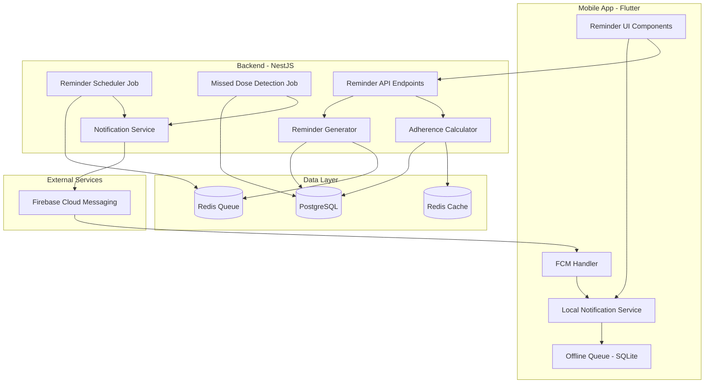

# Design Document: Reminder System and Adherence Tracking

## Overview

The Reminder System and Adherence Tracking feature is the cornerstone of DasTern's medication management platform. This system ensures patients receive timely, reliable medication reminders through push notifications, tracks their adherence behavior with real-time calculations, and alerts family members when doses are missed. The design builds upon the existing DasTern backend infrastructure (NestJS, PostgreSQL, Redis, Prisma) and integrates with the mobile Flutter app through Firebase Cloud Messaging (FCM).

### Key Design Principles

1. **Reliability First**: 99.9% reminder delivery with <300ms latency
2. **Offline-First**: Reminders work without connectivity, sync when online
3. **Scalability**: Handle 10,000+ reminders per minute
4. **Privacy-Aware**: Respect user preferences and family notification settings
5. **Performance-Optimized**: Redis caching, database indexing, efficient queries
6. **Multi-Language**: Full Khmer and English support throughout
7. **Graceful Degradation**: Fallback mechanisms when services are unavailable

### Technology Stack

- **Backend**: NestJS with TypeScript, scheduled jobs via `@nestjs/schedule`
- **Database**: PostgreSQL 16 with Prisma ORM
- **Cache**: Redis 7 for reminder queue and adherence caching
- **Push Notifications**: Firebase Cloud Messaging (FCM)
- **Mobile**: Flutter with local notifications (`flutter_local_notifications`)
- **Job Scheduling**: Cron jobs for reminder delivery and missed dose detection
- **Message Queue**: Redis-based queue for reminder processing

## Architecture

### System Architecture



### Data Flow: Reminder Generation

```
Prescription Confirmed
        ↓
Reminder Generator Service
        ↓
Calculate reminder times based on:
  - Medication schedule (morning/daytime/night)
  - Meal time preferences
  - Dosage timing (before/after meal)
        ↓
Create Reminder records in PostgreSQL
  - Status: PENDING
  - scheduledTime
  - medicationId, patientId
        ↓
Add to Redis Queue
  - Sorted set by scheduledTime
  - Key: reminder:{reminderId}
```

### Data Flow: Reminder Delivery

```
Reminder Scheduler Job (runs every minute)
        ↓
Query Redis Queue for reminders due in next minute
        ↓
For each reminder:
  1. Update status to DELIVERING
  2. Build notification payload
  3. Send via FCM
  4. Update status to DELIVERED
  5. Log delivery timestamp
        ↓
If delivery fails:
  - Retry with exponential backoff (3 attempts)
  - If all retries fail, mark as FAILED
```

### Data Flow: Dose Event Recording

```
Patient marks dose (Taken/Skipped)
        ↓
Mobile App
  - If online: POST /api/doses/:doseId/mark-taken
  - If offline: Store in SQLite queue
        ↓
Backend API
  - Validate dose exists and belongs to patient
  - Check time window (within 24 hours)
  - Determine status (ON_TIME vs LATE)
        ↓
Create DoseEvent record
  - status: TAKEN_ON_TIME or TAKEN_LATE
  - takenAt: timestamp
  - wasOffline: boolean
        ↓
Update Reminder status to COMPLETED
        ↓
Invalidate adherence cache
        ↓
Recalculate daily progress
        ↓
Return updated adherence percentage
```

### Data Flow: Missed Dose Detection

```
Missed Dose Detection Job (runs every 5 minutes)
        ↓
Query for reminders where:
  - status = DELIVERED
  - scheduledTime + grace_period < NOW()
  - No associated DoseEvent
        ↓
For each missed reminder:
  1. Create DoseEvent with status MISSED
  2. Update Reminder status to MISSED
  3. Send notification to patient
  4. Query family connections with alerts enabled
  5. Send MISSED_DOSE_ALERT to each family member
  6. Log in AuditLog
        ↓
Invalidate adherence cache
```

### Data Flow: Adherence Calculation

```
Request: GET /api/adherence?period=weekly
        ↓
Check Redis cache: adherence:{patientId}:{period}
        ↓
If cached and fresh (TTL < 5 min):
  - Return cached value
        ↓
If not cached:
  - Query DoseEvents for time period
  - Calculate: (TAKEN_ON_TIME + TAKEN_LATE) / TOTAL_SCHEDULED
  - Exclude PRN medications
  - Cache result with 5-minute TTL
  - Return percentage
```

## Components and Interfaces

### Backend Components

#### 1. Reminder Generator Service

**Purpose**: Generate reminder records when prescriptions are confirmed or medication schedules are updated.

**Interface**:
```typescript
interface ReminderGeneratorService {
  generateRemindersForPrescription(prescriptionId: string): Promise<Reminder[]>;
  regenerateRemindersForMedication(medicationId: string): Promise<Reminder[]>;
  deleteRemindersForPrescription(prescriptionId: string): Promise<void>;
  calculateReminderTime(
    medication: Medication,
    mealPreferences: MealTimePreference,
    timePeriod: TimePeriod
  ): Date;
}

interface Reminder {
  id: string;
  patientId: string;
  medicationId: string;
  prescriptionId: string;
  scheduledTime: Date;
  timePeriod: TimePeriod;
  status: ReminderStatus;
  deliveredAt?: Date;
  completedAt?: Date;
  snoozedUntil?: Date;
  snoozeCount: number;
  repeatCount: number;
  createdAt: Date;
  updatedAt: Date;
}

type ReminderStatus = 
  | 'PENDING'      // Created, not yet due
  | 'DELIVERING'   // Currently being sent
  | 'DELIVERED'    // Successfully sent to FCM
  | 'SNOOZED'      // Patient snoozed the reminder
  | 'COMPLETED'    // Patient marked dose as taken/skipped
  | 'MISSED'       // Grace period expired without action
  | 'FAILED';      // Delivery failed after retries
```

**Implementation Details**:
- Generate reminders for next 30 days when prescription is confirmed
- Calculate reminder times based on meal preferences:
  - Morning dose: mealPreferences.morningMeal - 15 minutes (if beforeMeal) or + 0 minutes (if afterMeal)
  - Daytime dose: mealPreferences.afternoonMeal - 15 minutes or + 0 minutes
  - Night dose: mealPreferences.nightMeal - 15 minutes or + 0 minutes
- Store reminders in PostgreSQL with status PENDING
- Add to Redis sorted set: `reminders:queue` with score = scheduledTime.getTime()
- Skip PRN medications (no automatic reminders)

#### 2. Reminder Scheduler Job

**Purpose**: Scheduled job that runs every minute to deliver reminders that are due.

**Interface**:
```typescript
interface ReminderSchedulerJob {
  execute(): Promise<void>;
  fetchDueReminders(): Promise<Reminder[]>;
  deliverReminder(reminder: Reminder): Promise<void>;
  retryFailedDelivery(reminder: Reminder, attempt: number): Promise<void>;
  sendRepeatReminder(reminder: Reminder): Promise<void>;
}
```

**Implementation Details**:
- Use `@Cron('* * * * *')` decorator (runs every minute)
- Query Redis sorted set for reminders with score <= NOW() + 60 seconds
- For each reminder:
  1. Update status to DELIVERING
  2. Build FCM payload with medication details
  3. Send via FCM
  4. On success: Update status to DELIVERED, set deliveredAt
  5. On failure: Retry with exponential backoff (1s, 2s, 4s)
  6. After 3 failures: Mark as FAILED, log error
- Schedule repeat reminders if enabled (10 minutes after delivery, max 3 repeats)

#### 3. Missed Dose Detection Job

**Purpose**: Scheduled job that runs every 5 minutes to detect missed doses and trigger alerts.

**Interface**:
```typescript
interface MissedDoseDetectionJob {
  execute(): Promise<void>;
  findMissedReminders(): Promise<Reminder[]>;
  markAsMissed(reminderId: string): Promise<DoseEvent>;
  notifyPatient(doseEvent: DoseEvent): Promise<void>;
  notifyFamilyMembers(doseEvent: DoseEvent): Promise<void>;
}
```

**Implementation Details**:
- Use `@Cron('*/5 * * * *')` decorator (runs every 5 minutes)
- Query for reminders where:
  ```sql
  status = 'DELIVERED' 
  AND scheduledTime + (grace_period_minutes * INTERVAL '1 minute') < NOW()
  AND NOT EXISTS (
    SELECT 1 FROM dose_events 
    WHERE reminder_id = reminders.id
  )
  ```
- For each missed reminder:
  1. Create DoseEvent with status MISSED
  2. Update Reminder status to MISSED
  3. Create notification for patient (type: MISSED_DOSE_ALERT)
  4. Query family connections: `status = ACCEPTED AND role = FAMILY_MEMBER AND metadata->>'alertsEnabled' = 'true'`
  5. Create notification for each family member
  6. Create AuditLog entry
- Batch process in chunks of 100 to avoid overwhelming the system

#### 4. Adherence Calculator Service

**Purpose**: Calculate adherence percentages with caching for performance.

**Interface**:
```typescript
interface AdherenceCalculatorService {
  calculateAdherence(
    patientId: string,
    period: 'daily' | 'weekly' | 'monthly',
    date?: Date
  ): Promise<AdherenceResult>;
  
  calculateDailyProgress(patientId: string, date: Date): Promise<number>;
  
  getAdherenceTrend(
    patientId: string,
    startDate: Date,
    endDate: Date
  ): Promise<AdherenceTrendData[]>;
  
  invalidateCache(patientId: string): Promise<void>;
}

interface AdherenceResult {
  percentage: number;
  takenCount: number;
  totalCount: number;
  colorCode: 'GREEN' | 'YELLOW' | 'RED';
  period: string;
}

interface AdherenceTrendData {
  date: string;
  percentage: number;
  takenCount: number;
  totalCount: number;
}
```

**Implementation Details**:
- Check Redis cache first: `adherence:{patientId}:{period}:{date}`
- If cached and TTL > 0: Return cached value
- If not cached:
  1. Query DoseEvents for the period
  2. Exclude PRN medications
  3. Calculate: `(TAKEN_ON_TIME + TAKEN_LATE) / (TAKEN_ON_TIME + TAKEN_LATE + MISSED + SKIPPED) * 100`
  4. Determine color code: ≥90% = GREEN, 70-89% = YELLOW, <70% = RED
  5. Cache result with 5-minute TTL
  6. Return result
- Invalidate cache when DoseEvent is created or updated

#### 5. Reminder Configuration Service

**Purpose**: Manage patient-specific reminder settings and preferences.

**Interface**:
```typescript
interface ReminderConfigurationService {
  updateReminderTime(
    patientId: string,
    medicationId: string,
    timePeriod: TimePeriod,
    newTime: string
  ): Promise<void>;
  
  toggleReminders(
    patientId: string,
    medicationId: string,
    enabled: boolean
  ): Promise<void>;
  
  updateGracePeriod(
    patientId: string,
    minutes: 10 | 20 | 30 | 60
  ): Promise<void>;
  
  updateRepeatFrequency(
    patientId: string,
    enabled: boolean,
    intervalMinutes?: number
  ): Promise<void>;
  
  getReminderSettings(patientId: string): Promise<ReminderSettings>;
}

interface ReminderSettings {
  gracePeriodMinutes: number;
  repeatRemindersEnabled: boolean;
  repeatIntervalMinutes: number;
  medicationSettings: {
    [medicationId: string]: {
      remindersEnabled: boolean;
      customTimes?: {
        morning?: string;
        daytime?: string;
        night?: string;
      };
    };
  };
}
```

**Implementation Details**:
- Store settings in User table (grace_period_minutes) and Medication table (metadata JSON)
- When settings change, regenerate affected reminders
- Use database transactions to ensure consistency
- Validate time formats (HH:mm) and grace period values

#### 6. Snooze Handler Service

**Purpose**: Handle snooze actions from patients.

**Interface**:
```typescript
interface SnoozeHandlerService {
  snoozeReminder(
    reminderId: string,
    patientId: string,
    durationMinutes: 5 | 10 | 15
  ): Promise<Reminder>;
  
  canSnooze(reminderId: string): Promise<boolean>;
  
  processSnoozedReminders(): Promise<void>;
}
```

**Implementation Details**:
- Update Reminder: status = SNOOZED, snoozedUntil = NOW() + duration, snoozeCount++
- Check snooze limit: snoozeCount < 3
- Add to Redis queue with new scheduled time
- Scheduler job will pick up snoozed reminders when snoozedUntil is reached

#### 7. Offline Sync Service (Extended)

**Purpose**: Sync dose events recorded offline when connectivity is restored.

**Interface**:
```typescript
interface OfflineSyncService {
  syncDoseEvents(patientId: string, events: OfflineDoseEvent[]): Promise<SyncResult>;
  validateOfflineEvent(event: OfflineDoseEvent): Promise<ValidationResult>;
  resolveConflicts(event: OfflineDoseEvent, serverState: DoseEvent): Promise<DoseEvent>;
}

interface OfflineDoseEvent {
  localId: string;
  reminderId: string;
  status: 'TAKEN' | 'SKIPPED';
  takenAt: Date;
  skipReason?: string;
  deviceTimestamp: Date;
}

interface SyncResult {
  synced: number;
  failed: number;
  conflicts: ConflictInfo[];
}
```

**Implementation Details**:
- Validate timestamps: takenAt must be within 24 hours of scheduledTime
- Check for existing DoseEvent for the reminder
- If conflict exists: Use earliest takenAt timestamp
- Create DoseEvent with wasOffline = true
- Update Reminder status to COMPLETED
- Invalidate adherence cache

### Mobile App Components

#### 1. Local Notification Service

**Purpose**: Handle local notifications when app is offline or FCM is unavailable.

**Interface**:
```dart
class LocalNotificationService {
  Future<void> scheduleReminder(Reminder reminder);
  Future<void> cancelReminder(String reminderId);
  Future<void> cancelAllReminders();
  Future<void> handleNotificationTap(String payload);
  Future<void> syncWithServer();
}
```

**Implementation Details**:
- Use `flutter_local_notifications` package
- Schedule notifications using exact alarm (Android 12+)
- Store up to 100 pending reminders locally
- Sync with server every hour to get new reminders
- Handle notification actions: Mark Taken, Snooze, Dismiss

#### 2. FCM Handler

**Purpose**: Receive and process push notifications from Firebase.

**Interface**:
```dart
class FCMHandler {
  Future<void> initialize();
  Future<void> handleForegroundMessage(RemoteMessage message);
  Future<void> handleBackgroundMessage(RemoteMessage message);
  Future<void> handleNotificationTap(RemoteMessage message);
  Future<String?> getToken();
}
```

**Implementation Details**:
- Register FCM token with backend on app launch
- Handle three notification types: REMINDER, MISSED_DOSE_ALERT, FAMILY_ALERT
- Display local notification when app is in foreground
- Navigate to appropriate screen on tap
- Update badge count

#### 3. Offline Queue Manager

**Purpose**: Queue dose events when offline and sync when online.

**Interface**:
```dart
class OfflineQueueManager {
  Future<void> queueDoseEvent(DoseEvent event);
  Future<List<DoseEvent>> getPendingEvents();
  Future<void> syncPendingEvents();
  Future<void> clearQueue();
  Future<int> getQueueSize();
}
```

**Implementation Details**:
- Store events in SQLite database
- Monitor connectivity using `connectivity_plus`
- Auto-sync when connectivity is restored
- Retry failed syncs with exponential backoff
- Display sync status in UI

#### 4. Reminder UI Components

**ReminderCard Widget**:
- Display medication name, dosage, scheduled time
- Show status indicator (due, taken, missed, snoozed)
- Action buttons: Mark Taken, Snooze, Skip
- Medication image thumbnail

**AdherenceChart Widget**:
- Line chart showing adherence trend
- Color-coded by adherence level
- Interactive tooltips with daily details
- Date range selector

**MissedDoseAlert Widget**:
- Prominent alert banner
- Medication details
- "Mark as Taken" button (if within 24 hours)
- "I'll take it later" button

## Data Models

### Database Schema Extensions

#### New Table: reminders

```prisma
model Reminder {
  id              String         @id @default(uuid())
  patientId       String
  medicationId    String
  prescriptionId  String
  scheduledTime   DateTime       @db.Timestamptz
  timePeriod      TimePeriod
  status          ReminderStatus @default(PENDING)
  deliveredAt     DateTime?      @db.Timestamptz
  completedAt     DateTime?      @db.Timestamptz
  snoozedUntil    DateTime?      @db.Timestamptz
  snoozeCount     Int            @default(0)
  repeatCount     Int            @default(0)
  createdAt       DateTime       @default(now()) @db.Timestamptz
  updatedAt       DateTime       @updatedAt @db.Timestamptz
  
  // Relations
  patient      User         @relation(fields: [patientId], references: [id], onDelete: Cascade)
  medication   Medication   @relation(fields: [medicationId], references: [id], onDelete: Cascade)
  prescription Prescription @relation(fields: [prescriptionId], references: [id], onDelete: Cascade)
  doseEvent    DoseEvent?
  
  @@index([patientId, scheduledTime])
  @@index([status, scheduledTime])
  @@index([medicationId])
}

enum ReminderStatus {
  PENDING
  DELIVERING
  DELIVERED
  SNOOZED
  COMPLETED
  MISSED
  FAILED
}
```

#### Extended Table: users

```prisma
model User {
  // ... existing fields
  gracePeriodMinutes      Int      @default(30)
  repeatRemindersEnabled  Boolean  @default(true)
  repeatIntervalMinutes   Int      @default(10)
  
  // Relations
  reminders Reminder[]
}
```

#### Extended Table: medications

```prisma
model Medication {
  // ... existing fields
  remindersEnabled Boolean @default(true)
  customTimes      Json?   // { morning: "08:00", daytime: "13:00", night: "20:00" }
  
  // Relations
  reminders Reminder[]
}
```

#### Extended Table: dose_events

```prisma
model DoseEvent {
  // ... existing fields
  reminderId String? @unique
  
  // Relations
  reminder Reminder? @relation(fields: [reminderId], references: [id], onDelete: SetNull)
}
```

### API Endpoints

#### Reminder Endpoints

```typescript
// Generate reminders for a prescription
POST /api/reminders/generate/:prescriptionId
Response: { reminders: Reminder[], count: number }

// Get upcoming reminders for patient
GET /api/reminders/upcoming
Query: { days?: number, limit?: number }
Response: { reminders: Reminder[] }

// Snooze a reminder
POST /api/reminders/:reminderId/snooze
Body: { durationMinutes: 5 | 10 | 15 }
Response: { reminder: Reminder, newScheduledTime: Date }

// Get reminder history
GET /api/reminders/history
Query: { startDate?: string, endDate?: string, status?: string, page?: number }
Response: { reminders: Reminder[], total: number }

// Update reminder settings
PATCH /api/reminders/settings
Body: {
  gracePeriodMinutes?: 10 | 20 | 30 | 60,
  repeatRemindersEnabled?: boolean,
  repeatIntervalMinutes?: number
}
Response: { settings: ReminderSettings }

// Update medication reminder time
PATCH /api/reminders/medications/:medicationId/time
Body: { timePeriod: TimePeriod, newTime: string }
Response: { medication: Medication, regeneratedCount: number }

// Toggle reminders for medication
PATCH /api/reminders/medications/:medicationId/toggle
Body: { enabled: boolean }
Response: { medication: Medication }
```

#### Adherence Endpoints

```typescript
// Get adherence for a period
GET /api/adherence
Query: { period: 'daily' | 'weekly' | 'monthly', date?: string }
Response: { adherence: AdherenceResult }

// Get adherence trend
GET /api/adherence/trend
Query: { startDate: string, endDate: string }
Response: { trend: AdherenceTrendData[] }

// Get daily progress
GET /api/adherence/daily-progress
Query: { date?: string }
Response: { progress: number, takenCount: number, totalCount: number }
```

#### Extended Dose Endpoints

```typescript
// Mark dose as taken (extended)
POST /api/doses/:doseId/mark-taken
Body: { 
  takenAt?: string,
  offline?: boolean,
  reminderId?: string
}
Response: { 
  dose: DoseEvent,
  dailyProgress: number,
  adherencePercentage: number
}

// Sync offline dose events
POST /api/doses/sync
Body: { events: OfflineDoseEvent[] }
Response: { 
  synced: number,
  failed: number,
  conflicts: ConflictInfo[]
}
```

### Redis Data Structures

#### Reminder Queue

```
Key: reminders:queue
Type: Sorted Set
Score: scheduledTime.getTime()
Member: reminderId

ZADD reminders:queue 1737360000000 "reminder-uuid-1"
ZRANGEBYSCORE reminders:queue 0 1737360060000  // Get reminders due in next minute
```

#### Adherence Cache

```
Key: adherence:{patientId}:{period}:{date}
Type: String (JSON)
TTL: 300 seconds (5 minutes)
Value: { percentage: 85.5, takenCount: 17, totalCount: 20, colorCode: "YELLOW" }

SET adherence:patient-123:weekly:2025-01-20 '{"percentage":85.5,...}' EX 300
```

#### FCM Token Storage

```
Key: fcm:token:{userId}
Type: String
TTL: No expiration
Value: FCM device token

SET fcm:token:user-123 "fcm-token-abc123"
```


## Correctness Properties

*A property is a characteristic or behavior that should hold true across all valid executions of a system—essentially, a formal statement about what the system should do. Properties serve as the bridge between human-readable specifications and machine-verifiable correctness guarantees.*

### Property 1: Reminder Generation Completeness
*For any* medication with a schedule (non-PRN), generating reminders should create reminder records for all scheduled doses over the next 30 days with status PENDING.
**Validates: Requirements 1.1, 1.6, 1.7**

### Property 2: Reminder Regeneration on Schedule Update
*For any* medication schedule update, all future reminders for that medication should be regenerated to reflect the new schedule times.
**Validates: Requirements 1.2, 9.1**

### Property 3: Reminder Cleanup on Medication Deletion
*For any* medication deletion, all pending reminders associated with that medication should be removed from the system.
**Validates: Requirements 1.3**

### Property 4: Meal-Based Reminder Time Calculation
*For any* medication and meal time preferences, the calculated reminder time should correctly incorporate the meal time with appropriate offset based on beforeMeal/afterMeal timing.
**Validates: Requirements 1.4**

### Property 5: PRN Medication Exclusion
*For any* medication marked as PRN, the reminder generation process should create zero automatic time-based reminders.
**Validates: Requirements 1.5**

### Property 6: FCM Notification Delivery
*For any* reminder whose scheduled time has arrived, a push notification should be sent via FCM to all registered devices for that patient.
**Validates: Requirements 2.1**

### Property 7: Notification Payload Completeness
*For any* sent push notification, the payload should include medication name, dosage, and scheduled time.
**Validates: Requirements 2.2**

### Property 8: Delivery Status Update
*For any* successfully sent push notification, the reminder status should be updated to DELIVERED and deliveredAt timestamp should be set.
**Validates: Requirements 2.3, 2.5**

### Property 9: Delivery Retry with Exponential Backoff
*For any* failed push notification delivery, the system should retry up to 3 times with exponentially increasing delays before marking as FAILED.
**Validates: Requirements 2.4**

### Property 10: Offline Notification Queueing
*For any* reminder scheduled while the device is offline, the local notification service should queue it for delivery when connectivity is restored.
**Validates: Requirements 2.6, 10.1**

### Property 11: Language Preference Enforcement
*For any* notification, the text content should match the patient's language preference (Khmer or English), with fallback to English if translation is missing.
**Validates: Requirements 2.7, 13.1, 13.2, 13.3, 13.5**

### Property 12: Snooze Options Availability
*For any* delivered reminder with snooze count less than 3, the notification should provide snooze options of 5, 10, and 15 minutes.
**Validates: Requirements 3.1, 3.5**

### Property 13: Snooze Rescheduling
*For any* snooze action, the reminder should be rescheduled to (current time + snooze duration), status updated to SNOOZED, and snooze count incremented.
**Validates: Requirements 3.2, 3.3**

### Property 14: Snoozed Reminder Redelivery
*For any* snoozed reminder, when the snoozedUntil time arrives, the notification should be delivered again.
**Validates: Requirements 3.4**

### Property 15: Dose Event Creation
*For any* patient action marking a dose as taken or skipped, a DoseEvent record should be created with the appropriate status and current timestamp, associated with the correct medication and scheduled time.
**Validates: Requirements 4.1, 4.2, 4.4**

### Property 16: Notification Dismissal on Dose Marking
*For any* dose marked as taken or skipped, the active reminder notification should be dismissed.
**Validates: Requirements 4.3**

### Property 17: Timing Classification
*For any* dose marked as taken, if marked within the grace period it should be recorded as TAKEN_ON_TIME, if after grace period but within 24 hours as TAKEN_LATE, and if beyond 24 hours the action should be rejected.
**Validates: Requirements 4.5, 4.6, 4.7**

### Property 18: Missed Dose Detection
*For any* delivered reminder where (scheduledTime + grace_period) < current time and no DoseEvent exists, a DoseEvent with status MISSED should be created and the reminder status updated to MISSED.
**Validates: Requirements 5.1, 5.2, 5.4**

### Property 19: Missed Dose Timestamp Recording
*For any* dose marked as missed, both the scheduled time and the detection timestamp should be recorded.
**Validates: Requirements 5.3**

### Property 20: Patient Missed Dose Alert
*For any* dose marked as missed, a notification with type MISSED_DOSE_ALERT should be created for the patient.
**Validates: Requirements 5.5**


### Property 21: Family Member Missed Dose Alerts
*For any* dose marked as missed, MISSED_DOSE_ALERT notifications should be created for all connected family members where connection status is ACCEPTED, role is FAMILY_MEMBER, and alertsEnabled is true.
**Validates: Requirements 5.6, 11.1, 11.4**

### Property 22: Family Alert Content
*For any* missed dose alert sent to family members, the notification should include patient name, medication name, and scheduled time, plus a deep link to adherence details.
**Validates: Requirements 11.2, 11.3**

### Property 23: Batched Family Alerts
*For any* patient with multiple doses missed within a short period (e.g., 1 hour), family members should receive a single summary notification instead of individual alerts.
**Validates: Requirements 11.5**

### Property 24: Alert Audit Logging
*For any* missed dose alert sent, an entry should be logged in the patient's activity history.
**Validates: Requirements 11.6**

### Property 25: Repeat Reminder Timing
*For any* delivered reminder with no DoseEvent recorded within 10 minutes, a repeat reminder should be sent if repeat reminders are enabled and repeat count is less than 3.
**Validates: Requirements 6.1, 6.2**

### Property 26: Repeat Reminder Indication
*For any* repeat reminder notification, the message text should indicate that this is a repeat notification.
**Validates: Requirements 6.3**

### Property 27: Repeat Reminder Cancellation
*For any* dose event creation, all pending repeat reminders for that dose should be cancelled.
**Validates: Requirements 6.4**

### Property 28: Repeat Reminder Preference Enforcement
*For any* patient with repeat reminders disabled, no repeat notifications should be sent regardless of dose event status.
**Validates: Requirements 6.5**

### Property 29: Adherence Recalculation Trigger
*For any* DoseEvent creation, the adherence calculator should recalculate the patient's adherence percentage and invalidate the cache.
**Validates: Requirements 7.1**

### Property 30: Adherence Calculation Formula
*For any* adherence calculation, the percentage should equal (count of TAKEN_ON_TIME + TAKEN_LATE) / (count of all non-PRN scheduled doses) × 100.
**Validates: Requirements 7.2, 7.3, 7.4**

### Property 31: Adherence Time Period Support
*For any* adherence query, the system should support calculating adherence for daily, weekly, and monthly time periods.
**Validates: Requirements 7.5**

### Property 32: Adherence Caching
*For any* adherence calculation, the result should be cached in Redis with a 5-minute TTL, and subsequent queries should return the cached value if available.
**Validates: Requirements 7.6, 7.7**

### Property 33: Adherence Color Coding
*For any* adherence percentage, the color code should be GREEN if ≥90%, YELLOW if 70-89%, and RED if <70%.
**Validates: Requirements 8.2**

### Property 34: Adherence History Retrieval
*For any* adherence history request, the system should return daily adherence percentages for the requested period, up to 90 days in the past.
**Validates: Requirements 8.1, 8.5**

### Property 35: Adherence Trend Aggregation
*For any* trend calculation, the system should provide weekly and monthly aggregated adherence percentages.
**Validates: Requirements 8.3**

### Property 36: Zero-Dose Day Exclusion
*For any* day with no scheduled doses, that day should be excluded from adherence trend calculations.
**Validates: Requirements 8.4**

### Property 37: Reminder Disabling Behavior
*For any* medication with reminders disabled, all pending reminders should be cancelled, but scheduled doses should continue to be tracked for adherence.
**Validates: Requirements 9.2**

### Property 38: Reminder Enabling Behavior
*For any* medication with reminders enabled, reminders should be generated for all future scheduled doses.
**Validates: Requirements 9.3**

### Property 39: Grace Period Update Application
*For any* grace period update, the new value should apply to all future reminders but not retroactively change already-scheduled reminders.
**Validates: Requirements 9.4, 15.3, 15.4**

### Property 40: Grace Period Validation
*For any* grace period setting, the system should validate that the value is one of 10, 20, 30, or 60 minutes, with a default of 30 if not configured.
**Validates: Requirements 9.5, 15.1, 15.2**

### Property 41: Repeat Frequency Update Application
*For any* repeat reminder frequency update, the new frequency should apply to future reminders.
**Validates: Requirements 9.6**

### Property 42: Settings Persistence
*For any* reminder settings update, the changes should be persisted to the database immediately.
**Validates: Requirements 9.7**

### Property 43: Offline Dose Event Sync
*For any* dose events recorded offline, when the app comes online, all events should be synced to the backend with wasOffline flag set to true.
**Validates: Requirements 10.2**

### Property 44: Offline Sync Validation
*For any* offline dose event being synced, if the takenAt timestamp is more than 24 hours after the scheduled time, the event should be rejected.
**Validates: Requirements 10.3**

### Property 45: Timezone Adjustment
*For any* device timezone change, reminder times should be adjusted to maintain the same local time.
**Validates: Requirements 10.4**

### Property 46: Sync Conflict Resolution
*For any* sync conflict where multiple dose events exist for the same scheduled dose, the system should prioritize the event with the earliest takenAt timestamp.
**Validates: Requirements 10.5**

### Property 47: Local Queue Capacity
*For any* offline reminder queue, the system should store up to 100 pending reminders, prioritizing the nearest scheduled reminders when the queue is full.
**Validates: Requirements 10.6, 10.7**


### Property 48: Reminder Trigger Latency
*For any* scheduled reminder, the notification should be triggered within 300 milliseconds of the scheduled time.
**Validates: Requirements 12.1**

### Property 49: Adherence Query Performance
*For any* adherence data query, the result should be returned within 200 milliseconds.
**Validates: Requirements 12.4**

### Property 50: Redis Queue Fallback
*For any* situation where the Redis queue is unavailable, the system should fall back to database polling with 1-minute intervals.
**Validates: Requirements 12.5**

### Property 51: Database Retry Logic
*For any* database query timeout, the system should retry with exponential backoff up to 3 times before failing.
**Validates: Requirements 12.6**

### Property 52: Cache Fallback
*For any* situation where Redis cache is unavailable, the adherence calculator should compute adherence directly from the database.
**Validates: Requirements 12.7**

### Property 53: Language Preference Update
*For any* patient language preference update, the new language should apply to all future notifications immediately.
**Validates: Requirements 13.4**

### Property 54: Reminder History Retrieval
*For any* reminder history request, the system should return all reminders for the requested time period (up to 90 days) with reminder time, delivery status, and associated DoseEvent.
**Validates: Requirements 14.1, 14.2, 14.5**

### Property 55: Reminder Action Logging
*For any* reminder action (delivered, snoozed, dismissed), the system should log the action with a timestamp.
**Validates: Requirements 14.3**

### Property 56: Reminder History Filtering
*For any* reminder history query with filters (medication, date range, status), all returned results should match the filter criteria.
**Validates: Requirements 14.4**

### Property 57: Reminder History Pagination
*For any* reminder history display, results should be paginated with 50 items per page.
**Validates: Requirements 14.6**

### Property 58: Grace Period Usage in Missed Detection
*For any* missed dose detection, the system should use the grace period value that was active when the reminder was originally scheduled, not the current grace period setting.
**Validates: Requirements 15.5**

## Error Handling

### Backend Error Handling

**Reminder Generation Errors:**
- `PRESCRIPTION_NOT_FOUND`: Return 404 with message "Prescription not found"
- `MEDICATION_NOT_FOUND`: Return 404 with message "Medication not found"
- `INVALID_SCHEDULE`: Return 400 with message "Invalid medication schedule"
- `MEAL_PREFERENCES_NOT_SET`: Return 400 with message "Please set your meal time preferences first"

**Reminder Delivery Errors:**
- `FCM_TOKEN_NOT_FOUND`: Log warning, mark reminder as FAILED
- `FCM_DELIVERY_FAILED`: Retry with exponential backoff, mark as FAILED after 3 attempts
- `INVALID_NOTIFICATION_PAYLOAD`: Log error, mark reminder as FAILED
- `RATE_LIMIT_EXCEEDED`: Queue for later delivery

**Dose Event Errors:**
- `REMINDER_NOT_FOUND`: Return 404 with message "Reminder not found"
- `DOSE_ALREADY_RECORDED`: Return 409 with message "Dose has already been recorded"
- `TIME_WINDOW_EXCEEDED`: Return 400 with message "Cannot mark dose more than 24 hours after scheduled time"
- `INVALID_STATUS`: Return 400 with message "Invalid dose status"

**Adherence Calculation Errors:**
- `NO_SCHEDULED_DOSES`: Return 200 with adherence 0% and message "No scheduled doses found"
- `INVALID_TIME_PERIOD`: Return 400 with message "Invalid time period. Use 'daily', 'weekly', or 'monthly'"
- `DATE_OUT_OF_RANGE`: Return 400 with message "Date must be within the last 90 days"

**Configuration Errors:**
- `INVALID_GRACE_PERIOD`: Return 400 with message "Grace period must be 10, 20, 30, or 60 minutes"
- `INVALID_TIME_FORMAT`: Return 400 with message "Time must be in HH:mm format"
- `MEDICATION_NOT_FOUND`: Return 404 with message "Medication not found"

**Offline Sync Errors:**
- `INVALID_TIMESTAMP`: Return 400 with message "Dose event timestamp is invalid"
- `SYNC_CONFLICT`: Return 409 with conflict details and resolution
- `VALIDATION_FAILED`: Return 400 with validation error details

### Mobile App Error Handling

**Network Errors:**
- Display toast: "Connection failed. Your action will be synced when online."
- Queue action for offline sync
- Show sync status indicator in UI

**Permission Errors:**
- Request notification permission if not granted
- Display dialog: "Notifications are required for medication reminders"
- Provide "Open Settings" button

**Local Notification Errors:**
- Log error for debugging
- Attempt to reschedule notification
- Display message: "Unable to schedule reminder. Please check app permissions."

**FCM Errors:**
- Fallback to local notifications
- Log error for debugging
- Attempt to re-register FCM token

**Sync Errors:**
- Display retry button
- Show sync status: "X items pending sync"
- Provide manual sync option in settings

## Testing Strategy

### Dual Testing Approach

This feature requires both unit tests and property-based tests for comprehensive coverage:

**Unit Tests** focus on:
- Specific reminder generation scenarios (e.g., morning dose at 8 AM)
- Error handling and edge cases (e.g., expired reminders, invalid grace periods)
- UI component rendering and interactions
- Integration between services
- Specific notification payloads

**Property-Based Tests** focus on:
- Reminder generation across all medication schedules
- Adherence calculation across all dose combinations
- Timing classification across all time windows
- Offline sync behavior across all conflict scenarios
- Notification delivery across all patient preferences

### Property Test Configuration

- **Backend Library**: Use `fast-check` for TypeScript/NestJS
- **Mobile Library**: Use Dart's `test` package with custom generators
- **Iterations**: Minimum 100 iterations per property test
- **Tagging**: Each property test must reference its design document property

Example tag format:
```typescript
// Feature: reminder-system-adherence-tracking, Property 1: Reminder Generation Completeness
test('generates reminders for all scheduled doses over 30 days', async () => {
  await fc.assert(
    fc.asyncProperty(
      medicationGenerator(), // Generates random medications with schedules
      mealPreferencesGenerator(),
      async (medication, mealPrefs) => {
        const reminders = await reminderService.generateRemindersForPrescription(
          medication.prescriptionId
        );
        
        // Verify all reminders are PENDING
        expect(reminders.every(r => r.status === 'PENDING')).toBe(true);
        
        // Verify 30-day span
        const dates = reminders.map(r => r.scheduledTime);
        const span = Math.max(...dates) - Math.min(...dates);
        expect(span).toBeLessThanOrEqual(30 * 24 * 60 * 60 * 1000);
      }
    ),
    { numRuns: 100 }
  );
});
```

### Unit Test Examples

**Reminder Generation:**
```typescript
describe('ReminderGeneratorService', () => {
  it('should generate morning reminder 15 minutes before meal for beforeMeal medication', async () => {
    const medication = createTestMedication({
      morningDosage: { amount: '1 tablet', beforeMeal: true }
    });
    const mealPrefs = { morningMeal: '08:00' };
    
    const reminderTime = await service.calculateReminderTime(
      medication,
      mealPrefs,
      'MORNING'
    );
    
    expect(reminderTime.getHours()).toBe(7);
    expect(reminderTime.getMinutes()).toBe(45);
  });
  
  it('should not generate reminders for PRN medications', async () => {
    const medication = createTestMedication({ isPRN: true });
    
    const reminders = await service.generateRemindersForPrescription(
      medication.prescriptionId
    );
    
    expect(reminders).toHaveLength(0);
  });
});
```

**Adherence Calculation:**
```typescript
describe('AdherenceCalculatorService', () => {
  it('should calculate 100% adherence when all doses are taken', async () => {
    const patient = await createTestPatient();
    await createDoseEvents(patient.id, [
      { status: 'TAKEN_ON_TIME' },
      { status: 'TAKEN_ON_TIME' },
      { status: 'TAKEN_LATE' }
    ]);
    
    const result = await service.calculateAdherence(patient.id, 'daily');
    
    expect(result.percentage).toBe(100);
    expect(result.colorCode).toBe('GREEN');
  });
  
  it('should exclude PRN medications from adherence calculation', async () => {
    const patient = await createTestPatient();
    await createDoseEvents(patient.id, [
      { status: 'TAKEN_ON_TIME', isPRN: false },
      { status: 'MISSED', isPRN: false },
      { status: 'MISSED', isPRN: true } // Should be excluded
    ]);
    
    const result = await service.calculateAdherence(patient.id, 'daily');
    
    expect(result.percentage).toBe(50); // 1 taken out of 2 non-PRN
  });
});
```

**Missed Dose Detection:**
```typescript
describe('MissedDoseDetectionJob', () => {
  it('should mark dose as missed after grace period expires', async () => {
    const patient = await createTestPatient({ gracePeriodMinutes: 30 });
    const reminder = await createTestReminder({
      patientId: patient.id,
      status: 'DELIVERED',
      scheduledTime: new Date(Date.now() - 35 * 60 * 1000) // 35 minutes ago
    });
    
    await job.execute();
    
    const updatedReminder = await prisma.reminder.findUnique({
      where: { id: reminder.id },
      include: { doseEvent: true }
    });
    
    expect(updatedReminder.status).toBe('MISSED');
    expect(updatedReminder.doseEvent.status).toBe('MISSED');
  });
  
  it('should send alerts to family members with alerts enabled', async () => {
    const patient = await createTestPatient();
    const family1 = await createFamilyConnection(patient.id, { alertsEnabled: true });
    const family2 = await createFamilyConnection(patient.id, { alertsEnabled: false });
    
    const reminder = await createMissedReminder(patient.id);
    await job.execute();
    
    const notifications = await prisma.notification.findMany({
      where: { type: 'MISSED_DOSE_ALERT' }
    });
    
    expect(notifications).toHaveLength(2); // Patient + family1 only
    expect(notifications.some(n => n.recipientId === family1.id)).toBe(true);
    expect(notifications.some(n => n.recipientId === family2.id)).toBe(false);
  });
});
```

## Implementation Notes

### Technology Choices

**Backend:**
- `@nestjs/schedule` for cron jobs
- `@nestjs/bull` for Redis queue management (optional enhancement)
- `firebase-admin` SDK for FCM
- Existing Prisma ORM for database operations
- Existing Redis client for caching

**Mobile:**
- `firebase_messaging` (^14.7.0) for FCM
- `flutter_local_notifications` (^16.3.0) for local notifications
- `timezone` (^0.9.2) for timezone handling
- Existing `sqflite` for offline storage
- Existing `connectivity_plus` for network status

### Database Migrations

**Migration 1: Create reminders table**
```sql
CREATE TABLE reminders (
  id UUID PRIMARY KEY DEFAULT gen_random_uuid(),
  patient_id UUID NOT NULL REFERENCES users(id) ON DELETE CASCADE,
  medication_id UUID NOT NULL REFERENCES medications(id) ON DELETE CASCADE,
  prescription_id UUID NOT NULL REFERENCES prescriptions(id) ON DELETE CASCADE,
  scheduled_time TIMESTAMPTZ NOT NULL,
  time_period time_period NOT NULL,
  status reminder_status NOT NULL DEFAULT 'PENDING',
  delivered_at TIMESTAMPTZ,
  completed_at TIMESTAMPTZ,
  snoozed_until TIMESTAMPTZ,
  snooze_count INTEGER NOT NULL DEFAULT 0,
  repeat_count INTEGER NOT NULL DEFAULT 0,
  created_at TIMESTAMPTZ NOT NULL DEFAULT NOW(),
  updated_at TIMESTAMPTZ NOT NULL DEFAULT NOW()
);

CREATE INDEX idx_reminders_patient_scheduled ON reminders(patient_id, scheduled_time);
CREATE INDEX idx_reminders_status_scheduled ON reminders(status, scheduled_time);
CREATE INDEX idx_reminders_medication ON reminders(medication_id);

CREATE TYPE reminder_status AS ENUM (
  'PENDING',
  'DELIVERING',
  'DELIVERED',
  'SNOOZED',
  'COMPLETED',
  'MISSED',
  'FAILED'
);
```

**Migration 2: Extend users table**
```sql
ALTER TABLE users 
  ADD COLUMN grace_period_minutes INTEGER DEFAULT 30,
  ADD COLUMN repeat_reminders_enabled BOOLEAN DEFAULT true,
  ADD COLUMN repeat_interval_minutes INTEGER DEFAULT 10;
```

**Migration 3: Extend medications table**
```sql
ALTER TABLE medications
  ADD COLUMN reminders_enabled BOOLEAN DEFAULT true,
  ADD COLUMN custom_times JSONB;
```

**Migration 4: Extend dose_events table**
```sql
ALTER TABLE dose_events
  ADD COLUMN reminder_id UUID UNIQUE REFERENCES reminders(id) ON DELETE SET NULL;
```

### Performance Optimizations

1. **Reminder Queue**: Use Redis sorted set for O(log N) insertion and O(1) range queries
2. **Adherence Cache**: Cache calculations for 5 minutes to reduce database load
3. **Batch Processing**: Process missed doses in chunks of 100
4. **Database Indexes**: Index on (patient_id, scheduled_time) and (status, scheduled_time)
5. **Connection Pooling**: Use Prisma connection pooling for concurrent requests
6. **FCM Batching**: Batch FCM notifications when sending to multiple devices

### Security Considerations

1. **Authorization**: Verify patient owns the reminder before allowing actions
2. **Rate Limiting**: Limit reminder generation to prevent abuse (max 1000 per prescription)
3. **Input Validation**: Validate all time inputs, grace periods, and snooze durations
4. **Data Privacy**: Only send necessary data in FCM payload, avoid sensitive information
5. **Audit Logging**: Log all reminder actions for compliance and debugging

### Monitoring and Observability

1. **Metrics to Track**:
   - Reminder delivery success rate
   - Average delivery latency
   - Missed dose detection rate
   - Adherence calculation performance
   - FCM token refresh rate
   - Offline sync success rate

2. **Alerts**:
   - Delivery success rate < 99%
   - Average latency > 500ms
   - Redis queue depth > 10,000
   - FCM delivery failures > 5% of attempts

3. **Logging**:
   - Log all reminder state transitions
   - Log all FCM delivery attempts and results
   - Log all adherence calculations
   - Log all offline sync operations

