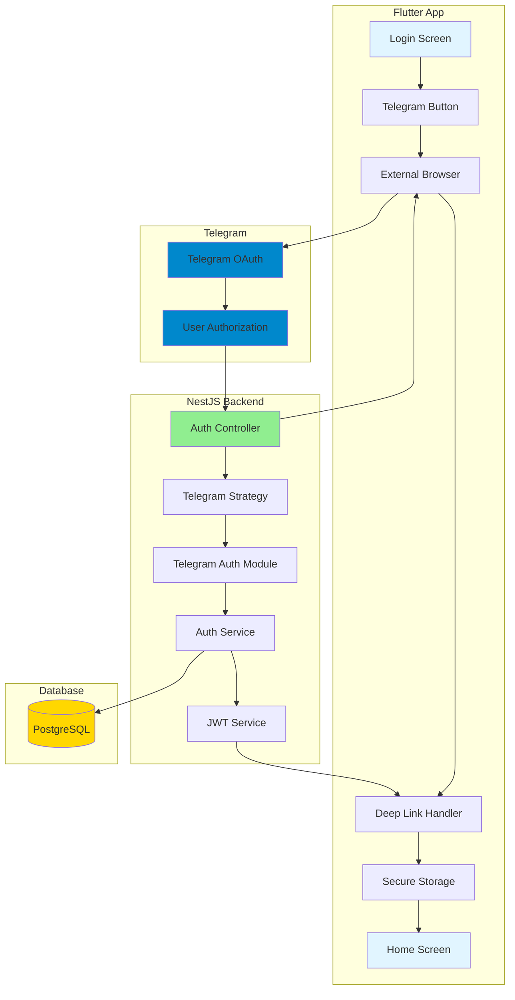
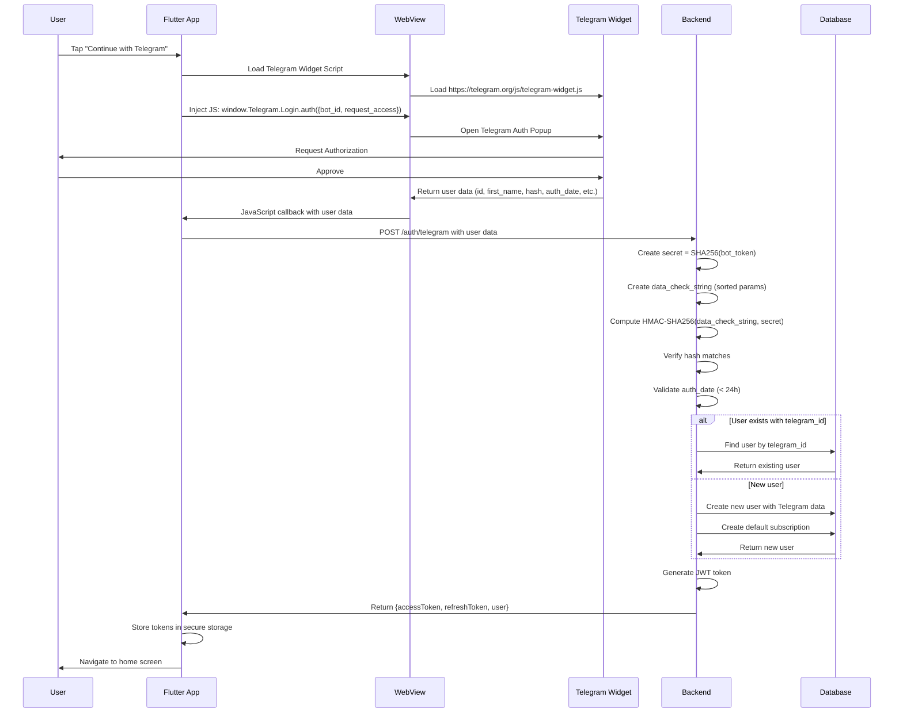

# Design Document: Telegram Authentication

## Overview

This design document specifies the technical implementation for integrating Telegram as an authentication method in the DasTern medication reminder system. The feature enables users to authenticate using their Telegram account through the Telegram Login Widget with HMAC SHA256 hash verification.

The implementation uses the official Telegram Login Widget (window.Telegram.Login.auth) loaded in a Flutter WebView, which provides user authentication data that is verified server-side. The design maintains backward compatibility with existing authentication methods and allows users to link multiple authentication providers to a single account.

### Key Design Principles

- **Security First**: HMAC SHA256 verification using SHA256(bot_token) as secret key, auth_date validation, and HTTPS enforcement
- **Consistency**: Follow existing NestJS auth patterns (DTOs, services, modules)
- **Backward Compatibility**: Existing users and authentication methods remain unaffected
- **Account Linking**: Support multiple authentication methods per user account
- **Mobile-First**: WebView integration for seamless Flutter app experience

## Architecture

### High-Level Architecture



### Authentication Flow Sequence



## Components and Interfaces

### Backend Components

#### 1. Telegram Auth Module (`telegram-auth.module.ts`)

New module that encapsulates Telegram authentication logic.

```typescript
@Module({
  imports: [JwtModule, ConfigModule],
  providers: [TelegramAuthService, TelegramHashVerifier],
  exports: [TelegramAuthService],
})
export class TelegramAuthModule {}
```

**Responsibilities:**
- Provide Telegram authentication services
- Export services for use in Auth module
- Manage Telegram-specific dependencies

#### 2. Telegram Auth Service (`telegram-auth.service.ts`)

Core service handling Telegram authentication logic.

```typescript
interface TelegramAuthData {
  id: number;
  first_name: string;
  last_name?: string;
  username?: string;
  photo_url?: string;
  auth_date: number;
  hash: string;
}

@Injectable()
export class TelegramAuthService {
  constructor(
    private prisma: PrismaService,
    private configService: ConfigService,
    private hashVerifier: TelegramHashVerifier,
  ) {}

  async validateTelegramAuth(data: TelegramAuthData): Promise<User>
  async findOrCreateUser(data: TelegramAuthData): Promise<User>
  async linkTelegramToExistingUser(userId: string, telegramData: TelegramAuthData): Promise<User>
}
```

**Responsibilities:**
- Coordinate authentication flow
- Validate Telegram response data
- Find or create user accounts
- Link Telegram accounts to existing users

#### 3. Telegram Hash Verifier (`telegram-hash-verifier.service.ts`)

Dedicated service for HMAC SHA256 verification.

```typescript
@Injectable()
export class TelegramHashVerifier {
  constructor(private configService: ConfigService) {}

  verifyHash(data: TelegramAuthData): boolean
  validateAuthDate(authDate: number): boolean
  private createDataCheckString(data: Record<string, any>): string
  private computeHash(dataCheckString: string, botToken: string): string
}
```

**Responsibilities:**
- Verify HMAC SHA256 hash
- Validate auth_date timestamp
- Construct data check string
- Compute expected hash
#### 4. Auth Controller Extensions

Add new endpoint to existing `auth.controller.ts`:

```typescript
@Controller('auth')
export class AuthController {
  // ... existing methods ...

  @Post('telegram')
  @Throttle({ default: { limit: 10, ttl: 60000 } })
  async telegramAuth(@Body() dto: TelegramAuthDto) {
    // Verify hash and auth_date
    const isValid = await this.telegramAuthService.verifyTelegramAuth(dto);
    if (!isValid) {
      throw new UnauthorizedException('Invalid Telegram authentication data');
    }
    
    // Find or create user
    const user = await this.authService.findOrCreateTelegramUser(dto);
    
    // Generate JWT tokens
    return this.authService.login(user);
  }
}
```
```

#### 5. Auth Service Extensions

Extend existing `auth.service.ts` with Telegram methods:

```typescript
@Injectable()
export class AuthService {
  // ... existing methods ...

  async telegramLogin(dto: TelegramAuthDto): Promise<AuthResponse>
  async handleTelegramCallback(data: TelegramCallbackDto): Promise<string>
  private async findOrCreateTelegramUser(telegramData: TelegramAuthData): Promise<User>
}
```

### Data Transfer Objects (DTOs)

#### TelegramAuthDto (`telegram-auth.dto.ts`)

```typescript
export class TelegramAuthDto {
  @IsNumber()
  @IsPositive()
  id: number;

  @IsString()
  @IsNotEmpty()
  first_name: string;

  @IsString()
  @IsOptional()
  last_name?: string;

  @IsString()
  @IsOptional()
  username?: string;

  @IsString()
  @IsOptional()
  photo_url?: string;

  @IsNumber()
  @IsPositive()
  auth_date: number;

  @IsString()
  @IsNotEmpty()
  hash: string;
}
```

#### TelegramCallbackDto (`telegram-callback.dto.ts`)

```typescript
export class TelegramCallbackDto extends TelegramAuthDto {
  // Inherits all fields from TelegramAuthDto
  // Used for GET /auth/telegram/callback query parameters
}
```
#### 1. Auth Provider Extensions (`auth_provider.dart`)

Extend existing AuthProvider with Telegram authentication using WebView:

```dart
import 'package:flutter_inappwebview/flutter_inappwebview.dart';

class AuthProvider extends ChangeNotifier {
  // ... existing methods ...

  /// Sign in with Telegram using WebView
  Future<bool> signInWithTelegram(BuildContext context) async {
    _log.info('AuthProvider', 'Telegram Sign-In attempt');
    _setLoading(true);
    _error = null;
    
    try {
      // Show WebView dialog with Telegram Login Widget
      final userData = await showDialog<Map<String, dynamic>>(
        context: context,
        builder: (context) => TelegramLoginDialog(
          botId: dotenv.env['TELEGRAM_BOT_ID']!,
        ),
      );
      
      if (userData == null) {
        throw Exception('Authentication cancelled');
      }
      
      // Send authentication data to backend
      final response = await _api.post('/auth/telegram', body: userData);
      
      // Store tokens
      await _secureStorage.write(
        key: 'accessToken',
        value: response['accessToken'],
      );
      await _secureStorage.write(
        key: 'refreshToken',
        value: response['refreshToken'],
      );
      
      _accessToken = response['accessToken'];
      _user = response['user'];
      _isAuthenticated = true;
      
      _log.success('AuthProvider', 'Telegram authentication successful', {
        'userId': _user?['id'],
        'role': _user?['role'],
      });
      
      notifyListeners();
      return true;
    } catch (e) {
      _error = e.toString().replaceFirst('Exception: ', '');
      _log.error('AuthProvider', 'Telegram Sign-In failed', e);
      notifyListeners();
      return false;
    } finally {
      _setLoading(false);
    }
  }
}
``` return 'https://oauth.telegram.org/auth?bot_id=$botUsername&origin=${callbackUrl}&request_access=write';
  }
}
```

#### 2. Login Screen Widget (`login_screen.dart`)

Add Telegram button to existing login screen:

```dart
class LoginScreen extends StatelessWidget {
  @override
  Widget build(BuildContext context) {
    final authProvider = Provider.of<AuthProvider>(context);
    final l10n = AppLocalizations.of(context)!;
    
    return Scaffold(
      body: Column(
        children: [
          // ... existing email/password fields ...
          
          // Social auth buttons
#### 2. Telegram Login Dialog Widget (`telegram_login_dialog.dart`)

Create a dialog with WebView for Telegram Login Widget:

```dart
import 'package:flutter/material.dart';
import 'package:flutter_inappwebview/flutter_inappwebview.dart';
import 'dart:convert';

class TelegramLoginDialog extends StatefulWidget {
  final String botId;
  
  const TelegramLoginDialog({
    Key? key,
    required this.botId,
  }) : super(key: key);

  @override
  _TelegramLoginDialogState createState() => _TelegramLoginDialogState();
}

class _TelegramLoginDialogState extends State<TelegramLoginDialog> {
  late InAppWebViewController _webViewController;
  bool _isLoading = true;

  @override
  Widget build(BuildContext context) {
    return Dialog(
      child: Container(
        height: 500,
        child: Stack(
          children: [
            InAppWebView(
              initialData: InAppWebViewInitialData(
                data: _getTelegramWidgetHtml(),
              ),
              initialSettings: InAppWebViewSettings(
                javaScriptEnabled: true,
#### 3. Login Screen Widget (`login_screen.dart`)

Add Telegram button to existing login screen:

```dart
class LoginScreen extends StatelessWidget {
  @override
  Widget build(BuildContext context) {
    final authProvider = Provider.of<AuthProvider>(context);
    final l10n = AppLocalizations.of(context)!;
    
    return Scaffold(
      body: Column(
        children: [
          // ... existing email/password fields ...
          
          // Social auth buttons
          ElevatedButton.icon(
            onPressed: () => authProvider.signInWithGoogle(),
            icon: Icon(Icons.g_mobiledata),
            label: Text(l10n.continueWithGoogle),
          ),
          
          ElevatedButton.icon(
            onPressed: () => authProvider.signInWithTelegram(context),
            icon: Icon(Icons.telegram),
            label: Text(l10n.continueWithTelegram),
            style: ElevatedButton.styleFrom(
              backgroundColor: Color(0xFF0088CC), // Telegram blue
            ),
          ),
        ],
      ),
    );
  }
}
```       background-color: #0088cc;
          color: white;
          border: none;
          padding: 12px 24px;
          font-size: 16px;
          border-radius: 8px;
          cursor: pointer;
        }
      </style>
    </head>
    <body>
      <div id="telegram-login-container">
        <h3>Login with Telegram</h3>
        <button onclick="loginWithTelegram()">Continue with Telegram</button>
      </div>
      
      <script>
        function loginWithTelegram() {
          if (window.Telegram && window.Telegram.Login) {
            window.Telegram.Login.auth(
              { 
                bot_id: '${widget.botId}',
                request_access: true 
              },
              function(data) {
                if (data) {
                  // Send data back to Flutter
                  window.flutter_inappwebview.callHandler('telegramAuthCallback', data);
                } else {
                  alert('Authentication failed or was cancelled');
                }
              }
            );
          } else {
            alert('Telegram Login Widget not loaded');
          }
        }
      </script>
    </body>
    </html>
    ''';
  }
}
```/ Listen for deep links when app is already running
  uriLinkStream.listen((Uri? uri) {
    if (uri != null && uri.scheme == 'myapp') {
      _handleDeepLink(uri);
    }
  }, onError: (err) {
    LoggerService.instance.error('DeepLink', 'Error handling deep link', err);
  });
  
  // Handle deep link that launched the app
  getInitialUri().then((Uri? uri) {
    if (uri != null && uri.scheme == 'myapp') {
      _handleDeepLink(uri);
    }
  });
}

void _handleDeepLink(Uri uri) {
  if (uri.path == '/login-success') {
    final token = uri.queryParameters['token'];
    if (token != null) {
      // Get auth provider and handle callback
      final authProvider = Provider.of<AuthProvider>(
        navigatorKey.currentContext!,
        listen: false,
      );
      authProvider.handleTelegramCallback(token);
      
      // Navigate to home screen
      navigatorKey.currentState?.pushReplacementNamed('/home');
    }
  }
}
```

## Data Models

### Database Schema Changes

#### User Entity Extensions

Add Telegram-specific fields to the existing User model in `schema.prisma`:

```prisma
model User {
  id                     String                @id @default(uuid()) @db.Uuid
  role                   UserRole
  
  // ... existing fields ...
  
  googleId               String?               @unique @db.VarChar(255)
  
  // New Telegram fields
  telegramId             String?               @unique @db.VarChar(255)
  telegramUsername       String?               @db.VarChar(255)
  telegramFirstName      String?               @db.VarChar(100)
  telegramLastName       String?               @db.VarChar(100)
  telegramPhotoUrl       String?
  
  // ... rest of existing fields ...
  
  @@index([telegramId])
  @@map("users")
}
```

**Migration Strategy:**
1. Add new nullable columns to User table
2. Create unique index on `telegramId`
3. Existing users will have NULL values for Telegram fields
4. No data migration required (backward compatible)

**Field Specifications:**
- `telegramId`: Unique identifier from Telegram (stored as string for consistency)
- `telegramUsername`: Optional Telegram username (without @ prefix)
- `telegramFirstName`: User's first name from Telegram profile
- `telegramLastName`: User's last name from Telegram profile (optional)
- `telegramPhotoUrl`: URL to user's Telegram profile photo (optional)

### JWT Token Payload

Extend existing JWT payload to include Telegram information:

```typescript
interface JwtPayload {
  sub: string;           // User ID
  phoneNumber?: string;  // Phone number (if available)
  role: UserRole;        // User role
  telegramId?: string;   // Telegram ID (if authenticated via Telegram)
  iat: number;           // Issued at
  exp: number;           // Expiration
}
```

## Security Implementation

### HMAC SHA256 Hash Verification

The Telegram authentication response must be verified using HMAC SHA256 to prevent forgery.

**Verification Algorithm:**

1. **Extract Parameters**: Receive all parameters from Telegram callback
2. **Create Data Check String**: 
   - Remove `hash` parameter
   - Sort remaining parameters alphabetically by key
   - Concatenate as `key=value` pairs separated by newlines
3. **Compute Secret Key**:
   - Use SHA256 hash of bot token as the secret key
4. **Compute HMAC**:
   - Calculate HMAC SHA256 of data check string using secret key
5. **Compare Hashes**:
   - Compare computed hash with provided hash
   - Use constant-time comparison to prevent timing attacks

**Implementation:**

```typescript
@Injectable()
export class TelegramHashVerifier {
  private readonly logger = new Logger(TelegramHashVerifier.name);

  constructor(private configService: ConfigService) {}

  verifyHash(data: TelegramAuthData): boolean {
    const { hash, ...params } = data;
    
    // Create data check string
    const dataCheckString = this.createDataCheckString(params);
    
    // Get bot token
    const botToken = this.configService.get<string>('TELEGRAM_BOT_TOKEN');
    if (!botToken) {
      throw new Error('TELEGRAM_BOT_TOKEN not configured');
    }
    
    // Compute expected hash
    const expectedHash = this.computeHash(dataCheckString, botToken);
    
    // Constant-time comparison
    const isValid = crypto.timingSafeEqual(
      Buffer.from(hash, 'hex'),
      Buffer.from(expectedHash, 'hex'),
    );
    
    if (!isValid) {
      this.logger.warn('Hash verification failed', {
        receivedHash: hash,
        expectedHash,
      });
    }
    
    return isValid;
  }

  validateAuthDate(authDate: number): boolean {
    const now = Math.floor(Date.now() / 1000);
    const age = now - authDate;
    const maxAge = 86400; // 24 hours in seconds
    
    if (age > maxAge) {
      this.logger.warn('Auth date expired', {
        authDate,
        age,
        maxAge,
      });
      return false;
    }
    
    if (age < 0) {
      this.logger.warn('Auth date is in the future', {
        authDate,
        now,
      });
      return false;
    }
    
    return true;
  }

  private createDataCheckString(data: Record<string, any>): string {
    return Object.keys(data)
      .sort()
      .map(key => `${key}=${data[key]}`)
      .join('\n');
  }

  private computeHash(dataCheckString: string, botToken: string): string {
    // Create secret key from bot token
    const secretKey = crypto
      .createHash('sha256')
      .update(botToken)
      .digest();
    
    // Compute HMAC
    return crypto
      .createHmac('sha256', secretKey)
      .update(dataCheckString)
      .digest('hex');
  }
}
```

### Auth Date Validation

Prevent replay attacks by validating the `auth_date` timestamp:

- **Maximum Age**: 24 hours (86400 seconds)
- **Future Check**: Reject timestamps in the future
- **Logging**: Log all rejected attempts for security monitoring

### Parameter Validation

Validate all incoming parameters using class-validator decorators:

```typescript
export class TelegramAuthDto {
  @IsNumber()
  @IsPositive()
  @Min(1)
  id: number;

  @IsString()
  @IsNotEmpty()
  @MaxLength(100)
  first_name: string;

  @IsString()
  @IsOptional()
  @MaxLength(100)
  last_name?: string;

  @IsString()
  @IsOptional()
  @MaxLength(255)
  @Matches(/^[a-zA-Z0-9_]{5,32}$/)
  username?: string;

  @IsString()
  @IsOptional()
  @IsUrl()
  photo_url?: string;

  @IsNumber()
  @IsPositive()
  @Min(1000000000) // Reasonable Unix timestamp minimum
  auth_date: number;

  @IsString()
  @IsNotEmpty()
  @Length(64, 64) // SHA256 hex string is always 64 characters
  @Matches(/^[a-f0-9]{64}$/)
  hash: string;
}
```

### Rate Limiting

Apply rate limiting to prevent abuse:

- **POST /auth/telegram**: 5 requests per minute
- **GET /auth/telegram/callback**: 10 requests per minute

### HTTPS Enforcement

- **Production**: Enforce HTTPS for all authentication endpoints
- **Development**: Allow HTTP for local testing
- **Configuration**: Use environment-based middleware

```typescript
@Injectable()
export class HttpsEnforcementMiddleware implements NestMiddleware {
  use(req: Request, res: Response, next: NextFunction) {
    if (process.env.NODE_ENV === 'production' && !req.secure) {
      return res.redirect(301, `https://${req.headers.host}${req.url}`);
    }
    next();
  }
}
```

## Error Handling

### Backend Error Responses

Standardized error responses for all Telegram authentication failures:

```typescript
// Hash verification failure
{
  statusCode: 401,
  message: 'Invalid authentication data',
  error: 'Unauthorized'
}

// Auth date expired
{
  statusCode: 401,
  message: 'Authentication data has expired',
  error: 'Unauthorized'
}

// Missing required parameters
{
  statusCode: 400,
  message: 'Missing required parameters: id, first_name, auth_date, hash',
  error: 'Bad Request'
}

// Invalid parameter format
{
  statusCode: 400,
  message: 'Invalid parameter format: id must be a positive integer',
  error: 'Bad Request'
}

// User creation failure
{
  statusCode: 500,
  message: 'Failed to create user account',
  error: 'Internal Server Error'
}

// Telegram service unavailable
{
  statusCode: 503,
  message: 'Authentication service temporarily unavailable',
  error: 'Service Unavailable'
}
```

### Frontend Error Handling

Flutter app error handling strategy:

```dart
Future<bool> signInWithTelegram() async {
  try {
    // ... authentication logic ...
  } on ApiException catch (e) {
    // Handle API errors
    switch (e.statusCode) {
      case 401:
        _error = l10n.authenticationFailed;
        break;
      case 400:
        _error = l10n.invalidRequest;
        break;
      case 503:
        _error = l10n.serviceUnavailable;
        break;
      default:
        _error = l10n.unexpectedError;
    }
    _showErrorDialog();
    return false;
  } catch (e) {
    // Handle unexpected errors
    _error = l10n.unexpectedError;
    _showErrorDialog();
    return false;
  }
}

void _showErrorDialog() {
  showDialog(
    context: context,
    builder: (context) => AlertDialog(
      title: Text(l10n.authenticationError),
      content: Text(_error ?? l10n.unexpectedError),
      actions: [
        TextButton(
          onPressed: () => Navigator.pop(context),
          child: Text(l10n.ok),
        ),
        TextButton(
          onPressed: () {
            Navigator.pop(context);
            signInWithTelegram(); // Retry
          },
          child: Text(l10n.tryAgain),
        ),
      ],
    ),
  );
}
```

### Error Logging

Comprehensive error logging for debugging and security monitoring:

```typescript
@Injectable()
export class TelegramAuthService {
  private readonly logger = new Logger(TelegramAuthService.name);

  async validateTelegramAuth(data: TelegramAuthData): Promise<User> {
    try {
      // Verify hash
      if (!this.hashVerifier.verifyHash(data)) {
        this.logger.warn('Hash verification failed', {
          telegramId: data.id,
          authDate: data.auth_date,
        });
        throw new UnauthorizedException('Invalid authentication data');
      }

      // Validate auth_date
      if (!this.hashVerifier.validateAuthDate(data.auth_date)) {
        this.logger.warn('Auth date validation failed', {
          telegramId: data.id,
          authDate: data.auth_date,
          age: Math.floor(Date.now() / 1000) - data.auth_date,
        });
        throw new UnauthorizedException('Authentication data has expired');
      }

      // ... rest of authentication logic ...
      
    } catch (error) {
      this.logger.error('Telegram authentication failed', {
        error: error.message,
        stack: error.stack,
        telegramId: data.id,
      });
      throw error;
    }
  }
}
```

### Fallback Mechanisms

- **Browser Launch Failure**: Show error message with manual URL option
- **Deep Link Failure**: Provide manual token entry option
- **Token Storage Failure**: Retry with exponential backoff
- **Network Failure**: Queue authentication for retry when online

## Integration with Existing Authentication

### Account Linking Strategy

Support multiple authentication methods per user account:

1. **Primary Identifier**: Email address (if available)
2. **Telegram-Only Users**: Create account with Telegram data only
3. **Existing Users**: Link Telegram to existing account by email match
4. **Multiple Methods**: Allow Google + Telegram + Email/Password on same account

**Account Linking Logic:**

```typescript
async findOrCreateTelegramUser(data: TelegramAuthData): Promise<User> {
  // 1. Try to find by telegram_id
  let user = await this.prisma.user.findUnique({
    where: { telegramId: data.id.toString() },
  });

  if (user) {
    // Update Telegram profile data if changed
    return this.updateTelegramProfile(user.id, data);
  }

  // 2. Try to find by email (if Telegram provides it)
  if (data.email) {
    user = await this.prisma.user.findUnique({
      where: { email: data.email },
    });

    if (user) {
      // Link Telegram to existing account
      return this.linkTelegramToUser(user.id, data);
    }
  }

  // 3. Create new user
  return this.createTelegramUser(data);
}

private async createTelegramUser(data: TelegramAuthData): Promise<User> {
  const user = await this.prisma.user.create({
    data: {
      telegramId: data.id.toString(),
      telegramUsername: data.username,
      telegramFirstName: data.first_name,
      telegramLastName: data.last_name,
      telegramPhotoUrl: data.photo_url,
      firstName: data.first_name,
      lastName: data.last_name,
      fullName: `${data.first_name} ${data.last_name || ''}`.trim(),
      // Generate random password for security compliance
      passwordHash: await bcrypt.hash(
        Math.random().toString(36),
        this.BCRYPT_ROUNDS,
      ),
      role: 'PATIENT',
      accountStatus: 'ACTIVE',
    },
  });

  // Create default subscription with 1-month Premium trial
  const trialEndDate = new Date();
  trialEndDate.setMonth(trialEndDate.getMonth() + 1);

  await this.prisma.subscription.create({
    data: {
      userId: user.id,
      tier: 'PREMIUM',
      storageQuota: 21474836480, // 20GB
      storageUsed: 0,
      hasUsedTrial: true,
      expiresAt: trialEndDate,
    },
  });

  return user;
}
```

### JWT Token Consistency

Maintain consistent JWT token structure across all authentication methods:

```typescript
async login(user: any) {
  const payload = {
    sub: user.id,
    phoneNumber: user.phoneNumber,
    role: user.role,
    // Include Telegram ID if available
    ...(user.telegramId && { telegramId: user.telegramId }),
  };
  
  const accessToken = this.jwtService.sign(payload);
  const refreshToken = this.jwtService.sign(payload, {
    secret: this.configService.get('JWT_REFRESH_SECRET'),
    expiresIn: this.configService.get('JWT_REFRESH_EXPIRES_IN') || '7d',
  });

  return {
    accessToken,
    refreshToken,
    user,
  };
}
```

### Existing Endpoint Compatibility

All existing authentication endpoints remain unchanged:

- `POST /auth/login` - Email/password login
- `POST /auth/google` - Google OAuth (mobile)
- `GET /auth/google/callback` - Google OAuth (web)
- `POST /auth/register/patient` - Patient registration
- `POST /auth/register/doctor` - Doctor registration
- `POST /auth/otp/send` - Send OTP
- `POST /auth/otp/verify` - Verify OTP
- `POST /auth/refresh` - Refresh token
- `GET /auth/me` - Get current user profile

New Telegram endpoints are additive only.


## Correctness Properties

A property is a characteristic or behavior that should hold true across all valid executions of a system—essentially, a formal statement about what the system should do. Properties serve as the bridge between human-readable specifications and machine-verifiable correctness guarantees.

### Property Reflection

After analyzing all acceptance criteria, I identified several areas where properties can be consolidated to eliminate redundancy:

**Consolidation Decisions:**

1. **Hash Verification Properties (3.1, 3.2, 3.3, 3.4)**: These can be combined into a single comprehensive property about hash verification round-trip behavior
2. **User Creation Properties (5.4, 5.5, 5.6, 5.7)**: These can be combined into a single property about new user initialization
3. **Error Message Properties (9.1, 9.2)**: These are specific enough to remain separate as they test different error conditions
4. **Parameter Validation Properties (8.1, 8.2, 8.3, 8.4, 8.5)**: These can be combined into a single comprehensive validation property
5. **JWT Properties (7.1, 7.2, 7.7)**: These can be combined into a single property about JWT generation consistency
6. **Logging Properties (3.5, 4.5, 9.7)**: These can be combined into a single property about comprehensive error logging

### Property 1: OAuth URL Construction

For any bot credentials and callback URL, the constructed Telegram OAuth URL should contain the bot username and properly encoded callback URL in the correct format.

**Validates: Requirements 1.3**

### Property 2: Parameter Extraction Completeness

For any valid Telegram callback request containing authentication parameters, all parameters (id, first_name, last_name, username, photo_url, auth_date, hash) should be extracted and available for processing.

**Validates: Requirements 2.3**

### Property 3: Hash Verification Round-Trip

For any valid Telegram authentication data with correct bot token, computing the HMAC SHA256 hash from the data check string (parameters sorted alphabetically, excluding hash) and comparing it with the provided hash should correctly identify valid and invalid authentication attempts.

**Validates: Requirements 3.1, 3.2, 3.3, 3.4**

### Property 4: Auth Date Expiration Validation

For any auth_date timestamp, if the time difference between current server time and auth_date exceeds 86400 seconds (24 hours) or is negative (future timestamp), the authentication request should be rejected with a 401 Unauthorized error.

**Validates: Requirements 4.2, 4.3**

### Property 5: User Lookup and Authentication

For any valid Telegram authentication data with a telegram_id that exists in the database, the system should authenticate the existing user rather than creating a new account.

**Validates: Requirements 5.1, 5.2**

### Property 6: New User Initialization

For any valid Telegram authentication data without an existing user, a new user should be created with accountStatus set to ACTIVE, role set to PATIENT, a generated password hash, and a default Premium trial subscription with 1-month expiration.

**Validates: Requirements 5.3, 5.4, 5.5, 5.6, 5.7**

### Property 7: Account Linking by Email

For any existing user with a matching email but no telegram_id, when Telegram authentication is received with that email, the user record should be updated with Telegram profile data without creating a duplicate account.

**Validates: Requirements 5.8**

### Property 8: Telegram ID Uniqueness

For any two users in the database, they cannot have the same non-null telegram_id value, ensuring each Telegram account can only be linked to one user account.

**Validates: Requirements 6.7**

### Property 9: Backward Compatibility

For any existing user record created before Telegram authentication was implemented, all Telegram fields (telegram_id, telegram_username, telegram_first_name, telegram_last_name, telegram_photo_url) should be null and the user should be able to authenticate using their existing authentication method.

**Validates: Requirements 6.6, 10.1**

### Property 10: JWT Token Generation Consistency

For any successful authentication (Telegram, Google, or email/password), the generated JWT token should include user ID, role, and use the same expiration settings, ensuring consistent token structure across all authentication methods.

**Validates: Requirements 7.1, 7.2, 7.7, 10.7**

### Property 11: Deep Link URL Format

For any JWT token generated after successful Telegram authentication, the constructed deep link URL should follow the format `myapp://login-success?token={JWT_Token}` and trigger a 302 HTTP redirect.

**Validates: Requirements 7.3, 7.4**

### Property 12: Token Extraction and Storage

For any deep link received by the Flutter app with a token parameter, the token should be extracted, validated as non-empty, and stored in secure storage (flutter_secure_storage).

**Validates: Requirements 7.5, 11.2, 11.3, 11.4**

### Property 13: Token Validation Before Navigation

For any JWT token received via deep link, the token should be verified as valid before navigating to the home screen; if invalid or missing, an error message should be displayed and the user should remain on the login screen.

**Validates: Requirements 11.5, 11.6**

### Property 14: Comprehensive Parameter Validation

For any Telegram authentication request, all required parameters (id, first_name, auth_date, hash) should be validated for presence, type correctness (id as positive integer, auth_date as valid Unix timestamp), and format; requests with missing or invalid parameters should be rejected with a 400 Bad Request error.

**Validates: Requirements 8.1, 8.2, 8.3, 8.4, 8.5**

### Property 15: Input Sanitization

For any string parameter received in Telegram authentication data (first_name, last_name, username), the value should be sanitized to prevent injection attacks before being stored in the database.

**Validates: Requirements 8.6**

### Property 16: Hash Verification Error Message

For any Telegram authentication request where the computed HMAC SHA256 hash does not match the provided hash, the system should return a 401 Unauthorized error with the message "Invalid authentication data".

**Validates: Requirements 9.1**

### Property 17: Auth Date Expiration Error Message

For any Telegram authentication request where the auth_date is older than 24 hours, the system should return a 401 Unauthorized error with the message "Authentication data has expired".

**Validates: Requirements 4.4, 9.2**

### Property 18: Comprehensive Error Logging

For any authentication error (hash verification failure, expired auth_date, missing parameters, user creation failure), the system should create a log entry with sufficient detail including error type, telegram_id, auth_date, and error message for security monitoring and debugging.

**Validates: Requirements 3.5, 4.5, 9.7**

### Property 19: Error Dialog Display

For any authentication error in the Flutter app, an error dialog should be displayed to the user with a user-friendly error message and a "Try Again" button for retry.

**Validates: Requirements 9.5, 9.6**

### Property 20: Multiple Authentication Methods

For any user account, multiple authentication methods (Google, Telegram, email/password) should be linkable to the same account without creating duplicate user records, identified by matching email addresses.

**Validates: Requirements 10.5, 10.6**

## Testing Strategy

### Dual Testing Approach

This feature requires both unit tests and property-based tests to ensure comprehensive coverage:

**Unit Tests** focus on:
- Specific examples of OAuth URL construction
- Rate limiting behavior (5 requests for /auth/telegram, 10 for /auth/telegram/callback)
- Database schema validation (Telegram fields exist with correct types)
- Deep link registration in app manifest
- HTTPS enforcement in production environment
- Specific error scenarios (Telegram API unavailable, user creation failure)
- Backward compatibility with existing auth methods (Google, email/password, OTP)

**Property-Based Tests** focus on:
- Universal properties that hold for all inputs
- Hash verification with randomly generated authentication data
- Auth date validation with various timestamps
- Parameter validation with random valid and invalid inputs
- User creation and account linking with random user data
- JWT token generation consistency across auth methods
- Deep link parsing with random token values

### Property-Based Testing Configuration

**Testing Library**: Use `fast-check` for TypeScript/NestJS backend and `test` package with custom generators for Flutter/Dart frontend.

**Test Configuration**:
- Minimum 100 iterations per property test
- Each test tagged with feature name and property number
- Tag format: `Feature: telegram-authentication, Property {number}: {property_text}`

**Example Property Test (Backend)**:

```typescript
import * as fc from 'fast-check';

describe('Feature: telegram-authentication, Property 3: Hash Verification Round-Trip', () => {
  it('should correctly verify valid and invalid HMAC SHA256 hashes', () => {
    fc.assert(
      fc.property(
        fc.record({
          id: fc.integer({ min: 1, max: 9999999
## Correctness Properties

A property is a characteristic or behavior that should hold true across all valid executions of a system—essentially, a formal statement about what the system should do. Properties serve as the bridge between human-readable specifications and machine-verifiable correctness guarantees.

### Property Reflection

After analyzing all acceptance criteria, I identified several areas where properties can be consolidated to eliminate redundancy:

**Consolidation Decisions:**

1. **Hash Verification Properties (3.1, 3.2, 3.3, 3.4)**: Combined into a single comprehensive property about hash verification
2. **User Creation Properties (5.4, 5.5, 5.6, 5.7)**: Combined into a single property about new user initialization
3. **Parameter Validation Properties (8.1, 8.2, 8.3, 8.4, 8.5)**: Combined into comprehensive validation property
4. **JWT Properties (7.1, 7.2, 7.7)**: Combined into JWT generation consistency property
5. **Logging Properties (3.5, 4.5, 9.7)**: Combined into comprehensive error logging property

### Property 1: OAuth URL Construction

For any bot credentials and callback URL, the constructed Telegram OAuth URL should contain the bot username and properly encoded callback URL in the correct format.

**Validates: Requirements 1.3**

### Property 2: Parameter Extraction Completeness

For any valid Telegram callback request containing authentication parameters, all parameters should be extracted and available for processing.

**Validates: Requirements 2.3**

### Property 3: Hash Verification Round-Trip

For any valid Telegram authentication data with correct bot token, computing the HMAC SHA256 hash from the data check string (parameters sorted alphabetically, excluding hash) and comparing it with the provided hash should correctly identify valid and invalid authentication attempts.

**Validates: Requirements 3.1, 3.2, 3.3, 3.4**

### Property 4: Auth Date Expiration Validation

For any auth_date timestamp, if the time difference between current server time and auth_date exceeds 86400 seconds or is negative, the authentication request should be rejected with a 401 Unauthorized error.

**Validates: Requirements 4.2, 4.3**

### Property 5: User Lookup and Authentication

For any valid Telegram authentication data with a telegram_id that exists in the database, the system should authenticate the existing user rather than creating a new account.

**Validates: Requirements 5.1, 5.2**

### Property 6: New User Initialization

For any valid Telegram authentication data without an existing user, a new user should be created with accountStatus ACTIVE, role PATIENT, a generated password hash, and a default Premium trial subscription.

**Validates: Requirements 5.3, 5.4, 5.5, 5.6, 5.7**

### Property 7: Account Linking by Email

For any existing user with a matching email but no telegram_id, when Telegram authentication is received with that email, the user record should be updated with Telegram profile data without creating a duplicate account.

**Validates: Requirements 5.8**

### Property 8: Telegram ID Uniqueness

For any two users in the database, they cannot have the same non-null telegram_id value.

**Validates: Requirements 6.7**

### Property 9: Backward Compatibility

For any existing user record created before Telegram authentication, all Telegram fields should be null and the user should authenticate using their existing method.

**Validates: Requirements 6.6, 10.1**

### Property 10: JWT Token Generation Consistency

For any successful authentication method, the generated JWT token should include user ID, role, and use the same expiration settings.

**Validates: Requirements 7.1, 7.2, 7.7, 10.7**

### Property 11: Deep Link URL Format

For any JWT token generated after successful Telegram authentication, the constructed deep link URL should follow the format myapp://login-success?token={JWT_Token}.

**Validates: Requirements 7.3, 7.4**

### Property 12: Token Extraction and Storage

For any deep link received with a token parameter, the token should be extracted, validated as non-empty, and stored in secure storage.

**Validates: Requirements 7.5, 11.2, 11.3, 11.4**

### Property 13: Token Validation Before Navigation

For any JWT token received via deep link, the token should be verified as valid before navigating to home screen; if invalid, an error should be displayed.

**Validates: Requirements 11.5, 11.6**

### Property 14: Comprehensive Parameter Validation

For any Telegram authentication request, all required parameters should be validated for presence, type correctness, and format; invalid requests should be rejected with 400 Bad Request.

**Validates: Requirements 8.1, 8.2, 8.3, 8.4, 8.5**

### Property 15: Input Sanitization

For any string parameter received in Telegram authentication data, the value should be sanitized to prevent injection attacks.

**Validates: Requirements 8.6**

### Property 16: Hash Verification Error Message

For any authentication request where the computed hash does not match the provided hash, the system should return 401 with message "Invalid authentication data".

**Validates: Requirements 9.1**

### Property 17: Auth Date Expiration Error Message

For any authentication request where auth_date is older than 24 hours, the system should return 401 with message "Authentication data has expired".

**Validates: Requirements 4.4, 9.2**

### Property 18: Comprehensive Error Logging

For any authentication error, the system should create a log entry with sufficient detail including error type, telegram_id, auth_date, and error message.

**Validates: Requirements 3.5, 4.5, 9.7**

### Property 19: Error Dialog Display

For any authentication error in the Flutter app, an error dialog should be displayed with a user-friendly message and a "Try Again" button.

**Validates: Requirements 9.5, 9.6**

### Property 20: Multiple Authentication Methods

For any user account, multiple authentication methods should be linkable to the same account without creating duplicates, identified by matching email.

**Validates: Requirements 10.5, 10.6**


## Testing Strategy

### Dual Testing Approach

This feature requires both unit tests and property-based tests to ensure comprehensive coverage:

**Unit Tests** focus on:
- Specific examples of OAuth URL construction
- Rate limiting behavior (5 requests for /auth/telegram, 10 for /auth/telegram/callback)
- Database schema validation (Telegram fields exist with correct types)
- Deep link registration in app manifest
- HTTPS enforcement in production environment
- Specific error scenarios (Telegram API unavailable, user creation failure)
- Backward compatibility with existing auth methods (Google, email/password, OTP)
- Localization support (English and Khmer button text)
- UI widget rendering (Telegram button on login screen)

**Property-Based Tests** focus on:
- Universal properties that hold for all inputs
- Hash verification with randomly generated authentication data
- Auth date validation with various timestamps
- Parameter validation with random valid and invalid inputs
- User creation and account linking with random user data
- JWT token generation consistency across auth methods
- Deep link parsing with random token values
- Input sanitization with various malicious inputs

### Property-Based Testing Configuration

**Testing Libraries**:
- Backend (NestJS): `fast-check` for TypeScript property-based testing
- Frontend (Flutter): `test` package with custom generators for Dart

**Test Configuration**:
- Minimum 100 iterations per property test
- Each test tagged with feature name and property number
- Tag format: `Feature: telegram-authentication, Property {number}: {property_text}`

**Example Property Test Structure (Backend)**:

```typescript
import * as fc from 'fast-check';

describe('Feature: telegram-authentication, Property 3: Hash Verification Round-Trip', () => {
  it('should correctly verify valid and invalid HMAC SHA256 hashes', () => {
    fc.assert(
      fc.property(
        fc.record({
          id: fc.integer({ min: 1, max: 999999999 }),
          first_name: fc.string({ minLength: 1, maxLength: 100 }),
          last_name: fc.option(fc.string({ maxLength: 100 })),
          username: fc.option(fc.string({ minLength: 5, maxLength: 32 })),
          auth_date: fc.integer({ min: 1600000000, max: 2000000000 }),
        }),
        (telegramData) => {
          const verifier = new TelegramHashVerifier(configService);
          
          // Compute valid hash
          const validHash = verifier.computeHash(telegramData, botToken);
          const dataWithValidHash = { ...telegramData, hash: validHash };
          
          // Valid hash should pass verification
          expect(verifier.verifyHash(dataWithValidHash)).toBe(true);
          
          // Invalid hash should fail verification
          const invalidHash = 'a'.repeat(64);
          const dataWithInvalidHash = { ...telegramData, hash: invalidHash };
          expect(verifier.verifyHash(dataWithInvalidHash)).toBe(false);
        }
      ),
      { numRuns: 100 }
    );
  });
});
```

**Example Property Test Structure (Frontend)**:

```dart
import 'package:test/test.dart';

void main() {
  group('Feature: telegram-authentication, Property 12: Token Extraction and Storage', () {
    test('should extract and store token from any valid deep link', () {
      final random = Random();
      
      for (int i = 0; i < 100; i++) {
        // Generate random JWT-like token
        final token = _generateRandomToken(random);
        final deepLink = Uri.parse('myapp://login-success?token=$token');
        
        // Extract token
        final extractedToken = deepLink.queryParameters['token'];
        
        // Verify extraction
        expect(extractedToken, equals(token));
        expect(extractedToken, isNotEmpty);
        
        // Verify storage (mock secure storage)
        final storage = MockSecureStorage();
        storage.write(key: 'accessToken', value: extractedToken);
        
        final storedToken = storage.read(key: 'accessToken');
        expect(storedToken, equals(token));
      }
    });
  });
}
```

### Unit Test Coverage Requirements

**Backend Unit Tests**:

1. **Telegram Hash Verifier**:
   - Valid hash verification passes
   - Invalid hash verification fails
   - Data check string construction (alphabetical order, excluding hash)
   - Auth date validation (current, expired, future timestamps)
   - Edge cases: empty strings, special characters, very long strings

2. **Telegram Auth Service**:
   - User lookup by telegram_id
   - User creation with Telegram data
   - Account linking by email
   - Subscription creation for new users
   - Error handling for database failures

3. **Auth Controller**:
   - POST /auth/telegram endpoint exists and responds
   - GET /auth/telegram/callback endpoint exists and responds
   - Rate limiting enforcement (5 and 10 requests per minute)
   - Parameter extraction from query string
   - Deep link redirect with JWT token

4. **Integration Tests**:
   - Complete authentication flow from callback to JWT generation
   - Account linking scenarios (existing Google user + Telegram)
   - Backward compatibility with existing auth methods
   - Error scenarios (invalid hash, expired auth_date, missing parameters)

**Frontend Unit Tests**:

1. **Auth Provider**:
   - signInWithTelegram() constructs correct OAuth URL
   - handleTelegramCallback() extracts and stores token
   - Error handling for invalid tokens
   - Deep link parsing logic

2. **Login Screen Widget**:
   - Telegram button renders correctly
   - Button tap triggers signInWithTelegram()
   - Localization support (English and Khmer)
   - Button styling (Telegram blue color)

3. **Deep Link Handler**:
   - Deep link registration in app manifest
   - URI parsing and token extraction
   - Navigation to home screen after successful auth
   - Error handling for malformed deep links

4. **Widget Tests**:
   - Login screen renders Telegram button
   - Error dialog displays correctly
   - "Try Again" button functionality

### Integration Testing

**End-to-End Test Scenarios**:

1. **New User Registration via Telegram**:
   - User taps "Continue with Telegram"
   - Browser opens with Telegram OAuth
   - User authorizes in Telegram
   - Callback received with valid data
   - New user created with Premium trial
   - JWT token generated and stored
   - User navigated to home screen

2. **Existing User Login via Telegram**:
   - User with existing Telegram account logs in
   - System finds user by telegram_id
   - JWT token generated
   - User navigated to home screen

3. **Account Linking**:
   - User with Google account uses Telegram auth
   - System links Telegram to existing account by email
   - No duplicate user created
   - JWT token includes both Google and Telegram IDs

4. **Error Scenarios**:
   - Invalid hash rejected with 401
   - Expired auth_date rejected with 401
   - Missing parameters rejected with 400
   - Rate limiting enforced
   - Error dialogs displayed in Flutter app

### Security Testing

**Security Test Cases**:

1. **Hash Verification**:
   - Tampered authentication data rejected
   - Modified hash values rejected
   - Replay attacks prevented by auth_date validation

2. **Input Validation**:
   - SQL injection attempts sanitized
   - XSS attempts sanitized
   - Invalid parameter types rejected
   - Oversized inputs rejected

3. **Rate Limiting**:
   - Excessive requests blocked
   - Rate limits reset after time window

4. **HTTPS Enforcement**:
   - Production endpoints require HTTPS
   - HTTP requests redirected to HTTPS

### Performance Testing

**Performance Benchmarks**:

1. **Hash Verification**: < 10ms per verification
2. **User Lookup**: < 50ms database query
3. **JWT Generation**: < 20ms per token
4. **Complete Auth Flow**: < 500ms end-to-end

### Test Data Management

**Test Data Strategy**:

1. **Property-Based Tests**: Use generators for random valid and invalid data
2. **Unit Tests**: Use fixtures for specific test cases
3. **Integration Tests**: Use test database with seed data
4. **E2E Tests**: Use staging environment with test Telegram bot

**Test Telegram Bot Configuration**:
- Separate bot for testing (different bot token)
- Test bot username: `dastern_test_bot`
- Test callback URL: `http://localhost:3000/auth/telegram/callback`

