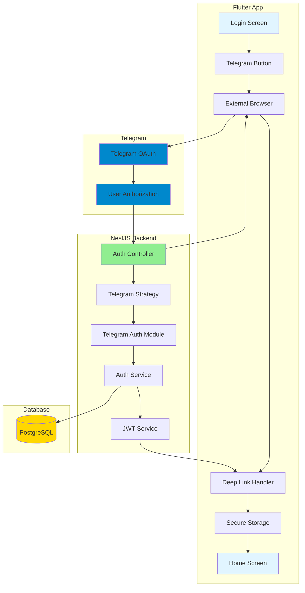
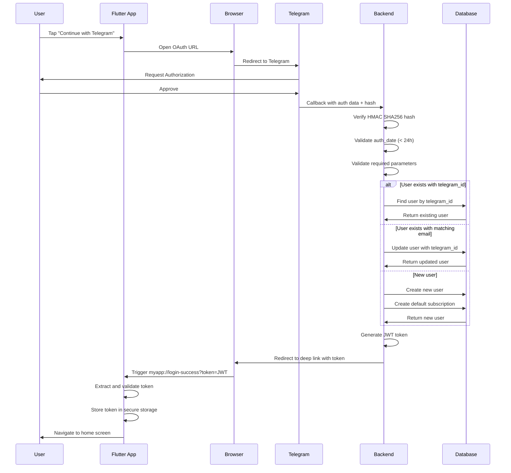

# Design Document: Telegram Authentication

## Overview

This design document specifies the technical implementation for integrating Telegram as an authentication method in the DasTern medication reminder system. The feature enables users to authenticate using their Telegram account through OAuth 2.0 flow with Telegram-specific HMAC SHA256 hash verification.

### Implementation Alignment Note (Current)

Current code implements **Telegram Login 2.0 (OIDC Authorization Code + PKCE)**:

- Flutter opens `https://oauth.telegram.org/auth` with PKCE
- Telegram redirects to app deep link `dastern://auth/telegram/callback`
- Flutter sends `code`, `codeVerifier`, `redirectUri` to backend `POST /auth/telegram`
- Backend exchanges code for `id_token` at `https://oauth.telegram.org/token`
- Backend validates JWT signature using Telegram JWKS and verifies claims (`iss`, `aud`, `exp`)

Legacy widget hash verification flow is considered deprecated for this implementation.

The implementation follows the existing authentication patterns established for Google OAuth and email/password authentication, ensuring consistency across the codebase. The design maintains backward compatibility with existing authentication methods and allows users to link multiple authentication providers to a single account.

### Key Design Principles

- **Security First**: HMAC SHA256 verification, auth_date validation, and HTTPS enforcement
- **Consistency**: Follow existing NestJS auth patterns (strategies, DTOs, services)
- **Backward Compatibility**: Existing users and authentication methods remain unaffected
- **Account Linking**: Support multiple authentication methods per user account
- **Mobile-First**: Deep link handling for seamless Flutter app integration

## Architecture

### High-Level Architecture



### Authentication Flow Sequence



## Components and Interfaces

### Backend Components

#### 1. Telegram Auth Module (`telegram-auth.module.ts`)

New module that encapsulates Telegram authentication logic.

```typescript
@Module({
  imports: [JwtModule, ConfigModule],
  providers: [TelegramAuthService, TelegramHashVerifier],
  exports: [TelegramAuthService],
})
export class TelegramAuthModule {}
```

**Responsibilities:**
- Provide Telegram authentication services
- Export services for use in Auth module
- Manage Telegram-specific dependencies

#### 2. Telegram Auth Service (`telegram-auth.service.ts`)

Core service handling Telegram authentication logic.

```typescript
interface TelegramAuthData {
  id: number;
  first_name: string;
  last_name?: string;
  username?: string;
  photo_url?: string;
  auth_date: number;
  hash: string;
}

@Injectable()
export class TelegramAuthService {
  constructor(
    private prisma: PrismaService,
    private configService: ConfigService,
    private hashVerifier: TelegramHashVerifier,
  ) {}

  async validateTelegramAuth(data: TelegramAuthData): Promise<User>
  async findOrCreateUser(data: TelegramAuthData): Promise<User>
  async linkTelegramToExistingUser(userId: string, telegramData: TelegramAuthData): Promise<User>
}
```

**Responsibilities:**
- Coordinate authentication flow
- Validate Telegram response data
- Find or create user accounts
- Link Telegram accounts to existing users

#### 3. Telegram Hash Verifier (`telegram-hash-verifier.service.ts`)

Dedicated service for HMAC SHA256 verification.

```typescript
@Injectable()
export class TelegramHashVerifier {
  constructor(private configService: ConfigService) {}

  verifyHash(data: TelegramAuthData): boolean
  validateAuthDate(authDate: number): boolean
  private createDataCheckString(data: Record<string, any>): string
  private computeHash(dataCheckString: string, botToken: string): string
}
```

**Responsibilities:**
- Verify HMAC SHA256 hash
- Validate auth_date timestamp
- Construct data check string
- Compute expected hash

#### 4. Auth Controller Extensions

Add new endpoints to existing `auth.controller.ts`:

```typescript
@Controller('auth')
export class AuthController {
  // ... existing methods ...

  @Post('telegram')
  @Throttle({ default: { limit: 5, ttl: 60000 } })
  async telegramAuth(@Body() dto: TelegramAuthDto) {
    return this.authService.telegramLogin(dto);
  }

  @Get('telegram/callback')
  @Throttle({ default: { limit: 10, ttl: 60000 } })
  async telegramCallback(@Query() query: TelegramCallbackDto, @Res() res: Response) {
    const token = await this.authService.handleTelegramCallback(query);
    const deepLink = `myapp://login-success?token=${token}`;
    return res.redirect(302, deepLink);
  }
}
```

#### 5. Auth Service Extensions

Extend existing `auth.service.ts` with Telegram methods:

```typescript
@Injectable()
export class AuthService {
  // ... existing methods ...

  async telegramLogin(dto: TelegramAuthDto): Promise<AuthResponse>
  async handleTelegramCallback(data: TelegramCallbackDto): Promise<string>
  private async findOrCreateTelegramUser(telegramData: TelegramAuthData): Promise<User>
}
```

### Data Transfer Objects (DTOs)

#### TelegramAuthDto (`telegram-auth.dto.ts`)

```typescript
export class TelegramAuthDto {
  @IsNumber()
  @IsPositive()
  id: number;

  @IsString()
  @IsNotEmpty()
  first_name: string;

  @IsString()
  @IsOptional()
  last_name?: string;

  @IsString()
  @IsOptional()
  username?: string;

  @IsString()
  @IsOptional()
  photo_url?: string;

  @IsNumber()
  @IsPositive()
  auth_date: number;

  @IsString()
  @IsNotEmpty()
  hash: string;
}
```

#### TelegramCallbackDto (`telegram-callback.dto.ts`)

```typescript
export class TelegramCallbackDto extends TelegramAuthDto {
  // Inherits all fields from TelegramAuthDto
  // Used for GET /auth/telegram/callback query parameters
}
```

### Frontend Components

#### 1. Auth Provider Extensions (`auth_provider.dart`)

Extend existing AuthProvider with Telegram authentication:

```dart
class AuthProvider extends ChangeNotifier {
  // ... existing methods ...

  /// Sign in with Telegram OAuth
  Future<bool> signInWithTelegram() async {
    _log.info('AuthProvider', 'Telegram Sign-In attempt');
    _setLoading(true);
    _error = null;
    
    try {
      // Construct Telegram OAuth URL
      final telegramUrl = _buildTelegramOAuthUrl();
      
      // Open in external browser
      if (await canLaunchUrl(Uri.parse(telegramUrl))) {
        await launchUrl(
          Uri.parse(telegramUrl),
          mode: LaunchMode.externalApplication,
        );
        return true;
      } else {
        throw Exception('Could not launch Telegram authentication');
      }
    } catch (e) {
      _error = e.toString().replaceFirst('Exception: ', '');
      _log.error('AuthProvider', 'Telegram Sign-In failed', e);
      notifyListeners();
      return false;
    } finally {
      _setLoading(false);
    }
  }

  /// Handle deep link callback from Telegram auth
  Future<bool> handleTelegramCallback(String token) async {
    _log.info('AuthProvider', 'Handling Telegram callback');
    _setLoading(true);
    _error = null;
    
    try {
      // Validate token format
      if (token.isEmpty) {
        throw Exception('Invalid token received');
      }
      
      // Store tokens
      await _secureStorage.write(key: 'accessToken', value: token);
      _accessToken = token;
      
      // Fetch user profile
      _user = await _api.getProfile(token);
      _isAuthenticated = true;
      
      _log.success('AuthProvider', 'Telegram authentication successful', {
        'userId': _user?['id'],
        'role': _user?['role'],
      });
      
      notifyListeners();
      return true;
    } catch (e) {
      _error = e.toString().replaceFirst('Exception: ', '');
      _log.error('AuthProvider', 'Telegram callback handling failed', e);
      notifyListeners();
      return false;
    } finally {
      _setLoading(false);
    }
  }

  String _buildTelegramOAuthUrl() {
    final botUsername = dotenv.env['TELEGRAM_BOT_USERNAME'];
    final callbackUrl = Uri.encodeComponent(
      '${dotenv.env['API_BASE_URL']}/auth/telegram/callback'
    );
    return 'https://oauth.telegram.org/auth?bot_id=$botUsername&origin=${callbackUrl}&request_access=write';
  }
}
```

#### 2. Login Screen Widget (`login_screen.dart`)

Add Telegram button to existing login screen:

```dart
class LoginScreen extends StatelessWidget {
  @override
  Widget build(BuildContext context) {
    final authProvider = Provider.of<AuthProvider>(context);
    final l10n = AppLocalizations.of(context)!;
    
    return Scaffold(
      body: Column(
        children: [
          // ... existing email/password fields ...
          
          // Social auth buttons
          ElevatedButton.icon(
            onPressed: () => authProvider.signInWithGoogle(),
            icon: Icon(Icons.g_mobiledata),
            label: Text(l10n.continueWithGoogle),
          ),
          
          ElevatedButton.icon(
            onPressed: () => authProvider.signInWithTelegram(),
            icon: Icon(Icons.telegram),
            label: Text(l10n.continueWithTelegram),
            style: ElevatedButton.styleFrom(
              backgroundColor: Color(0xFF0088CC), // Telegram blue
            ),
          ),
        ],
      ),
    );
  }
}
```

#### 3. Deep Link Handler (`main.dart`)

Configure deep link handling in app initialization:

```dart
void main() async {
  WidgetsFlutterBinding.ensureInitialized();
  
  // Initialize deep link listener
  _initDeepLinkListener();
  
  runApp(MyApp());
}

void _initDeepLinkListener() {
  // Listen for deep links when app is already running
  uriLinkStream.listen((Uri? uri) {
    if (uri != null && uri.scheme == 'myapp') {
      _handleDeepLink(uri);
    }
  }, onError: (err) {
    LoggerService.instance.error('DeepLink', 'Error handling deep link', err);
  });
  
  // Handle deep link that launched the app
  getInitialUri().then((Uri? uri) {
    if (uri != null && uri.scheme == 'myapp') {
      _handleDeepLink(uri);
    }
  });
}

void _handleDeepLink(Uri uri) {
  if (uri.path == '/login-success') {
    final token = uri.queryParameters['token'];
    if (token != null) {
      // Get auth provider and handle callback
      final authProvider = Provider.of<AuthProvider>(
        navigatorKey.currentContext!,
        listen: false,
      );
      authProvider.handleTelegramCallback(token);
      
      // Navigate to home screen
      navigatorKey.currentState?.pushReplacementNamed('/home');
    }
  }
}
```

## Data Models

### Database Schema Changes

#### User Entity Extensions

Add Telegram-specific fields to the existing User model in `schema.prisma`:

```prisma
model User {
  id                     String                @id @default(uuid()) @db.Uuid
  role                   UserRole
  
  // ... existing fields ...
  
  googleId               String?               @unique @db.VarChar(255)
  
  // New Telegram fields
  telegramId             String?               @unique @db.VarChar(255)
  telegramUsername       String?               @db.VarChar(255)
  telegramFirstName      String?               @db.VarChar(100)
  telegramLastName       String?               @db.VarChar(100)
  telegramPhotoUrl       String?
  
  // ... rest of existing fields ...
  
  @@index([telegramId])
  @@map("users")
}
```

**Migration Strategy:**
1. Add new nullable columns to User table
2. Create unique index on `telegramId`
3. Existing users will have NULL values for Telegram fields
4. No data migration required (backward compatible)

**Field Specifications:**
- `telegramId`: Unique identifier from Telegram (stored as string for consistency)
- `telegramUsername`: Optional Telegram username (without @ prefix)
- `telegramFirstName`: User's first name from Telegram profile
- `telegramLastName`: User's last name from Telegram profile (optional)
- `telegramPhotoUrl`: URL to user's Telegram profile photo (optional)

### JWT Token Payload

Extend existing JWT payload to include Telegram information:

```typescript
interface JwtPayload {
  sub: string;           // User ID
  phoneNumber?: string;  // Phone number (if available)
  role: UserRole;        // User role
  telegramId?: string;   // Telegram ID (if authenticated via Telegram)
  iat: number;           // Issued at
  exp: number;           // Expiration
}
```

## Security Implementation

### HMAC SHA256 Hash Verification

The Telegram authentication response must be verified using HMAC SHA256 to prevent forgery.

**Verification Algorithm:**

1. **Extract Parameters**: Receive all parameters from Telegram callback
2. **Create Data Check String**: 
   - Remove `hash` parameter
   - Sort remaining parameters alphabetically by key
   - Concatenate as `key=value` pairs separated by newlines
3. **Compute Secret Key**:
   - Use SHA256 hash of bot token as the secret key
4. **Compute HMAC**:
   - Calculate HMAC SHA256 of data check string using secret key
5. **Compare Hashes**:
   - Compare computed hash with provided hash
   - Use constant-time comparison to prevent timing attacks

**Implementation:**

```typescript
@Injectable()
export class TelegramHashVerifier {
  private readonly logger = new Logger(TelegramHashVerifier.name);

  constructor(private configService: ConfigService) {}

  verifyHash(data: TelegramAuthData): boolean {
    const { hash, ...params } = data;
    
    // Create data check string
    const dataCheckString = this.createDataCheckString(params);
    
    // Get bot token
    const botToken = this.configService.get<string>('TELEGRAM_BOT_TOKEN');
    if (!botToken) {
      throw new Error('TELEGRAM_BOT_TOKEN not configured');
    }
    
    // Compute expected hash
    const expectedHash = this.computeHash(dataCheckString, botToken);
    
    // Constant-time comparison
    const isValid = crypto.timingSafeEqual(
      Buffer.from(hash, 'hex'),
      Buffer.from(expectedHash, 'hex'),
    );
    
    if (!isValid) {
      this.logger.warn('Hash verification failed', {
        receivedHash: hash,
        expectedHash,
      });
    }
    
    return isValid;
  }

  validateAuthDate(authDate: number): boolean {
    const now = Math.floor(Date.now() / 1000);
    const age = now - authDate;
    const maxAge = 86400; // 24 hours in seconds
    
    if (age > maxAge) {
      this.logger.warn('Auth date expired', {
        authDate,
        age,
        maxAge,
      });
      return false;
    }
    
    if (age < 0) {
      this.logger.warn('Auth date is in the future', {
        authDate,
        now,
      });
      return false;
    }
    
    return true;
  }

  private createDataCheckString(data: Record<string, any>): string {
    return Object.keys(data)
      .sort()
      .map(key => `${key}=${data[key]}`)
      .join('\n');
  }

  private computeHash(dataCheckString: string, botToken: string): string {
    // Create secret key from bot token
    const secretKey = crypto
      .createHash('sha256')
      .update(botToken)
      .digest();
    
    // Compute HMAC
    return crypto
      .createHmac('sha256', secretKey)
      .update(dataCheckString)
      .digest('hex');
  }
}
```

### Auth Date Validation

Prevent replay attacks by validating the `auth_date` timestamp:

- **Maximum Age**: 24 hours (86400 seconds)
- **Future Check**: Reject timestamps in the future
- **Logging**: Log all rejected attempts for security monitoring

### Parameter Validation

Validate all incoming parameters using class-validator decorators:

```typescript
export class TelegramAuthDto {
  @IsNumber()
  @IsPositive()
  @Min(1)
  id: number;

  @IsString()
  @IsNotEmpty()
  @MaxLength(100)
  first_name: string;

  @IsString()
  @IsOptional()
  @MaxLength(100)
  last_name?: string;

  @IsString()
  @IsOptional()
  @MaxLength(255)
  @Matches(/^[a-zA-Z0-9_]{5,32}$/)
  username?: string;

  @IsString()
  @IsOptional()
  @IsUrl()
  photo_url?: string;

  @IsNumber()
  @IsPositive()
  @Min(1000000000) // Reasonable Unix timestamp minimum
  auth_date: number;

  @IsString()
  @IsNotEmpty()
  @Length(64, 64) // SHA256 hex string is always 64 characters
  @Matches(/^[a-f0-9]{64}$/)
  hash: string;
}
```

### Rate Limiting

Apply rate limiting to prevent abuse:

- **POST /auth/telegram**: 5 requests per minute
- **GET /auth/telegram/callback**: 10 requests per minute

### HTTPS Enforcement

- **Production**: Enforce HTTPS for all authentication endpoints
- **Development**: Allow HTTP for local testing
- **Configuration**: Use environment-based middleware

```typescript
@Injectable()
export class HttpsEnforcementMiddleware implements NestMiddleware {
  use(req: Request, res: Response, next: NextFunction) {
    if (process.env.NODE_ENV === 'production' && !req.secure) {
      return res.redirect(301, `https://${req.headers.host}${req.url}`);
    }
    next();
  }
}
```

## Error Handling

### Backend Error Responses

Standardized error responses for all Telegram authentication failures:

```typescript
// Hash verification failure
{
  statusCode: 401,
  message: 'Invalid authentication data',
  error: 'Unauthorized'
}

// Auth date expired
{
  statusCode: 401,
  message: 'Authentication data has expired',
  error: 'Unauthorized'
}

// Missing required parameters
{
  statusCode: 400,
  message: 'Missing required parameters: id, first_name, auth_date, hash',
  error: 'Bad Request'
}

// Invalid parameter format
{
  statusCode: 400,
  message: 'Invalid parameter format: id must be a positive integer',
  error: 'Bad Request'
}

// User creation failure
{
  statusCode: 500,
  message: 'Failed to create user account',
  error: 'Internal Server Error'
}

// Telegram service unavailable
{
  statusCode: 503,
  message: 'Authentication service temporarily unavailable',
  error: 'Service Unavailable'
}
```

### Frontend Error Handling

Flutter app error handling strategy:

```dart
Future<bool> signInWithTelegram() async {
  try {
    // ... authentication logic ...
  } on ApiException catch (e) {
    // Handle API errors
    switch (e.statusCode) {
      case 401:
        _error = l10n.authenticationFailed;
        break;
      case 400:
        _error = l10n.invalidRequest;
        break;
      case 503:
        _error = l10n.serviceUnavailable;
        break;
      default:
        _error = l10n.unexpectedError;
    }
    _showErrorDialog();
    return false;
  } catch (e) {
    // Handle unexpected errors
    _error = l10n.unexpectedError;
    _showErrorDialog();
    return false;
  }
}

void _showErrorDialog() {
  showDialog(
    context: context,
    builder: (context) => AlertDialog(
      title: Text(l10n.authenticationError),
      content: Text(_error ?? l10n.unexpectedError),
      actions: [
        TextButton(
          onPressed: () => Navigator.pop(context),
          child: Text(l10n.ok),
        ),
        TextButton(
          onPressed: () {
            Navigator.pop(context);
            signInWithTelegram(); // Retry
          },
          child: Text(l10n.tryAgain),
        ),
      ],
    ),
  );
}
```

### Error Logging

Comprehensive error logging for debugging and security monitoring:

```typescript
@Injectable()
export class TelegramAuthService {
  private readonly logger = new Logger(TelegramAuthService.name);

  async validateTelegramAuth(data: TelegramAuthData): Promise<User> {
    try {
      // Verify hash
      if (!this.hashVerifier.verifyHash(data)) {
        this.logger.warn('Hash verification failed', {
          telegramId: data.id,
          authDate: data.auth_date,
        });
        throw new UnauthorizedException('Invalid authentication data');
      }

      // Validate auth_date
      if (!this.hashVerifier.validateAuthDate(data.auth_date)) {
        this.logger.warn('Auth date validation failed', {
          telegramId: data.id,
          authDate: data.auth_date,
          age: Math.floor(Date.now() / 1000) - data.auth_date,
        });
        throw new UnauthorizedException('Authentication data has expired');
      }

      // ... rest of authentication logic ...
      
    } catch (error) {
      this.logger.error('Telegram authentication failed', {
        error: error.message,
        stack: error.stack,
        telegramId: data.id,
      });
      throw error;
    }
  }
}
```

### Fallback Mechanisms

- **Browser Launch Failure**: Show error message with manual URL option
- **Deep Link Failure**: Provide manual token entry option
- **Token Storage Failure**: Retry with exponential backoff
- **Network Failure**: Queue authentication for retry when online

## Integration with Existing Authentication

### Account Linking Strategy

Support multiple authentication methods per user account:

1. **Primary Identifier**: Email address (if available)
2. **Telegram-Only Users**: Create account with Telegram data only
3. **Existing Users**: Link Telegram to existing account by email match
4. **Multiple Methods**: Allow Google + Telegram + Email/Password on same account

**Account Linking Logic:**

```typescript
async findOrCreateTelegramUser(data: TelegramAuthData): Promise<User> {
  // 1. Try to find by telegram_id
  let user = await this.prisma.user.findUnique({
    where: { telegramId: data.id.toString() },
  });

  if (user) {
    // Update Telegram profile data if changed
    return this.updateTelegramProfile(user.id, data);
  }

  // 2. Try to find by email (if Telegram provides it)
  if (data.email) {
    user = await this.prisma.user.findUnique({
      where: { email: data.email },
    });

    if (user) {
      // Link Telegram to existing account
      return this.linkTelegramToUser(user.id, data);
    }
  }

  // 3. Create new user
  return this.createTelegramUser(data);
}

private async createTelegramUser(data: TelegramAuthData): Promise<User> {
  const user = await this.prisma.user.create({
    data: {
      telegramId: data.id.toString(),
      telegramUsername: data.username,
      telegramFirstName: data.first_name,
      telegramLastName: data.last_name,
      telegramPhotoUrl: data.photo_url,
      firstName: data.first_name,
      lastName: data.last_name,
      fullName: `${data.first_name} ${data.last_name || ''}`.trim(),
      // Generate random password for security compliance
      passwordHash: await bcrypt.hash(
        Math.random().toString(36),
        this.BCRYPT_ROUNDS,
      ),
      role: 'PATIENT',
      accountStatus: 'ACTIVE',
    },
  });

  // Create default subscription with 1-month Premium trial
  const trialEndDate = new Date();
  trialEndDate.setMonth(trialEndDate.getMonth() + 1);

  await this.prisma.subscription.create({
    data: {
      userId: user.id,
      tier: 'PREMIUM',
      storageQuota: 21474836480, // 20GB
      storageUsed: 0,
      hasUsedTrial: true,
      expiresAt: trialEndDate,
    },
  });

  return user;
}
```

### JWT Token Consistency

Maintain consistent JWT token structure across all authentication methods:

```typescript
async login(user: any) {
  const payload = {
    sub: user.id,
    phoneNumber: user.phoneNumber,
    role: user.role,
    // Include Telegram ID if available
    ...(user.telegramId && { telegramId: user.telegramId }),
  };
  
  const accessToken = this.jwtService.sign(payload);
  const refreshToken = this.jwtService.sign(payload, {
    secret: this.configService.get('JWT_REFRESH_SECRET'),
    expiresIn: this.configService.get('JWT_REFRESH_EXPIRES_IN') || '7d',
  });

  return {
    accessToken,
    refreshToken,
    user,
  };
}
```

### Existing Endpoint Compatibility

All existing authentication endpoints remain unchanged:

- `POST /auth/login` - Email/password login
- `POST /auth/google` - Google OAuth (mobile)
- `GET /auth/google/callback` - Google OAuth (web)
- `POST /auth/register/patient` - Patient registration
- `POST /auth/register/doctor` - Doctor registration
- `POST /auth/otp/send` - Send OTP
- `POST /auth/otp/verify` - Verify OTP
- `POST /auth/refresh` - Refresh token
- `GET /auth/me` - Get current user profile

New Telegram endpoints are additive only.
