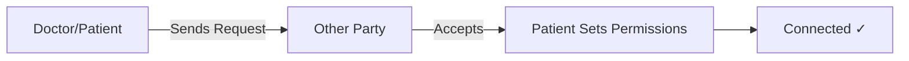

# 💊 Das Tern - Manual Prescription Platform

> **A patient-centered medication management platform with offline support, family connections, and doctor collaboration.**

[](LICENSE)
[](VERSION)

---

## 📖 Overview

Das Tern is a comprehensive medication management platform that puts patients in control of their health data while enabling seamless collaboration with doctors and family caregivers. The platform works both online and offline, ensuring medication adherence is never compromised.

### ✨ Key Features

- 🔐 **Patient-Owned Data** - Complete control over medical information
- 👨‍⚕️ **Doctor Collaboration** - Secure prescription management with version control
- 👨‍👩‍👧 **Family Support** - Caregiver alerts and shared monitoring
- 📱 **Offline-First** - Full functionality without internet connection
- 🔔 **Smart Reminders** - Never miss a dose, online or offline
- 📊 **Audit Trail** - Complete transparency of all data access
- 💰 **Flexible Plans** - Free to premium options for all needs

---

## 📑 Table of Contents

- [User Roles & Ownership](#-user-roles--ownership)
- [Connection System](#-connection-system)
  - [Doctor Connection](#-doctor-connection-two-way-accept)
  - [Family Connection](#-family-connection)
- [Prescription Management](#-prescription-management)
- [Dose Tracking](#-dose-tracking)
- [Reminder System](#-reminder-system)
- [PRN Medications](#-prn-medications-as-needed)
- [Audit Logging](#-audit-logging)
- [Subscription Plans](#-subscription-plans)
- [User Flows](#-user-flows)

---

## 👥 User Roles & Ownership

### Three Core Roles

<table>
<tr>
<td align="center">
<h4>🧑‍⚕️ Patient</h4>
<p>Primary user and data owner</p>
</td>
<td align="center">
<h4>👨‍👩‍👧 Family/Caregiver</h4>
<p>Support role using the same app</p>
</td>
<td align="center">
<h4>👨‍⚕️ Doctor</h4>
<p>Medical professional providing prescriptions</p>
</td>
</tr>
</table>

### 🔒 Ownership Principle

> **The patient is ALWAYS the owner of their medical data.**
> 
> All viewing or actions by Family or Doctor must be explicitly allowed by patient permission settings.

**💡 User Story:**
```
As a patient, I own my prescription and dose records, 
so I can control who can access my data.
```

---

## 🔗 Connection System

### 🤝 Doctor Connection (Two-Way Accept)

Connection can be initiated by **either side**, but **MUST** be accepted by the other.

#### 📋 Connection Flow



<details>
<summary><b>Case A: Doctor Initiates</b></summary>

1. 👨‍⚕️ Doctor sends connection request to patient
2. 🧑‍⚕️ Patient must accept
3. 🔐 After acceptance, patient chooses permission level for doctor

</details>

<details>
<summary><b>Case B: Patient Initiates</b></summary>

1. 🧑‍⚕️ Patient sends connection request to doctor
2. 👨‍⚕️ Doctor must accept
3. 🔐 After acceptance, patient chooses permission level for doctor

</details>

> ⚠️ **Important:** Even if the doctor accepts, the patient remains the owner and controls permission level.

---

#### 🔐 Permission Levels

| Permission | Icon | Description |
|-----------|:----:|-------------|
| **NOT_ALLOWED** | 🚫 | Doctor has no access |
| **REQUEST** | 🙋 | Doctor must request access each time (policy-based) |
| **SELECTED** | 📌 | Doctor has access only to selected items (specific prescriptions or time ranges) |
| **ALLOWED** | ✅ | Doctor has access to view history and data reports (default) |

#### ⚙️ Default Permission Behavior

When connection is confirmed:
- System shows a permission popup
- If user clicks **"OK"** without changes → Default = `ALLOWED` (view history/data report)

---

#### 📝 User Stories

```
✓ As a doctor, I can request to connect to a patient, 
  so I can monitor adherence once the patient accepts.

✓ As a patient, I can connect to a doctor, 
  so my doctor can help manage my medication plan.

✓ As a patient, I can set doctor permission to NOT_ALLOWED/REQUEST/SELECTED/ALLOWED, 
  so I stay in control of my privacy.
```

#### ✅ Acceptance Criteria

- [x] A doctor cannot view patient data without an accepted connection
- [x] After connection, doctor access is controlled by the patient permission enum
- [x] Default permission applies only when user clicks OK without selecting custom permissions

---

### 👨‍👩‍👧 Family Connection

Family members use the **same app**. After connection, they gain special advantages.

#### 🎁 Connection Advantages

| Feature | Description |
|---------|-------------|
| 🔔 **Missed-Dose Alerts** | Family receives alerts based on patient reminder/escalation rules |
| 👀 **Mutual View** | Both sides can view each other's history records (controlled by permissions) |
| 🔄 **Revocable Access** | Patient can revoke family access anytime |

> 📋 **Important:** All actions from family are audit logged.

---

#### 📝 User Stories

```
✓ As a patient, I connect my family 
  so they can remind me when I miss medication.

✓ As a family member, I receive alerts 
  so I can support the patient to take medicine on time.

✓ As a patient, I can revoke family access anytime 
  so I can protect my privacy.
```

#### ✅ Acceptance Criteria

- [x] If patient misses medication, family gets notified when online or later when sync occurs
- [x] Connection allows viewing history records depending on permission settings
- [x] Revoking permission removes access immediately

---

## 💊 Prescription Management

### 🔄 Prescription Lifecycle

```
Draft → Active → Paused → Inactive/Stopped
```

| Status | Icon | Description |
|--------|:----:|-------------|
| **Draft** | 📝 | Saved but not active, no schedule/reminders |
| **Active** | ✅ | Schedule generated, reminders enabled |
| **Paused** | ⏸️ | Temporary stop, history remains |
| **Inactive/Stopped** | 🛑 | Ended, history remains |

---

### 📚 Versioning System

#### Core Rules

- ❌ **No destructive edits**
- 🆕 Doctor modifications create a **new version**
- 📜 Old versions kept in **history**
- 📋 All changes recorded in **audit log**

---

### ⚡ Urgent Change Rule

Doctors can **auto-apply** urgent changes for patient safety:

```
Doctor marks urgent → System applies immediately → Patient notified → Logged in history
```

> 📌 **Must still appear in patient history and audit logs**

#### 📝 User Stories

```
✓ As a doctor, I can urgently change a prescription and auto-apply it, 
  so the patient immediately follows the new schedule.

✓ As a patient, I can see urgent changes in history, 
  so I know what changed and why.
```

#### ✅ Acceptance Criteria

- [x] Auto-applied changes create a new version
- [x] History shows: who changed, what changed, when, and reason
- [x] Patient is notified even when auto-applied

---

## 📊 Dose Tracking

### 📌 DoseEvent Status

| Status | Icon | Time Window |
|--------|:----:|-------------|
| **Due** | ⏰ | Scheduled but not yet taken |
| **Taken (On time)** | ✅ | Within allowed window |
| **Taken (Late)** | ⚠️ | After window but before cutoff |
| **Missed** | ❌ | Past cutoff without being taken |
| **Skipped** | ⏭️ | Optional: Manually skipped with reason |

### ⏱️ Time-Window Logic

```
┌─────────────────────────────────────────────────────────┐
│                                                         │
│  Within Window → ✅ Taken (On time)                     │
│  After Window  → ⚠️ Taken (Late)                        │
│  Past Cutoff   → ❌ Missed                              │
│                                                         │
└─────────────────────────────────────────────────────────┘
```

**💡 User Story:**
```
As a patient, I can mark taken, 
so my adherence record is accurate.
```

---

## ⏰ Reminder System

### 🎯 Core Principle

> **Reminders MUST work in both online and offline states.**

---

### 🔧 A) Reminder Creation

When prescription becomes `Active`:

1. 📅 Generate DoseEvents (schedule)
2. 💾 Store schedule in:
   - ☁️ Backend database
   - 📱 Local storage on device

> This ensures offline reminders can still fire without internet.

**💡 User Story:**
```
As a patient, I still receive reminders even when offline, 
so I don't miss medication.
```

---

### 📱 B) Offline Reminder Delivery

#### How It Works

```
┌─────────────────────────────────────────────────────────┐
│  OFFLINE MODE                                           │
├─────────────────────────────────────────────────────────┤
│  1. 📱 Phone uses local schedule                        │
│  2. 🔔 Sends notification to patient                    │
│  3. ✅ Patient taps "Taken"                             │
│  4. 💾 Store in local queue (pending sync)              │
│                                                         │
│  WHEN ONLINE                                            │
├─────────────────────────────────────────────────────────┤
│  5. 🔄 Sync queued actions to backend                   │
│  6. ✅ Backend updates DoseEvent & audit log            │
└─────────────────────────────────────────────────────────┘
```

**💡 User Story:**
```
As a patient, I can mark taken offline and it will sync later, 
so my records stay correct.
```

---

### 👨‍👩‍👧 C) Offline Missed-Dose Handling & Family Notification

#### The Problem

Offline device can detect missed dose locally, but **cannot notify family immediately**.

#### The Solution

```
┌─────────────────────────────────────────────────────────┐
│  OFFLINE MISSED DOSE                                    │
├─────────────────────────────────────────────────────────┤
│  1. ❌ Missed dose detected locally                     │
│  2. 💾 Store missed state + evidence                    │
│                                                         │
│  WHEN ONLINE                                            │
├─────────────────────────────────────────────────────────┤
│  3. 🔄 System syncs                                     │
│  4. 🔔 Sends missed alert to family (late but guaranteed)│
└─────────────────────────────────────────────────────────┘
```

> ⚠️ **Important:** Late family alert must clearly indicate it was sent after reconnect/sync.

#### 📝 User Stories

```
✓ As a family member, I still get notified about missed doses 
  even if the patient was offline, so I can follow up.

✓ As a patient, I understand late alerts happen after reconnect, 
  so I don't get confused.
```

#### ✅ Acceptance Criteria

- [x] Offline patient reminders still fire on time (local notifications)
- [x] Offline taken actions sync when online and update backend
- [x] Offline missed alerts are delivered to family after online sync (late but guaranteed)

---

## 🩺 PRN Medications (As Needed)

**PRN** = "Pro Re Nata" (as needed)

### ⚙️ Default Behavior

- 🌏 System uses **Cambodia time** as the default timezone
- ⏰ User should input reminder time(s)
- 🤖 If user does not input reminder times:
  - System automatically uses **default reminder times** (Cambodia timezone presets)
  - Example presets: 🌅 morning / ☀️ noon / 🌆 evening / 🌙 night
  - Exact times configurable in UI settings

---

### 📝 User Stories

```
✓ As a patient, I can set PRN reminder times, 
  so reminders match my real usage.

✓ As a patient, if I skip setting times, 
  the app uses default Cambodia-time presets so I still get reminders.
```

### ✅ Acceptance Criteria

- [x] PRN supports manual "Taken" without strict schedule if configured that way
- [x] If no PRN times entered, app auto-assigns default times using Cambodia timezone

---

## 📝 Audit Logging

### 🔍 What Gets Logged

Every action is tracked for complete transparency:

| Category | Events Logged |
|----------|---------------|
| 🔗 **Connections** | Connection requests and acceptances |
| 🔐 **Permissions** | Permission changes (enum changes) |
| 👀 **Access** | Who viewed what (based on policy) |
| 💊 **Prescriptions** | Creation and version changes |
| ⚡ **Urgent Changes** | Auto-apply changes |
| 🔔 **Reminders** | Reminders sent (including offline-late notifications) |
| ✅ **Dose Events** | Taken/missed events and sync time |

**💡 User Story:**
```
As a patient, I can audit who accessed or changed my data, 
so I trust the system.
```

---

## 💳 Subscription Plans

### 📊 Plan Comparison

<table>
<tr>
<th></th>
<th align="center">🆓 FREEMIUM</th>
<th align="center">⭐ PREMIUM</th>
<th align="center">👨‍👩‍👧 FAMILY PREMIUM</th>
</tr>
<tr>
<td><b>💰 Price</b></td>
<td align="center">Free</td>
<td align="center">$0.50/month</td>
<td align="center">$1.00/month</td>
</tr>
<tr>
<td><b>💾 Storage</b></td>
<td align="center">5GB</td>
<td align="center">20GB</td>
<td align="center">20GB</td>
</tr>
<tr>
<td><b>✨ Features</b></td>
<td align="center">MVP only</td>
<td align="center">All features</td>
<td align="center">All features</td>
</tr>
<tr>
<td><b>👥 Members</b></td>
<td align="center">1</td>
<td align="center">1</td>
<td align="center">Up to 3 total</td>
</tr>
</table>

---

### 🆓 FREEMIUM Plan

**Perfect for getting started**

#### Features Included

- ✅ Create medication (manual)
- ✅ Generate reminders
- ✅ Store records
- 💾 Storage limit: **5GB** per account

**💡 User Story:**
```
As a freemium user, I can manage my prescriptions and reminders, 
so I can use the core app for free.
```

---

### ⭐ PREMIUM Plan

**💰 Price:** $0.50 per month

#### Benefits

- ✅ **All features enabled**
- 💾 Storage limit: **20GB**
- 🚀 Priority support
- 📊 Advanced analytics

**💡 User Story:**
```
As a premium user, I pay monthly 
so I can use all features and get more storage.
```

---

### 👨‍👩‍👧 FAMILY PREMIUM Plan

**💰 Price:** $1 per month

#### Benefits

- ✅ Includes **all premium benefits**
- 👨‍👩‍👧 Family plan: **up to 3 members total** (including the payer)
- 🌟 **All members become premium users**
- 💾 20GB storage per member

**💡 User Story:**
```
As a patient, I pay for a family plan 
so my family members can also use premium features to support me.
```

#### ✅ Acceptance Criteria

- [x] Plan determines available features + storage enforcement
- [x] Family plan cannot exceed 3 members total
- [x] Upgrading plan unlocks feature access immediately after payment confirmation

---

## 🔄 User Flows

### Flow 1: 👨‍⚕️ Doctor ↔ Patient Connection + Prescription Update

#### 🎯 Goals

- ✅ Allow doctor and patient to connect with mutual acceptance
- ✅ Ensure patient controls permission levels
- ✅ Allow doctor to update prescriptions with version history, including urgent auto-apply

---

#### 1.1 Doctor Initiates Connection

```
┌─────────────────────────────────────────────────────────┐
│  1. 👨‍⚕️ Doctor selects patient                          │
│  2. 📤 Taps "Request Connection"                        │
│  3. 📥 Patient receives request                         │
│  4. ✅ Patient accepts/declines                         │
│                                                         │
│  IF ACCEPTED:                                           │
│  5. 🔐 Permission popup appears                         │
│  6. 🎚️ Patient sets permission enum:                    │
│     • NOT_ALLOWED                                       │
│     • REQUEST                                           │
│     • SELECTED                                          │
│     • ALLOWED (default if OK clicked)                   │
└─────────────────────────────────────────────────────────┘
```

**📝 User Stories:**
```
✓ As a doctor, I can request connection 
  so I can support patient adherence after they accept.

✓ As a patient, I approve or decline doctor connection 
  so I control my privacy.
```

---

#### 1.2 Patient Initiates Connection

```
┌─────────────────────────────────────────────────────────┐
│  1. 🧑‍⚕️ Patient searches/selects doctor                 │
│  2. 📤 Taps "Request Connection"                        │
│  3. 📥 Doctor receives request                          │
│  4. ✅ Doctor accepts/declines                          │
│                                                         │
│  IF ACCEPTED:                                           │
│  5. 🔐 Patient sets permission enum                     │
│  6. ✅ Default applies if patient clicks OK             │
└─────────────────────────────────────────────────────────┘
```

**💡 User Story:**
```
As a patient, I connect to my doctor 
so my doctor can monitor adherence with my consent.
```

---

#### 1.3 Doctor Modifies Prescription (Normal)

```
┌─────────────────────────────────────────────────────────┐
│  1. 👨‍⚕️ Doctor opens patient profile (if permitted)     │
│  2. 📝 Creates new version of prescription              │
│  3. 🔔 Patient is notified                              │
│  4. ✅ Patient accepts change (if non-urgent)           │
│  5. 🔄 New version becomes active                       │
│  6. 📅 Schedule regenerated                             │
└─────────────────────────────────────────────────────────┘
```

**📝 User Stories:**
```
✓ As a doctor, I can update prescription 
  so the patient follows correct treatment.

✓ As a patient, I approve non-urgent changes 
  so I understand what changes.
```

---

#### 1.4 Doctor Modifies Prescription (⚡ Urgent Auto-Apply)

```
┌─────────────────────────────────────────────────────────┐
│  1. 👨‍⚕️ Doctor marks update as URGENT                   │
│  2. ⚡ System auto-applies immediately                  │
│  3. 🔔 Patient receives urgent notification             │
│  4. 📋 History/audit log records:                       │
│     • ⚡ Urgent flag                                    │
│     • 👨‍⚕️ Doctor                                        │
│     • ⏰ Timestamp                                      │
│     • 📝 Reason                                         │
│     • 🔗 Version link                                   │
└─────────────────────────────────────────────────────────┘
```

**📝 User Stories:**
```
✓ As a doctor, I can urgently update prescription 
  so the patient immediately follows the safer plan.

✓ As a patient, I can see urgent updates in my history 
  so I trust the system.
```

---

### Flow 2: 👨‍👩‍👧 Family Connection

#### 🎯 Goals

- ✅ Connect patient and family with consent
- ✅ Send missed-dose alerts to family
- ✅ Allow shared view of history records (mutual view) after connection, controlled by permission rules

---

#### Connection Steps

```
┌─────────────────────────────────────────────────────────┐
│  1. 🧑‍⚕️ Patient invites family                          │
│     • 📱 Phone                                          │
│     • 📧 Email                                          │
│     • 📷 QR Code                                        │
│                                                         │
│  2. 👨‍👩‍👧 Family accepts                                 │
│                                                         │
│  3. 🔐 Patient sets permissions                         │
│                                                         │
│  4. ✅ Connected!                                       │
└─────────────────────────────────────────────────────────┘
```

---

#### 🎁 Advantages After Connection

| Advantage | Description |
|-----------|-------------|
| 🔔 **Missed Alerts** | Family receives alerts (online immediately, offline after sync) |
| 👀 **Mutual View** | View each other's history record (with permission enforcement) |
| 🔄 **Revocable** | Patient can revoke anytime |

---

#### 📝 User Stories

```
✓ As a patient, I invite my family 
  so they can remind me and help prevent missed doses.

✓ As a family member, I can view adherence history 
  so I can support the patient better.

✓ As a patient, I revoke permissions anytime 
  so I remain in control.
```

#### ✅ Acceptance Criteria

- [x] Family receives missed-dose alerts based on escalation rules
- [x] Offline missed alerts are delivered after patient reconnects
- [x] View-history access follows permission rules and is audit logged

---

### Flow 3: ⏰ Reminder Flow (Online + Offline Guarantee)

#### 🎯 Key Rule

> **Reminder schedule exists in BOTH backend DB and device local storage.**

#### Requirements

- ✅ Offline mode must still remind patient
- ✅ Offline missed alerts to family are sent after reconnect

---

#### Flow Diagram

```
┌─────────────────────────────────────────────────────────┐
│  PRESCRIPTION ACTIVATED                                 │
├─────────────────────────────────────────────────────────┤
│  1. 📅 DoseEvents generated                             │
│  2. 💾 Stored in:                                       │
│     • ☁️ Backend database                               │
│     • 📱 Local schedule storage                         │
└─────────────────────────────────────────────────────────┘
         │
         ▼
┌─────────────────────────────────────────────────────────┐
│  REMINDERS TRIGGER                                      │
├─────────────────────────────────────────────────────────┤
│  🌐 ONLINE:  Server + device notifications              │
│  📱 OFFLINE: Device local notifications                 │
└─────────────────────────────────────────────────────────┘
         │
         ▼
┌─────────────────────────────────────────────────────────┐
│  PATIENT MARKS TAKEN                                    │
├─────────────────────────────────────────────────────────┤
│  🌐 ONLINE:  Update backend immediately                 │
│  📱 OFFLINE: Store local pending action, sync later     │
└─────────────────────────────────────────────────────────┘
         │
         ▼
┌─────────────────────────────────────────────────────────┐
│  MISSED DOSE                                            │
├─────────────────────────────────────────────────────────┤
│  🌐 ONLINE:  Notify patient + family (escalation)       │
│  📱 OFFLINE: Store missed locally                       │
│             → After online sync, notify family          │
│               (late but guaranteed)                     │
└─────────────────────────────────────────────────────────┘
```

---

#### 📝 User Stories

```
✓ As a patient, I still get reminders offline 
  so I can take medicine on time.

✓ As a family member, I get missed-dose alerts 
  even if the patient was offline, so I can still help.
```

---

## 📌 Platform Scope Summary

### Core Principles

- 🤝 Doctor-patient connection requires **mutual acceptance**
- 🔐 Patient controls doctor permission enum: `NOT_ALLOWED`, `REQUEST`, `SELECTED`, `ALLOWED`
- ⚡ Urgent prescription updates may **auto-apply** but must appear in history/audit
- 📱 Reminders must function **offline** and sync actions later
- 💳 Subscription plans: **Freemium**, **Premium**, **Family Premium**

**💡 User Story:**
```
As a user, I can choose a plan that matches my needs and storage usage.
```

---

## 📞 Support & Contact

For questions, issues, or feature requests, please contact:

- 📧 Email: support@dastern.com
- 🌐 Website: https://dastern.com
- 📱 App: Available on iOS and Android

---

## 📄 License

This project is licensed under the MIT License - see the [LICENSE](LICENSE) file for details.

---

<div align="center">

**Made with ❤️ for better medication adherence**

[⬆ Back to Top](#-das-tern---manual-prescription-platform)

</div>
