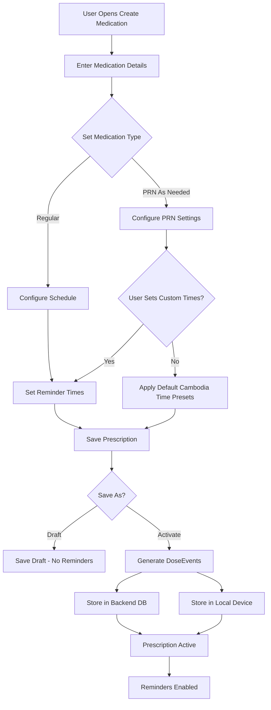
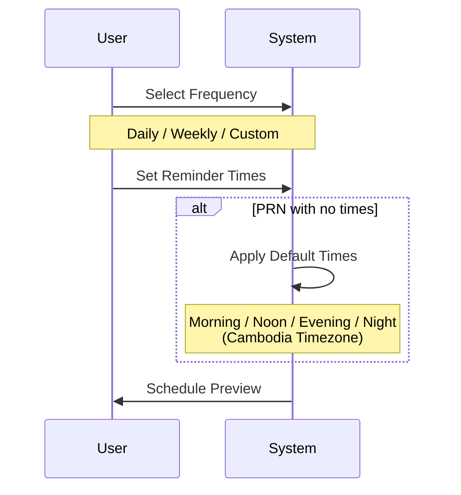

# Create Medication Flow

## Overview

This flow describes how patients create new medications and prescription schedules in the DasTern platform.

---

## Flow Diagram

---

## Step-by-Step Process

### 1. Enter Medication Details

| Field | Description | Required |
|-------|-------------|----------|
| Medication Name | Name of the medication | ✅ |
| Dosage | Amount per dose (e.g., 500mg) | ✅ |
| Form | Tablet, Capsule, Liquid, etc. | ✅ |
| Instructions | Special instructions (with food, etc.) | Optional |

### 2. Set Medication Type

#### Regular Medication
- Fixed schedule (e.g., twice daily)
- Specific times set by user
- Strict adherence tracking

#### PRN (As Needed) Medication
- Flexible schedule
- User can log doses as taken
- Default Cambodia timezone presets if no times specified

### 3. Configure Schedule

### 4. Save Prescription

#### Draft Mode
- Saved but **not active**
- No schedule generated
- No reminders enabled

#### Active Mode
- Schedule is generated (DoseEvents)
- Stored in:
  - ✅ Backend database
  - ✅ Local device storage
- Reminders enabled immediately

---

## Prescription States

| State | Schedule | Reminders | History |
|-------|----------|-----------|---------|
| **Draft** | ❌ | ❌ | ❌ |
| **Active** | ✅ | ✅ | Recording |
| **Paused** | Preserved | ❌ | Preserved |
| **Stopped** | Preserved | ❌ | Preserved |

---

## PRN Default Times (Cambodia Timezone)

If user does not specify reminder times for PRN medications:

| Period | Default Time |
|--------|--------------|
| Morning | 07:00 AM |
| Noon | 12:00 PM |
| Evening | 06:00 PM |
| Night | 09:00 PM |

> [!NOTE]
> These are example defaults. Actual times may be configurable in app settings.

---

## User Stories

- As a patient, I can create a medication with a schedule so I receive reminders.
- As a patient, I can save a draft prescription to complete later.
- As a patient, I can set PRN medications with flexible timing.
- As a patient, if I don't set PRN times, the app uses sensible defaults.

---

## Acceptance Criteria

- [ ] User can enter all required medication details
- [ ] User can save as Draft or Activate immediately
- [ ] Active prescriptions generate DoseEvents
- [ ] Schedule is stored in both backend and device
- [ ] PRN medications support default Cambodia timezone presets
- [ ] Reminders begin immediately after activation
