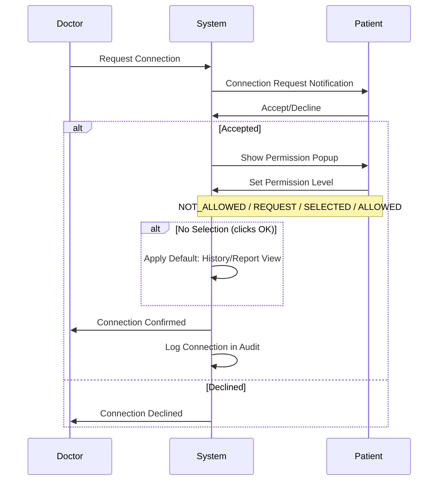
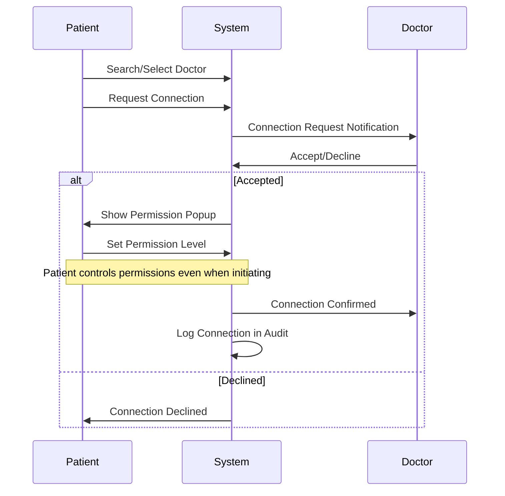
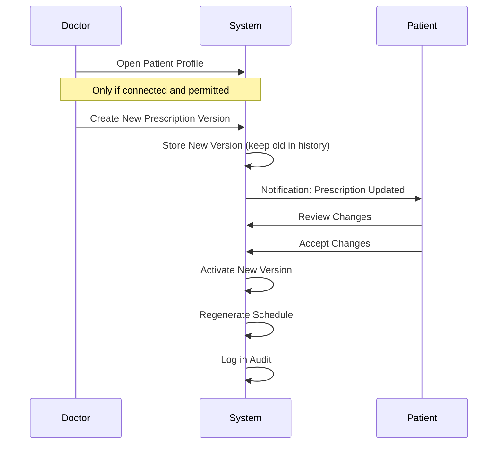
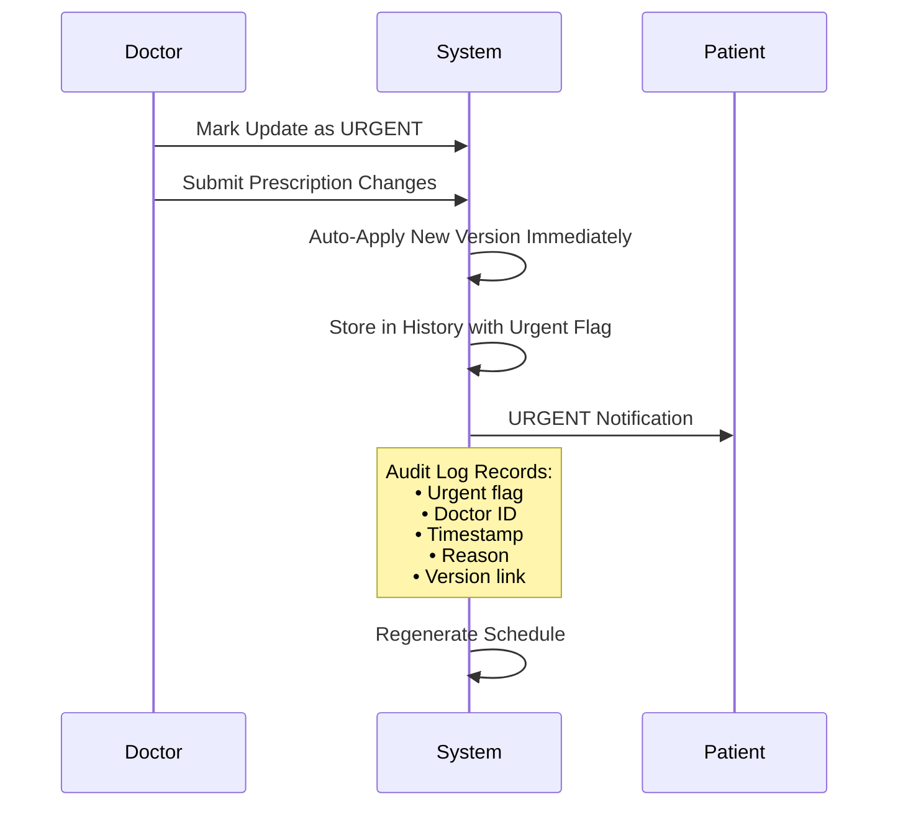

# Doctor ↔ Patient Connection + Prescription Update Flow

## Goals

- Allow doctor and patient to connect with **mutual acceptance**
- Ensure **patient controls permission levels**
- Allow doctor to update prescriptions with **version history**, including urgent auto-apply

---

## Flow 1: Doctor Initiates Connection

### Steps

1. Doctor selects patient and taps **"Request Connection"**
2. Patient receives request and accepts/declines
3. If accepted:
   - Permission popup appears for patient
   - Patient sets permission enum: `NOT_ALLOWED` / `REQUEST` / `SELECTED` / `ALLOWED`
   - If patient clicks OK without selecting → Default = history/data-report view is allowed

### User Stories

- As a doctor, I can request connection so I can support patient adherence after they accept.
- As a patient, I approve or decline doctor connection so I control my privacy.

---

## Flow 2: Patient Initiates Connection

### Steps

1. Patient searches/selects doctor and taps **"Request Connection"**
2. Doctor accepts/declines
3. If accepted:
   - Patient sets permission enum for doctor
   - Default applies if patient clicks OK

### User Story

- As a patient, I connect to my doctor so my doctor can monitor adherence with my consent.

---

## Flow 3: Doctor Modifies Prescription (Normal)

### Steps

1. Doctor opens patient profile (only if connected and permitted)
2. Doctor creates new version of prescription
3. Patient is notified
4. Patient accepts change (if non-urgent policy)
5. New version becomes active, schedule regenerated

### User Stories

- As a doctor, I can update prescription so the patient follows correct treatment.
- As a patient, I approve non-urgent changes so I understand what changes.

---

## Flow 4: Doctor Modifies Prescription (Urgent Auto-Apply)

### Steps

1. Doctor marks update as **urgent**
2. System **auto-applies** the new version immediately
3. Patient receives urgent notification
4. History/audit log must include:
   - Urgent flag
   - Doctor
   - Timestamp
   - Reason
   - Version link

### User Stories

- As a doctor, I can urgently update prescription so the patient immediately follows the safer plan.
- As a patient, I can see urgent updates in my history so I trust the system.

---

## Permission Reference

| Permission | Access Level |
|------------|--------------|
| `NOT_ALLOWED` | No access to patient data |
| `REQUEST` | Must request access each time |
| `SELECTED` | Access to specific items only |
| `ALLOWED` | Full access to allowed scope (history/reports) |

> [!IMPORTANT]
> Even after connection, the **patient remains the owner** and can change permission levels at any time.

---

## Acceptance Criteria

- [ ] Doctor cannot view patient data without an accepted connection
- [ ] Connection requires mutual acceptance from both parties
- [ ] Patient can set and change permission levels at any time
- [ ] Prescription updates create new versions (no destructive edits)
- [ ] Urgent updates are auto-applied with full audit trail
- [ ] All connection and permission changes are logged
