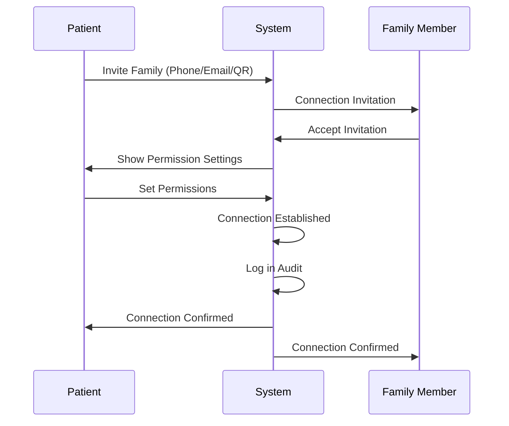
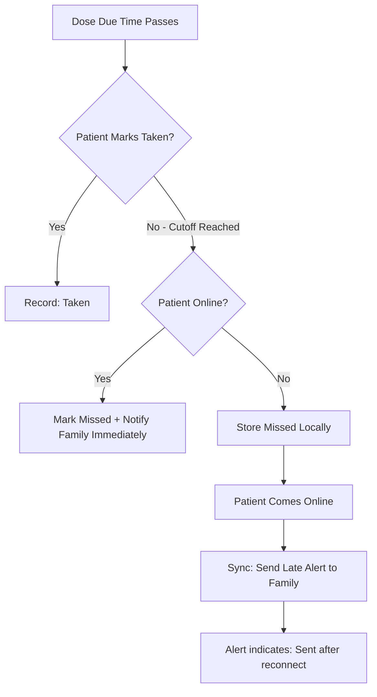
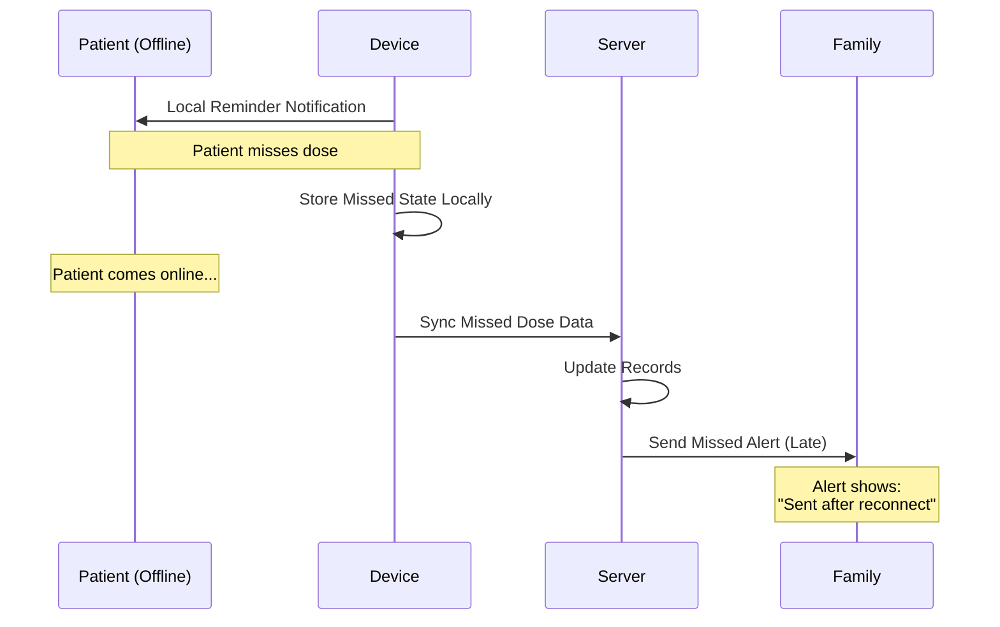

# Family Connection Flow

## Goals

- Connect patient and family with **consent**
- Send **missed-dose alerts** to family
- Allow **shared view of history records** (mutual view) after connection, controlled by permission rules

---

## Connection Flow

### Steps

1. **Patient invites family** (via phone/email/QR code)
2. **Family accepts**
3. **Patient sets permissions**
4. **Connected**

---

## Advantages After Connection

### 1. Missed-Dose Alerts

When patient misses medication:
- **Online:** Family receives alert immediately
- **Offline:** Family receives alert after patient reconnects (with late indicator)

### 2. Shared History View

- Patient and family can view each other's history records after connection
- Access controlled by permission rules
- All views are audit logged

### 3. Patient Control

> [!IMPORTANT]
> Patient can **revoke family access anytime**. Revocation removes access immediately.

---

## Permission Management

| Action | Permission Required |
|--------|---------------------|
| View patient's medication history | Patient grants view permission |
| Receive missed-dose alerts | Enabled by default after connection |
| View real-time adherence | Patient grants real-time access |

---

## User Stories

- As a patient, I invite my family so they can remind me and help prevent missed doses.
- As a family member, I can view adherence history so I can support the patient better.
- As a patient, I revoke permissions anytime so I remain in control.

---

## Offline Behavior

### Key Points

- Family **always gets notified** about missed doses
- Offline missed alerts are sent after sync (late but guaranteed)
- Alert clearly indicates it was sent after reconnect

---

## Acceptance Criteria

- [ ] Family receives missed-dose alerts based on escalation rules
- [ ] Offline missed alerts are delivered after patient reconnects
- [ ] View-history access follows permission rules
- [ ] All family access is audit logged
- [ ] Patient can revoke family access immediately
- [ ] Revoked access removes permissions instantly