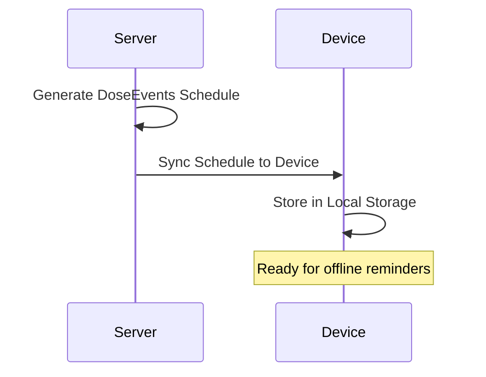
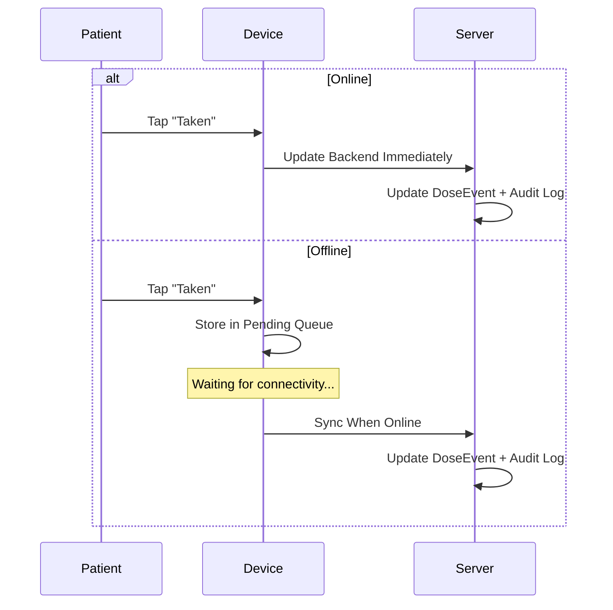
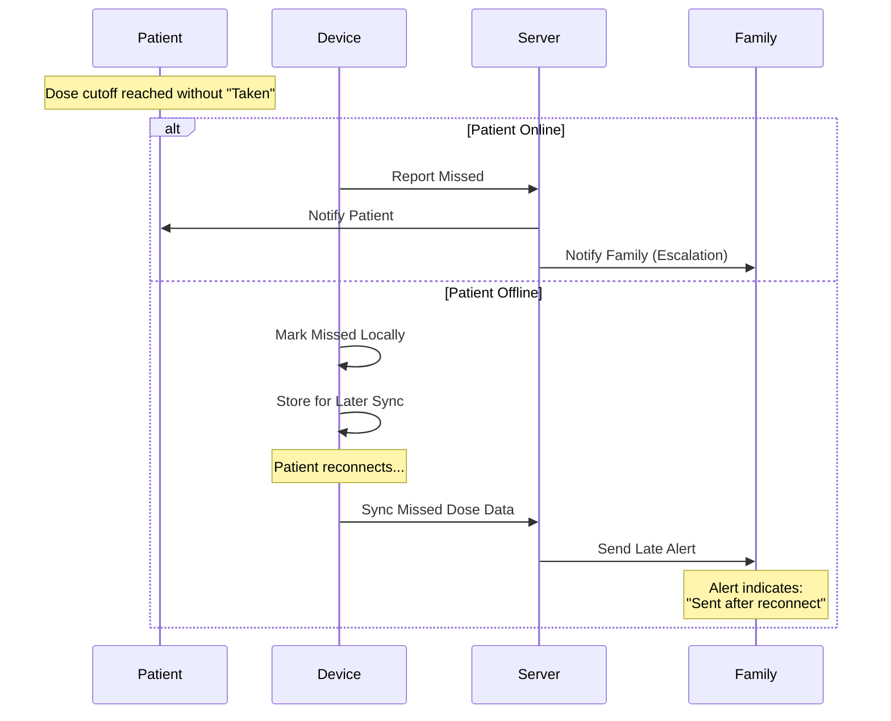

# Reminder Flow – Online + Offline Guarantee

## Key Rules

> [!IMPORTANT]
> - Reminder schedule exists in **BOTH** backend DB and device local storage
> - Offline mode **must still remind** patient
> - Offline missed alerts to family are sent **after reconnect**

---

## Complete Flow

```mermaid
flowchart TD
    subgraph Activation
        A[Prescription Activated] --> B[Generate DoseEvents]
        B --> C[Store in Backend DB]
        B --> D[Store in Local Device Storage]
    end

    subgraph Reminder Trigger
        E{Device Online?}
        E -->|Yes| F[Server + Device Notifications]
        E -->|No| G[Device Local Notifications Only]
    end

    subgraph Mark Taken
        H{Patient Online?}
        H -->|Yes| I[Update Backend Immediately]
        H -->|No| J[Store in Local Pending Queue]
        J --> K[Device Comes Online]
        K --> L[Sync Pending Actions to Backend]
    end

    subgraph Missed Dose
        M{Cutoff Reached Without Taken}
        M --> N{Patient Online?}
        N -->|Yes| O[Notify Patient + Family]
        N -->|No| P[Store Missed Locally]
        P --> Q[Patient Comes Online]
        Q --> R[Sync + Notify Family Late]
    end
```



---

## Step-by-Step Process

### 1. Prescription Activation

When prescription becomes **Active**:



**Storage locations:**
- ✅ Backend database
- ✅ Local schedule storage on device

### 2. Reminder Triggers

| Connectivity | Notification Source |
|--------------|---------------------|
| **Online** | Server + Device notifications |
| **Offline** | Device local notifications only |

### 3. Patient Marks Taken



### 4. Missed Dose Handling



---

## Offline Sync Queue

The device maintains a pending action queue for offline operations:

```
┌─────────────────────────────────────────┐
│           Pending Actions Queue         │
├─────────────────────────────────────────┤
│ • Taken action @ 08:00 AM              │
│ • Taken action @ 12:00 PM              │
│ • Missed dose @ 06:00 PM (no action)   │
└─────────────────────────────────────────┘
                    │
                    ▼ (On reconnect)
┌─────────────────────────────────────────┐
│         Sync to Backend                 │
├─────────────────────────────────────────┤
│ • Update DoseEvent records             │
│ • Update Audit Log                     │
│ • Trigger family notifications         │
└─────────────────────────────────────────┘
```

---

## Time Window Logic

```
Dose Scheduled Time
        │
        ▼
────────┬────────────────┬────────────────┬────────►
        │                │                │
   Allowed Window   Late Period      Cutoff
        │                │                │
        ▼                ▼                ▼
   Taken (On Time)  Taken (Late)      Missed
```

---

## User Stories

- As a patient, I still get reminders offline so I can take medicine on time.
- As a family member, I get missed-dose alerts even if the patient was offline, so I can still help.
- As a patient, I can mark taken offline and it will sync later, so my records stay correct.

---

## Acceptance Criteria

- [ ] Offline patient reminders still fire on time (local notifications)
- [ ] Offline taken actions sync when online and update backend
- [ ] Offline missed alerts are delivered to family after online sync
- [ ] Late alerts clearly indicate they were sent after reconnect
- [ ] All reminder events and actions are audit logged
- [ ] Schedule is stored in both backend and device local storage
