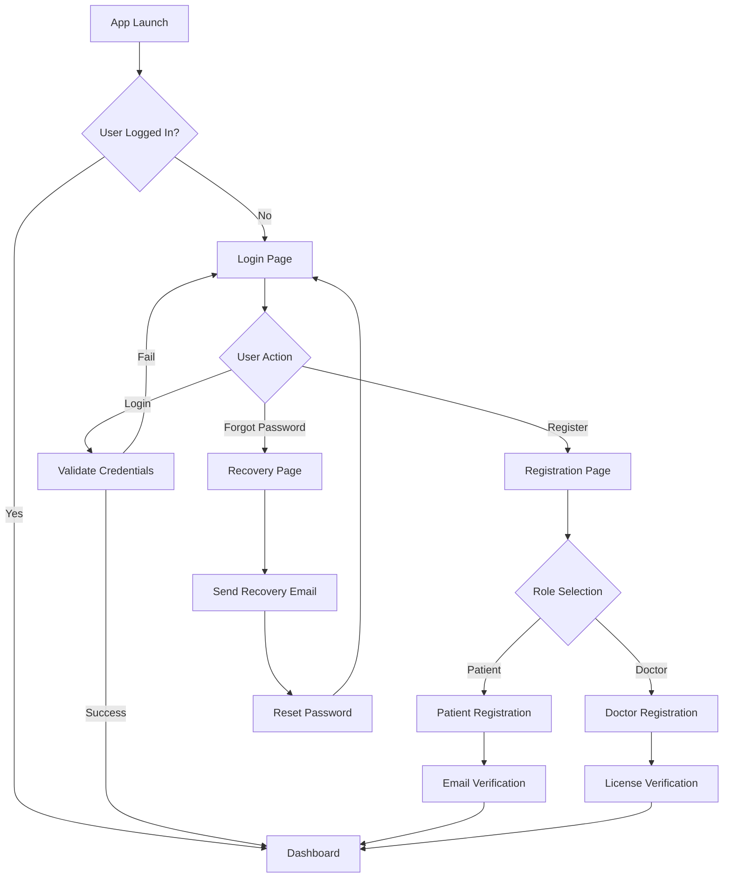

# Authentication UI Overview

This directory contains UI specifications for all authentication-related screens.

---

## Auth Flow Overview



---

## Auth Screens

| Screen | Description | Link |
|--------|-------------|------|
| **Login** | User authentication | [Login UI](./login_page_ui/user_login_ui.md) |
| **Patient Register** | New patient registration | [Patient Register](./register_page_ui/patient_register_ui.md) |
| **Doctor Register** | New doctor registration | [Doctor Register](./register_page_ui/doctor_register_ui.md) |
| **Account Recovery** | Password reset flow | [Recovery UI](./recovery_account_ui/recovery_account_ui.md) |

---

## Common Elements

### Input Validation

| Field | Validation |
|-------|------------|
| Email | Valid email format |
| Password | Min 8 chars, 1 uppercase, 1 number |
| Phone | Valid Cambodia phone format |
| Name | Min 2 characters |

### Error Messages

```
┌─────────────────────────────────────────────────┐
│  ❌ Invalid email or password                   │
│  Please check your credentials and try again    │
└─────────────────────────────────────────────────┘
```

### Success Messages

```
┌─────────────────────────────────────────────────┐
│  ✅ Registration successful!                    │
│  Please check your email to verify your account│
└─────────────────────────────────────────────────┘
```

---

## Security Considerations

- [ ] Password field with show/hide toggle
- [ ] Secure password storage (not displayed in plain text)
- [ ] Session timeout handling
- [ ] Biometric login option (future)
