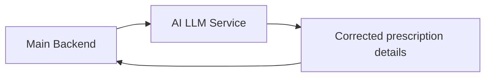

# AI LLM Service

The AI LLM service is the system's "cleanup helper" for prescription data.

## What it does

- It receives OCR results from the main backend.
- It corrects unclear medicine names and important prescription details.
- It helps turn messy scan output into cleaner, easier-to-save information.
- It can also help prepare reminder-friendly medication data.

## Simple flow

1. The backend gets a scanned prescription result.
2. The backend sends that result to the AI service.
3. The AI service reviews and improves the extracted information.
4. The improved result goes back to the backend.
5. The backend saves or shows the final result to the user.

## Why it matters

- It improves scan quality without changing the user experience.
- It reduces manual correction work.
- If the AI service is unavailable, the system can still continue with the original OCR result.
