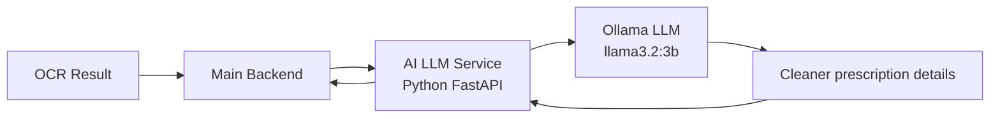

# AI LLM Service

## Simple explanation

- This service improves OCR output.
- It fixes unclear medicine names and key prescription details.
- It uses Ollama (a local LLM) to understand and correct the text.
- It sends a cleaner result back to the backend.

## Main idea

- OCR reads the text and extracts raw data.
- AI LLM Service processes the raw data with Ollama.
- Ollama is self-hosted locally (not an external API).
- This keeps data private and inference fast.
- If Ollama is unavailable, the backend can still continue with the original OCR result.
