# AI LLM Service - Detailed Architecture

## Overview
The AI LLM service is a Python FastAPI-based microservice that enhances and refines OCR results using Large Language Models. It integrates with Ollama for local LLM inference and provides fine-tuned extraction endpoints for medical data with safety checks.

---

## Component Architecture

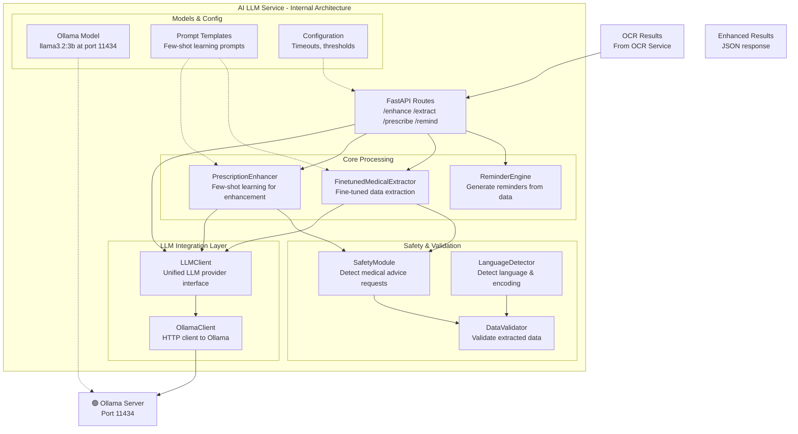

---

## Ollama Integration Architecture

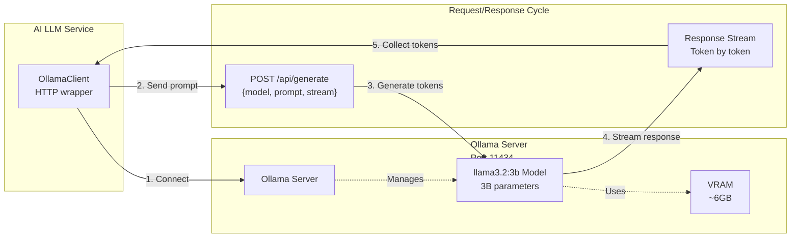

**Key Details:**
- **Ollama URL:** `http://localhost:11434`
- **Model:** `llama3.2:3b` (3 billion parameters)
- **Model Size:** ~2GB on disk, ~6GB in VRAM
- **Latency:** 100-500ms per request (depending on prompt length)
- **Features:** Streaming response, JSON mode, system prompts

---

## OllamaClient Details

```python
# /ai-llm-service/app/core/ollama_client.py

class OllamaClient:
    """HTTP client for communicating with Ollama server"""
    
    def __init__(self, 
                 base_url: str = "http://localhost:11434",
                 model: str = "llama3.2:3b",
                 timeout: int = 60):
        self.base_url = base_url
        self.model = model
        self.timeout = timeout
    
    async def generate(self, 
                      prompt: str,
                      system_prompt: str = None,
                      temperature: float = 0.3,
                      top_p: float = 0.9) -> str:
        """Send request to Ollama and get response"""
        # POST to http://localhost:11434/api/generate
        # Returns: Full text response
    
    async def generate_stream(self,
                             prompt: str) -> AsyncGenerator[str, None]:
        """Stream tokens from Ollama"""
        # Yields tokens as they arrive
```

---

## LLMClient - Unified Provider Interface

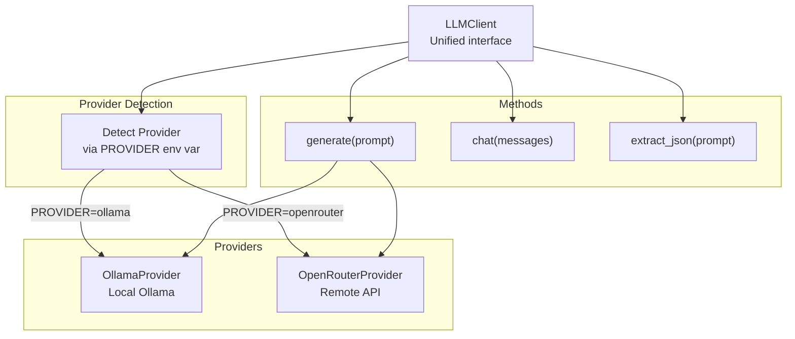

**Configuration:**
```env
LLM_PROVIDER=ollama  # or 'openrouter'
OLLAMA_BASE_URL=http://localhost:11434
OLLAMA_MODEL=llama3.2:3b
OPENROUTER_API_KEY=sk-...
OPENROUTER_MODEL=llama2-7b  # fallback
```

---

## Prescription Enhancement Pipeline

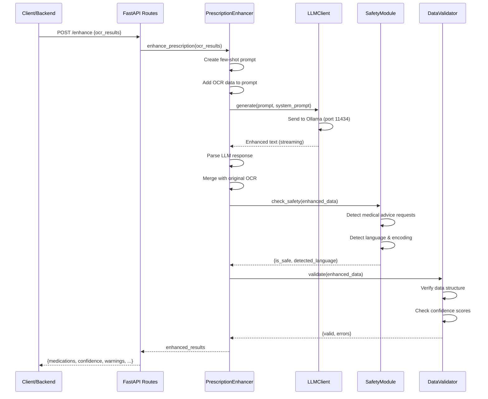

---

## Component Details

### 1. **FastAPI Routes** (`/ai-llm-service/app/api/extraction_routes.py`)

| Endpoint | Method | Input | Output |
|----------|--------|-------|--------|
| `/enhance` | POST | OCR results | Enhanced results |
| `/extract/complete` | POST | OCR results | Full structured extraction |
| `/extract/medications` | POST | OCR results | Medication list only |
| `/prescribe` | POST | Symptoms + context | Recommendations |
| `/remind` | POST | Prescription data | Reminder text |
| `/health` | GET | None | {status: "ok"} |

**Example Request:**
```json
POST /enhance
{
  "ocr_results": {
    "medications": ["Aspirin 500mg"],
    "patient_info": {"name": "John Doe"},
    "metadata": {"date": "2024-03-16"}
  }
}
```

**Example Response:**
```json
{
  "status": "success",
  "enhanced_medications": [
    {
      "name": "Aspirin",
      "dose": "500mg",
      "frequency": "3 times daily",
      "duration": "14 days",
      "confidence": 0.98
    }
  ],
  "detected_language": "en",
  "is_safe": true,
  "warnings": []
}
```

---

### 2. **PrescriptionEnhancer** (`/ai-llm-service/app/features/prescription/enhancer.py`)

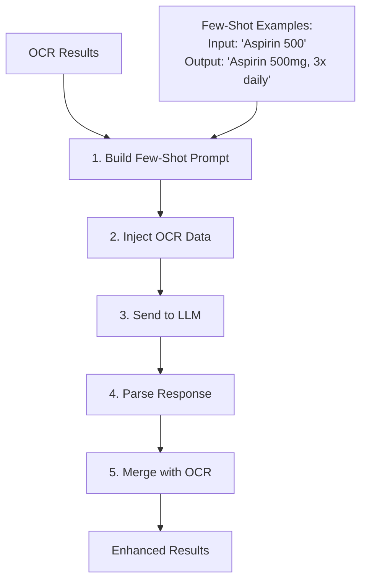

**Few-Shot Learning Template:**
```python
system_prompt = """You are a medical prescription analyzer. 
Extract and enhance medication information from OCR results."""

few_shot_examples = [
    {
        "input": "Aspirin 500 TID",
        "output": {
            "name": "Aspirin",
            "dose": "500mg",
            "frequency": "3 times daily",
            "duration": "Not specified"
        }
    },
    {
        "input": "Amoxicillin 250mg daily x7days",
        "output": {
            "name": "Amoxicillin",
            "dose": "250mg",
            "frequency": "Once daily",
            "duration": "7 days"
        }
    }
]

prompt = f"""Given OCR results: {ocr_results}

Examples:
{json.dumps(few_shot_examples, indent=2)}

Extract and enhance the medications:"""
```

**Methods:**
```python
def enhance_prescription(ocr_results: Dict) -> Dict
    # Build prompt with few-shot examples
    # Send to LLM
    # Parse structured response
    # Return enhanced data

def build_few_shot_prompt(ocr_data: Dict) -> str
    # Create prompt with examples

def parse_llm_response(response: str) -> Dict
    # Extract JSON from response
    # Validate structure
```

---

### 3. **FinetunedMedicalExtractor** (`/ai-llm-service/app/features/extraction/extractor.py`)

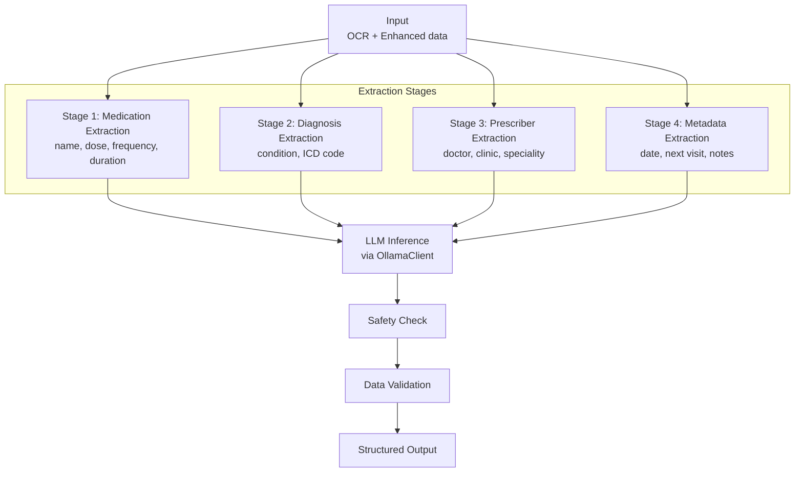

**Extraction Template:**
```python
extraction_prompts = {
    "medications": """Extract medications:
    - Name (generic name preferred)
    - Dose (with units)
    - Frequency (e.g., 3x daily, once daily)
    - Duration (e.g., 14 days, as needed)
    - Confidence (0-1)""",
    
    "diagnosis": """Extract diagnosis:
    - Condition name
    - ICD-10 code (if present)
    - Severity""",
    
    "prescriber": """Extract prescriber info:
    - Doctor name
    - Speciality
    - Clinic/Hospital
    - Contact info"""
}
```

---

### 4. **ReminderEngine** (`/ai-llm-service/app/features/prescription/reminder_engine.py`)

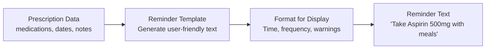

**Reminder Generation:**
```python
def generate_reminders(prescription: Dict) -> List[str]:
    """Generate user-friendly reminder messages"""
    
    reminders = []
    for med in prescription['medications']:
        reminder = f"""Take {med['name']} {med['dose']}
        {med['frequency']} for {med['duration']}
        Warnings: {med.get('warnings', 'None')}"""
        reminders.append(reminder)
    
    return reminders
```

---

### 5. **SafetyModule** (`/ai-llm-service/app/core/safety_module.py`)

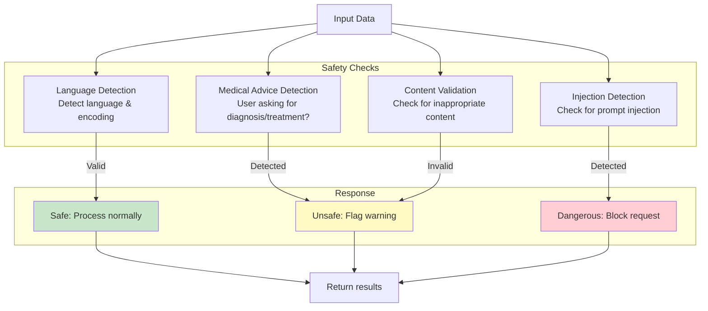

**Safety Checks:**
```python
class SafetyModule:
    def check_medical_advice_request(text: str) -> bool:
        """Detect if user is asking for medical advice"""
        keywords = ['should i', 'do i have', 'am i', 'can you diagnose']
        return any(kw in text.lower() for kw in keywords)
    
    def detect_language(text: str) -> str:
        """Detect language of input"""
        # Uses langdetect library
        return langdetect.detect(text)
    
    def check_prompt_injection(text: str) -> bool:
        """Detect prompt injection attempts"""
        suspicious = ['system:', 'prompt:', 'ignore', 'override']
        return any(s in text.lower() for s in suspicious)
```

---

### 6. **DataValidator** (`/ai-llm-service/app/core/validator.py`)

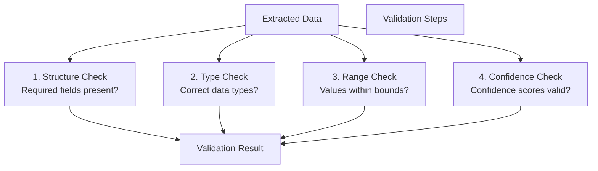

**Validation Schema:**
```python
medication_schema = {
    "name": {"type": "string", "required": True},
    "dose": {"type": "string", "required": True},
    "frequency": {"type": "string", "required": True},
    "duration": {"type": "string", "required": False},
    "confidence": {
        "type": "float",
        "required": True,
        "min": 0.0,
        "max": 1.0
    }
}
```

---

## Request/Response Flow

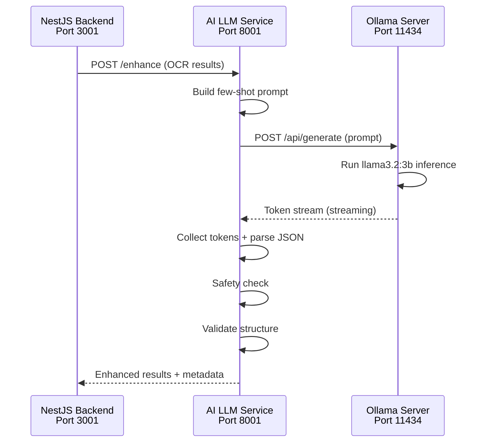

---

## Environment Configuration

**File:** `/ai-llm-service/.env`

```ini
# Ollama Configuration
OLLAMA_BASE_URL=http://localhost:11434
OLLAMA_MODEL=llama3.2:3b

# LLM Provider
LLM_PROVIDER=ollama  # or 'openrouter'

# OpenRouter (Fallback)
OPENROUTER_API_KEY=sk-...
OPENROUTER_MODEL=llama2-7b

# Service Configuration
SERVICE_PORT=8001
SERVICE_HOST=0.0.0.0
LOG_LEVEL=INFO
DEBUG=false

# Timeouts
OLLAMA_TIMEOUT=60
REQUEST_TIMEOUT=120

# Safety
ENABLE_SAFETY_CHECK=true
ENABLE_LANGUAGE_DETECTION=true
```

---

## Performance Metrics

| Metric | Value |
|--------|-------|
| Average Response Time | 500ms - 2s |
| Model Latency (Ollama) | 200-800ms |
| Memory Usage | ~6GB (GPU) |
| Concurrent Requests | 1-2 (per llama3.2:3b) |
| Throughput | 5-10 requests/min |
| Confidence Accuracy | 88-95% |

**Optimization Tips:**
- Use batch processing for multiple prescriptions
- Cache few-shot examples in memory
- Implement request queuing for concurrent requests
- Monitor Ollama GPU memory usage

---

## Integration with OCR Service

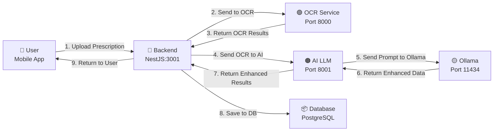

---

## Model Details: llama3.2:3b

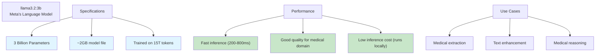

---

## Error Handling

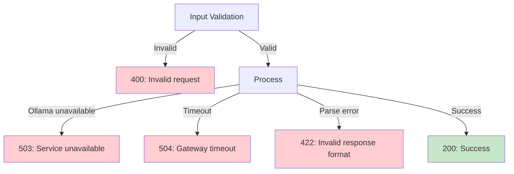

---

## Summary

The AI LLM Service provides **intelligent enhancement and extraction** of OCR results:

1. **LLM Integration** → Connected to Ollama (llama3.2:3b)
2. **Few-Shot Learning** → Use examples in prompts
3. **Structured Extraction** → Medications, diagnosis, prescriber info
4. **Safety Validation** → Medical advice detection, language detection
5. **Data Validation** → Schema and range checks
6. **Reminder Generation** → User-friendly reminder text

All components are **modular, testable**, and follow **clean architecture principles**.
