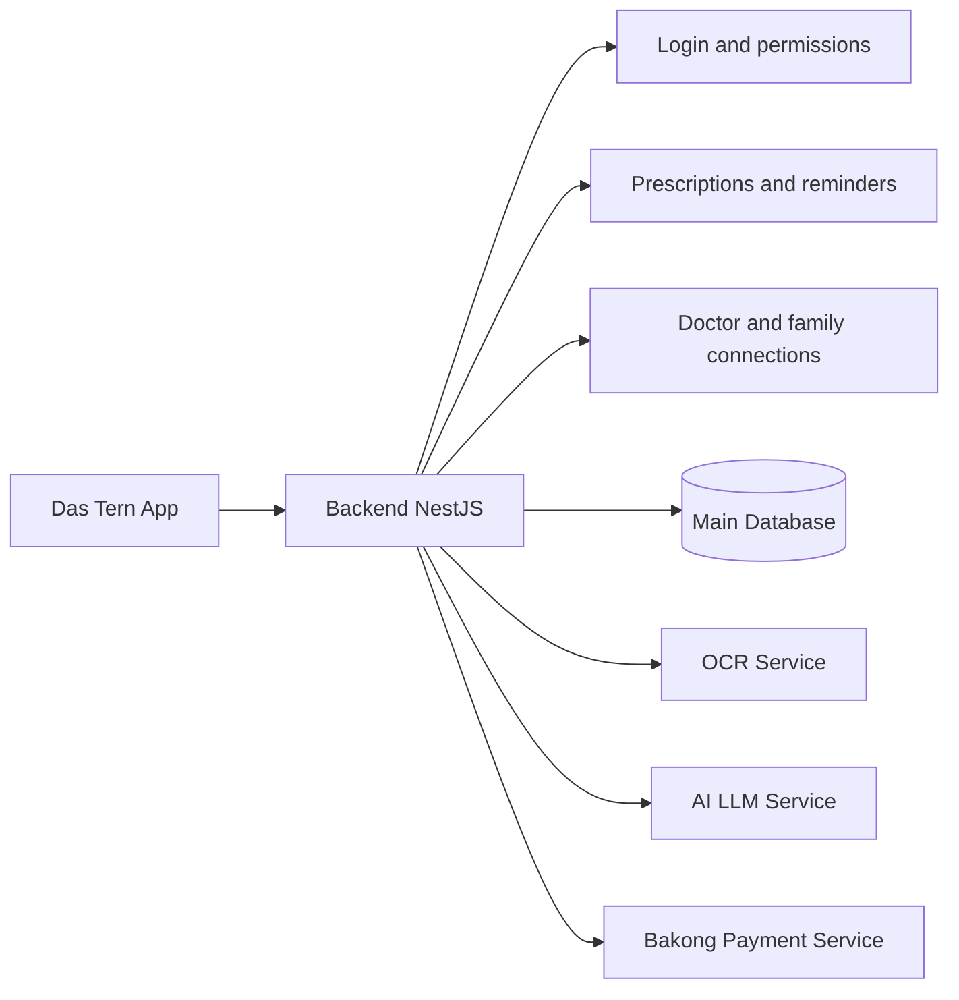

# Backend NestJS

## Simple explanation

- This is the main control center of the platform.
- It handles users, prescriptions, reminders, sharing, and health records.
- It also connects to OCR, AI, and payment services when needed.

## Main idea

- The app talks to one main backend.
- The backend enforces the rules and stores the data.
- Users do not need to connect to the specialist services directly.
