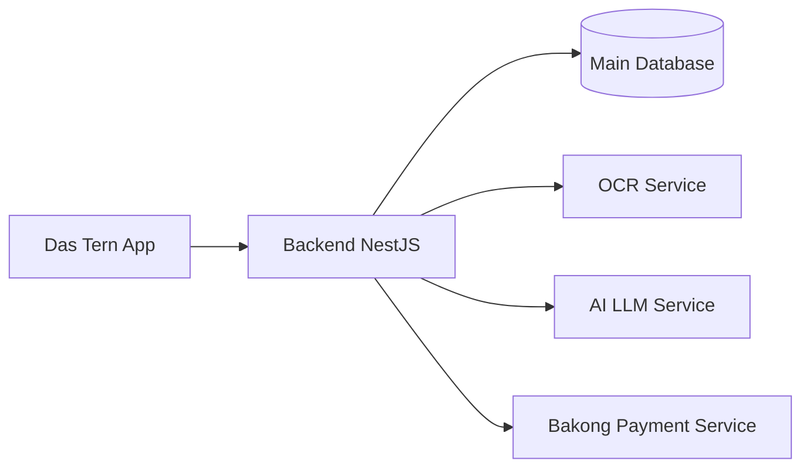

# Backend NestJS

The NestJS backend is the main control center of Das Tern.

## What it does

- It manages login, users, roles, and permissions.
- It stores prescriptions, medicines, reminders, and dose records.
- It handles doctor and family connections.
- It records health monitoring data and notifications.
- It connects to OCR, AI, and Bakong services when needed.

## Simple flow

1. The app sends a request to the backend.
2. The backend checks identity and access rules.
3. The backend handles the business logic.
4. It saves data in the main database.
5. If needed, it calls OCR, AI, or Bakong.
6. It returns the final result to the app.

## Why it matters

- It is the single place that coordinates the full platform.
- It keeps medical data, permissions, and workflows consistent.
- It protects users from having to talk to many separate services directly.
