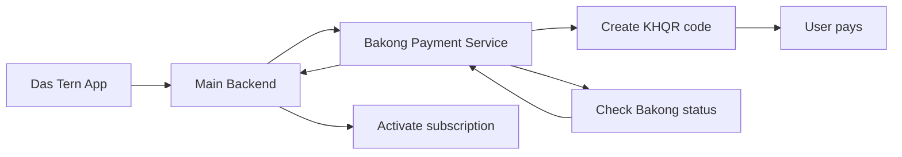

# Bakong Payment

## Simple explanation

- This service handles premium plan payments.
- It creates the payment QR code.
- It checks whether the payment is complete.
- It tells the backend when the subscription should be activated.

## Main idea

- Payment work is separated from medical data work.
- The app still talks through the main backend.
- This keeps payment handling more secure and easier to manage.
