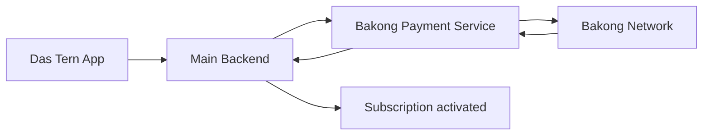

# Bakong Payment

The Bakong payment service is the system's secure payment specialist.

## What it does

- It creates a KHQR payment for premium plans.
- It checks whether the payment has been completed.
- It sends the payment result back to the main backend.
- It keeps payment records in a separate payment system.

## Simple flow

1. The user chooses a paid plan in the app.
2. The main backend asks the Bakong service to create a payment.
3. The Bakong service returns a QR code for the user to pay.
4. The Bakong service checks payment status with Bakong.
5. When payment is confirmed, the main backend updates the subscription.

## Why it matters

- It keeps payment work separate from core medical features.
- It adds an extra security boundary around financial operations.
- It allows the main backend to focus on user and medication workflows.
