# Integration Architecture - OCR + AI LLM + Backend

## Complete Prescription Processing Flow

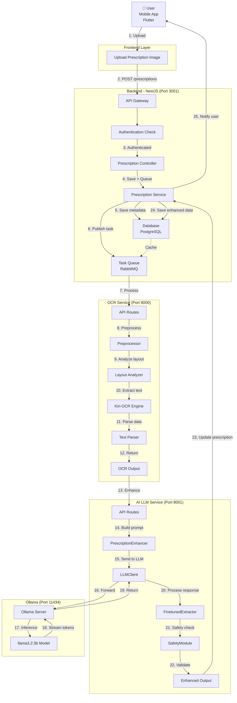

---

## Detailed Service Interaction Matrix

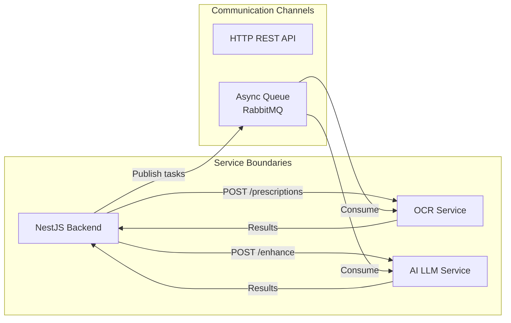

---

## Step-by-Step Processing Pipeline

### Phase 1: User Upload & Validation

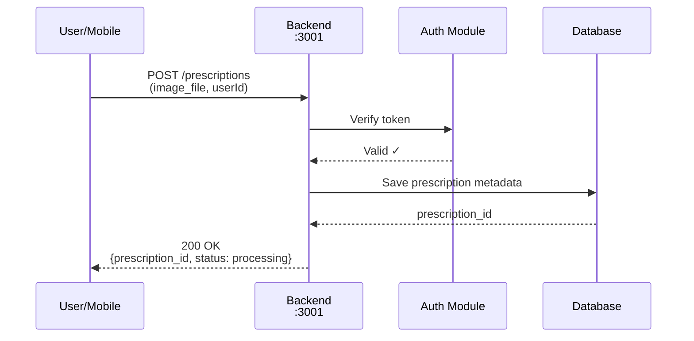

### Phase 2: OCR Processing

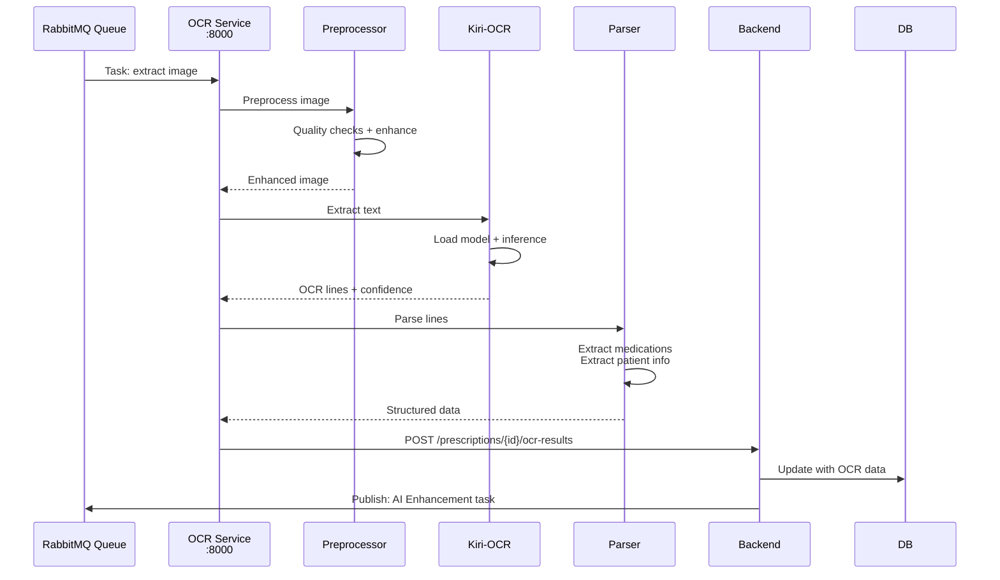

### Phase 3: AI Enhancement

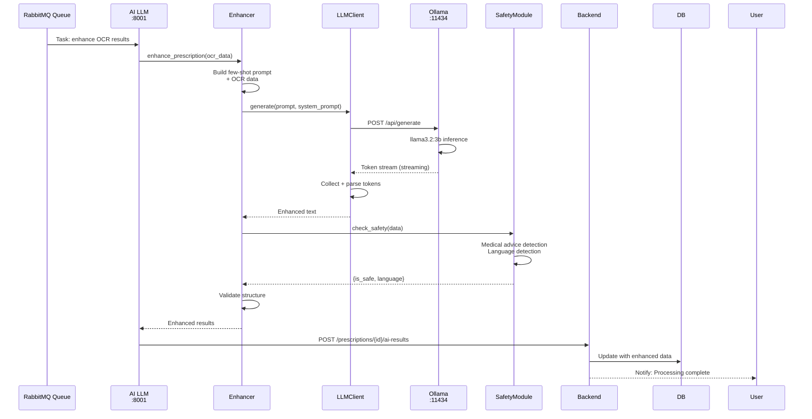

### Phase 4: Data Storage & Retrieval

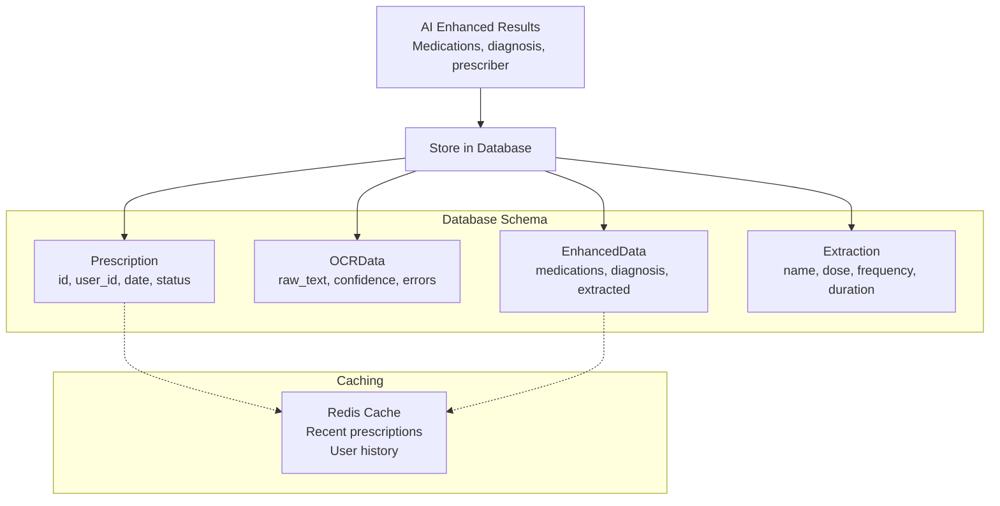

---

## Error Handling & Fallback Strategies

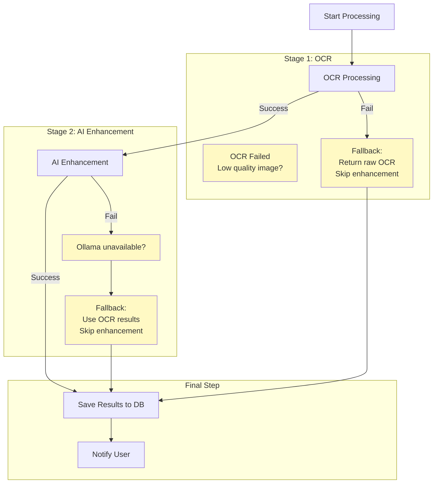

---

## Performance Metrics & Timing

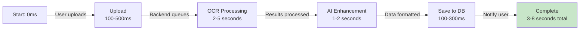

**Latency Breakdown:**
- **Upload:** 100-500ms (network dependent)
- **OCR Processing:** 2-5 seconds (image quality dependent)
  - Preprocessing: 500-800ms
  - Layout analysis: 300-500ms
  - OCR inference: 800-2000ms
  - Text parsing: 200-400ms
- **AI Enhancement:** 1-2 seconds (Ollama inference)
  - Prompt building: 50-100ms
  - Ollama inference: 400-800ms
  - Response parsing: 100-200ms
  - Safety check: 50-100ms
- **Database save:** 100-300ms
- **Total:** 3-8 seconds

---

## Database Schema

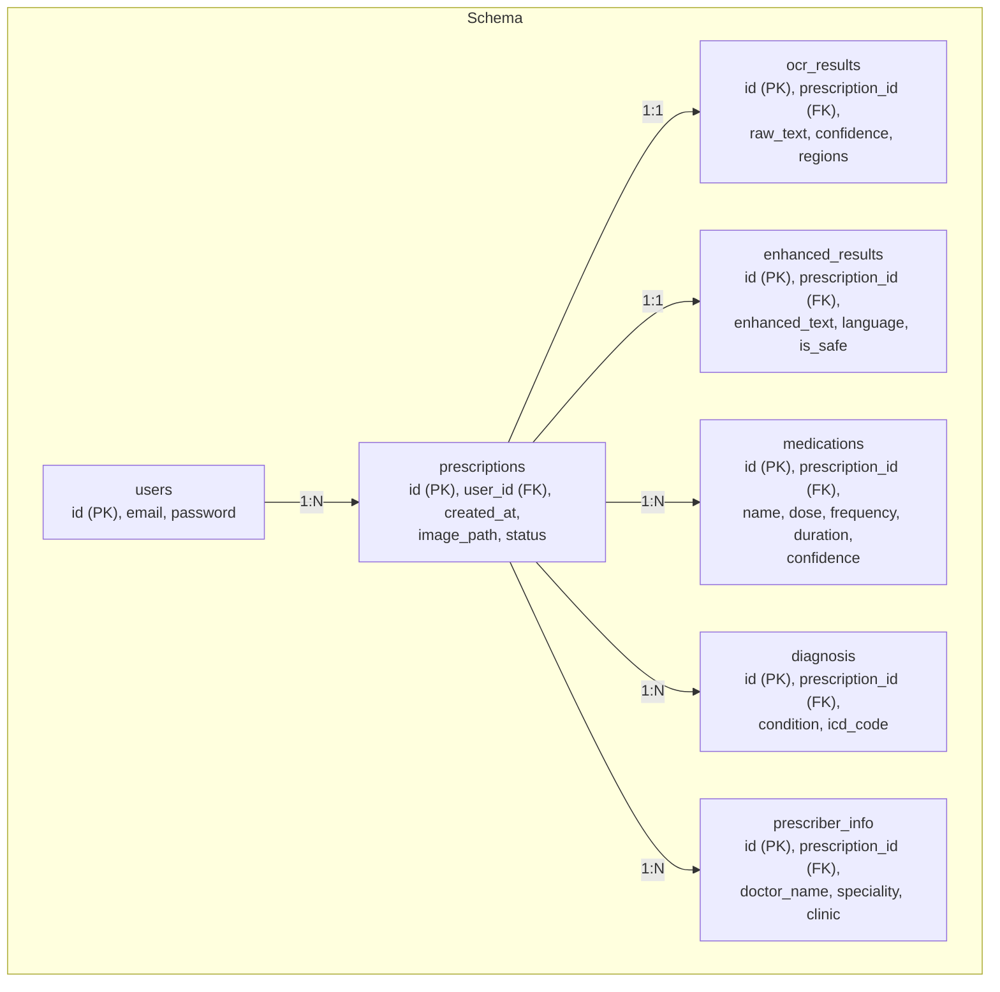

---

## Deployment Architecture

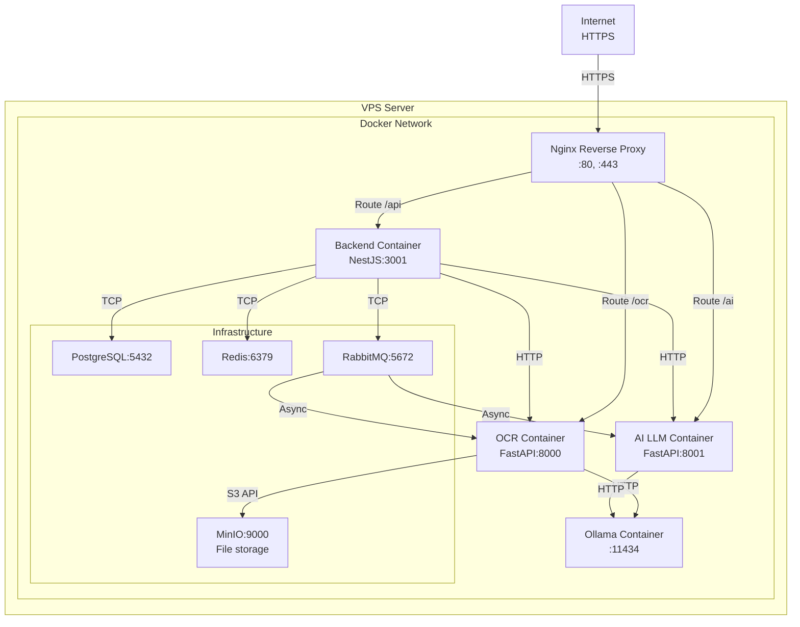

---

## Scaling Considerations

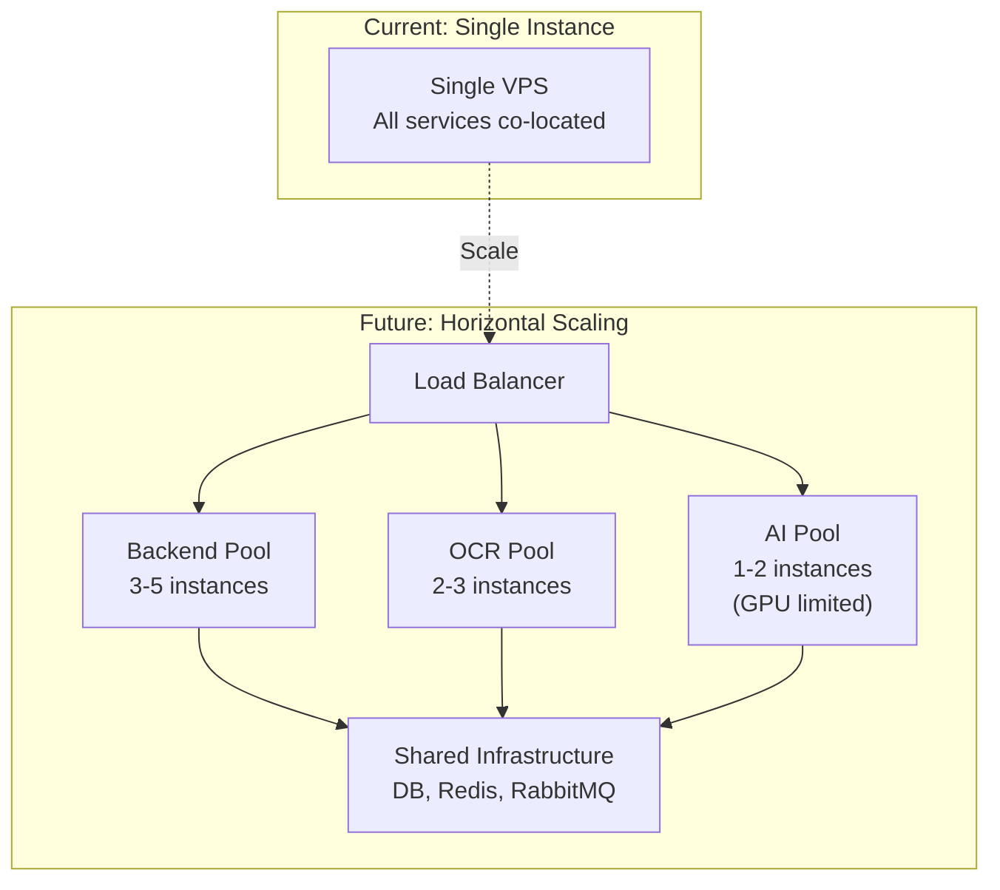

**Scaling Strategy:**
- **Backend (NestJS):** CPU-bound, can scale horizontally
- **OCR Service:** GPU-bound (optional), 2-3 instances on separate GPU nodes
- **AI LLM (Ollama):** GPU-memory-bound, limited by VRAM
- **Shared Services:** Use managed services (Managed PostgreSQL, Redis, RabbitMQ)

---

## Request/Response Cycle - Complete Flow

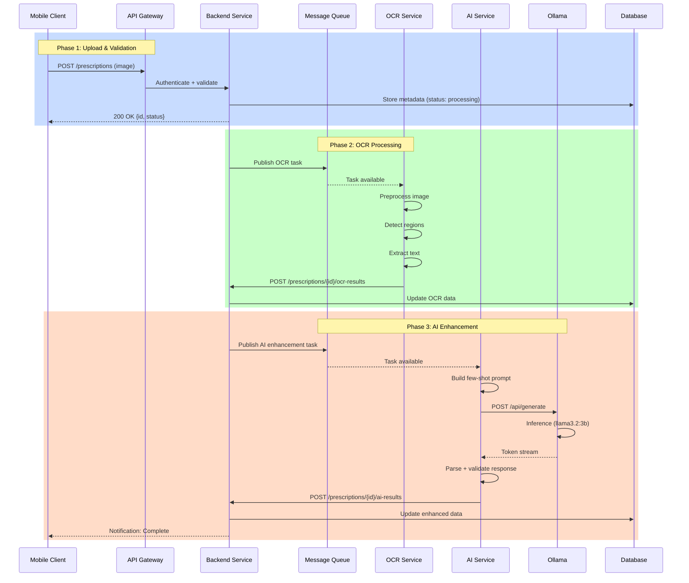

---

## Summary

The complete prescription processing pipeline:

1. **User Upload** → Flutter mobile app
2. **Backend Validation** → NestJS API Gateway
3. **Async Processing** → RabbitMQ queue
4. **OCR Pipeline** → Image preprocessing → Region detection → Text extraction
5. **AI Enhancement** → Few-shot prompting → Ollama inference → Data validation
6. **Data Storage** → PostgreSQL with structured schema
7. **User Notification** → Real-time updates to mobile client

**Total Processing Time:** 3-8 seconds end-to-end
**Bottleneck:** OCR inference (2-5 seconds) + Ollama inference (400-800ms)
**Optimization:** Can parallelize preprocessing and inference with batching

