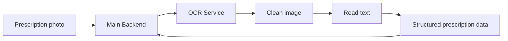

# OCR Service

## Simple explanation

- This service reads prescription photos.
- It cleans the image, reads the text, and extracts useful medicine details.
- It sends the result back as structured data.

## Main idea

- It changes paper prescriptions into digital information.
- The OCR service reads the image.
- The backend decides what to do with the result next.
