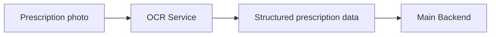

# OCR Service

The OCR service is the system's "prescription reader".

## What it does

- It receives a prescription image from the main backend.
- It improves the image quality so text is easier to read.
- It reads the prescription text and finds medicine-related details.
- It returns a structured result instead of a raw image.

## Simple flow

1. A patient uploads or scans a prescription photo.
2. The main backend sends the image to the OCR service.
3. The OCR service reads the text and extracts medicine information.
4. The result is sent back to the backend.
5. The backend can review it, improve it with AI, and save it.

## Why it matters

- It turns paper prescriptions into digital records.
- It saves users from typing medicine details manually.
- It focuses only on reading images; the backend handles storage and business rules.
