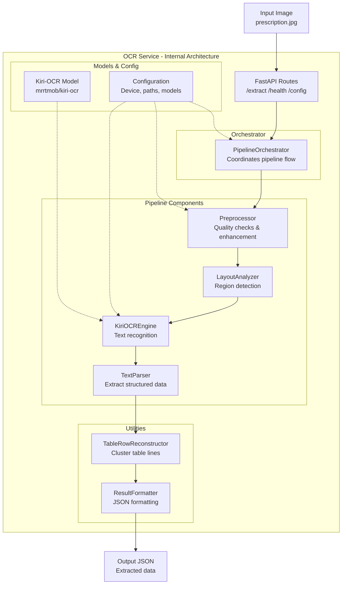
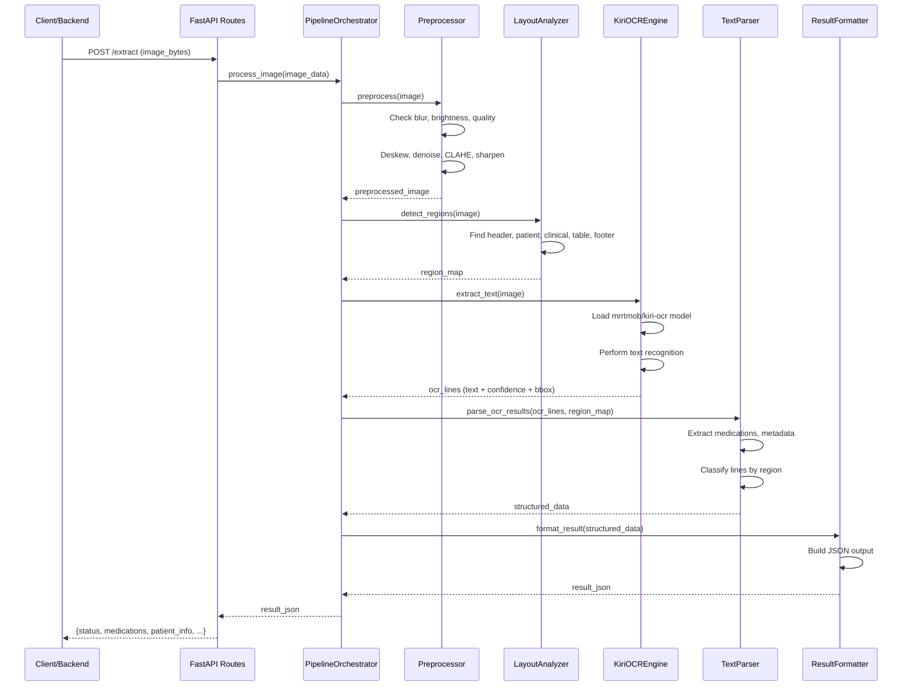
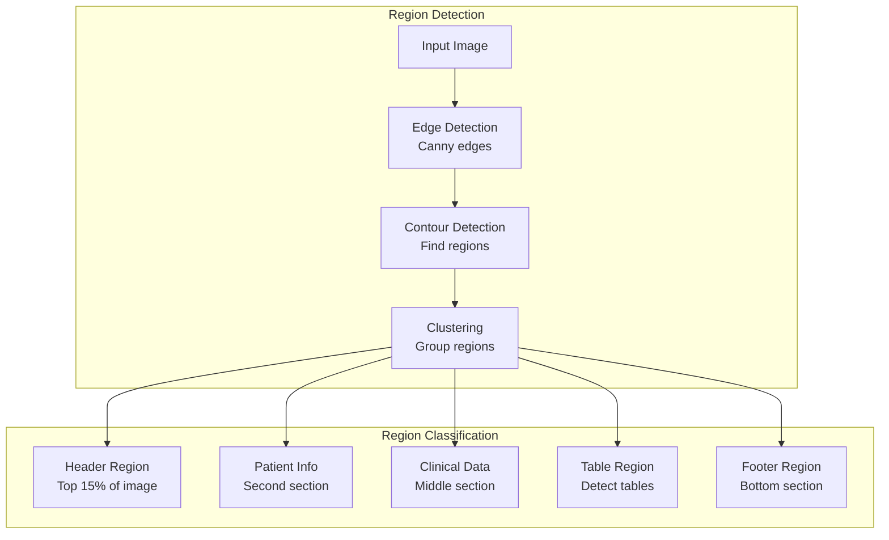
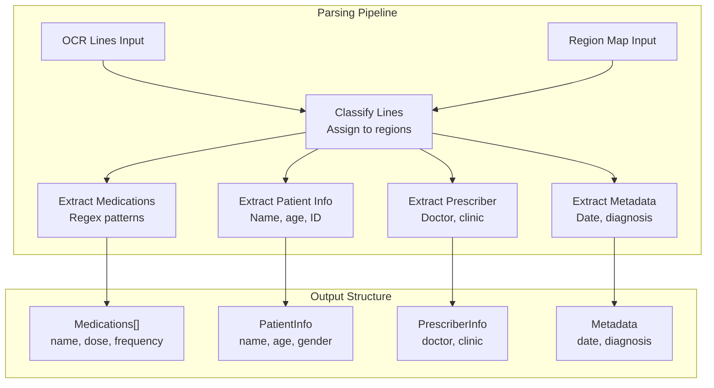
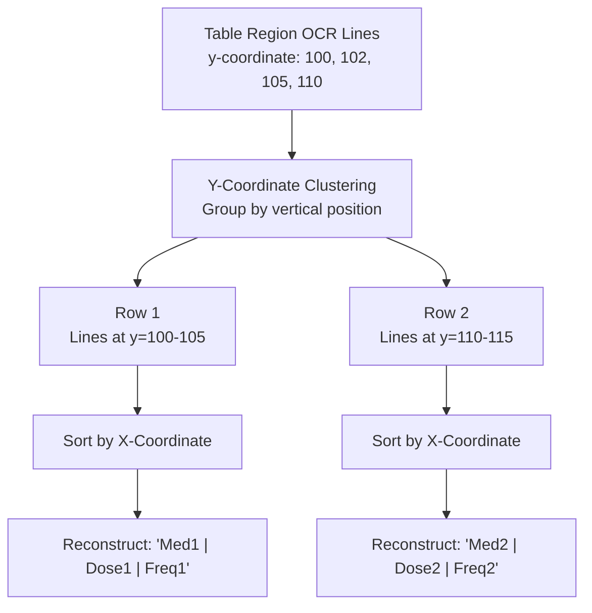
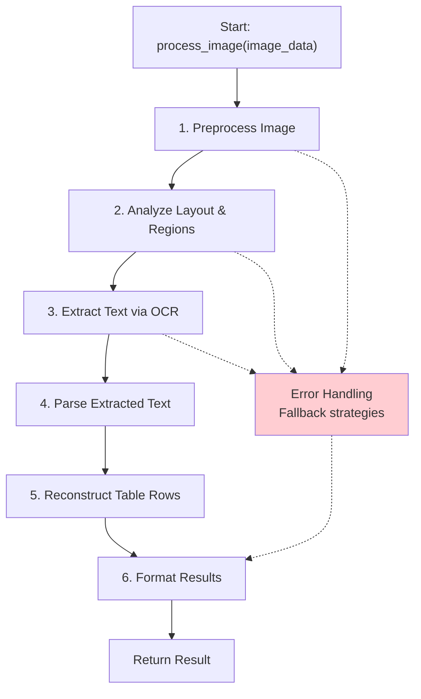
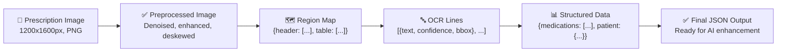
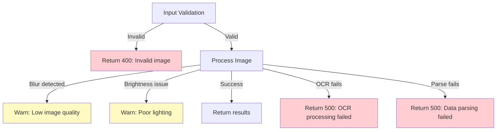
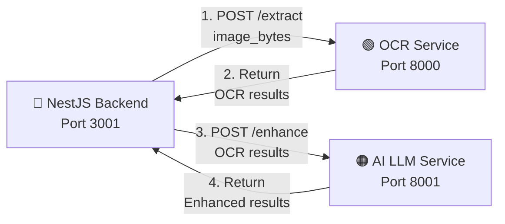

# OCR Service - Detailed Architecture

## Overview
The OCR service is a Python FastAPI-based microservice that extracts structured data from medical prescription images. It uses the Kiri-OCR engine to perform text recognition and a custom pipeline to extract medications, patient information, and prescriber details.

---

## Component Architecture



---

## Detailed Pipeline Flow



---

## Component Details

### 1. **FastAPI Routes** (`/ocr/app/api/routes.py`)

| Endpoint | Method | Input | Output |
|----------|--------|-------|--------|
| `/extract` | POST | Image file (multipart) | OCR results (JSON) |
| `/health` | GET | None | {status: "ok"} |
| `/config` | GET | None | Configuration details |

**Key Features:**
- Handles image upload validation
- Calls PipelineOrchestrator
- Returns formatted results

---

### 2. **Preprocessor** (`/ocr/app/pipeline/preprocessor.py`)

```mermaid
graph LR
    INPUT["Input Image"] --> BLUR["Blur Detection"]
    BLUR --> BRIGHTNESS["Brightness Check"]
    BRIGHTNESS --> DESKEW["Deskew"]
    DESKEW --> DENOISE["Denoise"]
    DENOISE --> CLAHE["CLAHE Enhancement"]
    CLAHE --> SHARPEN["Sharpen"]
    SHARPEN --> OUTPUT["Enhanced Image"]
    
    style BLUR fill:#e1f5ff
    style BRIGHTNESS fill:#e1f5ff
    style DESKEW fill:#f3e5f5
    style DENOISE fill:#f3e5f5
    style CLAHE fill:#e8f5e9
    style SHARPEN fill:#e8f5e9
```



**Methods:**
- `is_image_blurry()` - Uses Laplacian variance
- `is_image_too_dark()` - Checks mean brightness
- `deskew_image()` - Corrects image rotation
- `denoise_image()` - Applies bilateral filter
- `enhance_contrast()` - Uses CLAHE (Contrast Limited Adaptive Histogram Equalization)
- `sharpen_image()` - Uses unsharp mask

**Quality Metrics:**
- Blur threshold: Laplacian variance > 100
- Brightness threshold: Mean > 50
- Output: Enhanced image for OCR processing

---

### 3. **Layout Analyzer** (`/ocr/app/pipeline/layout_analyzer.py`)



**Detection Methods:**
- Edge detection using Canny
- Contour-based region identification
- Spatial clustering
- Region type classification

**Output:**
```python
region_map = {
    'header': [(x1, y1, x2, y2), ...],
    'patient_info': [(x1, y1, x2, y2), ...],
    'clinical_data': [(x1, y1, x2, y2), ...],
    'table': [(x1, y1, x2, y2), ...],
    'footer': [(x1, y1, x2, y2), ...]
}
```

---

### 4. **Kiri-OCR Engine** (`/ocr/app/pipeline/ocr_engine.py`)


**Model Details:**
- **Model Name:** `mrrtmob/kiri-ocr`
- **Framework:** PyTorch
- **Input:** RGB image (preprocessed)
- **Output:** Text lines with bounding boxes and confidence scores

**Engine Methods:**
```python
def warmup() → None
    # First inference to initialize CUDA/hardware
    
def extract_text(image) → List[OCRLine]
    # Returns: [
    #   {'text': 'Medication', 'confidence': 0.95, 'bbox': (x, y, w, h)},
    #   ...
    # ]
```

---

### 5. **Text Parser** (`/ocr/app/pipeline/text_parser.py`)



**Parsing Methods:**
- **Line Classification:** Assign each OCR line to a region type
- **Medication Extraction:** Regex patterns + keyword matching
- **Patient Info:** Parse name, age, gender, ID number
- **Prescriber Info:** Extract doctor name, clinic, contact
- **Metadata:** Date, diagnosis codes, special notes

**Output Structure:**
```python
parsed_data = {
    'medications': [
        {'name': 'Aspirin', 'dose': '500mg', 'frequency': '3x daily'},
        ...
    ],
    'patient_info': {'name': 'John Doe', 'age': 45, 'gender': 'M'},
    'prescriber_info': {'doctor': 'Dr. Smith', 'clinic': 'City Hospital'},
    'metadata': {'date': '2024-03-16', 'diagnosis': 'Hypertension'}
}
```

---

### 6. **Table Row Reconstructor** (`/ocr/app/pipeline/table_row_reconstructor.py`)



**Purpose:** Reconstruct table rows from scattered OCR lines

**Algorithm:**
1. Group OCR lines by vertical position (y-coordinate)
2. Sort lines within each group by horizontal position (x-coordinate)
3. Concatenate text to form complete rows

---

### 7. **Pipeline Orchestrator** (`/ocr/app/pipeline/orchestrator.py`)



**Key Responsibilities:**
- Coordinate all pipeline stages
- Handle errors and fallbacks
- Manage temporary data
- Return formatted results

---

## Data Flow Example



---

## Configuration

**Environment Variables:** (`/ocr/.env`)
```ini
DEVICE=cuda  # or 'cpu'
OCR_MODEL_NAME=mrrtmob/kiri-ocr
PREPROCESSOR_ENABLED=true
LAYOUT_ANALYSIS_ENABLED=true
TABLE_RECONSTRUCTION_ENABLED=true
LOG_LEVEL=INFO
```

**Model Paths:**
```
/ocr/app/models/kiri-ocr/  # Cached model
```

---

## Performance Metrics

| Metric | Value |
|--------|-------|
| Image Processing Time | 2-5 seconds |
| Model Load Time | ~3 seconds (first run) |
| OCR Accuracy | 92-98% (depending on image quality) |
| Supported Image Formats | PNG, JPG, TIFF |
| Max Image Size | 4096x4096px |
| Memory Usage | ~2GB (GPU) / ~500MB (CPU) |

---

## Error Handling



---

## Integration with Backend



---

## Summary

The OCR service follows a **modular pipeline architecture**:

1. **Input Validation** → Image received
2. **Preprocessing** → Quality enhancement
3. **Layout Analysis** → Region detection
4. **OCR Engine** → Text extraction (mrrtmob/kiri-ocr)
5. **Text Parsing** → Structured data extraction
6. **Table Reconstruction** → Row formation
7. **Output Formatting** → JSON response

Each component is **independently testable** and can be **extended or replaced** without affecting others.
