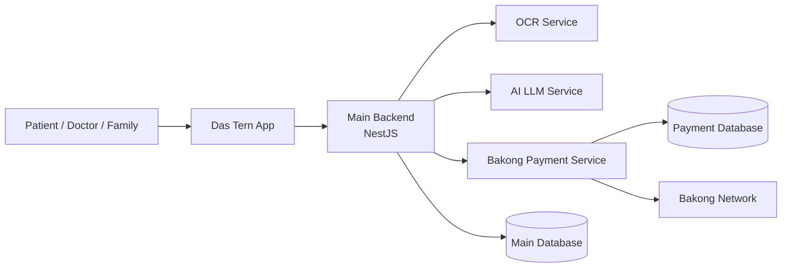

# Overall Architecture Overview

This platform works like one main control center with a few specialist services around it.

## What each part does

- The app is what patients, doctors, and family members use every day.
- The main backend is the system's "brain". It manages users, prescriptions, reminders, dose history, health records, and sharing rules.
- The OCR service reads prescription photos and turns them into structured data.
- The AI LLM service improves the scanned result by cleaning and correcting important details.
- The Bakong payment service handles subscription payments and payment confirmation.
- The databases store the main medical data and the payment records separately.

## Simple user journey

1. A user opens the app and sends a request.
2. The main backend decides what should happen.
3. If the user scans a prescription, the backend sends it to OCR, then optionally to AI for cleanup.
4. The backend saves the final result and creates reminders.
5. If the user upgrades a plan, the backend sends the payment request to Bakong.
6. When payment succeeds, the backend upgrades the subscription.

## Why this design matters

- It keeps the main app simple for users.
- It separates specialist work like scanning, AI, and payment.
- It lets the core platform keep working even if one specialist service is temporarily unavailable.
- It supports the offline-first reminder experience in the mobile app.
