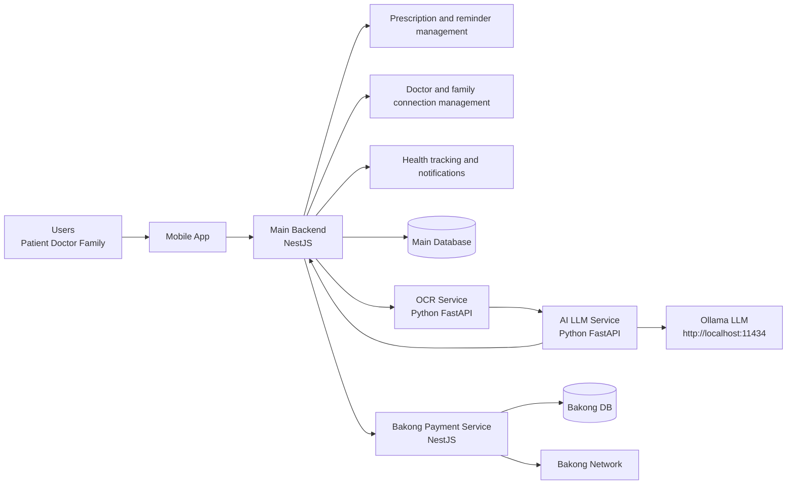
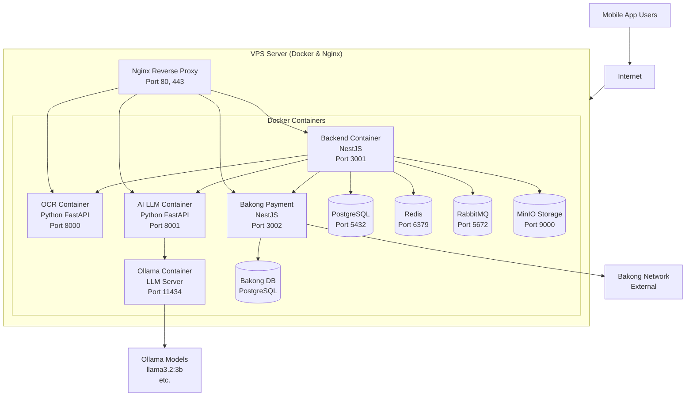

# Overall Architecture Overview

## Logical Architecture

## Physical Architecture

## Flow Details

### Prescription Scanning Flow
1. User uploads prescription image via Mobile App
2. Nginx routes request to Backend
3. Backend sends image to OCR Service
4. OCR Service reads the image and extracts text
5. Backend sends OCR result to AI LLM Service
6. AI LLM Service calls Ollama (local LLM) to improve data quality
7. Backend saves the final prescription with enhanced data

### Payment Flow
1. User selects premium plan in Mobile App
2. Nginx routes to Backend
3. Backend calls Bakong Payment Service
4. Bakong Payment Service generates KHQR QR code
5. User scans QR and pays via Bakong
6. Bakong Payment Service checks payment status
7. When confirmed, subscription is updated in main database

## Simple explanation

- Users access via mobile app through Nginx.
- Nginx routes requests to the appropriate backend service.
- Backend (NestJS) is the main control center.
- OCR Service reads prescription images (Python).
- AI LLM Service improves OCR results using Ollama local language model.
- Ollama runs a lightweight 3B model (llama3.2:3b) for fast, local AI processing.
- Bakong Payment handles subscription upgrades.
- All services are containerized with Docker on the VPS.

## Main idea

- Logically: Backend coordinates, OCR reads images, AI improves quality, Bakong handles payments.
- Physically: Single VPS with Docker containers, Nginx routing, and Ollama for local AI.
- Ollama is self-hosted (not external), giving better privacy, faster inference, and no API costs.
